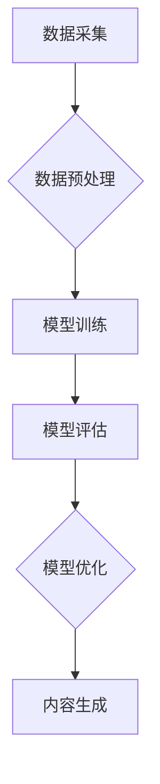

                 

## 生成式AIGC是金矿还是泡沫:数据才是关键

> 关键词：生成式AI，AIGC，大语言模型，数据驱动，训练数据，模型泛化，伦理问题

## 1. 背景介绍

近年来，人工智能（AI）领域取得了令人瞩目的进展，其中生成式人工智能（Generative AI）作为一朵冉冉升起的新星，迅速吸引了全球的目光。从能够创作逼真图像的 DALL-E 2 到能流畅对话的 ChatGPT，生成式AIGC展现出强大的创造力和应用潜力，引发了人们对未来科技发展的新思考。

然而，在AIGC的蓬勃发展背后，也潜藏着一些风险和挑战。一些人认为AIGC是科技领域的下一个“泡沫”，其发展过于依赖于大量数据和计算资源，缺乏真正的创新和实用价值。而另一些人则认为AIGC是真正的“金矿”，其蕴含的巨大潜力将彻底改变我们生活和工作的方式。

那么，生成式AIGC究竟是金矿还是泡沫？答案或许并不简单。本文将深入探讨AIGC的核心概念、技术原理、应用场景以及未来发展趋势，并分析其背后的数据驱动机制，帮助读者更好地理解AIGC的本质和未来发展方向。

## 2. 核心概念与联系

### 2.1 生成式AI的概念

生成式AI是指能够根据已有的数据生成新数据的AI模型。这些模型通过学习数据中的模式和规律，并利用这些知识生成新的、类似于训练数据的内容。

### 2.2 AIGC的分类

AIGC可以根据其生成内容的类型进行分类，主要包括：

* **文本生成:**  例如，ChatGPT、LaMDA等模型可以生成各种文本内容，包括文章、故事、诗歌、代码等。
* **图像生成:** 例如，DALL-E 2、Stable Diffusion等模型可以根据文本描述生成逼真的图像。
* **音频生成:** 例如，Jukebox、WaveNet等模型可以生成逼真的音乐、语音等音频内容。
* **视频生成:** 例如，Meta的Make-A-Video等模型可以根据文本描述生成短视频。

### 2.3 AIGC的架构

AIGC的架构通常包括以下几个关键部分：

* **数据采集和预处理:** 收集大量相关数据并进行清洗、格式化等预处理工作。
* **模型训练:** 利用深度学习算法训练模型，使其能够学习数据中的模式和规律。
* **模型评估:** 对训练好的模型进行评估，并根据评估结果进行模型调优。
* **内容生成:** 利用训练好的模型生成新的内容。

**Mermaid 流程图**



## 3. 核心算法原理 & 具体操作步骤

### 3.1 算法原理概述

生成式AIGC的核心算法主要基于深度学习，特别是**生成对抗网络（GAN）**和**变分自编码器（VAE）**。

* **GAN**由两个神经网络组成：生成器和判别器。生成器试图生成逼真的数据，而判别器试图区分真实数据和生成数据。两者在对抗游戏中不断学习，最终生成器能够生成与真实数据几乎 indistinguishable 的数据。
* **VAE**则通过编码器将数据压缩成低维表示，然后通过解码器将低维表示解码回原始数据。VAE通过最小化重建误差来学习数据分布，并能够生成新的数据样本。

### 3.2 算法步骤详解

**以文本生成为例，详细说明GAN的训练步骤：**

1. **初始化生成器和判别器:** 随机初始化生成器和判别器的参数。
2. **生成器生成数据:** 生成器根据随机噪声生成假数据。
3. **判别器判断真实性:** 判别器对真实数据和生成数据进行分类，并输出判断结果。
4. **更新生成器参数:** 根据判别器的反馈，更新生成器的参数，使其生成更逼真的数据。
5. **更新判别器参数:** 根据判别器的分类结果，更新判别器的参数，使其更好地区分真实数据和生成数据。
6. **重复步骤2-5:** 重复上述步骤，直到生成器能够生成与真实数据几乎 indistinguishable 的数据。

### 3.3 算法优缺点

**GAN的优点:**

* 可以生成高质量、逼真的数据。
* 能够学习复杂的数据分布。

**GAN的缺点:**

* 训练过程比较复杂，容易陷入局部最优。
* 难以评估模型的性能。

**VAE的优点:**

* 训练过程相对稳定，更容易收敛。
* 可以生成数据样本的概率分布。

**VAE的缺点:**

* 生成的数据质量可能不如GAN。
* 难以生成复杂的数据结构。

### 3.4 算法应用领域

生成式AIGC的应用领域非常广泛，包括：

* **文本生成:** 写作辅助工具、聊天机器人、代码生成、机器翻译等。
* **图像生成:** 艺术创作、图像修复、图像合成、3D建模等。
* **音频生成:** 音乐创作、语音合成、音效制作等。
* **视频生成:** 视频剪辑、视频特效、虚拟现实等。

## 4. 数学模型和公式 & 详细讲解 & 举例说明

### 4.1 数学模型构建

**GAN的数学模型:**

* **生成器:** G(z)
* **判别器:** D(x)

其中，z是随机噪声，x是真实数据。

**目标函数:**

* **生成器:**  L_G = E_{x~p_data(x)}[log(1-D(G(z)))]
* **判别器:** L_D = E_{x~p_data(x)}[log(D(x))] + E_{z~p_z(z)}[log(1-D(G(z)))]

**解释:**

* 生成器的目标是最大化判别器对生成数据的判断错误率。
* 判别器的目标是最大化对真实数据的判断正确率，同时最小化对生成数据的判断错误率。

**VAE的数学模型:**

* **编码器:**  z = E(x)
* **解码器:** x' = D(z)

其中，x是真实数据，z是编码后的低维表示，x'是解码后的数据。

**目标函数:**

* L = E_{x~p_data(x)}[D(E(x)) + KL(E(x)||q(z))]

**解释:**

* VAE的目标是最小化重建误差 (D(E(x))) 和编码后的数据分布与先验分布之间的差异 (KL(E(x)||q(z))).

### 4.2 公式推导过程

**GAN的目标函数推导:**

* 生成器希望生成的数据能够被判别器误判为真实数据，因此需要最大化 log(1-D(G(z)))。
* 判别器希望能够正确区分真实数据和生成数据，因此需要最大化 log(D(x)) 和 log(1-D(G(z)))。

**VAE的目标函数推导:**

* VAE的目标是最小化重建误差，即 x' 与 x 之间的差异。
* 同时，VAE也希望编码后的数据分布与先验分布尽可能接近，以避免过拟合。

### 4.3 案例分析与讲解

**DALL-E 2的案例分析:**

DALL-E 2是一个基于GAN的图像生成模型，能够根据文本描述生成逼真的图像。例如，输入文本描述“一只戴着皇冠的猫坐在钢琴上”，DALL-E 2能够生成一张符合描述的图像。

**ChatGPT的案例分析:**

ChatGPT是一个基于Transformer架构的文本生成模型，能够进行流畅的对话和文本创作。例如，用户可以与ChatGPT进行问答互动，或者要求它写一首诗歌。

## 5. 项目实践：代码实例和详细解释说明

### 5.1 开发环境搭建

* **操作系统:** Linux/macOS/Windows
* **编程语言:** Python
* **深度学习框架:** TensorFlow/PyTorch
* **其他工具:** Git、Jupyter Notebook

### 5.2 源代码详细实现

以下是一个简单的文本生成模型的代码示例，使用PyTorch框架实现：

```python
import torch
import torch.nn as nn

class TextGenerator(nn.Module):
    def __init__(self, vocab_size, embedding_dim, hidden_dim):
        super(TextGenerator, self).__init__()
        self.embedding = nn.Embedding(vocab_size, embedding_dim)
        self.lstm = nn.LSTM(embedding_dim, hidden_dim)
        self.fc = nn.Linear(hidden_dim, vocab_size)

    def forward(self, x):
        embedded = self.embedding(x)
        output, (hidden, cell) = self.lstm(embedded)
        output = self.fc(output[:, -1, :])
        return output

# 模型参数
vocab_size = 10000
embedding_dim = 128
hidden_dim = 256

# 实例化模型
model = TextGenerator(vocab_size, embedding_dim, hidden_dim)

# 训练模型
# ...

# 生成文本
# ...
```

### 5.3 代码解读与分析

* **Embedding层:** 将单词转换为向量表示。
* **LSTM层:** 学习文本序列的上下文信息。
* **全连接层:** 将LSTM输出映射到词汇表大小。
* **训练模型:** 使用训练数据训练模型，优化模型参数。
* **生成文本:** 使用训练好的模型，根据输入的种子词生成新的文本。

### 5.4 运行结果展示

训练好的模型能够根据输入的种子词生成流畅的文本。例如，输入“今天天气”，模型可能生成“今天天气晴朗，适合外出”。

## 6. 实际应用场景

### 6.1 文本生成

* **内容创作:** 自动生成新闻稿、广告文案、社交媒体内容等。
* **机器翻译:** 将文本从一种语言翻译成另一种语言。
* **代码生成:** 根据自然语言描述自动生成代码。
* **聊天机器人:** 创建能够进行自然对话的聊天机器人。

### 6.2 图像生成

* **艺术创作:** 生成独特的艺术作品，例如绘画、雕塑等。
* **图像修复:** 修复损坏的图像，例如去除噪点、修复缺失的部分等。
* **图像合成:** 合并多个图像，生成新的图像。
* **3D建模:** 根据文本描述生成3D模型。

### 6.3 音频生成

* **音乐创作:** 生成新的音乐作品，例如旋律、伴奏等。
* **语音合成:** 将文本转换为语音。
* **音效制作:** 生成各种音效，例如枪声、爆炸声等。

### 6.4 视频生成

* **视频剪辑:** 自动剪辑视频，生成指定长度的视频片段。
* **视频特效:** 添加各种视频特效，例如慢动作、快动作等。
* **虚拟现实:** 生成虚拟现实场景。

### 6.5 未来应用展望

* **个性化教育:** 根据学生的学习进度和需求生成个性化的学习内容。
* **医疗诊断:** 利用生成式AIGC辅助医生进行疾病诊断。
* **科学研究:** 加速科学研究，例如药物研发、材料设计等。
* **娱乐体验:** 提供更加沉浸式的娱乐体验，例如虚拟游戏、增强现实等。

## 7. 工具和资源推荐

### 7.1 学习资源推荐

* **书籍:**
    * 《Deep Learning》 by Ian Goodfellow, Yoshua Bengio, and Aaron Courville
    * 《Generative Deep Learning》 by David Foster
* **在线课程:**
    * Coursera: Deep Learning Specialization
    * Udacity: Deep Learning Nanodegree
* **博客和网站:**
    * OpenAI Blog
    * Google AI Blog
    * Towards Data Science

### 7.2 开发工具推荐

* **深度学习框架:** TensorFlow, PyTorch, Keras
* **编程语言:** Python
* **数据处理工具:** Pandas, NumPy
* **可视化工具:** Matplotlib, Seaborn

### 7.3 相关论文推荐

* **Generative Adversarial Networks** by Ian Goodfellow et al. (2014)
* **Variational Autoencoders** by Diederik P. Kingma and Max Welling (2013)
* **Attention Is All You Need** by Ashish Vaswani et al. (2017)

## 8. 总结：未来发展趋势与挑战

### 8.1 研究成果总结

近年来，生成式AIGC取得了令人瞩目的进展，能够生成逼真的文本、图像、音频和视频内容。这些模型的应用潜力巨大，能够改变我们生活和工作的方式。

### 8.2 未来发展趋势

* **模型规模和性能的提升:** 未来，生成式AIGC模型的规模和性能将会进一步提升，能够生成更加逼真、多样化的内容。
* **多模态生成:** 未来，生成式AIGC模型将能够跨越不同模态，例如文本、图像、音频、视频等，生成更加丰富的多模态内容。
* **个性化生成:** 未来，生成式AIGC模型将能够根据用户的个性化需求生成定制化的内容。
* **伦理和安全问题:** 随着生成式AIGC技术的进步，其伦理和安全问题也日益突出，需要引起重视和研究。

### 8.3 面临的挑战

* **数据获取和质量:** 生成式AIGC模型依赖于大量高质量的数据，数据获取和质量控制仍然是一个挑战。
* **模型训练成本:** 训练大型生成式AIGC模型需要大量的计算资源和时间，成本较高。
* **模型解释性和可控性:** 生成式AIGC模型的决策过程往往难以解释和控制，这可能会导致模型的不可靠性和安全性问题。

### 8.4 研究展望

未来，生成式AIGC领域的研究将集中在以下几个方面:

* **开发更加高效、鲁棒的训练算法:** 降低模型训练成本，提高模型性能。
* **探索新的模型架构:** 设计更加灵活、高效的模型架构，能够处理更加复杂的数据类型和任务。
* **解决模型解释性和可控性问题:** 开发能够解释模型决策过程的方法，提高模型的可控性和安全性。
* **研究生成式AIGC的伦理和社会影响:** 确保生成式AIGC技术能够安全、负责任地应用于社会。

## 9. 附录：常见问题与解答

### 9.1 如何选择合适的生成式AIGC模型？

选择合适的生成式AIGC模型需要根据具体的应用场景和需求进行考虑。例如，如果需要生成高质量的图像，可以选择DALL-E 2等基于GAN的模型；如果需要生成流畅的文本，可以选择GPT-3等基于Transformer的模型。

### 9.2 如何评估生成式AIGC模型的性能？

评估生成式AIGC模型的性能需要根据具体的应用场景和需求选择合适的指标。例如，对于文本生成模型，可以评估其语法正确性、流畅度、相关性等；对于图像生成模型，可以评估其逼真度、多样性、细节程度等。

### 9.3 如何解决生成式AIGC模型的伦理问题？

生成式AIGC模型的伦理问题需要引起重视和研究，例如：

* **数据隐私:** 生成式AIGC模型的训练数据可能包含个人隐私信息，需要采取措施保护数据隐私。
* **内容真实性:** 生成式AIGC模型能够生成逼真的虚假内容，可能被用于传播虚假信息，需要加强内容真实性验证。
* **版权问题:** 生成式AIGC模型生成的內容可能侵犯版权，需要明确版权归属问题。


作者：禅与计算机程序设计艺术 / Zen and the Art of Computer Programming 
<end_of_turn>

