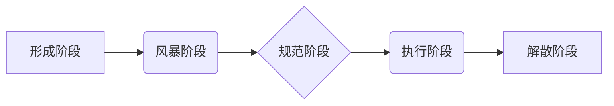

                 

## 用福格模型打造高效团队

> 关键词：福格模型、团队效率、软件开发、协作、沟通、组织架构、项目管理

### 1. 背景介绍

在当今快速发展的科技时代，软件开发团队的效率和协作能力至关重要。高效的团队能够快速交付高质量的软件产品，从而获得竞争优势。然而，构建高效团队并非易事，需要精心设计团队结构、明确职责分工、建立良好的沟通机制以及营造积极的团队氛围。

福格模型（Tuckman's Stages of Group Development）是一个经典的团队发展模型，它描述了团队从形成到成熟的五个阶段：

* **形成阶段（Forming）:** 团队成员刚开始组建，彼此陌生，相互观察，缺乏明确的团队目标和角色。
* **风暴阶段（Storming）:** 团队成员开始表达自己的意见和想法，可能会出现冲突和争论，团队目标和角色逐渐明确。
* **规范阶段（Norming）:** 团队成员开始建立信任和合作关系，形成共同的价值观和行为规范，团队目标和角色得到确认。
* **执行阶段（Performing）:** 团队成员高效协作，专注于完成团队目标，团队运作流畅，效率高。
* **解散阶段（Adjourning）:** 团队完成任务或解散，成员开始告别，回顾团队经历。

福格模型为我们理解团队发展提供了框架，但也需要结合实际情况进行应用。

### 2. 核心概念与联系

福格模型的核心概念是团队发展是一个循序渐进的过程，每个阶段都有其特点和挑战。团队需要经历五个阶段才能达到高效协作的状态。

**福格模型流程图**

### 3. 核心算法原理 & 具体操作步骤

福格模型本身不是一个算法，而是一个描述团队发展阶段的模型。 

**3.1 算法原理概述**

福格模型的原理是基于团队成员之间关系和团队目标达成程度的变化。 

**3.2 算法步骤详解**

福格模型没有具体的算法步骤，而是提供了一个团队发展阶段的框架。 团队领导者需要根据团队的实际情况，引导团队成员逐步完成每个阶段的转变。

**3.3 算法优缺点**

* **优点:** 
    * 易于理解和应用。
    * 提供了团队发展阶段的参考框架。
    * 可以帮助团队领导者了解团队当前状态，并采取相应的措施。
* **缺点:** 
    * 模型过于简单，没有考虑团队成员个体差异和外部环境因素的影响。
    * 每个阶段的时长和特征可能因团队而异，模型无法提供具体的指导。

**3.4 算法应用领域**

福格模型广泛应用于团队管理、项目管理、组织发展等领域。

### 4. 数学模型和公式 & 详细讲解 & 举例说明

福格模型本身没有数学模型和公式。

### 5. 项目实践：代码实例和详细解释说明

福格模型不是一个需要代码实现的模型，而是提供了一个团队发展阶段的框架。

### 6. 实际应用场景

福格模型可以应用于各种团队，例如软件开发团队、营销团队、研究团队等。

**6.1 软件开发团队**

在软件开发团队中，福格模型可以帮助团队领导者了解团队成员之间的关系和团队协作能力，并采取相应的措施提高团队效率。例如，在风暴阶段，团队领导者可以引导团队成员进行有效的沟通和协商，解决冲突，明确团队目标和角色。

**6.2 营销团队**

在营销团队中，福格模型可以帮助团队领导者了解团队成员的创意和想法，并引导团队成员进行有效的合作，制定有效的营销策略。

**6.3 研究团队**

在研究团队中，福格模型可以帮助团队领导者了解团队成员的专业知识和研究方向，并引导团队成员进行有效的合作，完成研究目标。

**6.4 未来应用展望**

随着人工智能和机器学习技术的不断发展，福格模型可以与这些技术结合，更加精准地预测团队发展阶段，并提供更个性化的指导建议。

### 7. 工具和资源推荐

**7.1 学习资源推荐**

* Tuckman's Stages of Group Development: https://en.wikipedia.org/wiki/Tuckman%27s_stages_of_group_development
* The Five Stages of Team Development: https://www.mindtools.com/pages/article/newLDR_82.htm

**7.2 开发工具推荐**

* 团队协作工具：Slack、Microsoft Teams、Jira
* 项目管理工具：Trello、Asana、GitHub

**7.3 相关论文推荐**

* Tuckman, B. W. (1965). Developmental sequence in small groups. Psychological Bulletin, 63(6), 384-399.

### 8. 总结：未来发展趋势与挑战

福格模型是一个经典的团队发展模型，它为我们理解团队发展提供了框架。 然而，模型本身也存在一些局限性，例如过于简单，没有考虑团队成员个体差异和外部环境因素的影响。

**8.1 研究成果总结**

福格模型的研究成果表明，团队发展是一个循序渐进的过程，每个阶段都有其特点和挑战。 团队需要经历五个阶段才能达到高效协作的状态。

**8.2 未来发展趋势**

未来，福格模型的研究将更加注重个性化和动态性。 

* 将人工智能和机器学习技术应用于福格模型，更加精准地预测团队发展阶段，并提供更个性化的指导建议。
* 将福格模型与其他团队发展模型相结合，形成更加完善的团队发展理论体系。

**8.3 面临的挑战**

* 如何将福格模型应用于更加复杂和动态的团队环境。
* 如何量化福格模型中的各个阶段，并建立更加科学的评估指标。

**8.4 研究展望**

未来，福格模型的研究将继续深入，为团队管理和组织发展提供更加有效的理论和实践指导。

### 9. 附录：常见问题与解答

* **问题:** 福格模型的五个阶段是固定的吗？
* **答案:** 福格模型的五个阶段是一个普遍的框架，但每个阶段的时长和特征可能因团队而异。

* **问题:** 如何帮助团队更快地进入执行阶段？
* **答案:** 团队领导者可以采取以下措施帮助团队更快地进入执行阶段：
    * 明确团队目标和角色。
    * 建立良好的沟通机制。
    * 营造积极的团队氛围。
    * 鼓励团队成员之间的合作和信任。

* **问题:** 如何应对团队成员之间的冲突？
* **答案:** 团队领导者可以采取以下措施应对团队成员之间的冲突：
    * 及时发现和解决冲突。
    * 鼓励团队成员进行有效的沟通和协商。
    * 帮助团队成员找到共同点。
    * 建立公平公正的冲突解决机制。

作者：禅与计算机程序设计艺术 / Zen and the Art of Computer Programming 
<end_of_turn>

