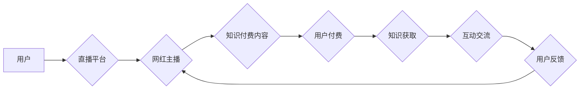

                 

## 关键词：知识付费、直播互动、网红经济、在线教育、内容生态、数据驱动、用户体验

## 1. 背景介绍

近年来，互联网技术的发展和移动互联网的普及，深刻地改变了人们获取信息和学习知识的方式。知识付费和直播互动作为互联网时代的新兴商业模式，迅速崛起，并逐渐融合，催生出一种全新的网红经济模式。

**1.1 知识付费的兴起**

知识付费是指以知识、技能、经验等为核心内容，通过付费的方式获取知识和服务。随着人们对自我提升和技能学习的重视，以及优质内容的稀缺性，知识付费市场呈现出爆发式增长。

**1.2 直播互动的普及**

直播互动是指通过实时视频传输，实现用户与主播之间的双向互动。直播平台的兴起，为用户提供了更加沉浸式和即时的体验，也为内容创作者提供了新的传播渠道。

**1.3 网红经济的蓬勃发展**

网红经济是指以网红为核心，通过内容创作、粉丝运营、商业合作等方式，实现经济价值的模式。网红凭借其独特的个人魅力和内容风格，积累了大量的粉丝，并逐渐成为品牌营销和产品推广的重要力量。

## 2. 核心概念与联系

知识付费与直播互动相结合的网红经济模式，融合了知识传播、互动娱乐和商业变现等多个要素，形成了一种全新的内容生态。

**2.1 核心概念原理**

* **知识付费:** 提供优质的知识内容，并通过付费的方式获取收益。
* **直播互动:** 利用实时视频传输，实现用户与主播之间的双向互动，增强用户粘性和参与度。
* **网红经济:** 借助网红的影响力，吸引用户关注，并实现商业变现。

**2.2 架构流程图**



**2.3 核心联系**

* **知识付费为核心:** 直播互动作为辅助手段，增强了知识付费内容的吸引力和互动性。
* **网红为引力:** 网红的影响力吸引用户关注，并促使用户付费获取知识。
* **直播互动为粘性:** 双向互动增强了用户粘性，提高了用户付费意愿。

## 3. 核心算法原理 & 具体操作步骤

**3.1 算法原理概述**

知识付费与直播互动相结合的网红经济模式，本质上是一种内容推荐和用户匹配算法的应用。通过分析用户行为数据、内容特征数据和网红属性数据，算法可以精准推荐符合用户需求的知识付费内容和网红主播。

**3.2 算法步骤详解**

1. **数据采集:** 收集用户行为数据（观看时长、点赞、评论、付费等）、内容特征数据（主题、标签、类型、质量等）和网红属性数据（粉丝数量、活跃度、专业领域等）。
2. **数据预处理:** 对采集到的数据进行清洗、转换和特征提取，以便于算法训练和应用。
3. **模型训练:** 利用机器学习算法，训练用户-内容-网红匹配模型。常见的算法包括协同过滤、内容基准和深度学习等。
4. **内容推荐:** 根据用户的兴趣偏好和历史行为，推荐符合其需求的知识付费内容和网红主播。
5. **互动优化:** 通过分析用户与内容和网红之间的互动数据，优化内容推荐策略和直播互动环节，提升用户体验。

**3.3 算法优缺点**

* **优点:** 能够精准推荐符合用户需求的内容，提高用户匹配度和付费意愿。
* **缺点:** 需要大量的数据支撑，算法模型的训练和优化需要专业技术人员。

**3.4 算法应用领域**

* 在线教育平台
* 直播电商平台
* 内容创作平台
* 社交媒体平台

## 4. 数学模型和公式 & 详细讲解 & 举例说明

**4.1 数学模型构建**

知识付费与直播互动相结合的网红经济模式，可以构建一个多变量数学模型，来预测用户付费意愿。

**用户付费意愿 = f(用户特征, 内容特征, 网红特征, 直播互动特征)**

其中:

* **用户特征:** 年龄、性别、职业、收入、教育程度、兴趣爱好等。
* **内容特征:** 主题、标签、类型、质量、价格、时长等。
* **网红特征:** 粉丝数量、活跃度、专业领域、信誉度等。
* **直播互动特征:** 观看人数、点赞数、评论数、礼物数、互动时长等。

**4.2 公式推导过程**

由于模型复杂度较高，无法直接推导出一个通用的公式。需要根据实际情况，选择合适的机器学习算法，并进行模型训练和优化。

**4.3 案例分析与讲解**

假设我们想要预测用户是否会付费观看某位网红主播的知识付费直播。我们可以收集用户、内容、网红和直播互动特征数据，并利用逻辑回归算法训练模型。

通过模型训练，我们可以得到一个预测概率，例如用户付费的概率为70%。

## 5. 项目实践：代码实例和详细解释说明

**5.1 开发环境搭建**

* 操作系统: Windows/macOS/Linux
* Python版本: 3.6+
* 必要的库: pandas, numpy, scikit-learn, tensorflow等

**5.2 源代码详细实现**

```python
# 导入必要的库
import pandas as pd
from sklearn.linear_model import LogisticRegression

# 加载数据
data = pd.read_csv('user_data.csv')

# 数据预处理
# ...

# 训练模型
model = LogisticRegression()
model.fit(data[['用户特征1', '用户特征2', ...]], data['付费'])

# 预测
new_user_data = pd.DataFrame({
    '用户特征1': [value1],
    '用户特征2': [value2],
    # ...
})
prediction = model.predict(new_user_data)

# 输出预测结果
print(prediction)
```

**5.3 代码解读与分析**

* 代码首先导入必要的库，并加载用户数据。
* 数据预处理步骤包括数据清洗、特征提取等。
* 训练模型使用逻辑回归算法，并将用户特征作为输入，付费行为作为输出。
* 预测部分使用训练好的模型，预测新用户的付费行为。

**5.4 运行结果展示**

运行结果将输出新用户的付费预测结果，例如 0 表示不付费，1 表示付费。

## 6. 实际应用场景

**6.1 在线教育平台**

* 推荐适合用户学习的课程和老师。
* 根据用户学习进度和反馈，个性化推荐学习内容。
* 利用直播互动功能，实现师生互动和知识答疑。

**6.2 直播电商平台**

* 推荐符合用户兴趣和需求的商品。
* 利用网红直播带货，提高商品销量。
* 通过直播互动，增强用户体验和购买意愿。

**6.3 内容创作平台**

* 推荐符合用户兴趣的优质内容。
* 利用网红效应，提升内容传播力和影响力。
* 通过直播互动，增强用户粘性和粉丝互动。

**6.4 未来应用展望**

* **更精准的个性化推荐:** 利用人工智能技术，更加精准地推荐符合用户需求的内容和服务。
* **更丰富的互动体验:** 利用虚拟现实、增强现实等技术，打造更加沉浸式的直播互动体验。
* **更完善的商业模式:** 开发更加多元化的商业模式，例如会员订阅、知识产权授权等。

## 7. 工具和资源推荐

**7.1 学习资源推荐**

* **书籍:** 《深度学习》、《机器学习实战》
* **在线课程:** Coursera、edX、Udacity
* **博客:** Towards Data Science、Machine Learning Mastery

**7.2 开发工具推荐**

* **Python:** 作为机器学习和数据分析的常用语言。
* **Jupyter Notebook:** 用于编写和运行Python代码，并可视化数据。
* **TensorFlow/PyTorch:** 深度学习框架。

**7.3 相关论文推荐**

* **推荐系统:** 《Collaborative Filtering for Implicit Feedback Datasets》
* **机器学习:** 《Support Vector Machines》
* **深度学习:** 《Deep Learning》

## 8. 总结：未来发展趋势与挑战

**8.1 研究成果总结**

知识付费与直播互动相结合的网红经济模式，已经取得了一定的发展成果，为用户提供了更加便捷、高效的知识获取方式，也为内容创作者和品牌提供了新的商业机会。

**8.2 未来发展趋势**

* **人工智能技术将更加深入地应用于内容推荐、用户匹配和互动优化等环节。**
* **直播互动形式将更加多样化，例如虚拟现实、增强现实等技术将被应用于直播场景。**
* **商业模式将更加多元化，例如会员订阅、知识产权授权等将成为新的发展方向。**

**8.3 面临的挑战**

* **数据安全和隐私保护:** 知识付费平台需要妥善处理用户数据，保障用户隐私安全。
* **内容质量和版权保护:** 平台需要加强对内容质量的监管，并有效保护知识产权。
* **监管政策和行业规范:** 政府和行业需要制定相应的监管政策和行业规范，引导平台健康发展。

**8.4 研究展望**

未来，我们需要继续深入研究知识付费与直播互动相结合的网红经济模式，探索更加精准、高效、安全的知识传播和商业变现模式。


## 9. 附录：常见问题与解答

**9.1 如何选择合适的知识付费内容？**

* 结合自身兴趣和需求，选择符合学习目标的内容。
* 阅读用户评价和课程介绍，了解内容质量和师资水平。
* 尝试免费课程或试听，体验课程风格和教学方法。

**9.2 如何提高直播互动体验？**

* 主动参与互动环节，例如提问、点赞、评论等。
* 与其他用户交流互动，分享学习心得和经验。
* 利用直播平台提供的工具，例如虚拟礼物、表情包等，增强互动乐趣。

**9.3 如何保护知识付费平台的知识产权？**

* 平台需要采取技术手段，例如加密、水印等，防止内容盗版。
* 平台需要加强法律维权，对侵权行为进行追究。
* 用户需要尊重知识产权，合法获取知识付费内容。


作者：禅与计算机程序设计艺术 / Zen and the Art of Computer Programming 
<end_of_turn>

