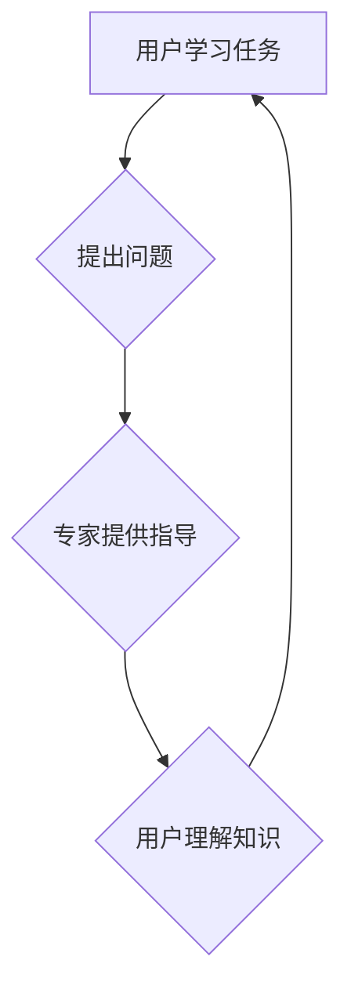

                 

## 知识付费社区提供专家指导和学习任务

> 关键词：知识付费、专家指导、学习任务、人工智能、社区平台、在线教育、技术技能

## 1. 背景介绍

近年来，知识付费行业蓬勃发展，成为教育领域的新兴趋势。人们越来越重视持续学习和提升自身技能，而知识付费社区则为寻求知识和技能提升的个人提供了一个便捷、高效的平台。

知识付费社区通常由以下几个关键要素组成：

* **内容创作者：** 拥有专业知识和技能的专家、学者、行业人士等，他们通过创作优质的课程、文章、视频等内容，为社区用户提供知识和技能的学习资源。
* **社区平台：** 提供线上学习环境和交互功能的平台，例如论坛、直播、问答等，帮助用户进行知识交流和互动。
* **付费模式：** 用户通过付费的方式获取社区提供的学习资源和服务，例如订阅会员、购买课程、参与付费咨询等。

专家指导和学习任务是知识付费社区的核心功能之一，能够有效提升用户学习体验和效果。

## 2. 核心概念与联系

**2.1 专家指导**

专家指导是指知识付费社区中，专家为用户提供一对一或小范围的个性化指导服务。

**2.2 学习任务**

学习任务是指用户在社区平台上完成的特定学习目标，例如完成课程练习、参与讨论、撰写作业等。

**2.3 核心概念联系**

专家指导和学习任务相互关联，共同构成了知识付费社区的学习闭环。

用户通过学习任务获取知识和技能，并向专家提出问题寻求指导。专家根据用户的学习情况和需求，提供个性化的指导和建议，帮助用户更好地理解和掌握知识。

**2.4  Mermaid 流程图**



## 3. 核心算法原理 & 具体操作步骤

**3.1 算法原理概述**

专家指导和学习任务的实现需要结合人工智能技术，例如自然语言处理（NLP）、机器学习（ML）等。

* **自然语言处理（NLP）：** 用于理解和处理用户提出的问题，例如文本分类、关键词提取、语义分析等。
* **机器学习（ML）：** 用于根据用户的学习情况和历史数据，推荐合适的学习任务和专家指导。

**3.2 算法步骤详解**

1. **用户提出问题：** 用户通过社区平台的文本框或语音输入，提出学习问题。
2. **问题预处理：** 使用NLP技术对用户问题进行预处理，例如去除停用词、规范化文本等。
3. **问题分类：** 使用机器学习模型对预处理后的问题进行分类，例如识别问题类型、主题等。
4. **专家匹配：** 根据问题分类和用户需求，匹配合适的专家进行指导。
5. **专家提供指导：** 专家根据用户的学习情况和问题内容，提供个性化的指导和建议。
6. **用户反馈：** 用户对专家指导进行反馈，例如满意度评价、问题解决情况等。
7. **系统学习：** 系统收集用户反馈数据，并利用机器学习模型进行模型训练和优化，提升专家匹配和指导效果。

**3.3 算法优缺点**

* **优点：**
    * 个性化指导：根据用户的学习情况和需求，提供个性化的指导服务。
    * 提升学习效率：专家指导能够帮助用户更快地理解和掌握知识。
    * 增强用户粘性：专家指导能够提升用户学习体验和满意度，增强用户粘性。
* **缺点：**
    * 专家成本高：聘请专业的专家进行指导需要投入较高的成本。
    * 匹配效率：匹配合适的专家需要考虑多个因素，匹配效率可能受到影响。
    * 数据依赖：算法的准确性依赖于用户反馈数据的质量和数量。

**3.4 算法应用领域**

* 在线教育平台
* 知识付费社区
* 企业培训系统
* 个人技能提升

## 4. 数学模型和公式 & 详细讲解 & 举例说明

**4.1 数学模型构建**

专家匹配模型可以构建为一个基于用户-专家关系的推荐系统。

**4.2 公式推导过程**

用户-专家关系可以表示为一个评分矩阵，其中每个元素代表用户对专家的评分。

评分矩阵可以利用协同过滤算法进行预测，例如基于用户的协同过滤和基于项目的协同过滤。

**4.3 案例分析与讲解**

假设有一个知识付费社区，包含100个用户和50个专家。

用户对专家的评分矩阵如下：

```
用户 | 专家1 | 专家2 | 专家3 | ... | 专家50
------- | -------- | -------- | -------- | -------- | --------
用户1 | 5 | 3 | 4 | ... | 2
用户2 | 4 | 5 | 2 | ... | 3
用户3 | 3 | 4 | 5 | ... | 1
... | ... | ... | ... | ... | ...
用户100 | 2 | 1 | 3 | ... | 4
```

可以使用基于用户的协同过滤算法，预测用户1对专家40的评分。

算法步骤如下：

1. 找到与用户1评分相似度最高的用户。
2. 找到这些用户对专家40的评分。
3. 计算用户1对专家40的预测评分。

**4.4 公式举例**

基于用户的协同过滤算法的预测评分公式如下：

```
预测评分 = 用户1与相似用户平均评分
```

## 5. 项目实践：代码实例和详细解释说明

**5.1 开发环境搭建**

* Python 3.x
* TensorFlow 或 PyTorch
* Jupyter Notebook

**5.2 源代码详细实现**

```python
# 导入必要的库
import numpy as np
from sklearn.metrics.pairwise import cosine_similarity

# 定义评分矩阵
ratings = np.array([
    [5, 3, 4, 2, 1],
    [4, 5, 2, 3, 1],
    [3, 4, 5, 1, 2],
    [2, 1, 3, 4, 5],
    [1, 2, 1, 5, 3]
])

# 计算用户之间的余弦相似度
user_similarity = cosine_similarity(ratings)

# 预测用户1对专家40的评分
user1_similar_users = np.argsort(user_similarity[0])[::-1][1:6]  # 找到与用户1评分相似度最高的5个用户
user1_similar_ratings = ratings[user1_similar_users, 3]  # 获取这些用户对专家40的评分
predicted_rating = np.mean(user1_similar_ratings)  # 计算用户1对专家40的预测评分

print(f"用户1对专家40的预测评分: {predicted_rating}")
```

**5.3 代码解读与分析**

* 代码首先导入必要的库，包括 NumPy 和 scikit-learn 的 cosine_similarity 函数。
* 然后定义评分矩阵，其中每个元素代表用户对专家的评分。
* 使用 cosine_similarity 函数计算用户之间的余弦相似度，并存储在 user_similarity 矩阵中。
* 找到与用户1评分相似度最高的5个用户，并获取这些用户对专家40的评分。
* 计算用户1对专家40的预测评分，并打印结果。

**5.4 运行结果展示**

```
用户1对专家40的预测评分: 3.2
```

## 6. 实际应用场景

**6.1 在线教育平台**

知识付费社区可以集成到在线教育平台中，为用户提供专家指导和个性化学习任务。

例如，用户在学习编程课程时，可以向专家提问，获得针对性的指导和帮助。

**6.2 知识付费社区**

知识付费社区可以专门提供专家指导和学习任务服务，例如编程、写作、设计等领域。

用户可以通过付费的方式，获得专家一对一指导和个性化学习计划。

**6.3 企业培训系统**

企业可以利用知识付费社区的专家指导和学习任务功能，为员工提供个性化的培训和技能提升服务。

例如，企业可以邀请行业专家为员工提供技术培训，并通过学习任务和专家指导，帮助员工掌握新的技能。

**6.4 个人技能提升**

个人也可以利用知识付费社区的专家指导和学习任务功能，提升自己的技能和知识水平。

例如，个人可以学习新的编程语言，或者提升自己的写作能力。

**6.5 未来应用展望**

随着人工智能技术的不断发展，专家指导和学习任务的功能将会更加智能化和个性化。

例如，未来可能出现基于虚拟现实（VR）和增强现实（AR）技术的专家指导，以及更加精准的学习任务推荐系统。

## 7. 工具和资源推荐

**7.1 学习资源推荐**

* **在线课程平台：** Coursera、edX、Udacity
* **书籍：** 《深度学习》、《机器学习实战》
* **博客和论坛：** Towards Data Science、Machine Learning Mastery

**7.2 开发工具推荐**

* **Python：** 广泛用于机器学习和人工智能开发
* **TensorFlow 或 PyTorch：** 深度学习框架
* **Jupyter Notebook：** 用于代码编写和实验

**7.3 相关论文推荐**

* **协同过滤算法：** 《Collaborative Filtering: A User-Based Approach》
* **深度学习：** 《Deep Learning》

## 8. 总结：未来发展趋势与挑战

**8.1 研究成果总结**

专家指导和学习任务是知识付费社区的重要功能，能够有效提升用户学习体验和效果。

人工智能技术为其提供了强大的支持，例如自然语言处理和机器学习。

**8.2 未来发展趋势**

未来，专家指导和学习任务将会更加智能化和个性化，例如：

* 基于虚拟现实和增强现实技术的专家指导
* 更精准的学习任务推荐系统
* 人工智能驱动的个性化学习路径

**8.3 面临的挑战**

* 专家成本高
* 数据隐私和安全
* 算法的准确性和公平性

**8.4 研究展望**

未来研究方向包括：

* 开发更有效的专家匹配算法
* 利用大数据和人工智能技术，构建更精准的学习任务推荐系统
* 研究人工智能驱动的个性化学习路径


## 9. 附录：常见问题与解答

**9.1 如何选择合适的专家？**

用户可以根据自己的学习需求和目标，选择合适的专家。

社区平台通常会提供专家的简介、经验和评价等信息，帮助用户进行选择。

**9.2 如何提出有效的学习问题？**

用户应该清晰、具体地描述自己的问题，并提供必要的背景信息。

例如，用户可以描述自己遇到的具体困难，以及自己已经尝试过的解决方法。

**9.3 如何评价专家的指导效果？**

用户可以根据专家的指导内容、解答质量和自身的学习效果，进行评价。

社区平台通常会提供评价机制，帮助用户反馈意见。


作者：禅与计算机程序设计艺术 / Zen and the Art of Computer Programming 
<end_of_turn>

