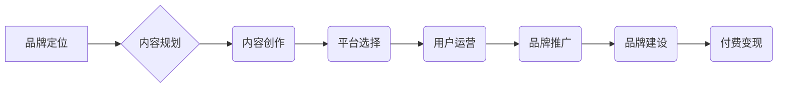

                 

## 知识付费赚钱的品牌品牌运营与品牌推广策略

> 关键词：知识付费、品牌运营、品牌推广、内容营销、社区建设、付费变现、用户运营

### 1. 背景介绍

知识经济时代，知识成为最宝贵的资源。知识付费作为一种新型的商业模式，在近年来迅速发展，成为众多创作者和企业寻求变现的重要途径。 

知识付费的核心在于将个人或机构的专业知识、技能和经验以数字化形式 packaged，并通过线上平台向用户提供付费获取。 

这种模式的兴起，得益于互联网技术的普及和用户对高质量知识的需求不断增长。 

然而，知识付费市场竞争激烈，想要在众多平台和内容中脱颖而出，建立自己的品牌，并实现持续盈利，需要深入思考品牌运营和推广策略。

### 2. 核心概念与联系

**2.1 品牌运营**

品牌运营是指企业围绕品牌价值，通过一系列的策略和行动，提升品牌知名度、美誉度和忠诚度，最终实现品牌价值最大化。

**2.2 品牌推广**

品牌推广是指企业通过各种营销活动，向目标用户传播品牌信息，提升品牌认知度和影响力，从而促进品牌销售和发展。

**2.3 知识付费品牌运营与推广的联系**

知识付费品牌运营与推广是相互关联、相互促进的。

良好的品牌运营可以为品牌推广提供坚实的基础，而有效的品牌推广可以提升品牌知名度和用户粘性，为品牌运营提供动力。

**2.4  品牌运营与推广流程图**



### 3. 核心算法原理 & 具体操作步骤

**3.1 算法原理概述**

知识付费品牌运营与推广的核心算法原理在于用户行为分析和数据驱动决策。

通过收集用户数据，分析用户行为模式，可以精准定位目标用户，制定有效的品牌运营和推广策略。

**3.2 算法步骤详解**

1. **数据收集:** 收集用户行为数据，包括用户画像、内容消费习惯、互动行为等。
2. **数据分析:** 利用数据分析工具，对用户数据进行分析，挖掘用户行为模式和潜在需求。
3. **用户画像构建:** 根据数据分析结果，构建用户画像，明确目标用户的特征和需求。
4. **内容规划:** 根据用户画像，制定内容规划，确定内容主题、形式、风格等。
5. **内容创作:** 根据内容规划，创作高质量、符合用户需求的内容。
6. **平台选择:** 选择合适的平台，将内容发布给目标用户。
7. **用户运营:** 通过互动、活动等方式，与用户建立联系，提升用户粘性。
8. **品牌推广:** 利用线上线下渠道，推广品牌信息，提升品牌知名度和影响力。
9. **付费变现:** 通过会员制度、课程销售等方式，实现知识付费变现。

**3.3 算法优缺点**

**优点:**

* 数据驱动决策，提高运营效率。
* 精准定位目标用户，提升营销效果。
* 持续优化内容和策略，实现品牌可持续发展。

**缺点:**

* 需要投入大量时间和资源进行数据收集和分析。
* 数据分析结果存在一定的误差，需要结合实际情况进行判断。
* 用户行为模式不断变化，需要持续跟踪和调整策略。

**3.4 算法应用领域**

* 知识付费平台
* 教育培训机构
* 咨询服务公司
* 个人创作者

### 4. 数学模型和公式 & 详细讲解 & 举例说明

**4.1 数学模型构建**

知识付费品牌运营与推广可以构建一个数学模型，来预测用户行为和品牌影响力。

该模型可以包含以下变量：

* **用户数量 (N):** 关注品牌的用户数量。
* **用户活跃度 (A):** 用户在平台上的活跃度，例如访问频率、互动次数等。
* **内容质量 (Q):** 内容的质量，例如原创性、实用性、吸引力等。
* **品牌影响力 (B):** 品牌在用户心中的影响力，例如知名度、信任度、忠诚度等。
* **推广力度 (P):** 品牌推广的力度，例如广告投放、活动策划等。

**4.2 公式推导过程**

可以建立一个线性回归模型，来预测用户数量和品牌影响力：

```latex
N = a + bA + cQ + dB + eP
```

其中，a、b、c、d、e为模型参数，可以通过数据拟合得到。

**4.3 案例分析与讲解**

假设一个知识付费平台，通过数据分析发现以下规律：

* 用户活跃度每增加10%，用户数量增长5%。
* 内容质量每提高1分，用户数量增长2%。
* 品牌影响力每提高1分，用户数量增长3%。
* 推广力度每增加10%，用户数量增长1%。

根据这些规律，可以建立一个线性回归模型：

```latex
N = 100 + 0.05A + 0.02Q + 0.03B + 0.01P
```

该模型可以用来预测不同用户活跃度、内容质量、品牌影响力和推广力度组合下，平台的用户数量。

### 5. 项目实践：代码实例和详细解释说明

**5.1 开发环境搭建**

* Python 3.x
* Jupyter Notebook
* pandas
* scikit-learn

**5.2 源代码详细实现**

```python
import pandas as pd
from sklearn.linear_model import LinearRegression

# 数据加载
data = pd.read_csv('knowledge_pay_data.csv')

# 特征选择
X = data[['A', 'Q', 'B', 'P']]
y = data['N']

# 模型训练
model = LinearRegression()
model.fit(X, y)

# 模型评估
# ...

# 预测
new_data = pd.DataFrame({'A': [100], 'Q': [8], 'B': [5], 'P': [20]})
prediction = model.predict(new_data)
print(prediction)
```

**5.3 代码解读与分析**

* 代码首先加载数据，并选择需要用于模型训练的特征和目标变量。
* 然后使用 scikit-learn 库中的 LinearRegression 类创建线性回归模型，并使用 fit() 方法训练模型。
* 训练完成后，可以使用 predict() 方法对新的数据进行预测。

**5.4 运行结果展示**

运行代码后，会输出预测的用户数量。

### 6. 实际应用场景

**6.1 知识付费平台运营**

* 通过用户行为分析，精准定位目标用户，定制化内容推荐。
* 根据用户反馈，优化内容质量和更新频率。
* 利用数据驱动决策，制定有效的品牌推广策略。

**6.2 教育培训机构营销**

* 分析学员学习行为，提供个性化学习方案。
* 根据市场需求，开发新的课程和培训项目。
* 利用数据分析，评估培训效果，不断改进教学内容。

**6.3 咨询服务公司品牌建设**

* 通过用户画像，了解目标客户的需求和痛点。
* 制定精准的营销策略，提升品牌知名度和影响力。
* 利用数据分析，评估服务效果，提升客户满意度。

**6.4 未来应用展望**

随着人工智能技术的不断发展，知识付费品牌运营与推广将更加智能化和个性化。

未来，我们可以期待：

* 更精准的用户画像和行为预测。
* 更个性化的内容推荐和学习方案。
* 更有效的品牌推广和营销活动。
* 更智能化的品牌运营和管理系统。

### 7. 工具和资源推荐

**7.1 学习资源推荐**

* **书籍:**

    * 《数据分析实战》
    * 《Python数据科学手册》
    * 《机器学习实战》

* **在线课程:**

    * Coursera
    * edX
    * Udemy

**7.2 开发工具推荐**

* **Python:**

    * pandas
    * scikit-learn
    * TensorFlow

* **数据可视化工具:**

    * Tableau
    * Power BI
    * matplotlib

**7.3 相关论文推荐**

* **推荐系统:**

    * Collaborative Filtering for Implicit Feedback Datasets
    * Matrix Factorization Techniques for Recommender Systems

* **用户行为分析:**

    * A Survey on User Behavior Modeling
    * Understanding User Behavior in Online Social Networks

### 8. 总结：未来发展趋势与挑战

**8.1 研究成果总结**

知识付费品牌运营与推广的算法研究取得了显著成果，为品牌运营和推广提供了数据驱动决策的工具和方法。

**8.2 未来发展趋势**

未来，知识付费品牌运营与推广将更加智能化、个性化和数据化。

* **人工智能技术:**

    * 更精准的用户画像和行为预测。
    * 更个性化的内容推荐和学习方案。
    * 更智能化的品牌运营和管理系统。

* **大数据技术:**

    * 更全面、更深入的用户行为分析。
    * 更有效的品牌推广和营销活动。

**8.3 面临的挑战**

* **数据隐私保护:**

    * 如何收集和使用用户数据，同时保障用户隐私安全。

* **算法可解释性:**

    * 如何提高算法的透明度和可解释性，让用户理解算法是如何运作的。

* **用户信任:**

    * 如何建立用户对知识付费平台和品牌的信任。

**8.4 研究展望**

未来，需要进一步研究以下问题:

* 如何开发更精准、更智能的用户画像模型。
* 如何设计更个性化的内容推荐和学习方案。
* 如何提高算法的可解释性和透明度。
* 如何建立用户对知识付费平台和品牌的信任。


### 9. 附录：常见问题与解答

**9.1 如何选择合适的知识付费平台？**

选择知识付费平台需要考虑以下因素:

* 平台用户群体
* 平台内容质量
* 平台运营模式
* 平台收费标准

**9.2 如何打造自己的知识付费品牌？**

打造知识付费品牌需要以下步骤:

* 确定品牌定位
* 规划内容方向
* 创作高质量内容
* 选择合适的平台
* 进行品牌推广
* 建立用户社区

**9.3 如何提高知识付费课程的转化率？**

提高知识付费课程的转化率需要以下措施:

* 优化课程内容
* 提供免费试听
* 降低课程价格
* 提供优惠活动
* 建立用户口碑

作者：禅与计算机程序设计艺术 / Zen and the Art of Computer Programming 


<end_of_turn>

