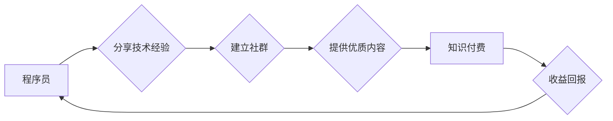

                 

## 知识付费：程序员的社群运营技巧

> 关键词：知识付费、程序员社群、运营技巧、内容创作、社区建设、技术分享、商业模式

## 1. 背景介绍

在当今数字化时代，知识已成为最宝贵的资源之一。程序员作为科技领域的核心力量，拥有丰富的技术经验和专业技能。如何将这些知识转化为价值，并通过知识付费模式实现自我价值和经济回报，成为越来越多的程序员关注的焦点。

程序员社群运营，作为知识付费的重要载体，为程序员提供了展示技术实力、分享经验、建立个人品牌和获取收益的平台。通过精心策划和运营的社群，程序员可以与志同道合的同行交流学习，共同进步，并通过提供优质内容和服务，实现知识付费的商业化。

## 2. 核心概念与联系

**2.1 知识付费**

知识付费是指通过提供有价值的知识、技能和服务，向用户收取费用的一种商业模式。它打破了传统知识传播的壁垒，赋予了知识生产者更多的自主性和收益权。

**2.2 程序员社群**

程序员社群是指由程序员组成的网络或线下组织，其成员之间通过共同的兴趣爱好、技术交流、项目合作等方式建立联系和互动。

**2.3 社群运营**

社群运营是指通过一系列的策略和行动，维护和发展社群，使其成为一个活跃、有价值的平台。

**2.4 核心关系**

知识付费与程序员社群运营之间存在着密切的联系。程序员社群可以成为知识付费的平台，而知识付费可以为程序员社群提供持续的动力和发展空间。

**Mermaid 流程图**



## 3. 核心算法原理 & 具体操作步骤

**3.1 算法原理概述**

程序员社群运营的核心算法原理在于构建一个高效的知识传播和价值交换机制。

**3.2 算法步骤详解**

1. **目标用户定位:** 确定目标用户群体，了解他们的需求、兴趣和痛点。
2. **内容规划:** 根据目标用户需求，规划优质、有价值的内容，包括技术文章、代码示例、项目案例、在线课程等。
3. **社群建设:** 选择合适的平台，建立线上或线下社群，并制定运营策略，吸引和留住用户。
4. **互动交流:** 鼓励用户参与互动，例如提问、讨论、分享经验，构建活跃的社群氛围。
5. **价值提供:** 通过提供优质内容、服务和资源，为用户创造价值，建立信任和粘性。
6. **知识付费:** 设计合理的知识付费模式，例如付费课程、会员订阅、咨询服务等，实现商业化。

**3.3 算法优缺点**

**优点:**

* 能够有效地将程序员的知识和经验转化为价值。
* 可以建立一个活跃的程序员社区，促进技术交流和合作。
* 能够为程序员提供持续的收入来源。

**缺点:**

* 需要投入大量的时间和精力进行社群运营。
* 需要不断更新内容，才能保持用户兴趣。
* 需要找到合适的知识付费模式，才能实现商业化。

**3.4 算法应用领域**

程序员社群运营的知识付费模式广泛应用于以下领域:

* **技术培训:** 提供编程语言、框架、工具等方面的培训课程。
* **项目合作:** 连接程序员，帮助他们找到项目合作机会。
* **技术咨询:** 为用户提供技术咨询服务，解决编程问题。
* **开源项目维护:** 通过知识付费支持开源项目的开发和维护。

## 4. 数学模型和公式 & 详细讲解 & 举例说明

**4.1 数学模型构建**

我们可以用一个简单的数学模型来描述程序员社群运营的知识付费模式:

**价值 = 内容质量 * 社群活跃度 * 用户粘性**

其中:

* **内容质量:** 指的是内容的实用性、原创性、深度和吸引力。
* **社群活跃度:** 指的是社群成员的参与度、互动频率和贡献度。
* **用户粘性:** 指的是用户对社群的依赖度、复购率和忠诚度。

**4.2 公式推导过程**

* **内容质量**越高，用户获得的价值越大，从而提高了付费意愿。
* **社群活跃度**越高，用户更容易获得帮助和支持，增强了社群归属感，提高了用户粘性。
* **用户粘性**越高，用户对社群的依赖度越高，更容易成为付费用户。

**4.3 案例分析与讲解**

例如，一个专注于人工智能领域的程序员社群，其内容质量包括最新的AI算法研究、实战案例分享、开源工具介绍等。社群运营团队定期组织线上线下活动，鼓励成员交流学习，并提供一对一技术指导服务。

通过持续提供优质内容和服务，该社群吸引了大量程序员加入，并形成了活跃的讨论氛围。用户对该社群的依赖度不断提高，最终实现了知识付费的商业化，例如通过付费课程、会员订阅等模式，为社群运营团队带来了稳定的收入。

## 5. 项目实践：代码实例和详细解释说明

**5.1 开发环境搭建**

* 选择合适的编程语言和框架，例如Python和Django。
* 安装必要的软件和工具，例如数据库、Web服务器、代码编辑器等。

**5.2 源代码详细实现**

```python
# 社群用户模型
class User(models.Model):
    username = models.CharField(max_length=255)
    email = models.EmailField()
    # ... 其他字段

# 内容模型
class Content(models.Model):
    title = models.CharField(max_length=255)
    content = models.TextField()
    author = models.ForeignKey(User, on_delete=models.CASCADE)
    # ... 其他字段

# 知识付费课程模型
class Course(models.Model):
    title = models.CharField(max_length=255)
    description = models.TextField()
    price = models.DecimalField(max_digits=10, decimal_places=2)
    # ... 其他字段
```

**5.3 代码解读与分析**

以上代码示例展示了程序员社群运营平台的基本模型，包括用户、内容和知识付费课程。

* 用户模型存储了用户的基本信息，例如用户名、邮箱等。
* 内容模型存储了社群中的各种内容，例如文章、代码示例、视频等。
* 知识付费课程模型存储了付费课程的信息，例如课程标题、描述、价格等。

**5.4 运行结果展示**

通过运行以上代码，可以搭建一个基本的程序员社群运营平台，实现用户注册、内容发布、知识付费等功能。

## 6. 实际应用场景

**6.1 在线技术社区**

例如Stack Overflow、GitHub等平台，通过知识付费模式，提供高级会员服务、付费咨询等，为社区运营和用户提供更多价值。

**6.2 线下技术 Meetup**

程序员组织线下技术交流活动，通过知识付费模式，提供付费讲座、培训课程等，吸引更多用户参与。

**6.3 个人技术博客**

程序员通过个人博客分享技术经验，可以通过知识付费模式，提供付费课程、电子书等，实现个人品牌建设和商业化。

**6.4 技术培训机构**

技术培训机构可以通过社群运营，建立学员社区，提供线上线下学习资源，并通过知识付费模式，提供定制化培训课程、一对一指导等服务。

**6.5 未来应用展望**

随着人工智能、大数据等技术的不断发展，程序员社群运营的知识付费模式将更加多元化和智能化。例如，基于人工智能的个性化学习推荐、虚拟现实技术打造沉浸式学习体验等，将为程序员提供更加高效、便捷的学习方式。

## 7. 工具和资源推荐

**7.1 学习资源推荐**

* **书籍:**《程序员的成长之路》、《社群运营实战指南》
* **在线课程:** Udemy、Coursera、Udacity等平台提供丰富的程序员社群运营课程。
* **博客:** 关注程序员社群运营领域的知名博客，例如程序员之家、码农之家等。

**7.2 开发工具推荐**

* **社群平台:** Discord、Slack、微信群等
* **内容管理系统:** WordPress、Django、Flask等
* **支付平台:** Alipay、微信支付、Stripe等

**7.3 相关论文推荐**

* **程序员社群运营研究:**  "The Impact of Online Communities on Software Development"
* **知识付费模式研究:** "The Economics of Knowledge Sharing"

## 8. 总结：未来发展趋势与挑战

**8.1 研究成果总结**

程序员社群运营的知识付费模式已经取得了一定的成功，为程序员提供了新的收入来源和发展机会。

**8.2 未来发展趋势**

* **个性化定制:** 基于用户需求和学习习惯，提供个性化学习内容和服务。
* **人工智能驱动:** 利用人工智能技术，实现智能内容推荐、自动答疑等功能，提高学习效率。
* **虚拟现实体验:** 利用虚拟现实技术，打造沉浸式学习体验，增强用户参与度。

**8.3 面临的挑战**

* **内容质量保证:** 需要持续提供高质量、有价值的内容，才能吸引和留住用户。
* **社群运营成本:** 社群运营需要投入大量的时间和精力，成本较高。
* **知识付费模式创新:** 需要不断探索新的知识付费模式，才能满足用户需求和实现商业化。

**8.4 研究展望**

未来，程序员社群运营的知识付费模式将更加智能化、个性化和多元化，为程序员提供更加高效、便捷的学习和发展平台。


## 9. 附录：常见问题与解答

**9.1 如何吸引用户加入社群？**

* 提供优质、有价值的内容
* 组织线上线下活动，促进用户互动
* 利用社交媒体推广社群
* 与其他程序员社区合作

**9.2 如何提高用户粘性？**

* 建立活跃的社群氛围
* 提供个性化学习服务
* 组织用户交流活动
* 奖励用户贡献

**9.3 如何设计合理的知识付费模式？**

* 了解用户需求和付费意愿
* 提供多种付费选项，例如付费课程、会员订阅、咨询服务等
* 保证内容质量和服务水平
* 提供良好的用户体验

**9.4 如何应对知识付费模式的挑战？**

* 持续提供高质量、有价值的内容
* 优化社群运营策略，降低运营成本
* 探索新的知识付费模式
* 与用户保持沟通，了解他们的需求和反馈


作者：禅与计算机程序设计艺术 / Zen and the Art of Computer Programming 
<end_of_turn>

