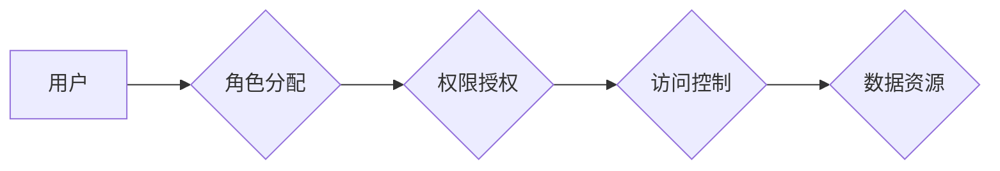

                 

## 知识发现引擎的用户权限管理

> 关键词：知识发现引擎、用户权限管理、角色授权、访问控制、数据安全、RBAC模型、细粒度权限、API接口

## 1. 背景介绍

知识发现引擎 (KDE) 作为一种强大的数据分析工具，能够从海量数据中挖掘出隐藏的知识和模式，为企业决策提供支持。然而，KDE 处理的数据通常包含敏感信息，因此用户权限管理显得尤为重要。

传统的数据库系统已经积累了丰富的用户权限管理经验，例如角色授权、访问控制等。然而，KDE 的特点，如数据复杂性、分析过程的动态性以及多用户协作，对用户权限管理提出了新的挑战。

## 2. 核心概念与联系

### 2.1 用户角色

在 KDE 中，用户通常被分配到不同的角色，每个角色拥有特定的权限和职责。例如，数据科学家可能需要访问所有数据进行分析，而业务分析师可能只需要访问特定数据集进行报表生成。

### 2.2 权限模型

权限模型定义了用户角色与数据资源之间的访问关系。常见的权限模型包括：

* **角色基准访问控制 (RBAC)**：将用户分配到角色，角色拥有特定的权限，用户继承角色的权限。
* **属性基准访问控制 (ABAC)**：根据用户属性、资源属性和环境属性进行动态授权。

### 2.3 访问控制

访问控制机制决定了用户是否可以访问特定的数据资源。常见的访问控制策略包括：

* **基于角色的访问控制 (RBAC)**：根据用户角色决定访问权限。
* **基于属性的访问控制 (ABAC)**：根据用户属性、资源属性和环境属性决定访问权限。
* **基于策略的访问控制 (PAC)**：使用规则引擎根据预定义的策略决定访问权限。

**Mermaid 流程图**



## 3. 核心算法原理 & 具体操作步骤

### 3.1 算法原理概述

KDE 的用户权限管理通常基于 RBAC 模型，通过角色授权和访问控制策略来实现。

* **角色授权**: 系统管理员定义角色，并为每个角色分配相应的权限。权限可以是读、写、删除等操作，也可以是访问特定数据资源的权限。
* **访问控制**: 当用户请求访问数据资源时，系统会根据用户的角色和资源的权限策略进行判断，决定是否允许访问。

### 3.2 算法步骤详解

1. **用户注册**: 新用户注册时，系统会分配一个唯一的用户 ID 和初始角色。
2. **角色管理**: 系统管理员可以创建、修改和删除角色，并为每个角色分配相应的权限。
3. **权限分配**: 系统管理员可以将用户分配到不同的角色，用户继承角色的权限。
4. **访问请求**: 当用户请求访问数据资源时，系统会检查用户的角色和资源的权限策略。
5. **访问控制**: 如果用户的角色拥有访问该资源的权限，则允许访问；否则，拒绝访问。

### 3.3 算法优缺点

**优点**:

* **易于理解和管理**: RBAC 模型简单易懂，易于管理和维护。
* **可扩展性强**: 可以根据需要添加新的角色和权限。
* **安全性高**: 通过角色授权和访问控制策略，可以有效地控制用户对数据资源的访问。

**缺点**:

* **缺乏灵活性**: RBAC 模型的权限分配比较固定，难以满足复杂场景的需求。
* **权限膨胀风险**: 如果角色权限设置过于宽松，可能会导致权限膨胀风险。

### 3.4 算法应用领域

RBAC 模型广泛应用于各种系统，例如：

* 数据库系统
* Web 应用
* 企业资源规划 (ERP) 系统
* 客户关系管理 (CRM) 系统

## 4. 数学模型和公式 & 详细讲解 & 举例说明

### 4.1 数学模型构建

我们可以用集合和关系来构建 RBAC 模型的数学模型：

* **用户集合**: U = {u1, u2, ..., un}
* **角色集合**: R = {r1, r2, ..., rm}
* **权限集合**: P = {p1, p2, ..., pn}
* **用户角色关系**: U × R → {0, 1}，表示用户 u 是否属于角色 r。
* **角色权限关系**: R × P → {0, 1}，表示角色 r 是否拥有权限 p。

### 4.2 公式推导过程

用户 u 是否拥有权限 p 可以通过以下公式推导：

```latex
u \in P \iff \exists r \in R (u \in R \land r \in P)
```

其中：

* u ∈ P 表示用户 u 拥有权限 p。
* ∃r ∈ R 表示存在一个角色 r。
* u ∈ R 表示用户 u 属于角色 r。
* r ∈ P 表示角色 r 拥有权限 p。

### 4.3 案例分析与讲解

假设有三个用户 (u1, u2, u3)，三个角色 (r1, r2, r3) 和三个权限 (p1, p2, p3)。

* 用户 u1 属于角色 r1 和 r2，角色 r1 拥有权限 p1 和 p2，角色 r2 拥有权限 p2 和 p3。
* 用户 u2 属于角色 r2 和 r3，角色 r2 拥有权限 p2 和 p3，角色 r3 拥有权限 p3。
* 用户 u3 属于角色 r1，角色 r1 拥有权限 p1 和 p2。

根据公式推导，我们可以得出：

* 用户 u1 拥有权限 p1，p2 和 p3。
* 用户 u2 拥有权限 p2 和 p3。
* 用户 u3 拥有权限 p1 和 p2。

## 5. 项目实践：代码实例和详细解释说明

### 5.1 开发环境搭建

* 操作系统：Linux
* 编程语言：Python
* 框架：Flask

### 5.2 源代码详细实现

```python
from flask import Flask, request, jsonify

app = Flask(__name__)

# 用户角色关系
user_roles = {
    'user1': ['admin', 'data_analyst'],
    'user2': ['data_analyst'],
    'user3': ['admin']
}

# 角色权限关系
role_permissions = {
    'admin': ['read', 'write', 'delete'],
    'data_analyst': ['read', 'write']
}

@app.route('/api/access', methods=['POST'])
def access_control():
    user = request.json.get('user')
    resource = request.json.get('resource')
    permission = request.json.get('permission')

    if user not in user_roles:
        return jsonify({'error': 'Invalid user'}), 401

    roles = user_roles[user]
    allowed = False

    for role in roles:
        if role in role_permissions and permission in role_permissions[role]:
            allowed = True
            break

    if allowed:
        return jsonify({'message': 'Access granted'}), 200
    else:
        return jsonify({'error': 'Access denied'}), 403

if __name__ == '__main__':
    app.run(debug=True)
```

### 5.3 代码解读与分析

* **用户角色关系**: 使用字典 `user_roles` 来存储用户和角色之间的关系。
* **角色权限关系**: 使用字典 `role_permissions` 来存储角色和权限之间的关系。
* **访问控制接口**: `/api/access` 接口接收用户、资源和权限信息，并根据 RBAC 模型进行访问控制。
* **权限判断**: 遍历用户的角色，判断角色是否拥有指定的权限。

### 5.4 运行结果展示

当用户请求访问资源时，系统会返回相应的访问结果：

* **访问允许**: 返回 `Access granted`。
* **访问拒绝**: 返回 `Access denied`。

## 6. 实际应用场景

KDE 的用户权限管理可以应用于各种场景，例如：

* **数据科学**: 不同的数据科学家可能需要访问不同的数据集进行分析，权限管理可以确保数据安全和隐私。
* **商业智能**: 业务分析师需要访问特定数据集进行报表生成，权限管理可以控制他们对数据的访问范围。
* **机器学习**: 训练机器学习模型需要访问大量数据，权限管理可以控制用户对训练数据的访问权限。

### 6.4 未来应用展望

随着 KDE 的发展，用户权限管理将面临新的挑战和机遇。例如：

* **细粒度权限**: 需要支持更细粒度的权限控制，例如控制对特定数据字段的访问。
* **动态授权**: 需要支持动态授权，根据用户行为和环境条件动态调整权限。
* **多租户环境**: 需要支持多租户环境，为不同的租户提供独立的权限管理。

## 7. 工具和资源推荐

### 7.1 学习资源推荐

* **RBAC 模型**: https://en.wikipedia.org/wiki/Role-based_access_control
* **ABAC 模型**: https://en.wikipedia.org/wiki/Attribute-based_access_control

### 7.2 开发工具推荐

* **Flask**: https://flask.palletsprojects.com/en/2.2.x/
* **Django**: https://www.djangoproject.com/

### 7.3 相关论文推荐

* **Role-Based Access Control: A Comprehensive Survey**: https://ieeexplore.ieee.org/document/6597548
* **Attribute-Based Access Control: A Survey**: https://dl.acm.org/doi/10.1145/2937723.2937737

## 8. 总结：未来发展趋势与挑战

### 8.1 研究成果总结

KDE 的用户权限管理已经取得了一定的成果，RBAC 模型为权限控制提供了基础框架。

### 8.2 未来发展趋势

未来，KDE 的用户权限管理将朝着以下方向发展：

* **细粒度权限**: 支持更细粒度的权限控制，例如控制对特定数据字段的访问。
* **动态授权**: 支持动态授权，根据用户行为和环境条件动态调整权限。
* **多租户环境**: 支持多租户环境，为不同的租户提供独立的权限管理。

### 8.3 面临的挑战

KDE 的用户权限管理也面临着一些挑战：

* **复杂场景**: 如何在复杂场景下实现灵活的权限控制。
* **数据安全**: 如何确保数据安全和隐私，防止数据泄露。
* **系统性能**: 如何保证权限管理机制对系统性能的影响最小。

### 8.4 研究展望

未来，我们需要继续研究和探索新的权限管理模型和技术，以满足 KDE 的发展需求。例如：

* 基于机器学习的权限管理
* 基于区块链的权限管理
* 基于身份验证的权限管理

## 9. 附录：常见问题与解答

**Q1: 如何设置用户角色和权限？**

A1: 系统管理员可以通过管理界面或 API 接口设置用户角色和权限。

**Q2: 如何控制用户对特定数据资源的访问？**

A2: 可以通过 RBAC 模型为角色分配相应的权限，控制角色对数据资源的访问。

**Q3: 如何处理权限膨胀风险？**

A3: 可以采用最小权限原则，只为用户分配必要的权限。定期审计用户权限，删除不必要的权限。

**Q4: 如何实现动态授权？**

A4: 可以使用 ABAC 模型，根据用户属性、资源属性和环境属性动态授权。

**Q5: 如何确保数据安全和隐私？**

A5: 可以采用多种安全措施，例如数据加密、访问日志记录、身份验证和授权机制。


作者：禅与计算机程序设计艺术 / Zen and the Art of Computer Programming 
<end_of_turn>

