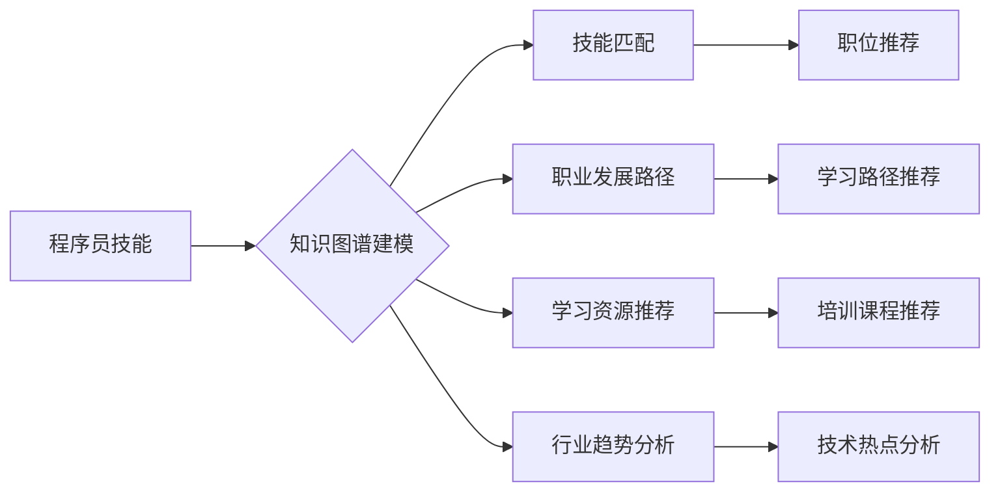

                 

## 知识图谱在程序员职业规划中的应用

> 关键词：知识图谱、程序员职业规划、技能匹配、职业发展、人工智能、数据分析、学习路径

## 1. 背景介绍

在当今科技飞速发展的时代，程序员职业面临着前所未有的机遇和挑战。随着人工智能、大数据等新兴技术的蓬勃发展，编程语言、框架和工具不断涌现，程序员需要不断学习和提升自身技能才能保持竞争力。传统的职业规划方法往往依赖于个人经验和网络资源，缺乏系统性和针对性。知识图谱作为一种新型的数据结构和分析方法，为程序员职业规划提供了全新的思路和可能性。

知识图谱是一种基于实体和关系的知识表示形式，能够将相关信息以结构化的方式存储和组织。它可以将程序员的技能、经验、项目、技术栈等信息进行建模，并通过关系分析挖掘出隐藏的知识和模式。

## 2. 核心概念与联系

### 2.1 知识图谱概述

知识图谱是一种基于实体和关系的知识表示形式，它将世界中的事物（实体）和它们之间的关系（关系）以图的形式表示。知识图谱的核心概念包括：

* **实体（Entity）：** 代表知识图谱中的具体事物，例如程序员、编程语言、技术框架等。
* **关系（Relation）：** 描述实体之间的连接和关联，例如“掌握”、“使用”、“开发”等。
* **属性（Property）：** 描述实体的特征和属性，例如程序员的技能、经验、学历等。

### 2.2 知识图谱与程序员职业规划的联系

知识图谱可以将程序员的技能、经验、项目、技术栈等信息进行建模，并通过关系分析挖掘出隐藏的知识和模式，从而为程序员职业规划提供以下方面的支持：

* **技能匹配:** 知识图谱可以根据程序员的技能和项目经验，匹配到相关的职位和公司，帮助程序员找到合适的职业方向。
* **职业发展路径:** 知识图谱可以分析程序员的技能发展趋势，并推荐相应的学习路径和职业发展方向。
* **学习资源推荐:** 知识图谱可以根据程序员的学习目标和兴趣，推荐相关的学习资源和培训课程。
* **行业趋势分析:** 知识图谱可以分析行业发展趋势和技术热点，帮助程序员了解未来的职业发展方向。

**Mermaid 流程图**



## 3. 核心算法原理 & 具体操作步骤

### 3.1 算法原理概述

知识图谱构建和分析的核心算法包括：

* **实体识别:** 从文本数据中识别出实体，例如程序员姓名、编程语言名称等。
* **关系抽取:** 从文本数据中识别出实体之间的关系，例如“使用”、“掌握”、“开发”等。
* **知识图谱推理:** 基于知识图谱中的实体和关系，进行逻辑推理，挖掘出隐藏的知识和模式。

### 3.2 算法步骤详解

**1. 数据收集:** 收集程序员的技能、经验、项目、技术栈等信息，可以从多种来源获取，例如简历、代码仓库、社交媒体等。

**2. 数据预处理:** 对收集到的数据进行清洗、格式化和标准化，例如去除重复信息、规范化实体名称等。

**3. 实体识别:** 使用自然语言处理技术，从预处理后的数据中识别出实体，例如程序员姓名、编程语言名称等。

**4. 关系抽取:** 使用机器学习算法，从预处理后的数据中识别出实体之间的关系，例如“使用”、“掌握”、“开发”等。

**5. 知识图谱构建:** 将识别出的实体和关系存储到知识图谱中，可以使用图数据库或其他数据存储技术。

**6. 知识图谱分析:** 使用知识图谱推理算法，分析知识图谱中的实体和关系，挖掘出隐藏的知识和模式。

### 3.3 算法优缺点

**优点:**

* **系统化:** 知识图谱可以将程序员的技能和经验进行系统化的建模和分析。
* **精准匹配:** 知识图谱可以根据程序员的技能和项目经验，精准匹配到相关的职位和公司。
* **个性化推荐:** 知识图谱可以根据程序员的学习目标和兴趣，个性化推荐学习资源和培训课程。

**缺点:**

* **数据依赖:** 知识图谱的构建和分析依赖于高质量的数据，数据质量直接影响知识图谱的准确性和有效性。
* **算法复杂:** 实体识别、关系抽取和知识图谱推理等算法比较复杂，需要专业的技术人员进行开发和维护。
* **隐私保护:** 知识图谱中包含大量的个人信息，需要采取相应的措施进行隐私保护。

### 3.4 算法应用领域

知识图谱在程序员职业规划领域的应用前景广阔，可以应用于以下领域：

* **职业咨询:** 为程序员提供个性化的职业规划建议。
* **招聘平台:** 为招聘公司提供精准的候选人匹配服务。
* **教育培训:** 为程序员提供个性化的学习路径和培训课程推荐。
* **行业研究:** 分析程序员技能发展趋势和行业发展方向。

## 4. 数学模型和公式 & 详细讲解 & 举例说明

### 4.1 数学模型构建

知识图谱的构建可以抽象为一个图论模型，其中：

* **节点:** 代表知识图谱中的实体，例如程序员、编程语言、技术框架等。
* **边:** 代表实体之间的关系，例如“掌握”、“使用”、“开发”等。

可以使用图数据库或其他数据存储技术来存储和管理知识图谱。

### 4.2 公式推导过程

知识图谱分析可以使用多种数学模型和算法，例如：

* **PageRank算法:** 用于计算实体的重要性，例如程序员的知名度或技能水平。
* **Link Prediction算法:** 用于预测实体之间的关系，例如程序员可能掌握的新的编程语言。
* **知识图谱推理:** 使用逻辑推理规则，从知识图谱中推导出新的知识，例如程序员的职业发展路径。

### 4.3 案例分析与讲解

例如，我们可以构建一个知识图谱来分析程序员的技能发展趋势。

* **实体:** 程序员、编程语言、技术框架、项目经验等。
* **关系:** “掌握”、“使用”、“开发”等。

通过分析知识图谱中的关系，我们可以发现程序员的技能发展趋势，例如：

* 某个编程语言的掌握率随着时间的推移不断提高。
* 某个技术框架的使用率在特定行业中比较高。
* 某个项目经验对程序员的职业发展有重要影响。

## 5. 项目实践：代码实例和详细解释说明

### 5.1 开发环境搭建

* **编程语言:** Python
* **图数据库:** Neo4j
* **自然语言处理库:** spaCy

### 5.2 源代码详细实现

```python
# 使用 spaCy 识别实体和关系
import spacy

nlp = spacy.load("en_core_web_sm")

text = "John Doe is a software engineer who masters Python and Java. He has developed several web applications using Django and Spring Boot."

doc = nlp(text)

# 提取实体
entities = [(ent.text, ent.label_) for ent in doc.ents]

# 提取关系
relations = []
for token in doc:
    if token.dep_ == "ROOT":
        subject = token.head.text
        verb = token.text
        object = token.children[0].text
        relations.append((subject, verb, object))

# 将实体和关系存储到 Neo4j 图数据库中
# ...

```

### 5.3 代码解读与分析

* 使用 spaCy 库对文本进行自然语言处理，识别出实体和关系。
* 将识别出的实体和关系存储到 Neo4j 图数据库中。
* 可以使用 Neo4j 的查询语言 Cypher 来查询知识图谱，分析程序员的技能和经验。

### 5.4 运行结果展示

* 可以使用 Neo4j 的图形界面来可视化知识图谱，展示程序员的技能网络和职业发展路径。
* 可以使用 Cypher 查询语言来分析知识图谱，例如查询掌握特定编程语言的程序员数量、特定技术框架的使用频率等。

## 6. 实际应用场景

### 6.1 职业咨询平台

知识图谱可以为程序员提供个性化的职业咨询服务，例如：

* 根据程序员的技能和经验，推荐合适的职业方向和学习路径。
* 分析程序员的职业发展趋势，预测未来的职业机会。
* 为程序员提供最新的行业资讯和技术趋势。

### 6.2 招聘平台

知识图谱可以帮助招聘平台提高招聘效率和准确性，例如：

* 根据职位要求，精准匹配到符合条件的候选人。
* 分析候选人的技能和经验，评估其是否适合特定职位。
* 为招聘公司提供候选人的人才画像和职业发展趋势分析。

### 6.3 教育培训平台

知识图谱可以帮助教育培训平台提供个性化的学习资源和培训课程推荐，例如：

* 根据程序员的学习目标和兴趣，推荐相关的学习资源和培训课程。
* 分析程序员的学习进度和掌握情况，提供个性化的学习建议。
* 为教育培训机构提供学员的学习数据分析和人才培养方案。

### 6.4 未来应用展望

随着人工智能、大数据等技术的不断发展，知识图谱在程序员职业规划领域的应用将更加广泛和深入，例如：

* **智能化职业规划:** 利用人工智能技术，自动生成程序员的个性化职业规划方案。
* **虚拟导师:** 利用知识图谱和人工智能技术，构建虚拟导师系统，为程序员提供一对一指导和职业发展建议。
* **程序员社区:** 利用知识图谱构建程序员社区，促进程序员之间的交流和合作。

## 7. 工具和资源推荐

### 7.1 学习资源推荐

* **Stanford Encyclopedia of Philosophy:** https://plato.stanford.edu/
* **The Knowledge Graph:** https://developers.google.com/knowledge-graph
* **Neo4j Documentation:** https://neo4j.com/docs/

### 7.2 开发工具推荐

* **Neo4j:** https://neo4j.com/
* **Apache Jena:** https://jena.apache.org/
* **GraphDB:** https://www.ontotext.com/products/graphdb/

### 7.3 相关论文推荐

* **Knowledge Graphs: A Survey**
* **Knowledge Graph Embedding: A Survey**
* **Knowledge Graph Reasoning: A Survey**

## 8. 总结：未来发展趋势与挑战

### 8.1 研究成果总结

知识图谱在程序员职业规划领域的应用取得了显著的成果，例如：

* 提高了职业咨询的精准度和效率。
* 提升了招聘平台的匹配效率和准确性。
* 提供了个性化的学习资源和培训课程推荐。

### 8.2 未来发展趋势

未来，知识图谱在程序员职业规划领域的应用将更加智能化、个性化和深入，例如：

* 利用人工智能技术，自动生成程序员的个性化职业规划方案。
* 构建虚拟导师系统，为程序员提供一对一指导和职业发展建议。
* 利用知识图谱构建程序员社区，促进程序员之间的交流和合作。

### 8.3 面临的挑战

知识图谱在程序员职业规划领域的应用也面临着一些挑战，例如：

* 数据质量问题：知识图谱的构建和分析依赖于高质量的数据，数据质量直接影响知识图谱的准确性和有效性。
* 算法复杂度问题：实体识别、关系抽取和知识图谱推理等算法比较复杂，需要专业的技术人员进行开发和维护。
* 隐私保护问题：知识图谱中包含大量的个人信息，需要采取相应的措施进行隐私保护。

### 8.4 研究展望

未来，我们需要继续加强对知识图谱技术的研发和应用，解决数据质量、算法复杂度和隐私保护等问题，推动知识图谱在程序员职业规划领域的更广泛和深入应用。

## 9. 附录：常见问题与解答

**1. 知识图谱的构建需要哪些数据？**

知识图谱的构建需要程序员的技能、经验、项目、技术栈等信息，可以从简历、代码仓库、社交媒体等多种来源获取。

**2. 知识图谱的分析需要哪些技术？**

知识图谱的分析可以使用多种数学模型和算法，例如 PageRank 算法、Link Prediction 算法和知识图谱推理算法。

**3. 知识图谱的应用场景有哪些？**

知识图谱在程序员职业规划领域的应用场景包括职业咨询、招聘平台、教育培训平台等。

**4. 知识图谱的未来发展趋势是什么？**

未来，知识图谱在程序员职业规划领域的应用将更加智能化、个性化和深入，例如利用人工智能技术自动生成职业规划方案，构建虚拟导师系统等。

**5. 知识图谱面临哪些挑战？**

知识图谱在程序员职业规划领域的应用也面临着一些挑战，例如数据质量问题、算法复杂度问题和隐私保护问题。


作者：禅与计算机程序设计艺术 / Zen and the Art of Computer Programming 
<end_of_turn>

