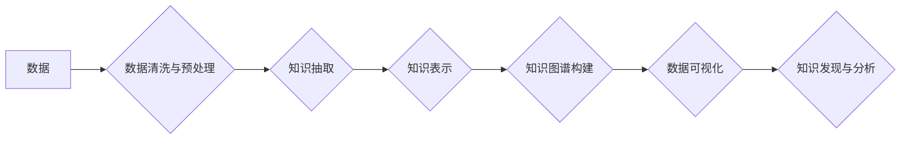

                 

## 知识的可视化：数据可视化与知识图谱

> 关键词：数据可视化、知识图谱、关系数据库、图数据库、机器学习、人工智能、信息检索、知识管理

## 1. 背景介绍

在海量数据时代，人类面临着信息过载的挑战。如何有效地理解、分析和利用这些数据成为了当今社会面临的重大课题。知识可视化作为一种新兴的技术，为我们提供了直观、交互式的工具，帮助我们探索数据背后的隐藏规律，挖掘知识价值。

数据可视化是指将数据以图形、图表等形式呈现出来，以便于人类理解和分析。它可以帮助我们快速识别数据趋势、发现异常值、比较不同数据之间的关系等。而知识图谱则是一种基于知识表示的结构化数据模型，它将知识表示为实体和关系的网络结构，能够更全面地捕捉知识之间的关联性。

将数据可视化与知识图谱相结合，可以构建更加智能、高效的知识探索和分析系统。

## 2. 核心概念与联系

**2.1 数据可视化**

数据可视化是将抽象的数据转换为易于理解的视觉表示，以帮助人们发现数据中的模式、趋势和异常值。常见的图表类型包括柱状图、折线图、饼图、散点图等。

**2.2 知识图谱**

知识图谱是一种基于知识表示的结构化数据模型，它将知识表示为实体和关系的网络结构。实体代表现实世界中的事物，关系代表实体之间的联系。

**2.3 数据可视化与知识图谱的联系**

数据可视化可以用于展示知识图谱中的实体和关系，帮助人们直观地理解知识结构。而知识图谱可以为数据可视化提供更丰富的语义信息，使数据可视化更加智能和有意义。

**2.4  Mermaid 流程图**



## 3. 核心算法原理 & 具体操作步骤

**3.1 算法原理概述**

数据可视化与知识图谱的结合涉及到多种算法，包括数据挖掘、机器学习、知识表示和图形算法等。

* **数据挖掘算法**用于从海量数据中提取有价值的知识，例如关联规则挖掘、分类算法、聚类算法等。
* **机器学习算法**用于构建知识图谱，例如实体识别、关系抽取、知识推理等。
* **知识表示算法**用于将知识表示为结构化的形式，例如RDF、OWL等。
* **图形算法**用于对知识图谱进行分析和可视化，例如路径查找、社区发现、图着色等。

**3.2 算法步骤详解**

1. **数据收集与预处理:** 收集相关数据，并进行清洗、转换、格式化等预处理操作，以确保数据质量和可视化效果。
2. **知识抽取:** 利用自然语言处理技术和机器学习算法，从文本数据中抽取实体、关系和事件等知识。
3. **知识表示:** 将抽取的知识表示为结构化的形式，例如知识图谱。
4. **知识图谱构建:** 利用图数据库技术构建知识图谱，并进行优化和维护。
5. **数据可视化:** 利用数据可视化工具和技术，将知识图谱中的实体和关系以图形、图表等形式呈现出来。

**3.3 算法优缺点**

* **优点:** 能够直观地展示知识结构，帮助人们发现隐藏的知识关系，提高知识发现和分析效率。
* **缺点:** 知识图谱构建和可视化需要复杂的算法和技术，数据量过大时，性能会受到影响。

**3.4 算法应用领域**

* **搜索引擎:** 构建知识图谱可以帮助搜索引擎理解用户查询意图，提供更精准的搜索结果。
* **推荐系统:** 知识图谱可以帮助推荐系统理解用户兴趣，提供更个性化的推荐。
* **医疗诊断:** 知识图谱可以帮助医生诊断疾病，并提供个性化的治疗方案。
* **教育教学:** 知识图谱可以帮助学生理解知识之间的关系，提高学习效率。

## 4. 数学模型和公式 & 详细讲解 & 举例说明

**4.1 数学模型构建**

知识图谱可以表示为一个三元组的集合，每个三元组由一个实体、一个关系和另一个实体组成。

* **实体 (Entity):** 代表现实世界中的事物，例如人、地点、事件等。
* **关系 (Relation):** 代表实体之间的联系，例如“出生于”、“工作于”、“喜欢”等。
* **属性 (Property):** 描述实体的特征，例如“姓名”、“年龄”、“职业”等。

**4.2 公式推导过程**

知识图谱中的关系可以表示为数学公式，例如：

* **出生于关系:**  `出生于(人, 地点)`
* **工作于关系:** `工作于(人, 机构)`
* **喜欢关系:** `喜欢(人, 物)`

**4.3 案例分析与讲解**

例如，我们可以构建一个关于人物的知识图谱，其中实体包括“人”、“地点”、“机构”等，关系包括“出生于”、“工作于”、“喜欢”等。

* 实体：李白 (人)、长安 (地点)、唐朝 (机构)
* 关系：出生于(李白, 长安)、工作于(李白, 唐朝)、喜欢(李白, 酒)

## 5. 项目实践：代码实例和详细解释说明

**5.1 开发环境搭建**

* **编程语言:** Python
* **图数据库:** Neo4j
* **数据可视化工具:** NetworkX、D3.js

**5.2 源代码详细实现**

```python
# 使用 Neo4j 连接数据库
driver = GraphDatabase.driver("bolt://localhost:7687", auth=("neo4j", "password"))

# 创建知识图谱
with driver.session() as session:
    session.run("CREATE (p:Person {name: '李白'})")
    session.run("CREATE (l:Location {name: '长安'})")
    session.run("CREATE (t:Organization {name: '唐朝'})")
    session.run("CREATE (p)-[:出生于]->(l)")
    session.run("CREATE (p)-[:工作于]->(t)")

# 使用 NetworkX 生成图形
import networkx as nx

graph = nx.Graph()
graph.add_node("李白", label="李白")
graph.add_node("长安", label="长安")
graph.add_node("唐朝", label="唐朝")
graph.add_edge("李白", "长安", label="出生于")
graph.add_edge("李白", "唐朝", label="工作于")

# 使用 D3.js 可视化图形
# ...
```

**5.3 代码解读与分析**

* 代码首先使用 Neo4j 连接数据库，并创建知识图谱中的实体和关系。
* 然后使用 NetworkX 生成图形，并添加节点和边。
* 最后使用 D3.js 可视化图形，并根据需要进行定制。

**5.4 运行结果展示**

运行代码后，将生成一个包含李白、长安和唐朝的知识图谱，并将其可视化成一个图形。

## 6. 实际应用场景

**6.1 搜索引擎**

知识图谱可以帮助搜索引擎理解用户查询意图，提供更精准的搜索结果。例如，当用户搜索“李白”时，搜索引擎可以利用知识图谱找到李白相关的实体和关系，并提供更全面的搜索结果，例如李白的生平、作品、诗歌等。

**6.2 推荐系统**

知识图谱可以帮助推荐系统理解用户兴趣，提供更个性化的推荐。例如，当用户购买了一本书后，推荐系统可以利用知识图谱找到与这本书相关的作者、主题、读者等信息，并推荐其他用户可能感兴趣的书籍。

**6.3 医疗诊断**

知识图谱可以帮助医生诊断疾病，并提供个性化的治疗方案。例如，当医生诊断了一位患者患有某种疾病时，知识图谱可以提供该疾病的症状、病因、治疗方法等信息，帮助医生做出更准确的诊断和治疗方案。

**6.4 未来应用展望**

随着人工智能技术的不断发展，知识图谱的应用场景将更加广泛。例如，知识图谱可以用于自动生成知识库、构建智能问答系统、辅助机器学习模型训练等。

## 7. 工具和资源推荐

**7.1 学习资源推荐**

* **书籍:**
    * 《知识图谱：构建、查询和应用》
    * 《图数据库：原理、技术和应用》
* **在线课程:**
    * Coursera: Knowledge Graphs
    * edX: Introduction to Knowledge Graphs

**7.2 开发工具推荐**

* **图数据库:** Neo4j, JanusGraph, Amazon Neptune
* **知识图谱构建工具:** Apache Jena, RDF4J
* **数据可视化工具:** NetworkX, D3.js, Gephi

**7.3 相关论文推荐**

* **《知识图谱：构建、查询和应用》**
* **《图数据库：原理、技术和应用》**

## 8. 总结：未来发展趋势与挑战

**8.1 研究成果总结**

知识可视化与知识图谱的结合取得了显著的成果，为知识发现、分析和应用提供了新的思路和方法。

**8.2 未来发展趋势**

* **更智能的知识图谱:** 利用人工智能技术，构建更智能、更自动化的知识图谱。
* **更丰富的知识表示:** 探索新的知识表示方法，更好地捕捉知识的复杂性和多样性。
* **更交互式的可视化:** 开发更交互式的可视化工具，让用户能够更直观地理解和探索知识图谱。

**8.3 面临的挑战**

* **数据质量:** 知识图谱的构建依赖于高质量的数据，而现实世界的数据往往存在不完整、不一致等问题。
* **知识表示:** 如何更好地表示知识的复杂性和多样性仍然是一个挑战。
* **可视化效果:** 如何将复杂的知识图谱以直观、易懂的方式呈现出来仍然是一个难题。

**8.4 研究展望**

未来，知识可视化与知识图谱的研究将继续深入，为我们提供更智能、更有效的知识探索和分析工具。


## 9. 附录：常见问题与解答

**9.1 如何构建知识图谱？**

构建知识图谱需要以下步骤：

1. **数据收集:** 收集相关数据，例如文本、图像、音频等。
2. **数据清洗:** 对数据进行清洗，去除噪声和重复数据。
3. **知识抽取:** 利用自然语言处理技术和机器学习算法，从数据中抽取实体、关系和事件等知识。
4. **知识表示:** 将抽取的知识表示为结构化的形式，例如知识图谱。
5. **知识图谱构建:** 利用图数据库技术构建知识图谱，并进行优化和维护。

**9.2 如何进行知识可视化？**

知识可视化可以使用多种工具和技术，例如：

* **NetworkX:** Python 库，用于构建和可视化图形。
* **D3.js:** JavaScript 库，用于创建交互式的可视化。
* **Gephi:** 开源图形可视化软件。

**9.3 知识图谱有哪些应用场景？**

知识图谱的应用场景非常广泛，例如：

* **搜索引擎:** 理解用户查询意图，提供更精准的搜索结果。
* **推荐系统:** 提供更个性化的推荐。
* **医疗诊断:** 辅助医生诊断疾病，提供个性化的治疗方案。
* **教育教学:** 帮助学生理解知识之间的关系，提高学习效率。


作者：禅与计算机程序设计艺术 / Zen and the Art of Computer Programming 
<end_of_turn>

