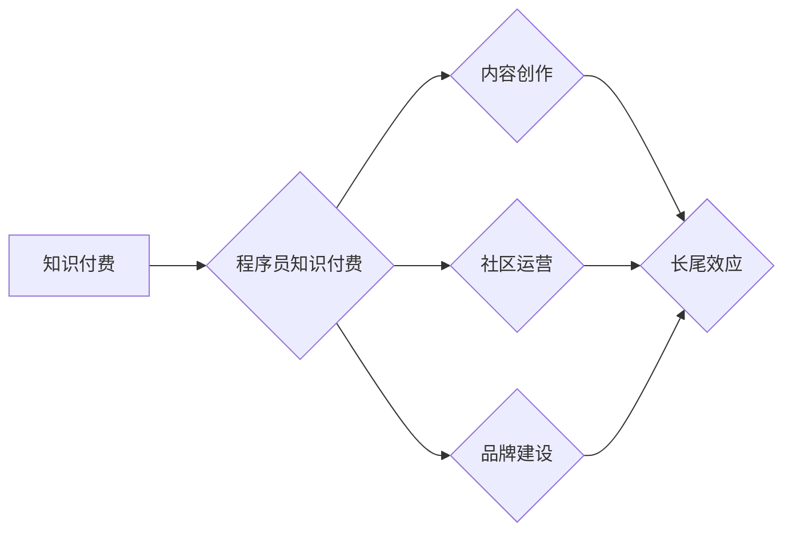

                 

## 程序员如何构建知识付费的长尾效应

> 关键词：知识付费、程序员、长尾效应、内容运营、社区建设、品牌建设、技术博客、在线课程、付费订阅

## 1. 背景介绍

随着互联网技术的快速发展，知识付费市场蓬勃兴起，成为一种新的经济模式。程序员作为技术人才，拥有丰富的专业知识和经验，具备成为知识付费创作者的先天优势。然而，如何构建知识付费的长尾效应，让知识持续产生价值，成为许多程序员面临的挑战。

传统知识付费模式往往依赖于短期爆款，一旦热度过，收入就会迅速下降。而长尾效应则指那些持续稳定的低流量，但总量庞大的收益模式。构建知识付费的长尾效应，需要程序员们从内容创作、社区运营、品牌建设等多个方面进行思考和实践。

## 2. 核心概念与联系

### 2.1 知识付费

知识付费是指通过提供有价值的知识和技能，向用户收取费用的一种商业模式。它涵盖了各种形式，例如在线课程、付费博客、电子书、咨询服务等。

### 2.2 长尾效应

长尾效应是指在大量商品或服务的市场中，少数热门商品或服务占据了大部分市场份额，而大量冷门商品或服务虽然销量低，但总量庞大，形成的累积效应。

### 2.3 程序员知识付费

程序员知识付费是指程序员将自己的技术知识和经验转化为有价值的内容，通过线上平台或线下活动向用户提供付费服务。

**核心概念联系：**



## 3. 核心算法原理 & 具体操作步骤

### 3.1 算法原理概述

构建知识付费的长尾效应，本质上是一种内容运营和用户关系管理的算法。它需要程序员们不断输出高质量的内容，建立活跃的社区，并打造个人品牌，从而吸引和留住用户，形成持续的收入流。

### 3.2 算法步骤详解

1. **内容创作：** 

   * 确定目标用户群体，了解他们的需求和痛点。
   * 选择自己擅长的技术领域，并进行深入研究和实践。
   * 创作高质量、有价值的内容，例如技术博客文章、视频教程、在线课程等。
   * 内容形式多样化，包括文字、图片、视频、音频等。

2. **社区运营：**

   * 建立线上社区，例如微信群、QQ群、论坛等，与用户互动交流。
   * 积极回复用户提问，解答用户疑惑，提供技术支持。
   * 组织线上线下活动，增强用户粘性，促进用户之间的交流。
   * 鼓励用户分享经验，建立共同学习氛围。

3. **品牌建设：**

   * 打造个人品牌，提升个人影响力。
   * 参与行业活动，结识同行，建立人脉关系。
   * 利用社交媒体平台，推广自己的知识付费产品。
   * 持续输出优质内容，树立专业形象。

### 3.3 算法优缺点

**优点：**

* 长期收益稳定，可持续发展。
* 降低营销成本，提升用户粘性。
* 增强个人品牌影响力，提升个人价值。

**缺点：**

* 需要投入大量时间和精力，前期收益可能较低。
* 需要不断学习和更新知识，保持竞争力。
* 需要具备一定的运营能力，才能有效管理用户关系。

### 3.4 算法应用领域

* 技术博客
* 在线课程平台
* 社区论坛
* 个人网站
* 社交媒体平台

## 4. 数学模型和公式 & 详细讲解 & 举例说明

### 4.1 数学模型构建

知识付费的长尾效应可以抽象为一个数学模型，其中用户数量、内容质量、社区活跃度等因素相互影响，最终决定了知识付费的收入。

**模型公式：**

```latex
R = f(U, C, A)
```

其中：

* R：知识付费收入
* U：用户数量
* C：内容质量
* A：社区活跃度

### 4.2 公式推导过程

* **用户数量 (U)：** 用户数量是知识付费收入的基础。用户越多，潜在的收入也就越大。
* **内容质量 (C)：** 内容质量直接影响用户粘性和付费意愿。高质量的内容能够吸引更多用户，并提升用户对知识付费产品的认可度。
* **社区活跃度 (A)：** 社区活跃度能够增强用户粘性，促进用户之间的交流和学习，从而提升知识付费的价值。

### 4.3 案例分析与讲解

假设有两个程序员，A和B，他们都创建了技术博客，并提供付费课程。

* A的博客内容质量较高，但用户数量较少，社区活跃度也较低。
* B的博客内容质量一般，但用户数量较多，社区活跃度较高。

根据上述模型，我们可以推断：

* A的知识付费收入可能较低，因为用户数量较少。
* B的知识付费收入可能较高，因为用户数量多，社区活跃度高，能够形成良好的口碑效应。

## 5. 项目实践：代码实例和详细解释说明

### 5.1 开发环境搭建

* 操作系统：Windows/macOS/Linux
* 代码编辑器：VS Code/Sublime Text/Atom
* 编程语言：Python/JavaScript/Go

### 5.2 源代码详细实现

以下是一个简单的Python代码实例，用于构建一个技术博客网站：

```python
from flask import Flask, render_template

app = Flask(__name__)

@app.route('/')
def index():
    return render_template('index.html')

if __name__ == '__main__':
    app.run(debug=True)
```

**代码解读：**

* 使用Flask框架构建一个简单的网站。
* 定义一个路由 `/`，指向 `index.html` 模板文件。
* 使用 `debug=True` 开启调试模式，方便开发和测试。

### 5.3 代码解读与分析

* 代码简洁易懂，主要实现了网站的基本功能。
* 可以根据需要添加更多路由和功能，例如用户注册、登录、文章发布等。
* 可以使用数据库存储文章内容，实现数据持久化。

### 5.4 运行结果展示

运行上述代码，访问 `http://127.0.0.1:5000/`，即可看到一个简单的技术博客网站。

## 6. 实际应用场景

### 6.1 技术博客

程序员可以利用技术博客平台，分享自己的技术经验和见解，并通过广告、赞助、付费订阅等方式获得收入。

### 6.2 在线课程

程序员可以录制视频教程，制作在线课程，并通过在线课程平台销售。

### 6.3 咨询服务

程序员可以提供技术咨询服务，帮助用户解决技术难题，并收取咨询费用。

### 6.4 未来应用展望

随着人工智能、大数据等技术的不断发展，知识付费市场将迎来更大的发展机遇。程序员可以利用这些技术，开发更具创新性的知识付费产品，例如智能化学习平台、个性化技术培训等。

## 7. 工具和资源推荐

### 7.1 学习资源推荐

* **书籍:** 《程序员的自我修养》、《代码的艺术》
* **网站:** CSDN、知乎、Stack Overflow
* **课程:** Coursera、Udemy、edX

### 7.2 开发工具推荐

* **代码编辑器:** VS Code、Sublime Text、Atom
* **网站框架:** Flask、Django、Node.js
* **数据库:** MySQL、MongoDB

### 7.3 相关论文推荐

* **长尾效应:** "The Long Tail" by Chris Anderson
* **知识付费:** "The Economics of Knowledge Sharing" by Michael J. Mauboussin

## 8. 总结：未来发展趋势与挑战

### 8.1 研究成果总结

构建知识付费的长尾效应，需要程序员们从内容创作、社区运营、品牌建设等多个方面进行思考和实践。通过不断输出高质量的内容，建立活跃的社区，并打造个人品牌，程序员可以实现知识付费的长期收益。

### 8.2 未来发展趋势

* **个性化定制:** 知识付费产品将更加注重用户个性化需求，提供定制化的学习方案。
* **人工智能驱动:** 人工智能技术将被应用于知识付费领域，例如智能化学习推荐、个性化学习辅导等。
* **多元化模式:** 知识付费模式将更加多元化，例如直播课程、付费会员、知识社区等。

### 8.3 面临的挑战

* **内容质量保证:** 持续输出高质量的内容是构建长尾效应的关键，但这也需要程序员们不断学习和提升。
* **用户粘性提升:** 知识付费市场竞争激烈，如何提升用户粘性，留住用户，是需要不断探索的课题。
* **商业模式创新:** 知识付费模式需要不断创新，才能适应市场变化，实现可持续发展。

### 8.4 研究展望

未来，知识付费市场将继续发展壮大，程序员们将有机会通过知识付费，实现自我价值，并为社会做出贡献。


## 9. 附录：常见问题与解答

**Q1：如何确定目标用户群体？**

**A1：** 可以通过分析自身技术领域、阅读行业报告、调研用户需求等方式，确定目标用户群体。

**Q2：如何提高内容质量？**

**A2：** 可以通过深入研究技术领域、实践经验积累、学习优秀案例等方式，提高内容质量。

**Q3：如何建立活跃的社区？**

**A3：** 可以通过组织线上线下活动、积极回复用户提问、提供技术支持等方式，建立活跃的社区。


作者：禅与计算机程序设计艺术 / Zen and the Art of Computer Programming 
<end_of_turn>

