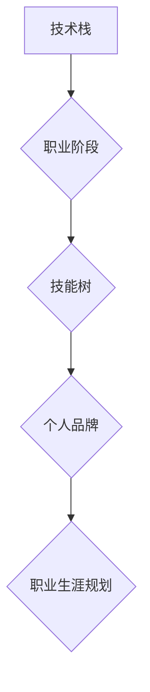

                 

## 程序员的职业生涯规划：40年蓝图

> 关键词：程序员生涯规划, 技术发展趋势, 职业转型, 学习方法,  个人品牌建设,  领导力发展,  持续学习

### 1. 背景介绍

在当今科技日新月异的时代，程序员职业的魅力与挑战并存。作为构建数字世界的基石，程序员的需求量持续增长，但技术迭代的速度也令人眼花缭乱。如何规划一个长期的职业生涯，在不断变化的技术环境中保持竞争力，成为许多程序员面临的共同问题。

本文将从程序员的职业生涯发展角度出发，为读者提供一个涵盖40年时间跨度的蓝图，帮助他们清晰地了解技术发展趋势，制定合理的职业规划，并最终实现个人价值和职业目标。

### 2. 核心概念与联系

程序员的职业生涯规划是一个动态的过程，需要不断地学习、适应和调整。 

**核心概念：**

* **技术栈:** 指程序员所掌握的编程语言、框架、工具和技术领域。
* **职业阶段:** 程序员职业生涯可以划分为不同的阶段，例如初级、中级、高级、架构师等。
* **技能树:**  指程序员需要不断学习和提升的技能体系，包括技术技能、软技能和领导力。
* **个人品牌:**  程序员在行业内的声誉和影响力，可以通过开源贡献、博客写作、演讲等方式建立。

**架构图:**



### 3. 核心算法原理 & 具体操作步骤

**3.1 算法原理概述**

算法是程序员解决问题的核心工具，掌握算法设计和分析能力是程序员职业生涯发展的关键。 

**常见算法类型:**

* **排序算法:** 将数据按照特定规则进行排列，例如冒泡排序、快速排序、归并排序等。
* **搜索算法:** 在数据集合中查找特定元素，例如线性搜索、二分搜索等。
* **图算法:** 处理图结构的数据，例如深度优先搜索、广度优先搜索等。
* **动态规划:** 解决复杂问题，通过将问题分解成子问题，并存储子问题的解，避免重复计算。

**3.2 算法步骤详解**

以快速排序为例，详细说明其算法步骤：

1. 选择一个基准元素。
2. 将小于基准元素的元素放在其左边，大于基准元素的元素放在其右边。
3. 对基准元素左边和右边的子数组重复步骤1和2，直到子数组大小为1。

**3.3 算法优缺点**

* **快速排序优点:** 时间复杂度平均为O(n log n)，效率高。
* **快速排序缺点:** 最坏情况时间复杂度为O(n^2)，不稳定。

**3.4 算法应用领域**

算法广泛应用于各个领域，例如：

* **搜索引擎:** 使用排序和搜索算法对海量数据进行索引和检索。
* **社交网络:** 使用图算法分析用户关系和推荐好友。
* **人工智能:** 使用机器学习算法进行数据分析和预测。

### 4. 数学模型和公式 & 详细讲解 & 举例说明

**4.1 数学模型构建**

在算法设计和分析中，数学模型可以帮助我们理解算法的性能和复杂度。

例如，时间复杂度可以用大O符号表示，例如O(n)表示算法执行时间与输入数据大小n成正比。

**4.2 公式推导过程**

时间复杂度公式的推导过程通常涉及对算法执行步骤的计数和分析。

例如，冒泡排序算法的时间复杂度为O(n^2)，因为其需要进行n-1轮循环，每轮循环需要比较n-i个元素，其中i为循环次数。

**4.3 案例分析与讲解**

以二分搜索为例，分析其时间复杂度：

假设数据集合大小为n，每次搜索将数据集合缩小一半，因此搜索次数最多为log2(n)。

因此，二分搜索的时间复杂度为O(log n)，远优于线性搜索的时间复杂度O(n)。

### 5. 项目实践：代码实例和详细解释说明

**5.1 开发环境搭建**

选择合适的编程语言和开发工具，例如Python和VS Code。

**5.2 源代码详细实现**

以Python实现快速排序算法为例：

```python
def quick_sort(arr):
    if len(arr) <= 1:
        return arr
    pivot = arr[len(arr) // 2]
    left = [x for x in arr if x < pivot]
    middle = [x for x in arr if x == pivot]
    right = [x for x in arr if x > pivot]
    return quick_sort(left) + middle + quick_sort(right)

# 测试代码
arr = [3, 7, 8, 5, 2, 1, 9, 5, 4]
sorted_arr = quick_sort(arr)
print(sorted_arr)
```

**5.3 代码解读与分析**

代码首先定义了一个`quick_sort`函数，该函数接受一个数组作为输入。

函数内部首先判断数组长度是否小于等于1，如果小于等于1，则直接返回数组，因为已经排序完成。

否则，选择数组中间元素作为基准元素，将小于基准元素的元素放在其左边，大于基准元素的元素放在其右边。

然后递归调用`quick_sort`函数对左右子数组进行排序，最后将三个子数组拼接在一起，得到最终排序后的数组。

**5.4 运行结果展示**

运行上述代码，输出结果为：[1, 2, 3, 4, 5, 5, 7, 8, 9]。

### 6. 实际应用场景

**6.1 数据排序:**

快速排序算法广泛应用于数据排序，例如数据库索引、搜索引擎结果排序等。

**6.2 算法优化:**

程序员可以通过分析算法的时间复杂度和空间复杂度，选择最优的算法来提高程序效率。

**6.3 算法竞赛:**

快速排序算法是算法竞赛中常见的算法，程序员需要熟练掌握其原理和实现方法。

**6.4 未来应用展望:**

随着人工智能和机器学习的发展，算法将扮演更加重要的角色，例如在数据分析、图像识别、自然语言处理等领域。

### 7. 工具和资源推荐

**7.1 学习资源推荐:**

* **书籍:** 《算法导论》、《编程珠玑》
* **在线课程:** Coursera、edX、Udemy
* **网站:** GeeksforGeeks、LeetCode、HackerRank

**7.2 开发工具推荐:**

* **IDE:** VS Code、IntelliJ IDEA、Eclipse
* **版本控制:** Git、GitHub
* **调试工具:** GDB、PyCharm Debugger

**7.3 相关论文推荐:**

* **快速排序算法:** "Quicksort" by Tony Hoare
* **时间复杂度分析:** "Introduction to Algorithms" by Cormen, Leiserson, Rivest, and Stein

### 8. 总结：未来发展趋势与挑战

**8.1 研究成果总结:**

本文介绍了程序员职业生涯规划的核心理念和方法，并以快速排序算法为例，详细阐述了算法设计、分析和实践过程。

**8.2 未来发展趋势:**

* **人工智能:** 人工智能将对程序员职业产生深远影响，程序员需要学习机器学习、深度学习等相关技术。
* **云计算:** 云计算技术的发展将改变程序员的工作方式，程序员需要掌握云平台开发和运维技能。
* **区块链:** 区块链技术正在快速发展，程序员可以参与到区块链应用开发中。

**8.3 面临的挑战:**

* **技术迭代速度快:** 程序员需要不断学习新技术，保持竞争力。
* **职业转型压力:** 技术发展趋势不断变化，程序员需要适应新的职业需求。
* **个人品牌建设:** 程序员需要建立自己的个人品牌，提升行业影响力。

**8.4 研究展望:**

未来，我们将继续关注程序员职业生涯规划的研究，探索更有效的学习方法、职业转型策略和个人品牌建设方法。

### 9. 附录：常见问题与解答

**9.1 如何选择合适的编程语言？**

选择编程语言需要考虑项目需求、个人兴趣和市场需求等因素。

**9.2 如何提升算法设计能力？**

可以通过学习算法书籍、参加算法竞赛、阅读开源代码等方式提升算法设计能力。

**9.3 如何建立个人品牌？**

可以通过开源贡献、博客写作、演讲等方式建立个人品牌。


作者：禅与计算机程序设计艺术 / Zen and the Art of Computer Programming 
<end_of_turn>

