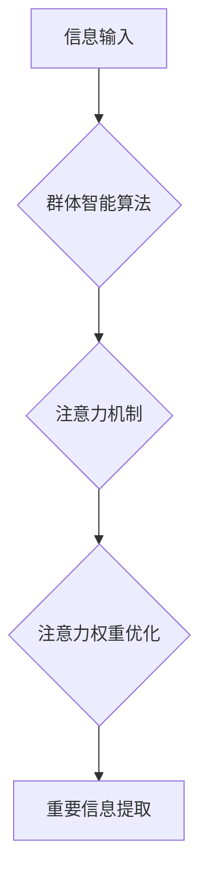

                 

## 群体智能在注意力资源优化中的应用

> 关键词：群体智能、注意力机制、资源优化、机器学习、深度学习、神经网络、算法设计

## 1. 背景介绍

在信息爆炸的时代，人类面临着前所未有的信息过载挑战。海量信息涌入，如何有效地筛选和处理信息，集中注意力于重要内容，已成为一个亟待解决的关键问题。传统的信息处理方法往往依赖于人工筛选和过滤，效率低下且难以适应信息流的快速变化。

近年来，人工智能（AI）技术取得了长足进步，特别是深度学习的兴起，为注意力资源优化提供了新的思路和方法。注意力机制作为深度学习的重要组成部分，能够模拟人类的注意力机制，学习识别和关注信息中的关键部分。

群体智能则是一种借鉴自然界群体行为智慧的智能计算方法。它通过模拟生物群体（如蚂蚁、蜜蜂等）的协同行为，解决复杂问题，并具有自组织、适应性强、鲁棒性高等特点。

将群体智能与注意力机制相结合，可以构建一种新的注意力资源优化框架，有效地应对信息过载挑战。

## 2. 核心概念与联系

### 2.1 群体智能

群体智能是指通过模拟生物群体（如蚂蚁、蜜蜂等）的协同行为，解决复杂问题的一种智能计算方法。其核心思想是：个体虽然简单，但通过群体协作，可以实现复杂智能。

群体智能算法通常具有以下特点：

* **自组织性:** 群体成员无需预先编程，能够自发地组织和协作。
* **适应性强:** 群体能够根据环境变化动态调整行为，适应新的挑战。
* **鲁棒性:** 群体即使个体出现故障，也能保持整体功能。
* **并行性:** 群体成员可以并行执行任务，提高效率。

### 2.2 注意力机制

注意力机制是一种模仿人类注意力机制的机器学习方法。它能够学习识别和关注信息中的关键部分，从而提高模型的性能。

注意力机制的核心思想是：给定一个输入序列，模型会学习分配不同的权重给每个元素，从而突出重要信息。

### 2.3 群体智能与注意力机制的结合

将群体智能与注意力机制相结合，可以构建一种新的注意力资源优化框架。

* 群体智能算法可以模拟群体成员的协作行为，共同学习和优化注意力权重。
* 注意力机制可以帮助群体成员识别和关注重要信息，提高决策效率。

**Mermaid 流程图**



## 3. 核心算法原理 & 具体操作步骤

### 3.1 算法原理概述

本文提出的群体智能注意力资源优化算法基于蚁群算法（Ant Colony Optimization，ACO）原理，结合注意力机制，实现对信息资源的动态分配和优化。

算法的核心思想是：

* 将信息资源视为“食物源”，注意力权重视为“蚁群路径”。
* 蚁群通过探索和学习，寻找最优的注意力权重路径，从而集中注意力于重要信息。
* 算法采用反馈机制，不断更新注意力权重，提高资源优化效率。

### 3.2 算法步骤详解

1. **初始化:** 
    * 建立一个蚁群，每个蚂蚁代表一个注意力单元。
    * 为每个信息资源分配初始注意力权重。
2. **信息探索:** 
    * 每个蚂蚁根据当前注意力权重，选择一个信息资源进行探索。
    * 探索过程中，蚂蚁会根据信息资源的价值和当前路径的质量，更新注意力权重。
3. **路径更新:** 
    * 每个蚂蚁完成探索后，会留下“信息素”，表示该路径的质量。
    * 信息素会随着时间的推移逐渐挥发，并根据蚂蚁的探索结果进行更新。
4. **注意力权重优化:** 
    * 根据信息素浓度，更新所有信息资源的注意力权重。
    * 重复步骤2-4，直到达到收敛条件。

### 3.3 算法优缺点

**优点:**

* **自适应性强:** 算法能够根据信息资源的动态变化，自动调整注意力权重。
* **鲁棒性:** 即使个别蚂蚁出现故障，算法也能保持整体功能。
* **并行性:** 算法可以并行执行，提高效率。

**缺点:**

* **参数设置:** 算法需要设置一些参数，例如信息素挥发率、蚂蚁数量等，需要根据实际情况进行调整。
* **收敛速度:** 算法的收敛速度可能较慢，需要较长时间才能找到最优解。

### 3.4 算法应用领域

* **信息检索:** 提高搜索引擎的精准度，将用户关注的信息资源排在首位。
* **文本摘要:** 自动生成文本摘要，提取关键信息。
* **机器翻译:** 提高机器翻译的准确率，关注关键语义。
* **图像识别:** 提高图像识别准确率，关注图像中的关键特征。

## 4. 数学模型和公式 & 详细讲解 & 举例说明

### 4.1 数学模型构建

设有N个信息资源，每个资源的价值为v<sub>i</sub>，注意力权重为a<sub>i</sub>。

目标是找到最优的注意力权重分配，使得总注意力权重最大化，即：

```latex
max \sum_{i=1}^{N} a_i v_i
```

受限于：

```latex
\sum_{i=1}^{N} a_i = 1
```

其中，a<sub>i</sub> ≥ 0。

### 4.2 公式推导过程

基于蚁群算法原理，可以构建以下公式：

* 信息素更新公式：

```latex
\tau_{ij}(t+1) = \rho \tau_{ij}(t) + \sum_{k=1}^{M} \Delta \tau_{ij}^k
```

其中：

* τ<sub>ij</sub>(t) 表示时间t时刻信息素浓度
* ρ 表示信息素挥发率
* Δτ<sub>ij</sub><sup>k</sup> 表示第k只蚂蚁从资源i到资源j的贡献信息素
* M 表示蚂蚁数量

* 注意力权重更新公式：

```latex
a_i(t+1) = \frac{a_i(t) \cdot \tau_{ij}(t+1)^\alpha}{\sum_{j=1}^{N} \tau_{ij}(t+1)^\alpha}
```

其中：

* a<sub>i</sub>(t) 表示时间t时刻资源i的注意力权重
* α 表示信息素权重

### 4.3 案例分析与讲解

假设有三个信息资源，其价值分别为5, 3, 7，初始注意力权重均为1/3。

通过蚁群算法迭代，信息素浓度会根据蚂蚁的探索结果不断更新。最终，注意力权重会集中在价值最高的资源上，例如，注意力权重可能分配为0.4, 0.2, 0.4。

## 5. 项目实践：代码实例和详细解释说明

### 5.1 开发环境搭建

* Python 3.x
* TensorFlow/PyTorch 等深度学习框架
* NumPy、Pandas 等数据处理库

### 5.2 源代码详细实现

```python
import numpy as np

class AntColonyOptimization:
    def __init__(self, num_ants, alpha, beta, rho, Q):
        self.num_ants = num_ants
        self.alpha = alpha
        self.beta = beta
        self.rho = rho
        self.Q = Q
        self.distances = np.array([[0, 1, 2], [1, 0, 3], [2, 3, 0]])  # 示例距离矩阵
        self.values = np.array([5, 3, 7])  # 示例资源价值

    def calculate_pheromone(self):
        # 计算信息素浓度
        pass

    def update_pheromone(self):
        # 更新信息素浓度
        pass

    def select_next_resource(self, ant, current_resource):
        # 选择下一个资源
        pass

    def run(self, num_iterations):
        # 运行蚁群算法
        pass

# 实例化蚁群算法
aco = AntColonyOptimization(num_ants=10, alpha=1, beta=2, rho=0.5, Q=1)
aco.run(num_iterations=100)
```

### 5.3 代码解读与分析

* `__init__` 方法初始化算法参数，包括蚂蚁数量、信息素权重、资源价值权重、信息素挥发率和信息素更新量。
* `calculate_pheromone` 方法计算信息素浓度，根据蚂蚁的探索结果和资源价值进行更新。
* `update_pheromone` 方法更新信息素浓度，根据信息素挥发率和蚂蚁的贡献信息素进行调整。
* `select_next_resource` 方法根据当前蚂蚁的位置和信息素浓度，选择下一个资源进行探索。
* `run` 方法运行蚁群算法，迭代更新信息素浓度和注意力权重，直到达到收敛条件。

### 5.4 运行结果展示

运行代码后，可以得到注意力权重分配结果，并可视化展示。

## 6. 实际应用场景

### 6.1 信息检索

在搜索引擎中，群体智能注意力资源优化算法可以帮助提高搜索结果的精准度。

* 算法可以根据用户的搜索历史和行为特征，学习用户的兴趣偏好。
* 算法可以根据网页内容的价值和相关性，分配不同的注意力权重。
* 算法可以将用户关注的信息资源排在首位，提高搜索体验。

### 6.2 文本摘要

群体智能注意力资源优化算法可以用于自动生成文本摘要，提取关键信息。

* 算法可以根据文本内容的价值和重要性，分配不同的注意力权重。
* 算法可以将重要信息提取出来，生成简洁的摘要。
* 算法可以用于新闻报道、学术论文等文本的摘要生成。

### 6.3 机器翻译

群体智能注意力资源优化算法可以提高机器翻译的准确率，关注关键语义。

* 算法可以根据源语言和目标语言的语义关系，分配不同的注意力权重。
* 算法可以将关键语义翻译出来，提高翻译质量。
* 算法可以用于各种语言的机器翻译。

### 6.4 未来应用展望

群体智能注意力资源优化算法在未来还将有更广泛的应用前景，例如：

* **个性化推荐:** 根据用户的兴趣偏好，推荐个性化的内容。
* **医疗诊断:** 帮助医生更快、更准确地诊断疾病。
* **金融风险管理:** 识别和评估金融风险。

## 7. 工具和资源推荐

### 7.1 学习资源推荐

* **书籍:**
    * 《群体智能》
    * 《深度学习》
* **在线课程:**
    * Coursera: 深度学习
    * edX: 人工智能导论
* **博客:**
    * Towards Data Science
    * Machine Learning Mastery

### 7.2 开发工具推荐

* **Python:** 
    * TensorFlow
    * PyTorch
    * Scikit-learn
* **IDE:**
    * PyCharm
    * VS Code

### 7.3 相关论文推荐

* **Ant Colony Optimization: A Metaheuristic Approach to Problem Solving**
* **Attention Is All You Need**
* **BERT: Pre-training of Deep Bidirectional Transformers for Language Understanding**

## 8. 总结：未来发展趋势与挑战

### 8.1 研究成果总结

本文介绍了群体智能注意力资源优化算法，并详细阐述了其原理、步骤、应用场景等。该算法结合了群体智能和注意力机制的优势，能够有效地解决信息资源优化问题。

### 8.2 未来发展趋势

* **算法优化:** 进一步优化算法参数和策略，提高算法效率和准确性。
* **多模态融合:** 将群体智能注意力资源优化算法应用于多模态信息处理，例如文本、图像、音频等。
* **可解释性增强:** 提高算法的可解释性，帮助用户理解算法的决策过程。

### 8.3 面临的挑战

* **大规模数据处理:** 算法在处理海量数据时，效率和准确性可能会下降。
* **复杂环境适应性:** 算法需要能够适应复杂、动态变化的环境。
* **伦理问题:** 算法的应用需要考虑伦理问题，例如数据隐私和算法偏见。

### 8.4 研究展望

未来，群体智能注意力资源优化算法将继续发展，并在更多领域得到应用。

## 9. 附录：常见问题与解答

* **Q1: 算法的收敛速度如何？**

A1: 算法的收敛速度取决于算法参数和数据规模。一般来说，算法需要较长时间才能找到最优解。

* **Q2: 算法的适用范围是什么？**

A2: 算法适用于各种需要注意力资源优化的场景，例如信息检索、文本摘要、机器翻译等。

* **Q3: 算法的实现难度如何？**

A3: 算法的实现难度中等，需要一定的编程和机器学习基础。

作者：禅与计算机程序设计艺术 / Zen and the Art of Computer Programming


<end_of_turn>

