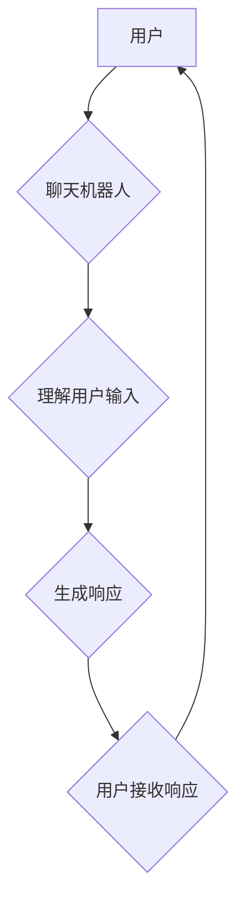

                 

## 聊天机器人伦理：身份和透明度

> 关键词：聊天机器人、人工智能、伦理、身份、透明度、偏见、可解释性、责任

### 1. 背景介绍

聊天机器人技术近年来发展迅速，从简单的问答系统演变为能够进行自然语言对话、理解上下文、甚至生成富有创意文本的复杂智能体。它们已广泛应用于客服、教育、娱乐等领域，为人们的生活带来了便利。然而，随着聊天机器人的能力不断增强，其潜在的伦理问题也日益凸显。

本篇文章将重点探讨聊天机器人伦理中的两个关键议题：身份和透明度。

* **身份**: 聊天机器人是否应该拥有某种身份认同？它们是否应该被视为具有独立意识的个体，还是仅仅是工具？

* **透明度**: 聊天机器人的决策过程是否应该对用户透明？用户应该了解聊天机器人的行为背后的逻辑和机制吗？

这些问题并非简单易解，它们涉及到哲学、社会学、法律等多个领域的思考。

### 2. 核心概念与联系

#### 2.1 聊天机器人

聊天机器人是一种能够与人类进行自然语言对话的计算机程序。它们通常基于自然语言处理（NLP）技术，能够理解和生成人类语言。

#### 2.2 身份认同

身份认同是指个体对自己在社会中的位置和角色的认知和理解。它包括个人经历、价值观、信仰、社会关系等多方面因素。

#### 2.3 透明度

透明度是指信息公开和可理解的程度。在聊天机器人领域，透明度是指用户能够了解聊天机器人的决策过程和行为背后的逻辑机制。

#### 2.4 伦理

伦理是指一组关于什么是对的和什么是错的道德准则。在人工智能领域，伦理问题涉及到人工智能技术的开发、应用和监管，以及人工智能技术对人类社会的影响。

**Mermaid 流程图**



### 3. 核心算法原理 & 具体操作步骤

#### 3.1 算法原理概述

聊天机器人通常使用基于规则或机器学习的算法进行对话。

* **基于规则的聊天机器人**: 这些机器人使用预先定义的规则和知识库来生成响应。它们的工作原理是根据用户输入匹配相应的规则，然后根据规则生成相应的响应。

* **基于机器学习的聊天机器人**: 这些机器人使用机器学习算法从大量对话数据中学习，能够生成更自然、更符合语境的响应。常见的机器学习算法包括：

    * **循环神经网络 (RNN)**: RNN 能够处理序列数据，例如文本，并学习文本中的上下文关系。

    * **长短期记忆网络 (LSTM)**: LSTM 是 RNN 的一种变体，能够更好地处理长序列数据。

    * **生成对抗网络 (GAN)**: GAN 由两个神经网络组成，一个生成器网络和一个鉴别器网络。生成器网络试图生成逼真的文本，而鉴别器网络试图区分真实文本和生成文本。

#### 3.2 算法步骤详解

**基于规则的聊天机器人**

1. 用户输入文本。
2. 系统将用户输入转换为标准格式。
3. 系统匹配用户输入与规则库中的规则。
4. 系统根据匹配的规则生成响应。
5. 系统将响应发送给用户。

**基于机器学习的聊天机器人**

1. 收集大量对话数据。
2. 使用机器学习算法训练聊天机器人模型。
3. 用户输入文本。
4. 模型将用户输入转换为向量表示。
5. 模型根据向量表示预测最合适的响应。
6. 模型将预测的响应生成为文本。
7. 系统将响应发送给用户。

#### 3.3 算法优缺点

**基于规则的聊天机器人**

* **优点**: 开发相对简单，可控性强。
* **缺点**: 难以处理复杂对话，缺乏自然性和灵活性。

**基于机器学习的聊天机器人**

* **优点**: 能够处理复杂对话，生成更自然、更符合语境的响应。
* **缺点**: 训练数据量大，训练时间长，可解释性差。

#### 3.4 算法应用领域

聊天机器人已广泛应用于以下领域：

* **客服**: 自动回答常见问题，提供24/7服务。
* **教育**: 提供个性化学习辅导，解答学生疑问。
* **娱乐**: 提供游戏互动，聊天陪伴。
* **医疗**: 提供医疗咨询，预约挂号。

### 4. 数学模型和公式 & 详细讲解 & 举例说明

#### 4.1 数学模型构建

在基于机器学习的聊天机器人中，常用的数学模型包括：

* **词嵌入**: 将单词映射到向量空间，捕捉单词之间的语义关系。常见的词嵌入模型包括 Word2Vec 和 GloVe。

* **序列到序列模型**: 用于将一个序列映射到另一个序列，例如将用户输入的文本映射到相应的回复文本。常见的序列到序列模型包括 RNN 和 Transformer。

#### 4.2 公式推导过程

**Word2Vec 模型**:

Word2Vec 模型使用神经网络来学习词嵌入。其目标是预测上下文词，并根据预测结果更新词向量。

* **负采样**: 为了提高训练效率，Word2Vec 使用负采样技术，只训练一部分负样本。

* **损失函数**: Word2Vec 使用交叉熵损失函数来衡量模型的预测性能。

#### 4.3 案例分析与讲解

**BERT 模型**:

BERT (Bidirectional Encoder Representations from Transformers) 是一个基于 Transformer 的预训练语言模型，能够理解文本的上下文关系。

BERT 使用 masked language modeling (MLM) 和 next sentence prediction (NSP) 两种预训练任务来学习词嵌入和句子表示。

* **MLM**: 随机掩盖文本中的部分词，然后预测被掩盖词。

* **NSP**: 判断两个句子是否相邻。

BERT 在许多自然语言处理任务中取得了优异的性能，例如文本分类、问答系统和机器翻译。

### 5. 项目实践：代码实例和详细解释说明

#### 5.1 开发环境搭建

* Python 3.6+
* TensorFlow 或 PyTorch
* NLTK 或 spaCy

#### 5.2 源代码详细实现

```python
# 使用 TensorFlow 实现简单的基于 RNN 的聊天机器人

import tensorflow as tf

# 定义模型
model = tf.keras.Sequential([
    tf.keras.layers.Embedding(input_dim=vocab_size, output_dim=embedding_dim),
    tf.keras.layers.LSTM(units=128),
    tf.keras.layers.Dense(units=vocab_size, activation='softmax')
])

# 编译模型
model.compile(optimizer='adam', loss='sparse_categorical_crossentropy', metrics=['accuracy'])

# 训练模型
model.fit(x_train, y_train, epochs=10)

# 生成响应
def generate_response(user_input):
    # 将用户输入转换为向量表示
    input_vector = encoder.encode(user_input)
    # 使用模型预测响应
    predicted_index = model.predict(input_vector)
    # 将预测索引转换为响应文本
    response = decoder.decode(predicted_index)
    return response
```

#### 5.3 代码解读与分析

* **Embedding 层**: 将单词映射到向量空间。
* **LSTM 层**: 处理文本序列，学习文本中的上下文关系。
* **Dense 层**: 将 LSTM 输出映射到词汇表大小，预测下一个单词。
* **训练过程**: 使用训练数据训练模型，优化模型参数。
* **生成响应**: 将用户输入转换为向量表示，使用模型预测响应，并将预测结果转换为文本。

#### 5.4 运行结果展示

```
用户输入: 你好
聊天机器人响应: 你好

用户输入: 你好吗
聊天机器人响应: 我很好，谢谢

用户输入: 天气怎么样
聊天机器人响应: 天气晴朗
```

### 6. 实际应用场景

#### 6.1 客服机器人

聊天机器人可以自动回答常见问题，例如订单查询、退货政策等，减轻人工客服的压力，提高服务效率。

#### 6.2 教育机器人

聊天机器人可以提供个性化学习辅导，解答学生疑问，帮助学生更好地理解课程内容。

#### 6.3 娱乐机器人

聊天机器人可以与用户进行游戏互动，聊天陪伴，提供娱乐休闲服务。

#### 6.4 未来应用展望

随着人工智能技术的不断发展，聊天机器人将有更广泛的应用场景，例如：

* **医疗诊断**: 帮助医生诊断疾病，提供个性化治疗方案。
* **法律咨询**: 提供法律咨询服务，帮助用户了解法律法规。
* **金融理财**: 提供理财建议，帮助用户管理个人财务。

### 7. 工具和资源推荐

#### 7.1 学习资源推荐

* **书籍**:

    * 《深度学习》
    * 《自然语言处理》

* **在线课程**:

    * Coursera
    * edX

#### 7.2 开发工具推荐

* **TensorFlow**: 开源深度学习框架。
* **PyTorch**: 开源深度学习框架。
* **NLTK**: 自然语言处理工具包。
* **spaCy**: 自然语言处理库。

#### 7.3 相关论文推荐

* **BERT**: Devlin et al. (2018)
* **GPT-3**: Brown et al. (2020)
* **LaMDA**: Google AI Blog (2021)

### 8. 总结：未来发展趋势与挑战

#### 8.1 研究成果总结

近年来，聊天机器人技术取得了显著进展，能够进行更自然、更智能的对话。

#### 8.2 未来发展趋势

* **更强大的模型**: 开发更强大的模型，能够理解更复杂的语言和上下文关系。
* **更个性化的体验**: 提供更个性化的聊天体验，根据用户的喜好和需求定制对话内容。
* **跨模态对话**: 支持多模态对话，例如文本、语音、图像等。

#### 8.3 面临的挑战

* **可解释性**: 提高聊天机器人的可解释性，让用户能够理解其决策过程。
* **偏见**: 避免聊天机器人产生偏见，确保其行为公平公正。
* **安全**: 保证聊天机器人的安全性和可靠性，防止其被恶意利用。

#### 8.4 研究展望

未来，聊天机器人技术将继续发展，为人们的生活带来更多便利和乐趣。

### 9. 附录：常见问题与解答

#### 9.1 聊天机器人会取代人类工作吗？

聊天机器人可以自动化一些重复性任务，但它们无法完全取代人类工作。人类仍然需要负责解决复杂问题、进行创造性思考和提供情感支持。

#### 9.2 聊天机器人会变得太智能吗？

人工智能技术的发展需要谨慎和负责。我们需要制定相应的伦理规范和监管机制，确保人工智能技术安全、可控和对人类社会有益。


作者：禅与计算机程序设计艺术 / Zen and the Art of Computer Programming 
<end_of_turn>

