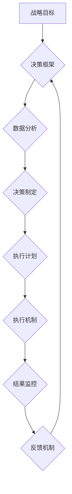

                 

## 行动体系：决定管理者的天花板

> 关键词：行动体系、管理者天花板、决策效率、执行力、流程优化、自动化、数据驱动、人工智能、敏捷开发

## 1. 背景介绍

在当今瞬息万变的科技时代，企业面临着前所未有的挑战和机遇。为了在激烈的竞争中脱颖而出，管理者需要具备敏锐的洞察力、高效的决策能力和强大的执行力。然而，许多管理者往往陷入决策的泥潭，执行力不足，难以将战略目标转化为实际成果。究其原因，往往在于缺乏一套完善的“行动体系”。

传统管理模式往往注重计划和控制，但忽视了行动的执行和反馈。管理者往往沉溺于制定宏大的战略目标，却忽略了将这些目标分解成可执行的行动步骤，并建立起有效的执行机制。这种“计划-控制”模式难以适应快速变化的市场环境，导致决策效率低下，执行力不足，最终导致管理者的“天花板”被设定。

## 2. 核心概念与联系

**2.1 核心概念**

* **行动体系:** 指的是一套完整的、可执行的决策和执行流程，旨在将战略目标转化为实际成果。它包括了决策框架、执行机制、反馈机制和持续改进机制等多个方面。
* **决策效率:** 指的是管理者在有限的时间内，能够做出正确、有效的决策的能力。
* **执行力:** 指的是管理者能够将决策转化为实际行动，并取得预期的结果的能力。
* **流程优化:** 指的是通过分析和改进现有流程，提高效率、降低成本和风险。
* **自动化:** 指的是利用技术手段，将重复性、规则性的工作自动化，释放人力资源。
* **数据驱动:** 指的是利用数据分析和预测，为决策提供依据，提高决策的准确性和有效性。

**2.2 架构图**



**2.3 联系**

行动体系的核心是将战略目标分解成可执行的行动步骤，并建立起有效的执行机制。决策效率和执行力是行动体系的关键要素，而流程优化、自动化和数据驱动则是提高决策效率和执行力的重要手段。

## 3. 核心算法原理 & 具体操作步骤

**3.1 算法原理概述**

行动体系的核心算法原理是基于“循环反馈”机制，通过不断迭代和优化，实现决策和执行的持续改进。该算法主要包括以下步骤：

1. **目标分解:** 将战略目标分解成具体的、可衡量的行动目标。
2. **决策制定:** 基于数据分析和决策框架，制定具体的行动计划。
3. **执行计划:** 将行动计划分解成具体的任务，并分配给相应的责任人。
4. **结果监控:** 定期监控行动计划的执行进度和结果，收集反馈信息。
5. **反馈机制:** 分析反馈信息，及时调整行动计划和执行机制，不断优化行动体系。

**3.2 算法步骤详解**

1. **目标分解:** 采用“SMART”目标设定原则，确保目标是具体、可衡量、可实现、相关和有时间限制的。
2. **决策制定:** 建立决策框架，明确决策的依据、流程和责任人。利用数据分析工具，收集和分析相关数据，为决策提供依据。
3. **执行计划:** 将行动计划分解成具体的任务，并分配给相应的责任人。制定详细的执行步骤和时间表，确保任务的顺利完成。
4. **结果监控:** 利用监控工具，实时跟踪行动计划的执行进度和结果。收集反馈信息，包括任务完成情况、遇到的问题和改进建议。
5. **反馈机制:** 定期召开会议，分析反馈信息，总结经验教训，并及时调整行动计划和执行机制。

**3.3 算法优缺点**

* **优点:** 
    * 提高决策效率和执行力。
    * 促进团队协作和沟通。
    * 增强对行动结果的掌控。
    * 促进持续改进和优化。
* **缺点:** 
    * 需要投入时间和精力进行建立和维护。
    * 需要具备一定的技术能力和数据分析能力。
    * 需要建立完善的反馈机制，才能保证持续改进。

**3.4 算法应用领域**

行动体系的应用领域非常广泛，包括：

* **企业管理:** 提高企业决策效率和执行力，实现战略目标。
* **项目管理:** 优化项目流程，提高项目进度和质量。
* **产品开发:** 加速产品开发周期，提高产品质量和用户体验。
* **个人成长:** 制定个人目标，制定行动计划，实现个人成长。

## 4. 数学模型和公式 & 详细讲解 & 举例说明

**4.1 数学模型构建**

我们可以用一个简单的数学模型来描述行动体系的运作机制：

```latex
Result = f(Goal, Plan, Execution, Feedback)
```

其中：

* **Result:**  最终结果
* **Goal:** 目标
* **Plan:** 行动计划
* **Execution:** 执行过程
* **Feedback:** 反馈信息

这个模型表明，最终结果是由目标、行动计划、执行过程和反馈信息的综合作用决定的。

**4.2 公式推导过程**

我们可以进一步推导这个模型，得到更具体的公式：

```latex
Result = f(Goal_Decomposition, Decision_Framework, Execution_Mechanism, Monitoring_System, Feedback_Loop)
```

其中：

* **Goal_Decomposition:** 目标分解
* **Decision_Framework:** 决策框架
* **Execution_Mechanism:** 执行机制
* **Monitoring_System:** 监控系统
* **Feedback_Loop:** 反馈循环

**4.3 案例分析与讲解**

假设一家公司想要提高销售额，我们可以用这个模型来分析行动体系的构建：

* **Goal:** 提高销售额
* **Goal_Decomposition:** 将销售额目标分解成具体的销售指标，例如增加新客户数量、提高客户复购率等。
* **Decision_Framework:** 建立一个决策框架，明确销售策略、营销活动和销售团队的职责。
* **Execution_Mechanism:** 制定具体的执行计划，例如开展线上线下营销活动、优化销售流程等。
* **Monitoring_System:** 利用销售数据分析系统，实时监控销售指标的执行情况。
* **Feedback_Loop:** 定期分析销售数据，收集客户反馈，并根据反馈信息调整销售策略和执行计划。

通过不断迭代和优化，这家公司可以逐步提高销售额，实现目标。

## 5. 项目实践：代码实例和详细解释说明

**5.1 开发环境搭建**

为了实现行动体系的自动化执行，我们可以使用 Python 语言和相关库进行开发。开发环境搭建包括：

* 安装 Python 语言环境
* 安装相关库，例如 Pandas、NumPy、Scikit-learn 等
* 设置开发工具，例如 Jupyter Notebook 或 VS Code

**5.2 源代码详细实现**

```python
import pandas as pd
from sklearn.linear_model import LinearRegression

# 数据加载
data = pd.read_csv("sales_data.csv")

# 目标分解
target_variable = "sales_amount"
features = ["marketing_spend", "customer_count"]

# 决策框架
def predict_sales(data):
    model = LinearRegression()
    model.fit(data[features], data[target_variable])
    return model.predict(data[features])

# 执行计划
def execute_plan(predicted_sales):
    # 根据预测结果制定执行计划，例如调整营销预算、增加销售人员等
    pass

# 结果监控
def monitor_results(actual_sales, predicted_sales):
    # 计算预测误差，分析执行效果
    pass

# 反馈机制
def update_plan(feedback):
    # 根据反馈信息调整决策框架和执行计划
    pass

# 主程序
if __name__ == "__main__":
    predicted_sales = predict_sales(data)
    execute_plan(predicted_sales)
    actual_sales = monitor_results()
    feedback = update_plan(feedback)
```

**5.3 代码解读与分析**

这段代码展示了行动体系的自动化执行流程。

* 数据加载：从 CSV 文件中加载销售数据。
* 目标分解：将销售额目标分解成具体的销售指标。
* 决策框架：使用线性回归模型预测销售额。
* 执行计划：根据预测结果制定执行计划。
* 结果监控：监控实际销售额，并计算预测误差。
* 反馈机制：根据反馈信息调整决策框架和执行计划。

**5.4 运行结果展示**

运行这段代码后，可以得到预测的销售额，并根据预测结果制定执行计划。通过监控实际销售额和预测误差，可以不断调整决策框架和执行计划，实现行动体系的持续改进。

## 6. 实际应用场景

行动体系的应用场景非常广泛，以下是一些具体的例子：

* **企业战略执行:** 企业可以利用行动体系将战略目标分解成具体的行动步骤，并建立起有效的执行机制，确保战略目标的顺利实现。
* **产品开发迭代:** 产品开发团队可以利用行动体系进行快速迭代，根据用户反馈不断优化产品功能和体验。
* **营销活动策划:** 营销团队可以利用行动体系制定营销活动计划，并根据活动效果进行调整，提高营销活动的效率和效果。
* **个人目标管理:** 个人可以利用行动体系制定个人目标，并制定行动计划，实现个人成长和发展。

**6.4 未来应用展望**

随着人工智能技术的不断发展，行动体系的应用场景将会更加广泛。例如：

* **智能决策支持:** 利用人工智能技术，自动分析数据，为决策提供更精准的建议。
* **自动化执行:** 利用人工智能技术，自动执行重复性、规则性的任务，释放人力资源。
* **个性化行动计划:** 根据用户的个人情况和目标，定制个性化的行动计划。

## 7. 工具和资源推荐

**7.1 学习资源推荐**

* **书籍:**
    * 《行动力：从目标到成果》
    * 《高效能人士的七个习惯》
    * 《刻意练习》
* **在线课程:**
    * Coursera: Project Management Specialization
    * Udemy: Agile Project Management

**7.2 开发工具推荐**

* **Python:** 
    * Jupyter Notebook
    * VS Code
* **数据分析工具:**
    * Pandas
    * NumPy
    * Scikit-learn
* **项目管理工具:**
    * Jira
    * Trello

**7.3 相关论文推荐**

* **The Actionable Intelligence Framework**
* **A Framework for Building Actionable AI Systems**
* **Actionable Insights: From Data to Decisions**

## 8. 总结：未来发展趋势与挑战

**8.1 研究成果总结**

行动体系的研究成果表明，通过建立一套完善的决策和执行流程，可以有效提高管理者的决策效率和执行力，实现战略目标的顺利实现。

**8.2 未来发展趋势**

未来行动体系的发展趋势包括：

* **智能化:** 利用人工智能技术，自动分析数据，为决策提供更精准的建议，并自动执行重复性、规则性的任务。
* **个性化:** 根据用户的个人情况和目标，定制个性化的行动计划。
* **协同化:** 促进团队协作和沟通，实现共同目标的达成。

**8.3 面临的挑战**

行动体系的应用也面临着一些挑战：

* **数据质量:** 行动体系的有效性依赖于数据的准确性和完整性。
* **技术能力:** 建立和维护行动体系需要一定的技术能力和数据分析能力。
* **组织文化:** 行动体系的实施需要企业文化和管理模式的转变。

**8.4 研究展望**

未来研究方向包括：

* **开发更智能的行动体系:** 利用人工智能技术，实现行动体系的自动化和智能化。
* **研究不同行业和场景下的行动体系:** 探索不同行业和场景下行动体系的最佳实践。
* **研究行动体系的社会影响:** 评估行动体系对企业、社会和个人的影响。

## 9. 附录：常见问题与解答

**9.1 如何建立行动体系？**

建立行动体系需要以下步骤：

1. 明确目标
2. 分解目标
3. 建立决策框架
4. 制定执行计划
5. 建立监控系统
6. 建立反馈机制

**9.2 行动体系的实施需要哪些资源？**

实施行动体系需要以下资源：

* 人力资源
* 技术资源
* 资金资源
* 时间资源

**9.3 行动体系的评估指标有哪些？**

行动体系的评估指标包括：

* 决策效率
* 执行力
* 结果达成率
* 团队协作
* 持续改进

**9.4 行动体系的应用范围有哪些？**

行动体系的应用范围非常广泛，包括：

* 企业管理
* 项目管理
* 产品开发
* 个人成长


作者：禅与计算机程序设计艺术 / Zen and the Art of Computer Programming 
<end_of_turn>

