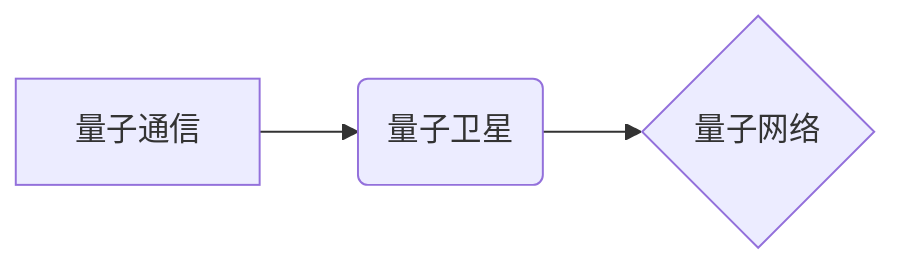

                 

## 量子通信卫星：构建全球量子通信网络

> 关键词：量子通信、量子卫星、量子网络、量子加密、量子纠缠、密鑰分發

### 1. 背景介绍

随着信息技术的飞速发展，网络安全问题日益突出。传统加密技术面临着被量子计算机破解的威胁，因此，探索新的安全通信方式成为当务之急。量子通信凭借其基于量子力学原理的独特优势，被认为是未来网络安全的重要保障。

量子通信卫星作为量子通信网络的关键基础设施，能够实现跨越长距离的量子信息传输，为构建全球量子通信网络奠定基础。

### 2. 核心概念与联系

#### 2.1 量子通信

量子通信利用量子力学原理，例如量子叠加和量子纠缠，实现信息的安全传输。

* **量子叠加:** 量子比特（qubit）可以同时处于0和1的叠加态，拥有比经典比特更多的信息存储能力。
* **量子纠缠:** 两个或多个量子比特可以相互纠缠，即使相隔很远，测量一个量子比特的状态也能瞬间影响另一个量子比特的状态。

#### 2.2 量子卫星

量子卫星是一种搭载量子通信设备的卫星，能够在太空平台上进行量子信息传输。

* **优势:** 卫星不受地面环境限制，能够实现跨越长距离的量子通信，克服地面量子通信网络的局限性。
* **应用:** 构建全球量子通信网络、实现量子网络互联互通、开展量子科学实验等。

#### 2.3 量子网络

量子网络是利用量子通信技术构建的网络，能够实现量子信息的安全传输和共享。

* **架构:** 由多个量子节点组成，节点之间通过量子信道进行连接。
* **功能:** 量子信息传输、量子计算、量子传感器等。

**核心概念与联系流程图:**



### 3. 核心算法原理 & 具体操作步骤

#### 3.1 算法原理概述

量子通信的核心算法原理是基于量子力学原理的量子密钥分发协议（QKD）。

* **原理:** 利用量子叠加和量子纠缠特性，双方可以生成一个共享的秘密密钥，即使第三方进行窃听，也无法获取密钥信息。
* **优势:** 具有绝对的安全性和不可破解性。

#### 3.2 算法步骤详解

1. **量子态准备:** 发送方准备一系列量子比特，每个量子比特处于叠加态。
2. **量子态传输:** 发送方将量子比特通过量子信道发送给接收方。
3. **量子态测量:** 接收方对接收到的量子比特进行测量，并记录测量结果。
4. **密钥提取:** 发送方和接收方根据各自的测量结果，提取出共享的秘密密钥。
5. **安全验证:** 发送方和接收方进行安全验证，确保密钥的安全性和完整性。

#### 3.3 算法优缺点

* **优点:** 具有绝对的安全性和不可破解性，能够抵抗量子计算机的攻击。
* **缺点:** 距离限制、传输效率低、成本高昂。

#### 3.4 算法应用领域

* **金融安全:** 保护金融交易的安全性和隐私性。
* **政府信息安全:** 保护国家机密和重要信息的安全。
* **医疗信息安全:** 保护患者隐私和医疗数据的安全。

### 4. 数学模型和公式 & 详细讲解 & 举例说明

#### 4.1 数学模型构建

量子密钥分发协议（QKD）的数学模型可以基于量子力学和信息论的原理构建。

* **量子态:** 量子比特可以表示为一个复数向量，例如|0⟩ = (1, 0)和|1⟩ = (0, 1)。
* **量子测量:** 量子测量可以表示为一个投影操作，将量子态投影到一个特定的基底上。
* **密钥提取:** 密钥提取过程可以基于量子测量结果的统计分析进行。

#### 4.2 公式推导过程

QKD协议的安全性基于以下数学原理：

* **海森堡测不准原理:** 无法同时精确测量量子系统的两个物理量，例如位置和动量。
* **量子纠缠:** 两个或多个量子比特可以相互纠缠，即使相隔很远，测量一个量子比特的状态也能瞬间影响另一个量子比特的状态。

#### 4.3 案例分析与讲解

例如，BB84协议是一种经典的QKD协议，其安全性基于量子态的随机性。发送方将量子比特随机地编码为|0⟩或|1⟩，并通过量子信道发送给接收方。接收方对接收到的量子比特进行随机测量，并记录测量结果。发送方和接收方根据各自的测量结果，提取出共享的秘密密钥。

### 5. 项目实践：代码实例和详细解释说明

#### 5.1 开发环境搭建

* **编程语言:** Python
* **量子计算库:** Qiskit
* **仿真环境:** Qiskit Aer

#### 5.2 源代码详细实现

```python
from qiskit import QuantumCircuit, Aer, execute

# 创建量子电路
qc = QuantumCircuit(2)

# 应用量子门
qc.h(0)
qc.cx(0, 1)

# 测量量子比特
qc.measure([0, 1], [0, 1])

# 仿真量子电路
simulator = Aer.get_backend('qasm_simulator')
job = execute(qc, simulator, shots=1024)
result = job.result()
counts = result.get_counts(qc)

# 打印测量结果
print(counts)
```

#### 5.3 代码解读与分析

* **创建量子电路:** 使用Qiskit库创建两个量子比特的量子电路。
* **应用量子门:** 应用Hadamard门和CNOT门，实现量子态的制备和纠缠。
* **测量量子比特:** 对量子比特进行测量，并记录测量结果。
* **仿真量子电路:** 使用Qiskit Aer仿真环境仿真量子电路，并获取测量结果。
* **打印测量结果:** 打印测量结果，观察量子态的叠加和纠缠特性。

#### 5.4 运行结果展示

运行代码后，会输出测量结果，例如：

```
{
    '00': 512,
    '11': 512
}
```

结果表明，量子比特处于纠缠态，测量结果符合量子力学的预测。

### 6. 实际应用场景

#### 6.1 金融安全

量子通信可以用于保护金融交易的安全性和隐私性。例如，银行可以使用量子密钥分发协议来生成安全的密钥，用于加密交易数据，防止数据被窃取或篡改。

#### 6.2 政府信息安全

政府机构可以使用量子通信来保护国家机密和重要信息的安全。例如，政府可以利用量子通信网络进行安全通信，防止情报泄露和网络攻击。

#### 6.3 医疗信息安全

医疗机构可以使用量子通信来保护患者隐私和医疗数据的安全。例如，医院可以使用量子通信网络传输患者的病历和医疗影像数据，确保数据的安全性和保密性。

#### 6.4 未来应用展望

随着量子通信技术的不断发展，其应用场景将更加广泛。例如，量子通信可以用于构建量子互联网，实现量子计算和量子传感的应用。

### 7. 工具和资源推荐

#### 7.1 学习资源推荐

* **书籍:**
    * 量子通信原理与应用
    * 量子信息科学
* **在线课程:**
    * Coursera: Quantum Computing for Everyone
    * edX: Introduction to Quantum Computing

#### 7.2 开发工具推荐

* **Qiskit:** Python量子计算库
* **Cirq:** Google开发的量子计算库
* **PennyLane:** 用于量子机器学习的库

#### 7.3 相关论文推荐

* **BB84协议:** Bennett, C. H., & Brassard, G. (1984). Quantum cryptography: Public key distribution and coin tossing. Proceedings of IEEE International Conference on Computers, Systems & Signal Processing, 175-179.
* **量子网络:** Nielsen, M. A., & Chuang, I. L. (2010). Quantum computation and quantum information. Cambridge university press.

### 8. 总结：未来发展趋势与挑战

#### 8.1 研究成果总结

量子通信卫星技术取得了显著进展，为构建全球量子通信网络奠定了基础。

#### 8.2 未来发展趋势

* **提高量子通信距离:** 研究更长距离的量子通信技术，实现跨洲甚至跨全球的量子通信。
* **提升量子通信效率:** 提高量子信息传输速率和效率，满足未来网络需求。
* **拓展量子通信应用:** 将量子通信技术应用于更多领域，例如量子计算、量子传感等。

#### 8.3 面临的挑战

* **技术难题:** 量子通信技术还面临着许多技术难题，例如量子纠缠的保真度、量子信息传输的效率等。
* **成本问题:** 量子通信卫星的研制和部署成本较高，需要进一步降低成本。
* **标准化问题:** 量子通信标准尚未统一，需要制定国际标准，促进量子通信技术的普及。

#### 8.4 研究展望

未来，量子通信技术将继续发展，为人类社会带来革命性的变革。

### 9. 附录：常见问题与解答

* **什么是量子纠缠？**

量子纠缠是指两个或多个量子比特之间存在一种特殊的关联关系，即使相隔很远，测量一个量子比特的状态也能瞬间影响另一个量子比特的状态。

* **量子通信比传统通信安全吗？**

是的，量子通信基于量子力学原理，具有绝对的安全性和不可破解性，能够抵抗量子计算机的攻击。

* **量子通信技术何时能够普及？**

量子通信技术的普及还需要时间，需要解决技术难题、降低成本和制定标准等问题。


作者：禅与计算机程序设计艺术 / Zen and the Art of Computer Programming 
<end_of_turn>

