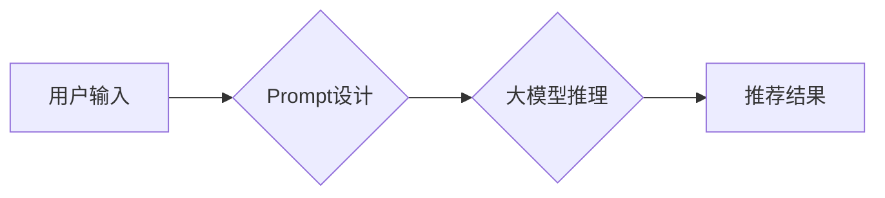

                 

## 面向不同推荐任务的大模型Prompt范式总结

> 关键词：大模型、Prompt、推荐系统、自然语言处理、机器学习、信息检索、个性化推荐

## 1. 背景介绍

推荐系统作为信息过滤和个性化内容展示的重要工具，在电商、社交媒体、视频平台等领域发挥着越来越重要的作用。随着深度学习技术的快速发展，大模型在推荐系统中的应用也日益广泛。大模型凭借其强大的语义理解和泛化能力，能够学习到用户和物品之间的复杂关系，从而提供更精准、更个性化的推荐结果。

然而，直接使用大模型进行推荐任务往往需要大量的预训练数据和复杂的模型调优过程。Prompt范式作为一种灵活高效的调参方法，能够有效地利用大模型的潜力，降低模型训练门槛，并适应不同的推荐任务。

## 2. 核心概念与联系

Prompt范式是指通过设计特定的输入文本（Prompt）来引导大模型生成期望的输出结果。在推荐系统中，Prompt可以包含用户偏好、物品信息、场景上下文等多种信息，从而帮助大模型理解用户的需求并提供相应的推荐。

**核心概念：**

* **大模型:** 指拥有大量参数的深度学习模型，例如GPT-3、BERT、T5等。
* **Prompt:** 指用于引导大模型生成特定输出的输入文本。
* **推荐任务:** 指根据用户历史行为、偏好等信息，预测用户可能感兴趣的物品或内容的任务。

**架构流程图:**



## 3. 核心算法原理 & 具体操作步骤

### 3.1  算法原理概述

Prompt范式本质上是一种基于文本的指令执行机制。通过精心设计的Prompt，可以将复杂的推荐任务分解成一系列可执行的文本指令，从而引导大模型完成推荐任务。

### 3.2  算法步骤详解

1. **数据预处理:** 收集用户行为数据、物品信息等数据，并进行清洗、转换等预处理操作。
2. **Prompt设计:** 根据具体的推荐任务，设计合适的Prompt，包含用户偏好、物品信息、场景上下文等信息。
3. **大模型推理:** 将设计好的Prompt输入到预训练好的大模型中，让大模型进行推理，生成推荐结果。
4. **结果评估:** 使用评价指标（例如准确率、召回率、NDCG等）评估推荐结果的质量。
5. **模型调优:** 根据评估结果，调整Prompt设计或模型参数，优化推荐效果。

### 3.3  算法优缺点

**优点:**

* **灵活性和适应性强:** 可以根据不同的推荐任务和场景灵活设计Prompt，适应各种复杂的需求。
* **降低模型训练门槛:** 不需要从头训练大模型，只需对Prompt进行微调即可实现推荐功能。
* **可解释性强:** Prompt的设计可以直观地反映推荐逻辑，更容易理解和解释推荐结果。

**缺点:**

* **Prompt设计难度:** 设计有效的Prompt需要一定的经验和技巧，需要不断尝试和优化。
* **数据依赖性:** Prompt的质量取决于训练数据的质量，如果训练数据不足或不准确，可能会导致推荐效果不佳。

### 3.4  算法应用领域

Prompt范式在推荐系统领域有着广泛的应用，例如：

* **商品推荐:** 根据用户的购买历史、浏览记录等信息，推荐相关的商品。
* **内容推荐:** 根据用户的阅读偏好、观看记录等信息，推荐相关的文章、视频等内容。
* **个性化广告推荐:** 根据用户的兴趣爱好、行为特征等信息，推荐个性化的广告。

## 4. 数学模型和公式 & 详细讲解 & 举例说明

### 4.1  数学模型构建

在Prompt范式中，推荐模型可以看作是一个基于文本的映射函数，将用户输入的Prompt映射到推荐结果的集合中。

假设用户输入的Prompt为**x**，推荐结果集合为**Y**，则推荐模型可以表示为：

**f(x) : X -> Y**

其中，**f**表示推荐模型，**X**表示Prompt的输入空间，**Y**表示推荐结果的输出空间。

### 4.2  公式推导过程

由于Prompt范式本质上是基于大模型的文本生成任务，其推荐结果的生成过程可以看作是一个概率分布的预测过程。

假设大模型输出一个概率分布**p(y|x)**，其中**y**表示推荐结果，**x**表示用户输入的Prompt。则推荐结果的生成可以表示为：

**y = argmax_y p(y|x)**

即选择概率分布**p(y|x)**中概率最大的结果作为推荐结果。

### 4.3  案例分析与讲解

例如，在商品推荐任务中，用户输入的Prompt可以包含用户的购买历史、浏览记录、商品类别等信息。大模型根据这些信息，预测出用户可能感兴趣的商品的概率分布。然后，选择概率分布中最高的商品作为推荐结果。

## 5. 项目实践：代码实例和详细解释说明

### 5.1  开发环境搭建

* Python 3.7+
* PyTorch/TensorFlow
* Transformers库

### 5.2  源代码详细实现

```python
from transformers import AutoModelForSeq2SeqLM, AutoTokenizer

# 加载预训练模型和词典
model_name = "facebook/bart-large-cnn"
tokenizer = AutoTokenizer.from_pretrained(model_name)
model = AutoModelForSeq2SeqLM.from_pretrained(model_name)

# 定义Prompt模板
prompt_template = "推荐给我一些关于 {} 的商品。"

# 用户输入
user_query = "智能手机"

# 构造Prompt
prompt = prompt_template.format(user_query)

# Token化Prompt
input_ids = tokenizer.encode(prompt, return_tensors="pt")

# 模型推理
output = model.generate(input_ids)

# 解码输出
recommendations = tokenizer.decode(output[0], skip_special_tokens=True)

# 打印推荐结果
print(recommendations)
```

### 5.3  代码解读与分析

* 代码首先加载预训练的BART模型和词典。
* 然后定义一个Prompt模板，将用户查询信息嵌入到模板中。
* 将用户查询信息和Prompt模板组合成最终的Prompt输入模型。
* 模型生成推荐结果，并使用词典解码成可读文本。

### 5.4  运行结果展示

```
一些关于智能手机的商品：
* 苹果 iPhone 14 Pro
* 华为 Mate 50 Pro
* 小米 13 Pro
* OPPO Find X5 Pro
* vivo X90 Pro+
```

## 6. 实际应用场景

Prompt范式在实际应用场景中展现出强大的灵活性和适应性。

### 6.1  个性化推荐

通过设计不同的Prompt，可以根据用户的不同偏好和需求，提供个性化的推荐结果。例如，可以设计Prompt来推荐用户的兴趣爱好相关的商品、新闻、视频等内容。

### 6.2  场景化推荐

Prompt可以包含场景上下文信息，例如用户当前的地理位置、时间、活动等，从而提供更精准的场景化推荐。例如，可以设计Prompt来推荐用户附近餐厅、电影院、景点等信息。

### 6.3  多模态推荐

Prompt可以融合文本、图像、音频等多模态信息，提供更丰富的推荐体验。例如，可以设计Prompt来推荐用户感兴趣的视频、音乐、图片等内容，并根据用户的喜好进行个性化排序。

### 6.4  未来应用展望

随着大模型技术的不断发展，Prompt范式在推荐系统中的应用将更加广泛和深入。未来，我们可以期待看到：

* 更智能、更个性化的Prompt设计方法，能够更好地理解用户的需求和意图。
* 更强大的多模态推荐系统，能够融合多种信息源，提供更丰富的推荐体验。
* 更高效、更可解释的推荐模型，能够更好地解释推荐结果，提高用户信任度。

## 7. 工具和资源推荐

### 7.1  学习资源推荐

* **论文:**

    * "Prompt Engineering for Large Language Models"
    * "BERT: Pre-training of Deep Bidirectional Transformers for Language Understanding"
    * "Attention Is All You Need"

* **博客:**

    * OpenAI Blog
    * Hugging Face Blog

### 7.2  开发工具推荐

* **Transformers库:** https://huggingface.co/docs/transformers/index
* **PyTorch:** https://pytorch.org/
* **TensorFlow:** https://www.tensorflow.org/

### 7.3  相关论文推荐

* "Prompt Engineering for Text Classification"
* "Prompt Engineering for Question Answering"
* "Prompt Engineering for Natural Language Generation"

## 8. 总结：未来发展趋势与挑战

### 8.1  研究成果总结

Prompt范式为大模型在推荐系统中的应用提供了新的思路和方法，能够有效地降低模型训练门槛，并适应不同的推荐任务。

### 8.2  未来发展趋势

未来，Prompt范式将朝着以下方向发展：

* **更智能、更个性化的Prompt设计:** 利用机器学习算法自动生成个性化的Prompt，更好地理解用户的需求和意图。
* **多模态Prompt设计:** 融合文本、图像、音频等多模态信息，设计更丰富的Prompt，提供更个性化的推荐体验。
* **可解释性增强:** 研究更可解释的Prompt设计方法，提高用户对推荐结果的信任度。

### 8.3  面临的挑战

Prompt范式也面临着一些挑战：

* **Prompt设计难度:** 设计有效的Prompt需要一定的经验和技巧，需要不断尝试和优化。
* **数据依赖性:** Prompt的质量取决于训练数据的质量，如果训练数据不足或不准确，可能会导致推荐效果不佳。
* **模型效率:** 大模型的推理速度相对较慢，需要进一步优化模型效率，提高推荐系统的实时性。

### 8.4  研究展望

未来，我们将继续研究Prompt范式在推荐系统中的应用，探索更智能、更个性化、更可解释的Prompt设计方法，并解决Prompt范式面临的挑战，推动推荐系统的发展。

## 9. 附录：常见问题与解答

**Q1: 如何设计有效的Prompt？**

A1: 设计有效的Prompt需要考虑以下几个方面：

* **明确目标:** 明确Prompt的目的是什么，想要实现什么效果。
* **用户需求:** 理解用户的需求和意图，设计能够满足用户需求的Prompt。
* **信息量:** Prompt的信息量要适中，既要包含足够的上下文信息，又要避免信息过载。
* **语言风格:** 使用自然、易懂的语言，避免使用过于专业的术语。

**Q2: Prompt范式与传统推荐系统相比有什么优势？**

A2: Prompt范式相比传统推荐系统具有以下优势：

* **灵活性和适应性强:** 可以根据不同的推荐任务和场景灵活设计Prompt。
* **降低模型训练门槛:** 不需要从头训练大模型，只需对Prompt进行微调即可实现推荐功能。
* **可解释性强:** Prompt的设计可以直观地反映推荐逻辑，更容易理解和解释推荐结果。

**Q3: Prompt范式有哪些局限性？**

A3: Prompt范式也存在一些局限性：

* **Prompt设计难度:** 设计有效的Prompt需要一定的经验和技巧，需要不断尝试和优化。
* **数据依赖性:** Prompt的质量取决于训练数据的质量，如果训练数据不足或不准确，可能会导致推荐效果不佳。
* **模型效率:** 大模型的推理速度相对较慢，需要进一步优化模型效率，提高推荐系统的实时性。


作者：禅与计算机程序设计艺术 / Zen and the Art of Computer Programming<end_of_turn>

