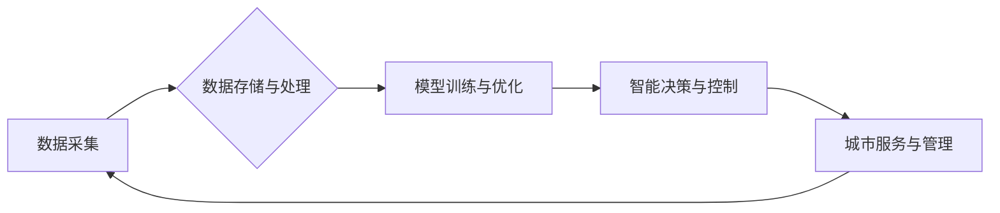

                 

## AI与人类计算：打造可持续发展的城市生活

> 关键词：人工智能、城市计算、可持续发展、数据驱动、智能优化、人类-计算机交互、城市规划、资源管理、环境保护

## 1. 背景介绍

随着全球人口的持续增长和城市化的加速推进，城市面临着前所未有的挑战。资源短缺、环境污染、交通拥堵、公共安全等问题日益突出，严重影响着城市居民的生活质量和可持续发展。传统城市管理模式已难以应对这些复杂问题，迫切需要引入新的技术和理念来推动城市转型升级。

人工智能（AI）作为一门新兴技术，凭借其强大的数据处理能力、学习能力和决策能力，为解决城市问题提供了新的思路和解决方案。AI技术能够帮助城市收集、分析和利用海量数据，洞察城市运行规律，优化城市管理，提升城市服务水平，最终实现城市的可持续发展。

## 2. 核心概念与联系

城市计算是指利用计算技术和数据分析手段，对城市运行状态进行实时监测、分析和预测，从而实现城市管理的智能化和优化。AI与城市计算的结合，形成了一个全新的城市智能化发展模式，即“AI驱动的城市计算”。

**AI驱动的城市计算架构**



**核心概念原理和架构**

* **数据采集:** 通过传感器、摄像头、社交媒体等多种途径，收集城市运行状态的各种数据，例如交通流量、空气质量、能源消耗、公共安全事件等。
* **数据存储与处理:** 将收集到的数据存储在云平台或本地数据库中，并利用大数据处理技术对数据进行清洗、转换、分析和挖掘。
* **模型训练与优化:** 利用机器学习算法，对城市数据进行训练，建立城市运行的预测模型，例如交通流量预测模型、空气质量预测模型、能源消耗预测模型等。
* **智能决策与控制:** 根据预测模型的输出结果，对城市运行状态进行智能决策和控制，例如调整交通信号灯，优化能源分配，预警潜在风险等。
* **城市服务与管理:** 通过智能决策和控制，提升城市服务水平，例如智能交通管理、智能环境监测、智能公共安全等。

## 3. 核心算法原理 & 具体操作步骤

### 3.1  算法原理概述

在AI驱动的城市计算中，常用的算法包括机器学习、深度学习、强化学习等。

* **机器学习:** 通过训练模型，让模型从数据中学习规律，并对新数据进行预测或分类。例如，利用机器学习算法可以建立交通流量预测模型，预测未来交通流量的变化趋势。
* **深度学习:** 是一种更高级的机器学习算法，利用多层神经网络，能够学习更复杂的特征和模式。例如，利用深度学习算法可以建立图像识别模型，识别城市中的交通违规行为。
* **强化学习:** 通过奖励机制，让模型学习最优的策略。例如，利用强化学习算法可以训练智能交通信号灯，根据实时交通流量情况，优化信号灯的控制策略。

### 3.2  算法步骤详解

以交通流量预测为例，详细说明机器学习算法的具体操作步骤：

1. **数据收集:** 收集历史交通流量数据，包括时间、地点、交通流量等信息。
2. **数据预处理:** 对数据进行清洗、转换、归一化等处理，使其适合模型训练。
3. **模型选择:** 选择合适的机器学习算法，例如线性回归、决策树、支持向量机等。
4. **模型训练:** 利用训练数据，训练模型，使其能够学习交通流量的规律。
5. **模型评估:** 利用测试数据，评估模型的预测精度。
6. **模型优化:** 根据评估结果，调整模型参数，提高模型的预测精度。
7. **模型部署:** 将训练好的模型部署到实际环境中，用于实时预测交通流量。

### 3.3  算法优缺点

**优点:**

* 能够从海量数据中发现隐藏的规律，提供更精准的预测结果。
* 能够根据实时数据进行动态调整，提高决策效率。
* 能够自动化完成许多重复性任务，减轻人工负担。

**缺点:**

* 需要大量的训练数据，否则模型的预测精度会降低。
* 模型的训练过程需要消耗大量的计算资源。
* 模型的解释性较差，难以理解模型的决策过程。

### 3.4  算法应用领域

AI算法在城市计算领域有着广泛的应用，例如：

* **智能交通管理:** 交通流量预测、拥堵路段预警、智能信号灯控制、自动驾驶等。
* **智能环境监测:** 空气质量监测、水质监测、噪音监测、环境污染预警等。
* **智能公共安全:** 犯罪预测、公共安全事件预警、人脸识别、视频监控等。
* **智能能源管理:** 能源消耗预测、智能电网控制、分布式能源管理等。

## 4. 数学模型和公式 & 详细讲解 & 举例说明

### 4.1  数学模型构建

在AI驱动的城市计算中，常用的数学模型包括线性回归模型、逻辑回归模型、支持向量机模型、神经网络模型等。

**线性回归模型**

线性回归模型是一种简单的机器学习算法，用于预测连续变量。其基本假设是，目标变量与输入变量之间存在线性关系。

**公式:**

$$y = \beta_0 + \beta_1x_1 + \beta_2x_2 + ... + \beta_nx_n + \epsilon$$

其中：

* $y$ 是目标变量
* $x_1, x_2, ..., x_n$ 是输入变量
* $\beta_0, \beta_1, \beta_2, ..., \beta_n$ 是模型参数
* $\epsilon$ 是误差项

**举例说明:**

假设我们要预测城市交通流量，输入变量包括时间、日期、天气状况等，目标变量是交通流量。我们可以使用线性回归模型建立预测模型，并根据历史数据训练模型参数。

### 4.2  公式推导过程

线性回归模型的参数可以通过最小二乘法进行估计。最小二乘法旨在找到一组参数，使得模型预测值与实际值之间的误差平方和最小。

**公式推导过程:**

1. 定义误差平方和函数:

$$SSE = \sum_{i=1}^{n}(y_i - \hat{y}_i)^2$$

其中:

* $y_i$ 是第 $i$ 个样本的实际值
* $\hat{y}_i$ 是第 $i$ 个样本的预测值

2. 对误差平方和函数求导，并令其等于零:

$$\frac{\partial SSE}{\partial \beta_j} = 0$$

3. 解出模型参数:

$$\beta_j = (X^TX)^{-1}X^Ty$$

其中:

* $X$ 是输入变量矩阵
* $y$ 是目标变量向量

### 4.3  案例分析与讲解

通过以上公式推导，我们可以得到线性回归模型的参数估计方法。

**案例分析:**

假设我们收集了城市交通流量的历史数据，包括时间、日期、天气状况等信息。我们可以使用线性回归模型建立预测模型，并根据历史数据训练模型参数。

**讲解:**

训练好的模型可以用于预测未来交通流量。例如，如果我们知道未来时间、日期和天气状况，就可以利用模型预测未来交通流量。

## 5. 项目实践：代码实例和详细解释说明

### 5.1  开发环境搭建

为了实现AI驱动的城市计算项目，需要搭建相应的开发环境。

**开发环境搭建步骤:**

1. 安装Python编程语言和相关库，例如NumPy、Pandas、Scikit-learn等。
2. 选择合适的云平台或本地服务器，用于存储数据和运行模型。
3. 安装必要的开发工具，例如IDE、版本控制系统等。

### 5.2  源代码详细实现

以下是一个简单的交通流量预测代码实例，使用Python和Scikit-learn库实现：

```python
import pandas as pd
from sklearn.linear_model import LinearRegression

# 加载数据
data = pd.read_csv("traffic_data.csv")

# 选择特征变量和目标变量
features = ["time", "date", "weather"]
target = "traffic_flow"

# 训练模型
model = LinearRegression()
model.fit(data[features], data[target])

# 预测未来交通流量
future_data = pd.DataFrame({
    "time": [10, 11, 12],
    "date": ["2023-10-27", "2023-10-27", "2023-10-27"],
    "weather": ["晴", "晴", "阴"]
})
predicted_traffic_flow = model.predict(future_data[features])

# 打印预测结果
print(predicted_traffic_flow)
```

### 5.3  代码解读与分析

* **数据加载:** 使用Pandas库加载交通流量数据。
* **特征选择:** 选择时间、日期、天气等特征变量，以及目标变量交通流量。
* **模型训练:** 使用Scikit-learn库的LinearRegression模型训练模型，并使用历史数据进行训练。
* **预测:** 使用训练好的模型预测未来交通流量。
* **结果打印:** 打印预测结果。

### 5.4  运行结果展示

运行以上代码，可以得到未来交通流量的预测结果。

## 6. 实际应用场景

### 6.1  智能交通管理

AI驱动的城市计算可以应用于智能交通管理，例如：

* **交通流量预测:** 利用历史交通流量数据，预测未来交通流量，帮助交通管理部门优化交通信号灯控制策略，缓解交通拥堵。
* **拥堵路段预警:** 利用实时交通流量数据，识别拥堵路段，并向驾驶员发出预警，引导驾驶员选择最佳路线。
* **智能停车管理:** 利用传感器数据，监测停车场停车位情况，并向驾驶员提供实时停车位信息，帮助驾驶员快速找到停车位。

### 6.2  智能环境监测

AI驱动的城市计算可以应用于智能环境监测，例如：

* **空气质量监测:** 利用传感器数据，监测空气质量，并向市民提供实时空气质量信息，提醒市民注意防护。
* **水质监测:** 利用传感器数据，监测水质，并及时发现水质污染问题，帮助环保部门采取措施保护水资源。
* **噪音监测:** 利用传感器数据，监测噪音水平，并识别噪音源，帮助城市管理部门控制噪音污染。

### 6.3  智能公共安全

AI驱动的城市计算可以应用于智能公共安全，例如：

* **犯罪预测:** 利用历史犯罪数据，预测未来犯罪高发区域，帮助警方加强巡逻力度，预防犯罪发生。
* **公共安全事件预警:** 利用传感器数据和视频监控数据，识别公共安全事件，例如火灾、爆炸、交通事故等，并及时向相关部门发出预警。
* **人脸识别:** 利用人脸识别技术，识别嫌疑人，帮助警方抓捕犯罪嫌疑人。

### 6.4  未来应用展望

随着人工智能技术的不断发展，AI驱动的城市计算将在未来发挥更重要的作用，例如：

* **城市规划:** 利用AI技术分析城市数据，优化城市规划，建设更加宜居、可持续的城市。
* **智慧医疗:** 利用AI技术辅助医生诊断疾病，提高医疗效率，改善医疗服务质量。
* **智慧教育:** 利用AI技术个性化教学，提高教育效率，促进教育公平。

## 7. 工具和资源推荐

### 7.1  学习资源推荐

* **在线课程:** Coursera、edX、Udacity等平台提供丰富的AI和城市计算相关课程。
* **书籍:** 《深度学习》、《机器学习实战》、《城市计算》等书籍可以帮助读者深入了解AI和城市计算相关知识。
* **博客和论坛:** 许多AI和城市计算领域的专家和学者在博客和论坛上分享他们的经验和见解。

### 7.2  开发工具推荐

* **Python:** Python是一种流行的编程语言，广泛应用于AI和数据科学领域。
* **Scikit-learn:** Scikit-learn是一个开源的机器学习库，提供各种机器学习算法和工具。
* **TensorFlow:** TensorFlow是一个开源的深度学习框架，可以用于训练和部署深度学习模型。
* **PyTorch:** PyTorch是一个开源的深度学习框架，以其灵活性和易用性而闻名。

### 7.3  相关论文推荐

* **《城市计算：概念、架构和应用》**
* **《人工智能在城市管理中的应用》**
* **《基于深度学习的交通流量预测》**

## 8. 总结：未来发展趋势与挑战

### 8.1  研究成果总结

AI驱动的城市计算已经取得了显著的成果，例如：

* **交通流量预测精度提高:** 利用AI技术，交通流量预测精度显著提高，帮助城市管理部门优化交通信号灯控制策略，缓解交通拥堵。
* **环境监测能力增强:** 利用AI技术，环境监测能力增强，能够及时发现环境污染问题，帮助环保部门采取措施保护环境。
* **公共安全水平提升:** 利用AI技术，公共安全水平提升，能够及时识别和预警公共安全事件，帮助警方维护社会治安。

### 8.2  未来发展趋势

未来，AI驱动的城市计算将朝着以下方向发展:

* **更加智能化:** 利用更先进的AI算法，例如深度学习、强化学习等，实现城市计算的更加智能化。
* **更加个性化:** 利用用户数据，为每个用户提供个性化的城市服务。
* **更加可持续:** 利用AI技术优化城市资源配置，促进城市的可持续发展。

### 8.3  面临的挑战

AI驱动的城市计算也面临着一些挑战:

* **数据安全:** 城市数据涉及到个人隐私，需要采取有效的措施保障数据安全。
* **算法透明度:** AI算法的决策过程往往难以理解，需要提高算法的透明度，增强公众信任。
* **伦理问题:** AI技术应用需要考虑伦理问题，例如算法偏见、人工智能的责任等。

### 8.4  研究展望

未来，需要加强对AI驱动的城市计算的研究，解决上述挑战，推动AI技术在城市管理领域的更加广泛应用，打造更加智能、可持续的城市。

## 9. 附录：常见问题与解答

**常见问题:**

* **AI驱动的城市计算需要哪些数据?**

**解答:** AI驱动的城市计算需要各种城市运行数据，例如交通流量数据、环境监测数据、公共安全数据、能源消耗数据等。

* **AI驱动的城市计算有哪些应用场景?**

**解答:** AI驱动的城市计算可以应用于智能交通管理、智能环境监测、智能公共安全、智慧医疗、智慧教育等多个领域。

* **AI驱动的城市计算有哪些挑战?**

**解答:** AI驱动的城市计算面临着数据安全、算法透明度、伦理问题等挑战。

* **如何学习AI驱动的城市计算?**

**解答:** 可以通过在线课程、书籍、博客、论坛等方式学习AI驱动的城市计算相关知识。


作者：禅与计算机程序设计艺术 / Zen and the Art of Computer Programming<end_of_turn>

