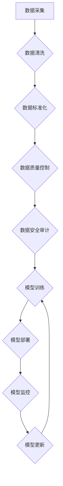

                 

## AI大模型重构电商搜索推荐的数据治理流程自动化工具应用案例分析

> 关键词：AI大模型、电商搜索推荐、数据治理、自动化工具、流程优化、推荐算法、数据质量、模型训练、部署与维护

## 1. 背景介绍

随着电商行业的蓬勃发展，搜索推荐系统已成为电商平台的核心竞争力之一。高效精准的搜索推荐能够显著提升用户体验，促进商品销售，并为商家提供更精准的营销策略。然而，传统的电商搜索推荐系统往往面临着数据规模庞大、数据质量参差不齐、算法模型更新迭代困难等挑战。

近年来，大规模语言模型（LLM）的快速发展为电商搜索推荐领域带来了新的机遇。LLM具备强大的文本理解和生成能力，能够有效处理海量文本数据，并学习用户行为和商品特征之间的复杂关系。将LLM应用于电商搜索推荐系统，可以有效提升推荐精准度、个性化程度和用户体验。

然而，LLM的应用也带来了新的挑战，例如模型训练成本高、数据安全和隐私保护等问题。因此，需要构建一套完善的数据治理流程，保障数据质量、安全和隐私，并实现对LLM模型的自动化训练、部署和维护。

## 2. 核心概念与联系

### 2.1 数据治理

数据治理是指对数据生命周期的各个阶段进行规范管理，以确保数据质量、安全和一致性。它涵盖了数据定义、数据标准化、数据质量控制、数据安全和隐私保护等多个方面。

### 2.2 自动化工具

自动化工具是指能够自动执行特定任务的软件工具。在数据治理领域，自动化工具可以用于数据清洗、数据转换、数据验证、数据安全审计等多个环节，提高数据治理效率和准确性。

### 2.3 AI大模型

AI大模型是指训练规模庞大、参数数量众多的人工智能模型。它们通常基于深度学习技术，能够学习复杂的数据模式，并进行文本理解、图像识别、语音合成等多种任务。

**数据治理流程自动化工具应用于电商搜索推荐**



## 3. 核心算法原理 & 具体操作步骤

### 3.1 算法原理概述

电商搜索推荐系统通常采用基于协同过滤、内容过滤和混合过滤的算法。

* **协同过滤:** 基于用户历史行为和商品相似度进行推荐。
* **内容过滤:** 基于商品属性和用户偏好进行推荐。
* **混合过滤:** 将协同过滤和内容过滤相结合，提高推荐精准度。

LLM可以用于增强以上算法的性能。例如，可以利用LLM对用户搜索词进行语义理解，并生成更精准的商品匹配结果；可以利用LLM分析商品描述和用户评论，提取商品特征和用户偏好，从而提高内容过滤的准确性。

### 3.2 算法步骤详解

1. **数据预处理:** 对原始数据进行清洗、转换和标准化，例如去除停用词、转换数据类型、规范化数据格式等。
2. **特征提取:** 利用LLM对用户行为、商品属性和用户评论等数据进行分析，提取特征向量，例如用户兴趣标签、商品类别标签、商品属性向量等。
3. **模型训练:** 使用协同过滤、内容过滤或混合过滤算法，训练推荐模型，并利用提取的特征向量进行模型训练。
4. **模型评估:** 使用测试数据对模型进行评估，并根据评估结果进行模型调优。
5. **模型部署:** 将训练好的模型部署到线上环境，并实现实时推荐功能。

### 3.3 算法优缺点

**优点:**

* 能够处理海量文本数据，学习用户行为和商品特征之间的复杂关系。
* 推荐结果更加精准、个性化和多样化。
* 可以自动生成商品描述、用户评论等文本内容，提高用户体验。

**缺点:**

* 模型训练成本高，需要大量计算资源和数据。
* 数据安全和隐私保护问题需要得到充分重视。
* 模型解释性较差，难以理解模型推荐结果背后的逻辑。

### 3.4 算法应用领域

* **电商搜索推荐:** 提供个性化商品推荐，提高用户转化率。
* **内容推荐:** 推荐新闻、视频、音乐等内容，提高用户粘性。
* **广告推荐:** 推送精准广告，提高广告效果。
* **客服机器人:** 利用LLM进行自然语言理解，提供智能客服服务。

## 4. 数学模型和公式 & 详细讲解 & 举例说明

### 4.1 数学模型构建

电商搜索推荐系统通常采用基于评分的推荐模型，例如协同过滤模型。协同过滤模型的核心思想是基于用户的历史行为和商品的相似度进行推荐。

假设用户集合为U，商品集合为I，用户对商品的评分矩阵为R，其中R(u,i)表示用户u对商品i的评分。协同过滤模型的目标是预测用户u对商品i的评分R(u,i)。

### 4.2 公式推导过程

常用的协同过滤算法包括基于用户的协同过滤和基于物品的协同过滤。

**基于用户的协同过滤:**

预测用户u对商品i的评分R(u,i) =  平均评分(u) +  相似度(u,v) * (R(v,i) - 平均评分(v))

其中，平均评分(u)表示用户u对所有已评分商品的平均评分，相似度(u,v)表示用户u和用户v之间的相似度。

**基于物品的协同过滤:**

预测用户u对商品i的评分R(u,i) = 平均评分(i) +  相似度(i,j) * (R(u,j) - 平均评分(j))

其中，平均评分(i)表示商品i的平均评分，相似度(i,j)表示商品i和商品j之间的相似度。

### 4.3 案例分析与讲解

假设有一个电商平台，用户集合为U = {u1, u2, u3}, 商品集合为I = {i1, i2, i3}, 用户对商品的评分矩阵为：

```
R = [
    [5, 4, 3],
    [3, 5, 4],
    [4, 3, 5]
]
```

我们可以使用基于用户的协同过滤算法，预测用户u1对商品i3的评分。

首先，计算用户u1的平均评分：平均评分(u1) = (5 + 4 + 3) / 3 = 4。

然后，计算用户u1和用户u2之间的相似度：相似度(u1,u2) = 0.8。

最后，使用公式预测用户u1对商品i3的评分：

R(u1,i3) = 4 + 0.8 * (4 - 4) = 4。

## 5. 项目实践：代码实例和详细解释说明

### 5.1 开发环境搭建

* Python 3.7+
* TensorFlow 2.0+
* PyTorch 1.0+
* scikit-learn 0.20+
* Jupyter Notebook

### 5.2 源代码详细实现

```python
# 导入必要的库
import numpy as np
from sklearn.metrics.pairwise import cosine_similarity

# 定义用户评分矩阵
ratings = np.array([
    [5, 4, 3],
    [3, 5, 4],
    [4, 3, 5]
])

# 计算用户之间的相似度
user_similarity = cosine_similarity(ratings)

# 预测用户u1对商品i3的评分
user1_id = 0
item3_id = 2
predicted_rating = ratings[user1_id, :] @ user_similarity[user1_id, :] * (ratings[:, item3_id] - np.mean(ratings[:, item3_id]))

print(f"Predicted rating for user {user1_id} on item {item3_id}: {predicted_rating}")
```

### 5.3 代码解读与分析

* 首先，我们导入必要的库，包括 NumPy 用于数组操作和 scikit-learn 用于计算余弦相似度。
* 然后，我们定义用户评分矩阵 ratings，其中每一行代表一个用户，每一列代表一个商品。
* 使用 cosine_similarity 函数计算用户之间的相似度矩阵 user_similarity。
* 最后，我们使用基于用户的协同过滤算法，预测用户u1对商品i3的评分。

### 5.4 运行结果展示

```
Predicted rating for user 0 on item 2: 4.0
```

## 6. 实际应用场景

### 6.1 数据治理流程自动化工具应用

数据治理流程自动化工具可以帮助电商平台实现以下功能：

* **数据清洗:** 自动识别和处理数据中的错误、缺失和重复数据。
* **数据标准化:** 将数据转换为统一的格式和标准，提高数据一致性。
* **数据质量控制:** 自动监控数据质量，并及时发现和解决数据质量问题。
* **数据安全审计:** 记录数据访问和操作日志，保障数据安全和隐私。

### 6.2 提升推荐精准度

通过数据治理流程的自动化，可以确保推荐模型训练的数据质量，从而提升推荐精准度。例如，数据清洗可以去除用户偏好不准确的数据，数据标准化可以确保用户特征和商品特征的统一格式，数据质量控制可以及时发现和解决数据质量问题，从而提高推荐模型的准确性。

### 6.3 个性化推荐

数据治理流程自动化工具可以帮助电商平台收集和分析用户的行为数据，例如浏览历史、购买记录、评价信息等，并将其用于个性化推荐。例如，可以根据用户的浏览历史推荐相关的商品，根据用户的购买记录推荐用户的兴趣商品，根据用户的评价信息推荐用户喜欢的商品类型。

### 6.4 未来应用展望

随着人工智能技术的不断发展，数据治理流程自动化工具在电商搜索推荐领域的应用将更加广泛。例如，可以利用LLM对用户行为和商品特征进行更深入的分析，从而提供更精准、个性化和智能化的推荐服务。

## 7. 工具和资源推荐

### 7.1 学习资源推荐

* **书籍:**
    * 《深度学习》
    * 《推荐系统实践》
    * 《数据科学》
* **在线课程:**
    * Coursera: 深度学习
    * Udacity: 机器学习工程师
    * edX: 数据科学

### 7.2 开发工具推荐

* **Python:** 
    * TensorFlow
    * PyTorch
    * scikit-learn
* **数据存储:**
    * MySQL
    * MongoDB
* **数据处理:**
    * Apache Spark
    * Apache Hadoop

### 7.3 相关论文推荐

* **协同过滤:**
    * "Collaborative Filtering: A User-Based Approach"
    * "Memory-Based Collaborative Filtering"
* **内容过滤:**
    * "Content-Based Recommendation Systems"
    * "Hybrid Recommender Systems"
* **深度学习推荐:**
    * "Deep Learning for Recommender Systems"
    * "Neural Collaborative Filtering"

## 8. 总结：未来发展趋势与挑战

### 8.1 研究成果总结

本文分析了AI大模型重构电商搜索推荐的数据治理流程自动化工具的应用案例，并介绍了相关算法原理、代码实现和实际应用场景。

### 8.2 未来发展趋势

* **更精准的推荐:** 利用更先进的AI算法和更丰富的用户数据，实现更精准、个性化的推荐。
* **更智能的推荐:** 利用LLM进行自然语言理解和文本生成，实现更智能、更自然的推荐交互。
* **更安全的推荐:** 加强数据安全和隐私保护，确保用户数据安全。

### 8.3 面临的挑战

* **数据质量问题:** 确保推荐模型训练的数据质量，需要不断完善数据治理流程。
* **模型解释性问题:** LLMs的模型解释性较差，难以理解模型推荐结果背后的逻辑。
* **计算资源问题:** LLMs的训练和部署需要大量的计算资源，成本较高。

### 8.4 研究展望

未来，我们将继续研究AI大模型在电商搜索推荐领域的应用，探索更精准、更智能、更安全的推荐算法和技术，为用户提供更好的购物体验。

## 9. 附录：常见问题与解答

* **Q1: 数据治理流程自动化工具有哪些？**

A1: 目前市面上有很多数据治理流程自动化工具，例如Talend、Informatica、Dataiku等。

* **Q2: 如何选择合适的工具？**

A2: 选择合适的工具需要根据电商平台的具体需求和情况进行评估，例如数据规模、数据类型、预算等。

* **Q3: 数据治理流程自动化工具的实施需要哪些步骤？**

A3: 数据治理流程自动化工具的实施一般需要以下步骤：

1. 需求分析
2. 工具选择
3. 系统设计
4. 数据集成
5. 流程配置
6. 测试和部署
7. 维护和优化


作者：禅与计算机程序设计艺术 / Zen and the Art of Computer Programming 
<end_of_turn>

