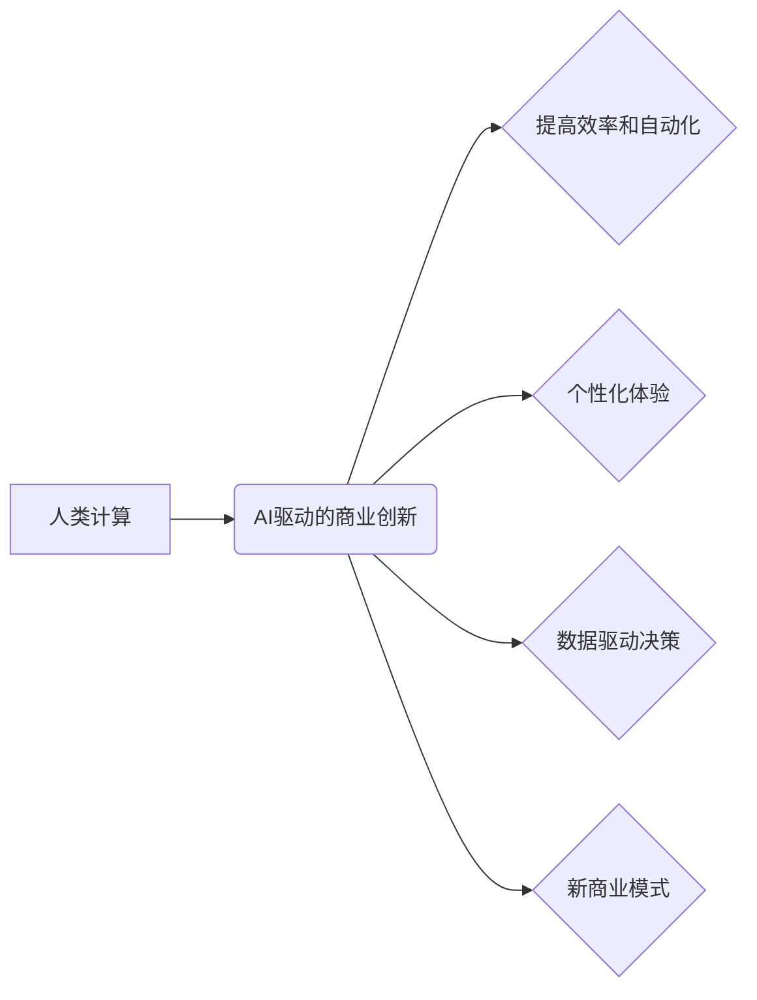

                 

## AI驱动的创新：人类计算在商业中的道德考虑因素与应用趋势预测

> 关键词：人工智能、商业创新、人类计算、道德伦理、应用趋势预测

### 1. 背景介绍

人工智能（AI）正以惊人的速度发展，深刻地改变着我们生活的方方面面。从自动驾驶汽车到个性化医疗，AI技术正在创造前所未有的机遇。在商业领域，AI驱动的创新正在掀起一场革命，企业正在利用AI技术提高效率、降低成本、创造新的商业模式。然而，AI技术的快速发展也引发了广泛的伦理和社会问题，例如算法偏见、数据隐私、工作岗位替代等。

本篇文章将探讨AI驱动的商业创新，重点关注人类计算在其中扮演的角色，以及AI技术应用带来的道德考虑因素和未来趋势预测。

### 2. 核心概念与联系

**2.1 人类计算**

人类计算是指人类参与到计算过程中的行为，包括人类的认知能力、决策能力和创造力。在AI时代，人类计算与机器计算相互补充，共同推动着商业创新。

**2.2 AI驱动的商业创新**

AI驱动的商业创新是指利用AI技术创造新的商业价值，包括：

* **提高效率和自动化:** AI可以自动化重复性任务，释放人力资源，提高工作效率。
* **个性化体验:** AI可以根据用户的行为和偏好提供个性化的产品和服务，提升用户体验。
* **数据驱动决策:** AI可以分析海量数据，帮助企业做出更明智的决策。
* **新商业模式:** AI可以催生新的商业模式，例如共享经济、平台经济等。

**2.3 人类计算与AI驱动的商业创新**

人类计算和AI驱动的商业创新是相互促进的。AI技术可以增强人类计算能力，例如：

* **辅助决策:** AI可以提供数据分析和预测，帮助人类做出更明智的决策。
* **激发创造力:** AI可以提供新的思路和灵感，帮助人类进行创新。
* **提升协作效率:** AI可以帮助人类更好地协作，提高工作效率。

**2.4 核心概念关系图**



### 3. 核心算法原理 & 具体操作步骤

**3.1 算法原理概述**

本节将介绍一种常用的AI算法——深度学习，并阐述其在商业创新中的应用。深度学习是一种机器学习的子领域，它利用多层神经网络来模拟人类大脑的学习过程。通过训练大量的样本数据，深度学习模型可以学习到复杂的模式和特征，从而实现各种任务，例如图像识别、自然语言处理、预测分析等。

**3.2 算法步骤详解**

深度学习算法的具体操作步骤如下：

1. **数据收集和预处理:** 收集大量相关数据，并进行清洗、格式化、特征提取等预处理工作。
2. **网络结构设计:** 根据具体任务需求，设计多层神经网络的结构，包括神经元数量、连接方式、激活函数等。
3. **模型训练:** 使用训练数据训练神经网络模型，通过调整模型参数，使模型的预测结果与真实值尽可能接近。
4. **模型评估:** 使用测试数据评估模型的性能，例如准确率、召回率、F1-score等。
5. **模型部署:** 将训练好的模型部署到实际应用场景中，例如网站、应用程序、嵌入式系统等。

**3.3 算法优缺点**

**优点:**

* **高准确率:** 深度学习模型能够学习到复杂的模式和特征，从而实现高准确率的预测和分类。
* **自动化特征提取:** 深度学习模型可以自动提取数据中的特征，无需人工特征工程。
* **通用性强:** 深度学习模型可以应用于多种不同的任务，例如图像识别、自然语言处理、语音识别等。

**缺点:**

* **数据依赖性强:** 深度学习模型需要大量的训练数据才能达到较高的性能。
* **训练时间长:** 深度学习模型的训练时间通常较长，需要强大的计算资源。
* **可解释性差:** 深度学习模型的内部工作机制比较复杂，难以解释其决策过程。

**3.4 算法应用领域**

深度学习算法在商业领域有着广泛的应用，例如：

* **客户关系管理 (CRM):** 利用深度学习算法分析客户数据，预测客户行为，提供个性化服务。
* **营销推广:** 利用深度学习算法分析用户画像，精准投放广告，提高营销效果。
* **风险管理:** 利用深度学习算法分析金融数据，识别欺诈行为，降低风险。
* **供应链管理:** 利用深度学习算法优化物流配送，提高供应链效率。

### 4. 数学模型和公式 & 详细讲解 & 举例说明

**4.1 数学模型构建**

深度学习模型的核心是多层神经网络。每个神经元接收多个输入信号，并通过权重进行加权求和，然后应用激活函数进行非线性变换，输出一个信号。神经网络的层数和结构决定了模型的复杂度和学习能力。

**4.2 公式推导过程**

深度学习模型的训练过程是通过反向传播算法来进行的。反向传播算法的核心思想是通过计算误差，并反向传播到各层神经元，调整神经元的权重和偏置，使得模型的预测结果与真实值尽可能接近。

**损失函数:** 用于衡量模型预测结果与真实值的差距。常见的损失函数包括均方误差 (MSE)、交叉熵损失 (Cross-Entropy Loss) 等。

**梯度下降:** 用于更新神经元的权重和偏置。梯度下降算法通过计算损失函数的梯度，沿着梯度方向调整权重和偏置，使得损失函数的值不断减小。

**4.3 案例分析与讲解**

假设我们有一个图像分类任务，目标是将图像分类为猫和狗。我们可以使用深度学习模型来实现这个任务。

1. **数据收集和预处理:** 收集大量猫和狗的图像数据，并进行预处理，例如裁剪、缩放、归一化等。
2. **网络结构设计:** 设计一个包含多层卷积神经网络 (CNN) 的模型，用于提取图像特征。
3. **模型训练:** 使用训练数据训练CNN模型，并使用交叉熵损失函数和梯度下降算法进行优化。
4. **模型评估:** 使用测试数据评估模型的性能，例如准确率、召回率等。
5. **模型部署:** 将训练好的模型部署到实际应用场景中，例如手机应用程序、网站等。

### 5. 项目实践：代码实例和详细解释说明

**5.1 开发环境搭建**

本项目使用Python语言和TensorFlow框架进行开发。需要安装Python、TensorFlow和必要的库，例如NumPy、pandas等。

**5.2 源代码详细实现**

```python
import tensorflow as tf

# 定义模型结构
model = tf.keras.models.Sequential([
    tf.keras.layers.Conv2D(32, (3, 3), activation='relu', input_shape=(28, 28, 1)),
    tf.keras.layers.MaxPooling2D((2, 2)),
    tf.keras.layers.Conv2D(64, (3, 3), activation='relu'),
    tf.keras.layers.MaxPooling2D((2, 2)),
    tf.keras.layers.Flatten(),
    tf.keras.layers.Dense(10, activation='softmax')
])

# 编译模型
model.compile(optimizer='adam',
              loss='sparse_categorical_crossentropy',
              metrics=['accuracy'])

# 训练模型
model.fit(x_train, y_train, epochs=10)

# 评估模型
loss, accuracy = model.evaluate(x_test, y_test)
print('Test loss:', loss)
print('Test accuracy:', accuracy)
```

**5.3 代码解读与分析**

这段代码定义了一个简单的卷积神经网络模型，用于图像分类任务。

* `tf.keras.models.Sequential` 创建了一个顺序模型，即层级结构。
* `tf.keras.layers.Conv2D` 定义了一个卷积层，用于提取图像特征。
* `tf.keras.layers.MaxPooling2D` 定义了一个最大池化层，用于降低特征图的尺寸。
* `tf.keras.layers.Flatten` 将多维特征图转换为一维向量。
* `tf.keras.layers.Dense` 定义了一个全连接层，用于分类。
* `model.compile` 编译模型，指定优化器、损失函数和评价指标。
* `model.fit` 训练模型，使用训练数据进行训练。
* `model.evaluate` 评估模型，使用测试数据评估模型的性能。

**5.4 运行结果展示**

训练完成后，可以将模型部署到实际应用场景中，例如手机应用程序、网站等。

### 6. 实际应用场景

**6.1 个性化推荐系统**

AI驱动的个性化推荐系统可以根据用户的行为和偏好，推荐个性化的产品和服务。例如，电商平台可以利用AI算法分析用户的购买历史、浏览记录、评价等数据，推荐用户可能感兴趣的商品。

**6.2 智能客服系统**

AI驱动的智能客服系统可以自动回答用户的常见问题，例如订单查询、退换货等。智能客服系统可以解放人工客服人员，提高服务效率。

**6.3 欺诈检测系统**

AI驱动的欺诈检测系统可以分析金融交易数据，识别异常行为，防止欺诈活动。例如，银行可以利用AI算法分析用户的交易记录，识别可能存在的信用卡欺诈行为。

**6.4 医疗诊断辅助系统**

AI驱动的医疗诊断辅助系统可以帮助医生更快、更准确地诊断疾病。例如，AI算法可以分析医学影像数据，识别肿瘤、骨折等病变。

**6.5 未来应用展望**

随着AI技术的不断发展，其在商业领域的应用将更加广泛和深入。例如：

* **自动驾驶:** AI驱动的自动驾驶汽车将改变交通出行方式，提高道路安全。
* **工业自动化:** AI可以自动化工业生产过程，提高生产效率和降低成本。
* **个性化教育:** AI可以根据学生的学习进度和能力，提供个性化的学习方案。
* **虚拟助手:** AI驱动的虚拟助手将更加智能化，能够更好地帮助人们完成日常任务。

### 7. 工具和资源推荐

**7.1 学习资源推荐**

* **在线课程:** Coursera、edX、Udacity 等平台提供丰富的AI课程。
* **书籍:** 《深度学习》、《机器学习实战》等书籍是学习AI的基础教材。
* **开源项目:** TensorFlow、PyTorch 等开源项目提供了丰富的代码示例和学习资源。

**7.2 开发工具推荐**

* **TensorFlow:** Google开发的开源机器学习框架。
* **PyTorch:** Facebook开发的开源机器学习框架。
* **Keras:** TensorFlow的高级API，易于使用。

**7.3 相关论文推荐**

* **《ImageNet Classification with Deep Convolutional Neural Networks》**
* **《Attention Is All You Need》**
* **《BERT: Pre-training of Deep Bidirectional Transformers for Language Understanding》**

### 8. 总结：未来发展趋势与挑战

**8.1 研究成果总结**

近年来，AI技术取得了长足的进步，在商业领域展现出巨大的潜力。深度学习算法在图像识别、自然语言处理、预测分析等领域取得了突破性进展。

**8.2 未来发展趋势**

* **模型更加强大:** AI模型将更加强大，能够处理更复杂的任务，例如自动驾驶、药物研发等。
* **边缘计算:** AI计算将更加靠近数据源，实现更实时、更高效的处理。
* **跨模态学习:** AI模型将能够处理多种数据类型，例如文本、图像、音频等，实现更全面的理解。

**8.3 面临的挑战**

* **数据隐私:** AI模型训练需要大量数据，如何保护用户数据隐私是一个重要挑战。
* **算法偏见:** AI模型可能存在算法偏见，导致不公平的结果，需要进行算法公平性评估和改进。
* **工作岗位替代:** AI自动化可能导致部分工作岗位被替代，需要进行社会转型和政策调整。

**8.4 研究展望**

未来，AI研究将更加注重伦理、可解释性和安全性。需要开发更加公平、透明、可控的AI算法，并制定相应的法律法规，引导AI技术健康发展。

### 9. 附录：常见问题与解答

**9.1 如何选择合适的AI算法？**

选择合适的AI算法需要根据具体任务需求和数据特点进行选择。例如，图像分类任务可以使用卷积神经网络，文本分类任务可以使用循环神经网络。

**9.2 如何解决AI模型的过拟合问题？**

过拟合是指AI模型在训练数据上表现很好，但在测试数据上表现较差。解决过拟合问题的方法包括：

* 增加训练数据量
* 使用正则化技术
* 使用Dropout技术
* 使用交叉验证

**9.3 如何评估AI模型的性能？**

常用的AI模型性能评估指标包括准确率、召回率、F1-score、AUC等。选择合适的评估指标需要根据具体任务需求进行选择。


作者：禅与计算机程序设计艺术 / Zen and the Art of Computer Programming 
<end_of_turn>

