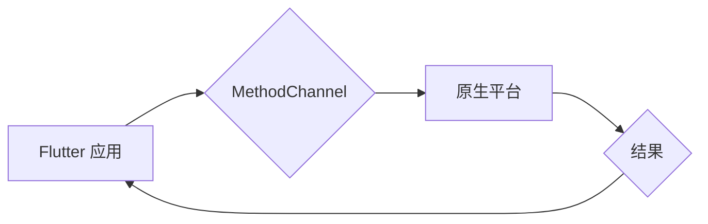

                 

## Flutter跨平台插件开发

> 关键词：Flutter, 跨平台, 插件开发, Native,  Android, iOS,  Dart,  MethodChannel,  EventChannel

## 1. 背景介绍

在当今移动应用开发领域，跨平台开发已经成为一种主流趋势。开发者希望能够用一套代码实现多个平台（如 Android 和 iOS）上的应用，以节省开发时间和成本。Flutter，作为 Google 推出的开源跨平台 UI 框架，凭借其高性能、快速开发和原生美观的用户界面，迅速获得了开发者们的青睐。

然而，Flutter 的原生能力主要集中在 UI 层面，对于需要访问平台特定功能（如相机、定位、蓝牙等）时，就需要借助插件。Flutter 插件可以将原生代码封装成 Dart 库，从而让 Flutter 应用能够访问这些平台特定功能。

## 2. 核心概念与联系

Flutter 插件的核心概念是将原生代码与 Flutter 应用进行桥接，实现数据和功能的交互。

**2.1 插件类型**

Flutter 插件主要分为两种类型：

* **MethodChannel 插件:**  用于单向通信，Flutter 应用向原生平台发送消息，原生平台处理消息并返回结果。
* **EventChannel 插件:** 用于双向通信，Flutter 应用和原生平台可以互相发送消息，实现实时数据交互。

**2.2 插件架构**

Flutter 插件的架构通常包含以下几个部分：

* **Flutter 端:** 使用 Dart 语言编写，负责与 Flutter 应用进行交互，并通过 MethodChannel 或 EventChannel 与原生平台进行通信。
* **原生平台端:** 使用平台原生语言（如 Java/Kotlin 或 Swift/Objective-C）编写，负责处理 Flutter 应用发送的消息，并返回结果或发送事件。
* **桥接层:**  负责 Flutter 端和原生平台端之间的通信，通常由 Flutter 的 runtime 环境提供。

**2.3 Mermaid 流程图**



## 3. 核心算法原理 & 具体操作步骤

### 3.1 算法原理概述

Flutter 插件的核心算法原理是基于消息传递机制，通过 MethodChannel 或 EventChannel 实现 Flutter 应用与原生平台之间的通信。

* **MethodChannel:**  Flutter 应用通过调用 Dart 方法，将消息发送到原生平台，原生平台处理消息并返回结果。
* **EventChannel:** Flutter 应用和原生平台可以互相订阅事件，当事件发生时，会自动触发相应的回调函数。

### 3.2 算法步骤详解

**3.2.1 MethodChannel 插件开发步骤:**

1. 在 Flutter 应用中创建一个 MethodChannel 实例，指定通道名称。
2. 在原生平台端创建一个对应的 MethodChannel 实例，并注册处理消息的回调函数。
3. 在 Flutter 应用中调用 MethodChannel 的方法，发送消息到原生平台。
4. 原生平台接收消息后，执行相应的处理逻辑，并通过 MethodChannel 返回结果。

**3.2.2 EventChannel 插件开发步骤:**

1. 在 Flutter 应用中创建一个 EventChannel 实例，指定通道名称。
2. 在原生平台端创建一个对应的 EventChannel 实例，并注册处理事件的回调函数。
3. 原生平台发送事件到 Flutter 应用，Flutter 应用接收事件并执行相应的处理逻辑。
4. Flutter 应用可以订阅原生平台发送的事件，并接收事件数据。

### 3.3 算法优缺点

**3.3.1 MethodChannel:**

* **优点:**  简单易用，适合单向通信场景。
* **缺点:**  无法实现实时双向通信。

**3.3.2 EventChannel:**

* **优点:**  支持实时双向通信，适合需要实时数据交互的场景。
* **缺点:**  开发相对复杂，需要处理事件订阅和取消订阅逻辑。

### 3.4 算法应用领域

Flutter 插件的应用领域非常广泛，例如：

* **访问平台特定功能:**  例如相机、定位、蓝牙、传感器等。
* **集成第三方库:**  例如支付、地图、广告等。
* **扩展 Flutter 应用功能:**  例如自定义动画、数据存储、网络请求等。

## 4. 数学模型和公式 & 详细讲解 & 举例说明

Flutter 插件的开发与数学模型和公式的应用关系不大，主要依赖于 Dart 语言和平台原生语言的编程能力。

## 5. 项目实践：代码实例和详细解释说明

### 5.1 开发环境搭建

1. 安装 Flutter SDK: https://docs.flutter.dev/get-started/install
2. 安装 Android Studio 或 Xcode: https://developer.android.com/studio/ 或 https://developer.apple.com/xcode/

### 5.2 源代码详细实现

以下是一个简单的 Flutter 插件示例，用于获取设备的电池电量：

**Flutter 端 (lib/battery_plugin.dart):**

```dart
import 'dart:async';

import 'package:flutter/services.dart';

class BatteryPlugin {
  static const MethodChannel _channel = MethodChannel('battery_plugin');

  static Future<int> getBatteryLevel() async {
    final int batteryLevel = await _channel.invokeMethod('getBatteryLevel');
    return batteryLevel;
  }
}
```

**原生平台端 (Android/iOS):**

* **Android:**

```java
package com.example.flutter_battery_plugin;

import io.flutter.embedding.engine.plugins.FlutterPlugin;
import io.flutter.plugin.common.MethodCall;
import io.flutter.plugin.common.MethodChannel;
import io.flutter.plugin.common.MethodChannel.MethodCallHandler;
import io.flutter.plugin.common.PluginRegistry;

import android.content.Context;
import android.content.IntentFilter;
import android.os.BatteryManager;

public class BatteryPlugin implements FlutterPlugin, MethodCallHandler {

    private MethodChannel channel;
    private BatteryLevelListener batteryLevelListener;

    @Override
    public void onAttachedToEngine(FlutterPluginBinding binding) {
        channel = new MethodChannel(binding.getBinaryMessenger(), "battery_plugin");
        channel.setMethodCallHandler(this);
    }

    @Override
    public void onDetachedFromEngine(@NonNull FlutterPluginBinding binding) {
        channel.setMethodCallHandler(null);
    }

    @Override
    public void onMethodCall(MethodCall call, MethodChannel.Result result) {
        if (call.method == "getBatteryLevel") {
            int batteryLevel = getBatteryLevel();
            result.success(batteryLevel);
        } else {
            result.notImplemented();
        }
    }

    private int getBatteryLevel() {
        int batteryLevel = 0;
        BatteryManager batteryManager = (BatteryManager) getContext().getSystemService(Context.BATTERY_SERVICE);
        if (batteryManager != null) {
            batteryLevel = batteryManager.getIntProperty(BatteryManager.BATTERY_PROPERTY_CAPACITY);
        }
        return batteryLevel;
    }

    private Context getContext() {
        return channel.getArguments().get("context");
    }
}
```

* **iOS:**

```swift
import Flutter

class BatteryPlugin: NSObject, FlutterPlugin {

    static func register(with registrar: FlutterPluginRegistrar) {
        let channel = FlutterMethodChannel(name: "battery_plugin", binaryMessenger: registrar.messenger())
        let instance = BatteryPlugin()
        registrar.addMethodCallDelegate(instance, channel: channel)
    }

    func handle(_ call: FlutterMethodCall, result: @escaping FlutterResult) {
        if call.method == "getBatteryLevel" {
            let batteryLevel = getBatteryLevel()
            result(batteryLevel)
        } else {
            result(FlutterMethodNotImplemented)
        }
    }

    func getBatteryLevel() -> Int {
        let level = UIDevice.current.batteryLevel
        return Int(level * 100)
    }
}
```

### 5.3 代码解读与分析

* **Flutter 端:**  `BatteryPlugin` 类定义了一个 `getBatteryLevel` 方法，通过 `MethodChannel` 向原生平台发送消息，请求获取电池电量。
* **原生平台端:**  Android 和 iOS 端分别实现了 `BatteryPlugin` 类，通过 `BatteryManager` 和 `UIDevice` 获取电池电量，并通过 `MethodChannel` 返回结果给 Flutter 应用。

### 5.4 运行结果展示

运行 Flutter 应用后，调用 `BatteryPlugin.getBatteryLevel()` 方法，可以获取设备的电池电量百分比。

## 6. 实际应用场景

Flutter 插件的应用场景非常广泛，例如：

* **访问平台特定功能:**  例如相机、定位、蓝牙、传感器等。
* **集成第三方库:**  例如支付、地图、广告等。
* **扩展 Flutter 应用功能:**  例如自定义动画、数据存储、网络请求等。

## 7. 工具和资源推荐

### 7.1 学习资源推荐

* **Flutter 官方文档:** https://docs.flutter.dev/
* **Flutter 插件开发指南:** https://docs.flutter.dev/development/platform-integration/plugins
* **Flutter 社区论坛:** https://flutter.dev/community

### 7.2 开发工具推荐

* **Android Studio:** https://developer.android.com/studio/
* **Xcode:** https://developer.apple.com/xcode/

### 7.3 相关论文推荐

* **Flutter: A Framework for Building Native Mobile Apps with a Single Codebase:** https://arxiv.org/abs/1705.08387

## 8. 总结：未来发展趋势与挑战

Flutter 插件开发是一个快速发展的领域，未来发展趋势包括：

* **更强大的跨平台支持:**  Flutter 将继续支持更多平台，例如 Web、桌面等。
* **更丰富的插件生态:**  越来越多的开发者将开发 Flutter 插件，丰富 Flutter 应用的功能。
* **更智能的插件管理:**  Flutter 将提供更智能的插件管理工具，帮助开发者更方便地管理和使用插件。

Flutter 插件开发也面临一些挑战，例如:

* **原生代码的兼容性:**  不同平台的原生代码兼容性问题需要仔细处理。
* **插件性能优化:**  一些插件可能会影响 Flutter 应用的性能，需要进行优化。
* **插件安全问题:**  需要确保 Flutter 插件的安全性和可靠性。

## 9. 附录：常见问题与解答

* **Q: 如何发布 Flutter 插件？**

A: Flutter 插件可以通过 Flutter 的插件仓库发布，例如 pub.dev。

* **Q: 如何调试 Flutter 插件？**

A: 可以使用 Flutter 的调试工具，例如 Flutter DevTools，来调试 Flutter 插件。

* **Q: Flutter 插件的安全性如何保证？**

A: Flutter 插件的安全性可以通过代码审查、测试和使用安全的插件库来保证。


作者：禅与计算机程序设计艺术 / Zen and the Art of Computer Programming 
<end_of_turn>

