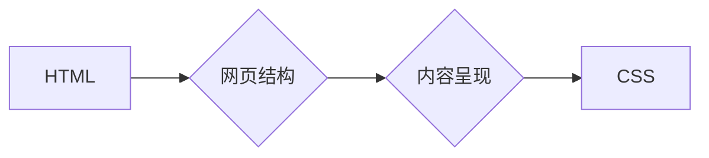

                 

## 1. 背景介绍

随着互联网的蓬勃发展，网页设计和开发成为越来越重要的技能。想要在网络世界中留下自己的印记，无论是个人博客、企业网站还是电商平台，都需要具备扎实的网页制作基础。HTML 和 CSS 是构成网页的基石，掌握它们将开启你进入网页开发世界的门户。

HTML（HyperText Markup Language）是网页的结构语言，它定义了网页内容的层次结构、文本、图像、链接等元素。CSS（Cascading Style Sheets）则是网页的样式语言，它用来控制网页元素的布局、颜色、字体、间距等视觉效果。

## 2. 核心概念与联系

### 2.1 HTML

HTML 使用标记语言来描述网页内容，标记由尖括号 `<>` 包裹，例如 `<h1>` 表示标题一级， `<p>` 表示段落。HTML 文档由一系列标记组成，这些标记嵌套在一起，形成网页的层次结构。

### 2.2 CSS

CSS 通过选择器选择 HTML 元素，然后使用属性和值来定义其样式。选择器可以根据元素的标签名、类名、ID 等属性进行匹配。属性和值则用来指定元素的具体样式，例如颜色、字体、大小、间距等。

### 2.3 关系

HTML 和 CSS 协同工作，共同构建网页。HTML 提供网页结构，CSS 则负责网页的视觉呈现。

**Mermaid 流程图**



## 3. 核心算法原理 & 具体操作步骤

### 3.1 算法原理概述

HTML 和 CSS 虽然不是传统的算法，但它们遵循一定的规则和语法，可以看作是网页构建的“算法”。

HTML 的算法原理是基于标记语言的嵌套结构，通过标记定义元素的类型和层次关系，最终形成网页的结构树。CSS 的算法原理则是基于选择器匹配和样式应用，通过选择器选择目标元素，然后根据样式规则应用相应的属性值，最终实现网页的视觉效果。

### 3.2 算法步骤详解

**HTML 算法步骤**

1. 定义 HTML 文档的根元素 `<html>`.
2. 在根元素下定义 `<head>` 和 `<body>` 元素。
3. 在 `<head>` 元素中定义网页的元信息，例如标题、字符集等。
4. 在 `<body>` 元素中定义网页的内容，例如标题、段落、图像、链接等。
5. 使用标记语言定义元素的类型和层次关系，形成网页的结构树。

**CSS 算法步骤**

1. 定义 CSS 规则，规则由选择器、属性和值组成。
2. 选择器匹配目标元素。
3. 根据样式规则应用属性值，修改元素的样式。

### 3.3 算法优缺点

**HTML 算法优点**

* 语法简单易懂。
* 结构清晰，易于维护。
* 广泛支持，几乎所有浏览器都能解析 HTML。

**HTML 算法缺点**

* 表现力有限，无法实现复杂的视觉效果。
* 需要配合 CSS 使用才能达到理想的效果。

**CSS 算法优点**

* 表现力强，可以实现丰富的视觉效果。
* 可复用性高，可以定义多个样式规则，并应用于多个元素。
* 样式分离，可以将样式和内容分开管理，提高代码的可维护性。

**CSS 算法缺点**

* 语法相对复杂，需要一定的学习成本。
* 样式冲突可能导致网页显示异常。

### 3.4 算法应用领域

HTML 和 CSS 是网页开发的基础，广泛应用于各种领域，例如：

* **网站建设:** 建立个人博客、企业网站、电商平台等。
* **移动应用开发:** 开发移动网页应用。
* **图形设计:** 使用 HTML 和 CSS 创建交互式图形和动画。
* **游戏开发:** 使用 HTML5 和 CSS3 开发简单的网页游戏。

## 4. 数学模型和公式 & 详细讲解 & 举例说明

### 4.1 数学模型构建

HTML 和 CSS 的数学模型主要涉及到布局、尺寸和间距的计算。

**布局模型:**

* **盒模型:**  每个 HTML 元素都被视为一个盒子，包含内容、边框、内边距和外边距。盒模型的尺寸计算涉及到这些不同部分的宽度和高度。

**尺寸和间距:**

* **像素 (px):**  最基本的单位，表示物理尺寸。
* **百分比 (%):**  相对于父元素的尺寸。
* **视窗单位 (vw, vh):**  相对于浏览器视窗的尺寸。
* **相对单位 (em, rem):**  相对于字体大小的尺寸。

### 4.2 公式推导过程

**盒模型公式:**

```
元素宽度 = 内容宽度 + 内边距 + 边框宽度 + 外边距
元素高度 = 内容高度 + 内边距 + 边框高度 + 外边距
```

**百分比尺寸计算:**

```
元素宽度 = 父元素宽度 * 百分比值 / 100
```

### 4.3 案例分析与讲解

**案例:**

一个宽度为 300px 的父元素，包含一个子元素，子元素的宽度设置为 50%。

**计算:**

子元素宽度 = 300px * 50% / 100 = 150px

**解释:**

子元素的宽度等于父元素宽度的 50%。

## 5. 项目实践：代码实例和详细解释说明

### 5.1 开发环境搭建

* **文本编辑器:**  例如 Sublime Text, Atom, VS Code 等。
* **浏览器:**  例如 Chrome, Firefox, Safari 等。

### 5.2 源代码详细实现

```html
<!DOCTYPE html>
<html>
<head>
  <title>HTML 和 CSS 基础</title>
  <style>
    body {
      font-family: sans-serif;
      margin: 0;
      padding: 0;
    }

    h1 {
      text-align: center;
      color: blue;
    }

    p {
      margin: 20px;
      padding: 10px;
      border: 1px solid #ccc;
    }
  </style>
</head>
<body>
  <h1>我的第一个网页</h1>
  <p>这是一个简单的 HTML 和 CSS 示例。</p>
</body>
</html>
```

### 5.3 代码解读与分析

* **HTML 部分:**
    * `<!DOCTYPE html>`:  声明文档类型为 HTML5。
    * `<html>`:  根元素，包含整个网页内容。
    * `<head>`:  包含网页元信息，例如标题、字符集等。
    * `<title>`:  设置网页标题。
    * `<style>`:  包含 CSS 样式规则。
    * `<body>`:  包含网页可视内容。
    * `<h1>`:  表示标题一级。
    * `<p>`:  表示段落。

* **CSS 部分:**
    * `body`:  选择所有 `<body>` 元素，设置字体、边距和内边距。
    * `h1`:  选择所有 `<h1>` 元素，设置文本对齐方式和颜色。
    * `p`:  选择所有 `<p>` 元素，设置边距、内边距和边框。

### 5.4 运行结果展示

运行上述代码，在浏览器中将显示一个标题为 "我的第一个网页" 的网页，包含一个蓝色标题和一个带边框的段落。

## 6. 实际应用场景

HTML 和 CSS 在网页开发中有着广泛的应用场景，例如：

* **网站布局:**  使用 HTML 定义网页结构，使用 CSS 控制元素的布局和样式，例如导航栏、主内容区域、侧边栏等。
* **网页交互:**  使用 HTML 定义交互元素，例如按钮、链接、表单等，使用 CSS 控制交互元素的样式和状态变化。
* **网页动画:**  使用 CSS3 动画特性实现网页元素的动画效果，例如滚动、淡入淡出、旋转等。

### 6.4 未来应用展望

随着 Web 技术的不断发展，HTML 和 CSS 将会继续演进，并应用于更多领域，例如：

* **移动端开发:**  HTML5 和 CSS3 为移动端开发提供了强大的工具，可以开发更加丰富的移动网页应用。
* **虚拟现实 (VR) 和增强现实 (AR):**  HTML 和 CSS 可以用于构建 VR 和 AR 体验，例如虚拟场景、交互式模型等。
* **物联网 (IoT):**  HTML 和 CSS 可以用于开发物联网设备的界面，例如智能家居设备、穿戴设备等。

## 7. 工具和资源推荐

### 7.1 学习资源推荐

* **Mozilla Developer Network (MDN):**  https://developer.mozilla.org/en-US/
* **W3Schools:**  https://www.w3schools.com/
* **CSS-Tricks:**  https://css-tricks.com/

### 7.2 开发工具推荐

* **Sublime Text:**  https://www.sublimetext.com/
* **Atom:**  https://atom.io/
* **VS Code:**  https://code.visualstudio.com/

### 7.3 相关论文推荐

* **HTML5: The Definitive Guide:**  https://www.oreilly.com/library/view/html5-the-definitive/9781449328005/
* **CSS Secrets:**  https://css-secrets.com/

## 8. 总结：未来发展趋势与挑战

### 8.1 研究成果总结

HTML 和 CSS 是网页开发的基础，经过多年的发展，已经形成了完善的规范和生态系统。它们为网页开发提供了强大的工具和技术，使得网页可以更加丰富、交互和美观。

### 8.2 未来发展趋势

* **更强大的功能:**  HTML 和 CSS 将会继续添加新的功能，例如更丰富的动画效果、更强大的布局能力、更完善的交互特性等。
* **更良好的用户体验:**  HTML 和 CSS 将会更加注重用户体验，例如更易于阅读的文本、更流畅的动画、更便捷的交互等。
* **更广泛的应用:**  HTML 和 CSS 将会应用于更多领域，例如移动端开发、虚拟现实、增强现实等。

### 8.3 面临的挑战

* **兼容性问题:**  不同浏览器对 HTML 和 CSS 的支持程度不同，需要不断解决兼容性问题。
* **性能优化:**  随着网页越来越复杂，性能优化成为一个重要的挑战。
* **安全问题:**  HTML 和 CSS 可能会被用于攻击网站，需要加强安全防护。

### 8.4 研究展望

未来，HTML 和 CSS 将会继续发展，并与其他 Web 技术融合，为用户提供更加丰富的、交互性和美观的网页体验。


## 9. 附录：常见问题与解答

**常见问题:**

* **如何解决 HTML 和 CSS 的兼容性问题?**

**解答:**

可以使用 CSS 预处理器，例如 Sass 或 Less，来编写更简洁的 CSS 代码，并自动生成兼容不同浏览器的 CSS 代码。

* **如何优化 HTML 和 CSS 的性能?**

**解答:**

可以使用压缩工具压缩 HTML 和 CSS 文件，减少文件大小。可以使用 CSS 优化工具，例如 CSSNano，来删除冗余的 CSS 代码。可以使用图片优化工具，例如 TinyPNG，来压缩图片文件大小。

* **如何学习 HTML 和 CSS?**

**解答:**

可以使用在线学习资源，例如 MDN 和 W3Schools，学习 HTML 和 CSS 的基础知识。可以使用书籍和教程，深入学习 HTML 和 CSS 的高级知识。


作者：禅与计算机程序设计艺术 / Zen and the Art of Computer Programming 


<end_of_turn>

