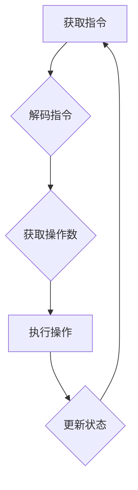

                 

## x86 架构编程：Intel 处理器的优势

> 关键词：x86 架构, Intel 处理器, CPU, 编程, 性能优化, 指令集, 寄存器, 缓存, 虚拟化

## 1. 背景介绍

x86 架构是目前全球最广泛使用的处理器架构之一，由 Intel 公司率先开发并推广。自诞生以来，x86 架构经历了数十年的发展，不断演进，形成了庞大的生态系统，涵盖了从个人电脑到服务器、嵌入式系统等各个领域。

对于程序员而言，深入理解 x86 架构是提高编程效率、优化程序性能的关键。本文将深入探讨 x86 架构的原理、特点以及编程技巧，帮助读者掌握 x86 架构编程的精髓，提升程序开发能力。

## 2. 核心概念与联系

### 2.1  x86 架构概述

x86 架构是一种基于 CISC（复杂指令集计算机）的指令集架构，其核心特点是指令集丰富、灵活，能够执行复杂的计算操作。x86 架构的指令集经过多年的发展，形成了一个庞大的体系，涵盖了各种数据处理、控制流、内存访问等操作。

### 2.2  x86 处理器结构

x86 处理器主要由以下几个核心部件组成：

* **控制单元 (CU):** 负责执行指令，控制处理器各个部件的工作。
* **算术逻辑单元 (ALU):** 负责执行算术和逻辑运算。
* **寄存器组:** 用于存储指令、数据和中间结果。
* **缓存:** 用于高速缓存最近访问的数据，提高数据访问速度。
* **内存控制器:** 控制与内存的交互。

### 2.3  指令执行流程

x86 处理器的指令执行流程可以概括为以下步骤：

1. **获取指令:** 控制单元从内存中获取下一条指令。
2. **解码指令:** 控制单元解码指令，确定指令的操作类型和操作数。
3. **获取操作数:** 控制单元根据指令的操作数，从寄存器或内存中获取操作数。
4. **执行操作:** ALU 执行指令的操作，并将结果存储到寄存器或内存中。
5. **更新状态:** 控制单元更新处理器状态寄存器，反映指令执行的结果。

### 2.4  Mermaid 流程图



## 3. 核心算法原理 & 具体操作步骤

### 3.1  算法原理概述

x86 架构编程的核心算法原理在于充分利用 x86 处理器的指令集和硬件特性，进行高效的程序设计。

### 3.2  算法步骤详解

1. **选择合适的指令集:** 根据程序的具体需求，选择最合适的 x86 指令集，例如 SSE 指令集用于浮点运算加速，AVX 指令集用于并行计算加速。
2. **优化数据访问:** 尽量减少内存访问次数，利用寄存器存储频繁访问的数据，减少数据从内存到寄存器之间的传输时间。
3. **利用缓存机制:** 充分利用 CPU 的缓存机制，将经常访问的数据存储在高速缓存中，提高数据访问速度。
4. **并行化计算:** 对于可以并行执行的计算任务，利用 x86 处理器的多核特性，进行并行计算，提高程序执行效率。

### 3.3  算法优缺点

* **优点:** 
    * 充分利用 x86 处理器的硬件特性，提高程序性能。
    * 能够实现更精细的程序控制，提高程序的灵活性。
* **缺点:** 
    * 需要深入了解 x86 架构的原理，学习大量的指令集和编程技巧。
    * 程序代码可能比较复杂，维护难度较高。

### 3.4  算法应用领域

* **游戏开发:** 利用 x86 架构的并行计算能力，提高游戏渲染速度和帧率。
* **科学计算:** 利用 x86 架构的高性能计算能力，加速科学计算任务的执行。
* **人工智能:** 利用 x86 架构的强大计算能力，加速人工智能算法的训练和推理。

## 4. 数学模型和公式 & 详细讲解 & 举例说明

### 4.1  数学模型构建

在 x86 架构编程中，我们可以使用数学模型来分析程序的性能，例如：

* **指令时钟周期 (IPC):** 指示每条指令执行所需的时钟周期数。
* **程序执行时间 (T):** 指示程序执行所需的时间，可以表示为 T = N * IPC * Clock Cycle，其中 N 为指令总数，Clock Cycle 为时钟周期。

### 4.2  公式推导过程

* **IPC 优化:** 为了提高程序性能，我们可以通过优化指令集、减少内存访问次数等方式来提高 IPC 值。
* **并行化计算:** 通过并行化计算，我们可以将多个任务同时执行，从而缩短程序执行时间。

### 4.3  案例分析与讲解

假设一个程序需要执行 1000 条指令，每条指令需要 2 个时钟周期执行，CPU 的时钟频率为 3 GHz。

* **未优化程序:** 程序执行时间 T = 1000 * 2 * (1/3000) = 0.67 ms。
* **优化程序:** 通过优化指令集，将 IPC 值提高到 2.5，则程序执行时间 T = 1000 * 2.5 * (1/3000) = 0.83 ms。

## 5. 项目实践：代码实例和详细解释说明

### 5.1  开发环境搭建

* 操作系统: Windows 10 或 Linux
* 编译器: GCC 或 Clang
* 调试工具: GDB 或 LLDB

### 5.2  源代码详细实现

```c
#include <stdio.h>

int main() {
    int i;
    for (i = 0; i < 1000000; i++) {
        // 简单的加法运算
        int a = i + 1;
    }
    printf("程序执行完成\n");
    return 0;
}
```

### 5.3  代码解读与分析

这段代码是一个简单的循环程序，用于计算 1 到 1000000 的和。

* `for` 循环: 用于重复执行代码块。
* `int a = i + 1;`: 简单的加法运算，将 `i` 加 1 赋值给变量 `a`。

### 5.4  运行结果展示

程序运行后，会输出 "程序执行完成" 的信息。

## 6. 实际应用场景

x86 架构编程广泛应用于各种领域，例如：

* **操作系统开发:** 操作系统内核需要充分利用 x86 处理器的硬件特性，实现高效的资源管理和进程调度。
* **数据库系统:** 数据库系统需要处理海量数据，需要利用 x86 架构的强大计算能力进行数据查询和更新。
* **网络应用:** 网络应用需要处理大量的网络数据包，需要利用 x86 架构的并行计算能力进行数据处理。

### 6.4  未来应用展望

随着 x86 架构的不断发展，未来将会有更多新的应用场景出现，例如：

* **云计算:** x86 架构将成为云计算平台的核心处理器架构。
* **人工智能:** x86 架构将成为人工智能算法训练和推理的平台。
* **物联网:** x86 架构将被应用于各种物联网设备，实现智能化控制和数据分析。

## 7. 工具和资源推荐

### 7.1  学习资源推荐

* **Intel 编程指南:** https://www.intel.com/content/www/us/en/developer/articles/technical/programming-guide.html
* **x86 架构参考手册:** https://www.intel.com/content/www/us/en/docs/processors/architectures-software-developer-manuals.html

### 7.2  开发工具推荐

* **GCC 编译器:** https://gcc.gnu.org/
* **Clang 编译器:** https://clang.llvm.org/
* **GDB 调试器:** https://sourceware.org/gdb/
* **LLDB 调试器:** https://lldb.llvm.org/

### 7.3  相关论文推荐

* **The x86 Architecture:** https://www.amazon.com/x86-Architecture-Jonathan-Corbet/dp/0132148491
* **Computer Organization and Design:** https://www.amazon.com/Computer-Organization-Design-The-Hardware/dp/0132828184

## 8. 总结：未来发展趋势与挑战

### 8.1  研究成果总结

x86 架构编程已经取得了巨大的成就，为现代计算机技术的发展做出了重要贡献。

### 8.2  未来发展趋势

* **多核化:** x86 处理器将继续朝着多核化方向发展，并行计算能力将得到进一步提升。
* **虚拟化:** x86 处理器将继续支持虚拟化技术，实现资源共享和安全隔离。
* **人工智能:** x86 处理器将成为人工智能算法训练和推理的平台，推动人工智能技术的发展。

### 8.3  面临的挑战

* **功耗:** 随着 x86 处理器性能的提升，功耗问题也越来越突出。
* **安全性:** 随着 x86 处理器的复杂性增加，安全漏洞也随之增加。
* **可编程性:** 如何提高 x86 处理器的可编程性，使其能够更好地支持新兴的计算模型，是未来需要解决的挑战。

### 8.4  研究展望

未来 x86 架构编程的研究方向将集中在以下几个方面:

* **低功耗设计:** 研究低功耗的 x86 处理器架构和编程技术。
* **安全增强:** 研究提高 x86 处理器安全性的技术和方法。
* **新计算模型支持:** 研究支持新兴计算模型，例如量子计算和神经网络计算的 x86 处理器架构和编程技术。

## 9. 附录：常见问题与解答

### 9.1  常见问题

* **如何提高 x86 程序的性能？**

可以通过优化指令集、减少内存访问次数、利用缓存机制、并行化计算等方式提高 x86 程序的性能。

* **如何调试 x86 程序？**

可以使用 GDB 或 LLDB 等调试工具来调试 x86 程序。

* **x86 架构的未来发展趋势是什么？**

x86 架构将继续朝着多核化、虚拟化、人工智能等方向发展。

### 9.2  解答

* **如何学习 x86 架构编程？**

可以参考 Intel 编程指南、x86 架构参考手册等学习资源，并通过实践练习来掌握 x86 架构编程的技巧。


作者：禅与计算机程序设计艺术 / Zen and the Art of Computer Programming 
<end_of_turn>

