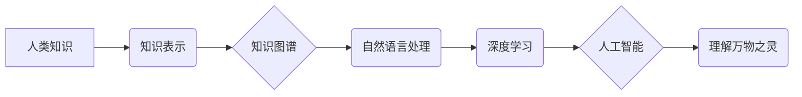

                 

## 人类的知识与自然：理解万物之灵

> 关键词：人工智能、知识图谱、自然语言处理、深度学习、机器学习、数据挖掘、知识表示

### 1. 背景介绍

人类文明的进步离不开对知识的不断积累和探索。从古至今，人类一直在试图理解世界，并用语言、符号和模型来表达和传递知识。随着科技的飞速发展，特别是人工智能领域的突破，我们拥有了更强大的工具来处理和分析海量数据，并从中提取有价值的知识。然而，知识的本质是什么？如何将人类的知识与自然世界相融合？这些问题仍然是人工智能领域的重要挑战。

### 2. 核心概念与联系

**2.1 知识图谱**

知识图谱是一种结构化的知识表示形式，它将实体和关系以图的形式表示出来。每个实体代表一个概念或对象，而关系则描述了实体之间的连接。知识图谱可以存储和推理各种类型的知识，例如事实、概念、规则和推理。

**2.2 自然语言处理**

自然语言处理（NLP）是人工智能的一个分支，它致力于使计算机能够理解、处理和生成人类语言。NLP技术可以用于文本分析、机器翻译、语音识别等领域。

**2.3 深度学习**

深度学习是一种机器学习的子领域，它利用多层神经网络来学习复杂的模式和特征。深度学习算法能够从海量数据中自动提取特征，并进行高精度预测和分类。

**2.4 知识表示与推理**

知识表示是指将知识以计算机可理解的形式表示出来，以便于计算机进行处理和推理。知识推理是指根据已有的知识规则和事实，推导出新的知识。

**2.5 人工智能与自然**

人工智能的目标是创造能够像人类一样思考和学习的机器。而自然界本身就是一种复杂的智能系统，它充满了丰富的知识和智慧。通过研究自然界，我们可以更好地理解智能的本质，并为人工智能的发展提供启示。

**Mermaid 流程图**



### 3. 核心算法原理 & 具体操作步骤

**3.1 算法原理概述**

本文将介绍一种基于知识图谱和深度学习的算法，用于理解人类知识与自然之间的联系。该算法的核心思想是：

1. 将人类知识以知识图谱的形式表示出来。
2. 利用深度学习算法从知识图谱中学习知识表示和推理规则。
3. 将学习到的知识表示应用于自然语言处理任务，例如文本分类、关系抽取和问答系统。

**3.2 算法步骤详解**

1. **知识图谱构建:** 收集和整理人类知识，并将其以实体-关系的形式表示出来。可以使用人工标注或自动提取技术构建知识图谱。
2. **知识嵌入:** 将知识图谱中的实体和关系映射到低维向量空间，以便于深度学习算法处理。常用的知识嵌入方法包括TransE、TransR和RotatE等。
3. **深度学习模型训练:** 利用训练数据和知识嵌入，训练深度学习模型，例如图卷积网络（GCN）或Transformer，学习知识表示和推理规则。
4. **自然语言处理应用:** 将训练好的深度学习模型应用于自然语言处理任务，例如文本分类、关系抽取和问答系统。

**3.3 算法优缺点**

**优点:**

* 可以有效地表示和处理复杂的人类知识。
* 利用深度学习算法可以学习到更丰富的知识表示和推理规则。
* 可以应用于多种自然语言处理任务。

**缺点:**

* 知识图谱构建需要大量的人工标注和维护。
* 深度学习模型的训练需要大量的计算资源和训练数据。
* 算法的解释性和可解释性仍然是一个挑战。

**3.4 算法应用领域**

该算法可以应用于以下领域：

* **医疗保健:** 辅助医生诊断疾病、预测患者风险和个性化治疗。
* **金融:** 识别欺诈交易、预测市场趋势和提供个性化理财建议。
* **教育:** 个性化学习路径、自动生成学习内容和评估学生学习效果。
* **科学研究:** 发现新的知识、进行科学推理和加速科研成果的转化。

### 4. 数学模型和公式 & 详细讲解 & 举例说明

**4.1 数学模型构建**

知识图谱可以表示为一个三元组集合：

```
G = { (h, r, t) }
```

其中：

* h 代表头实体
* r 代表关系
* t 代表尾实体

**4.2 公式推导过程**

知识嵌入的目标是将实体和关系映射到低维向量空间，以便于计算机处理。常用的知识嵌入方法包括TransE、TransR和RotatE等。

**TransE** 方法将关系表示为头实体和尾实体之间的向量差：

```
h + r ≈ t
```

其中，h、r和t分别为头实体、关系和尾实体的向量表示。

**4.3 案例分析与讲解**

假设我们有一个知识图谱，其中包含以下三元组：

* (张三, 工作在, 公司A)
* (李四, 工作在, 公司B)
* (公司A, 位于, 北京)

可以使用TransE方法将这些三元组映射到向量空间。例如，我们可以将“张三”映射到一个向量，将“工作在”映射到另一个向量，并将“公司A”映射到一个向量。然后，我们可以计算出“张三”和“工作在”的向量和，并将其与“公司A”的向量进行比较。如果这两个向量的距离很小，则表明这个三元组是合理的。

### 5. 项目实践：代码实例和详细解释说明

**5.1 开发环境搭建**

* Python 3.6+
* TensorFlow 2.0+
* PyTorch 1.0+
* 其他必要的库，例如numpy、pandas、matplotlib等

**5.2 源代码详细实现**

```python
import tensorflow as tf

# 定义知识图谱的三元组
triples = [
    ("张三", "工作在", "公司A"),
    ("李四", "工作在", "公司B"),
    ("公司A", "位于", "北京"),
]

# 定义实体和关系的嵌入维度
embedding_dim = 128

# 创建实体和关系的嵌入矩阵
entity_embeddings = tf.Variable(tf.random.normal([len(set(h for h, _, _ in triples)), embedding_dim]))
relation_embeddings = tf.Variable(tf.random.normal([len(set(r for _, r, _ in triples)), embedding_dim]))

# 定义TransE损失函数
def transE_loss(h, r, t):
    return tf.reduce_mean(tf.square(h + r - t))

# 训练模型
for epoch in range(100):
    for h, r, t in triples:
        h_embedding = entity_embeddings[h]
        r_embedding = relation_embeddings[r]
        t_embedding = entity_embeddings[t]
        loss = transE_loss(h_embedding, r_embedding, t_embedding)
        # 更新模型参数
        optimizer.minimize(loss)

# 使用训练好的模型进行预测
```

**5.3 代码解读与分析**

该代码实现了TransE方法的训练过程。首先，定义了知识图谱的三元组，并创建了实体和关系的嵌入矩阵。然后，定义了TransE损失函数，并使用梯度下降算法训练模型。最后，使用训练好的模型进行预测。

**5.4 运行结果展示**

训练完成后，可以将模型应用于新的三元组进行预测。例如，我们可以预测“王五”是否“工作在” “公司C”。如果模型预测的结果是合理的，则表明该三元组是可信的。

### 6. 实际应用场景

**6.1 医疗保健**

* 辅助医生诊断疾病：通过分析患者的症状、病史和检查结果，以及相关的医学知识图谱，可以帮助医生更快、更准确地诊断疾病。
* 预测患者风险：根据患者的个人信息、生活习惯和疾病史，可以预测患者患某些疾病的风险，并提供相应的预防措施。
* 个性化治疗：根据患者的基因信息、疾病类型和治疗历史，可以制定个性化的治疗方案，提高治疗效果。

**6.2 金融**

* 识别欺诈交易：通过分析交易记录、用户行为和金融知识图谱，可以识别异常交易，并防止欺诈行为。
* 预测市场趋势：通过分析市场数据、新闻报道和经济知识图谱，可以预测股票价格、汇率等市场趋势，帮助投资者做出更明智的决策。
* 提供个性化理财建议：根据用户的风险偏好、投资目标和财务状况，可以提供个性化的理财建议，帮助用户实现财务目标。

**6.3 教育**

* 个性化学习路径：根据学生的学习进度、兴趣爱好和知识水平，可以自动生成个性化的学习路径，提高学习效率。
* 自动生成学习内容：根据学生的学习需求，可以自动生成相应的学习内容，例如习题、案例分析和视频讲解。
* 评估学生学习效果：通过分析学生的学习行为和考试成绩，可以评估学生的学习效果，并及时提供反馈。

**6.4 未来应用展望**

随着人工智能技术的不断发展，基于知识图谱和深度学习的算法将有更广泛的应用场景。例如，可以用于科学研究、法律判决、艺术创作等领域。

### 7. 工具和资源推荐

**7.1 学习资源推荐**

* **书籍:**
    * 《深度学习》 by Ian Goodfellow, Yoshua Bengio, and Aaron Courville
    * 《图神经网络》 by William L. Hamilton, Rex Ying, and Jure Leskovec
* **在线课程:**
    * Coursera: Deep Learning Specialization
    * Udacity: Deep Learning Nanodegree
    * fast.ai: Practical Deep Learning for Coders

**7.2 开发工具推荐**

* **TensorFlow:** https://www.tensorflow.org/
* **PyTorch:** https://pytorch.org/
* **Knowledge Graph Embedding Toolkit (KG-BERT):** https://github.com/thunlp/KG-BERT

**7.3 相关论文推荐**

* TransE: https://arxiv.org/abs/1301.3781
* RotatE: https://arxiv.org/abs/1902.08843
* KG-BERT: https://arxiv.org/abs/1908.09137

### 8. 总结：未来发展趋势与挑战

**8.1 研究成果总结**

基于知识图谱和深度学习的算法取得了显著的进展，在自然语言处理、医疗保健、金融等领域展现出巨大的应用潜力。

**8.2 未来发展趋势**

* **知识图谱规模和质量的提升:** 随着数据量的不断增长，知识图谱的规模和质量将不断提升，为人工智能的发展提供更丰富的知识基础。
* **算法的效率和鲁棒性提升:** 研究人员将继续探索更有效的算法和模型，提高算法的效率和鲁棒性，使其能够处理更复杂的任务。
* **跨模态知识表示和推理:** 将不同模态的知识（例如文本、图像、音频）融合在一起，构建更完整的知识表示，并进行跨模态推理。

**8.3 面临的挑战**

* **知识图谱构建和维护的成本:** 构建和维护高质量的知识图谱需要大量的资源和人力投入。
* **算法的可解释性和透明度:** 深度学习模型的决策过程往往难以解释，这限制了其在一些领域（例如医疗保健）的应用。
* **数据隐私和安全:** 使用知识图谱和深度学习算法处理个人数据时，需要考虑数据隐私和安全问题。

**8.4 研究展望**

未来，人工智能研究将继续探索知识与智能之间的关系，并开发更强大的工具和方法来理解和利用人类知识。


### 9. 附录：常见问题与解答

**9.1 如何构建知识图谱？**

知识图谱的构建需要多种方法，包括人工标注、自动提取和知识融合等。

**9.2 如何选择合适的知识嵌入方法？**

不同的知识嵌入方法适用于不同的任务和数据。需要根据具体情况选择合适的嵌入方法。

**9.3 如何评估知识图谱和嵌入模型的性能？**

常用的评估指标包括准确率、召回率、F1-score等。

**9.4 如何解决知识图谱中的数据稀疏性问题？**

可以使用多种方法解决数据稀疏性问题，例如知识图谱补全、迁移学习等。

**9.5 如何保证知识图谱和深度学习算法的安全性？**

需要采取相应的措施来保证数据隐私和安全，例如数据加密、匿名化等。


作者：禅与计算机程序设计艺术 / Zen and the Art of Computer Programming 
<end_of_turn>

