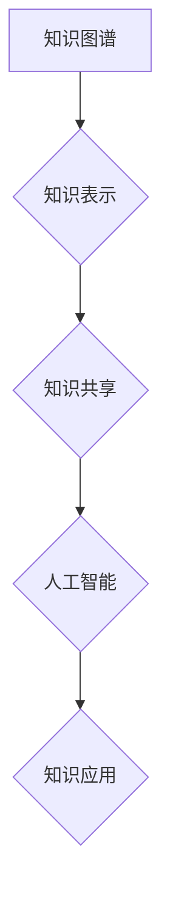

                 

## 人类知识的共享平台：知识的力量

> 关键词：知识图谱、知识共享、人工智能、机器学习、深度学习、数据可视化、知识推理

## 1. 背景介绍

在信息爆炸的时代，人类所积累的知识量呈指数级增长。然而，这些知识往往分散在不同的平台、格式和领域，难以被有效地组织、共享和利用。如何构建一个能够有效存储、检索、分析和应用人类知识的平台，是当今科技领域面临的一项重大挑战。

知识图谱作为一种新型的知识表示形式，为解决这一挑战提供了新的思路。它以图的形式表示知识，将实体和关系作为节点和边，能够有效地捕捉知识之间的复杂关联。基于知识图谱的人工智能系统能够进行更深入的知识推理和理解，从而为人类提供更智能、更精准的服务。

## 2. 核心概念与联系

### 2.1 知识图谱

知识图谱是一种基于知识表示的数据库，它以图的形式存储和组织知识。知识图谱由实体、关系和属性组成：

* **实体:** 代表现实世界中的事物，例如人、地点、事件等。
* **关系:** 描述实体之间的连接，例如“出生于”、“位于”、“创作”等。
* **属性:** 描述实体的特征，例如“姓名”、“年龄”、“国籍”等。

知识图谱能够有效地捕捉知识之间的复杂关联，并支持多种知识推理和查询操作。

### 2.2 知识共享

知识共享是指知识的开放获取、使用、修改和传播。它基于开放的许可协议，允许任何人自由地获取、使用和共享知识。知识共享能够促进知识的传播和创新，推动社会进步。

### 2.3 人工智能

人工智能是指模拟人类智能的计算机系统。它包括许多不同的技术，例如机器学习、深度学习、自然语言处理等。人工智能能够帮助人类解决复杂问题，提高工作效率，并创造新的价值。

**核心概念与联系流程图**



## 3. 核心算法原理 & 具体操作步骤

### 3.1 算法原理概述

知识图谱构建的核心算法主要包括：

* **知识抽取:** 从文本、数据等来源中提取实体和关系。
* **知识链接:** 将提取到的实体和关系连接起来，构建知识图谱。
* **知识推理:** 基于知识图谱中的关系，进行逻辑推理，推导出新的知识。

### 3.2 算法步骤详解

**知识抽取算法步骤:**

1. **文本预处理:** 对输入文本进行清洗、分词、词性标注等预处理操作。
2. **实体识别:** 使用命名实体识别模型识别文本中的实体。
3. **关系抽取:** 使用关系抽取模型识别实体之间的关系。

**知识链接算法步骤:**

1. **实体匹配:** 将抽取到的实体进行匹配，消除重复实体。
2. **关系链接:** 将匹配后的实体连接起来，构建知识图谱。

**知识推理算法步骤:**

1. **规则定义:** 定义一些知识推理规则，例如“如果A出生于B，则A的国籍为B的国籍”。
2. **规则应用:** 将规则应用于知识图谱，推导出新的知识。

### 3.3 算法优缺点

**优点:**

* 能够有效地组织和存储知识。
* 支持多种知识推理和查询操作。
* 能够促进知识共享和创新。

**缺点:**

* 知识抽取和链接算法的准确率仍然存在提升空间。
* 知识图谱的规模和复杂度不断增长，维护和更新难度不断增加。

### 3.4 算法应用领域

知识图谱的应用领域非常广泛，包括：

* **搜索引擎:** 提升搜索结果的准确性和相关性。
* **问答系统:** 提供更智能、更精准的答案。
* **推荐系统:** 提供更个性化的推荐。
* **医疗诊断:** 辅助医生进行诊断和治疗。
* **教育教学:** 提供更丰富的学习资源和个性化学习体验。

## 4. 数学模型和公式 & 详细讲解 & 举例说明

### 4.1 数学模型构建

知识图谱可以抽象为一个三元组模型：

* **T = (E, R, A)**

其中：

* **E:** 实体集合
* **R:** 关系集合
* **A:** 属性集合

每个三元组表示一个知识事实：

* **(e1, r, e2)**

其中：

* **e1:** 实体1
* **r:** 关系
* **e2:** 实体2

### 4.2 公式推导过程

知识推理可以使用逻辑规则和推理算法进行。例如，可以使用以下规则进行推理：

* **规则1:** 如果 (A, “出生于”, B)，则 (A, “国籍”, B)。

如果知识图谱中存在三元组 (张三, “出生于”, 中国)，则可以使用规则1推导出三元组 (张三, “国籍”, 中国)。

### 4.3 案例分析与讲解

**案例:**

假设知识图谱中包含以下三元组：

* (李明, “朋友”, 王丽)
* (王丽, “朋友”, 张强)

可以使用以下推理规则推导出新的知识：

* **规则2:** 如果 (A, “朋友”, B) 且 (B, “朋友”, C)，则 (A, “朋友”, C)。

根据规则2，可以推导出三元组 (李明, “朋友”, 张强)。

## 5. 项目实践：代码实例和详细解释说明

### 5.1 开发环境搭建

* **操作系统:** Ubuntu 20.04
* **编程语言:** Python 3.8
* **开发工具:** Jupyter Notebook
* **库依赖:**

```
pip install rdflib networkx
```

### 5.2 源代码详细实现

```python
from rdflib import Graph, Literal, URIRef
from rdflib.namespace import RDF, FOAF

# 创建知识图谱
g = Graph()

# 添加实体
g.add((URIRef("http://example.org/person/liming"), FOAF.name, Literal("李明")))
g.add((URIRef("http://example.org/person/wangli"), FOAF.name, Literal("王丽")))
g.add((URIRef("http://example.org/person/zhangqiang"), FOAF.name, Literal("张强")))

# 添加关系
g.add((URIRef("http://example.org/person/liming"), FOAF.knows, URIRef("http://example.org/person/wangli")))
g.add((URIRef("http://example.org/person/wangli"), FOAF.knows, URIRef("http://example.org/person/zhangqiang")))

# 查询知识
for s, p, o in g.triples((URIRef("http://example.org/person/liming"), None, None)):
    print(f"{s} {p} {o}")
```

### 5.3 代码解读与分析

* 代码首先创建了一个知识图谱对象 `g`。
* 然后，代码添加了三个实体和三个关系。
* 最后，代码使用 `g.triples()` 方法查询了所有与实体 `http://example.org/person/liming` 相关的知识。

### 5.4 运行结果展示

```
http://example.org/person/liming http://xmlns.com/foaf/0.1/name '李明'
http://example.org/person/liming http://xmlns.com/foaf/0.1/knows http://example.org/person/wangli
```

## 6. 实际应用场景

### 6.1 搜索引擎

知识图谱可以帮助搜索引擎更好地理解用户查询意图，并提供更准确、更相关的搜索结果。例如，如果用户查询“张三”，搜索引擎可以利用知识图谱中的信息，返回张三的个人信息、作品、生平等相关内容。

### 6.2 问答系统

知识图谱可以为问答系统提供丰富的知识库，帮助系统更准确地理解用户问题，并给出更精准的答案。例如，如果用户问“中国首都是哪里？”，问答系统可以利用知识图谱中的信息，直接回答“北京”。

### 6.3 推荐系统

知识图谱可以帮助推荐系统更好地理解用户的兴趣和偏好，并提供更个性化的推荐。例如，如果用户喜欢看科幻电影，推荐系统可以利用知识图谱中的信息，推荐其他科幻电影、科幻书籍、科幻游戏等相关内容。

### 6.4 未来应用展望

随着人工智能技术的不断发展，知识图谱的应用场景将更加广泛。例如，知识图谱可以应用于医疗诊断、教育教学、法律服务、金融理财等领域，帮助人类解决更复杂的问题，创造更大的价值。

## 7. 工具和资源推荐

### 7.1 学习资源推荐

* **书籍:**

    * 《知识图谱》 - 王晓东
    * 《知识图谱技术》 - 孙建华

* **在线课程:**

    * Coursera: Knowledge Graphs
    * edX: Introduction to Knowledge Graphs

### 7.2 开发工具推荐

* **RDF库:** rdflib (Python)
* **知识图谱构建工具:** Neo4j, GraphDB
* **知识图谱可视化工具:** Gephi, Cytoscape

### 7.3 相关论文推荐

* **构建知识图谱的算法和方法:**

    * “A Survey on Knowledge Graph Construction” - ACM Computing Surveys

* **知识图谱的应用:**

    * “Knowledge Graphs for Artificial Intelligence” - Nature

## 8. 总结：未来发展趋势与挑战

### 8.1 研究成果总结

知识图谱技术已经取得了显著的成果，在搜索引擎、问答系统、推荐系统等领域得到了广泛应用。

### 8.2 未来发展趋势

* **知识图谱规模和复杂度不断增长:** 未来，知识图谱将包含更多实体、关系和属性，并涵盖更广泛的领域。
* **知识图谱的动态更新和维护:** 知识是不断变化的，知识图谱需要能够动态更新和维护，以保持其准确性和有效性。
* **知识图谱的跨语言和跨域融合:** 未来，知识图谱将需要能够跨语言和跨域进行融合，以更好地服务于人类的需求。

### 8.3 面临的挑战

* **知识抽取和链接算法的准确率:** 知识抽取和链接算法仍然存在提升空间，需要进一步的研究和开发。
* **知识图谱的规模和复杂度:** 随着知识图谱的规模和复杂度不断增长，其维护和更新难度不断增加。
* **知识图谱的开放性和可访问性:** 知识图谱需要更加开放和可访问，以便于更多的人能够利用其价值。

### 8.4 研究展望

未来，知识图谱技术将继续朝着更加智能、更加开放、更加可持续的方向发展。

## 9. 附录：常见问题与解答

**常见问题:**

* **什么是知识图谱？**

知识图谱是一种基于知识表示的数据库，它以图的形式存储和组织知识。

* **知识图谱有什么应用场景？**

知识图谱的应用场景非常广泛，包括搜索引擎、问答系统、推荐系统、医疗诊断、教育教学等领域。

* **如何构建知识图谱？**

知识图谱的构建需要进行知识抽取、知识链接和知识推理等步骤。

**解答:**

* **什么是知识图谱？**

知识图谱是一种基于知识表示的数据库，它以图的形式存储和组织知识。知识图谱由实体、关系和属性组成，能够有效地捕捉知识之间的复杂关联。

* **知识图谱有什么应用场景？**

知识图谱的应用场景非常广泛，包括搜索引擎、问答系统、推荐系统、医疗诊断、教育教学等领域。例如，知识图谱可以帮助搜索引擎更好地理解用户查询意图，并提供更准确、更相关的搜索结果。

* **如何构建知识图谱？**

知识图谱的构建需要进行知识抽取、知识链接和知识推理等步骤。知识抽取是指从文本、数据等来源中提取实体和关系。知识链接是指将提取到的实体和关系连接起来，构建知识图谱。知识推理是指基于知识图谱中的关系，进行逻辑推理，推导出新的知识。


作者：禅与计算机程序设计艺术 / Zen and the Art of Computer Programming 
<end_of_turn>

