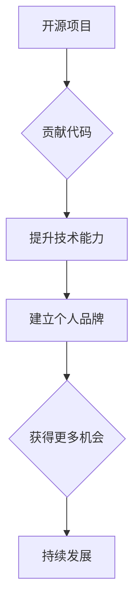

                 

## 利用开源项目打造个人品牌

> 关键词：开源项目、个人品牌、技术贡献、社区参与、职业发展

### 1. 背景介绍

在当今科技日新月异的时代，个人品牌建设对于IT从业者来说至关重要。一个强大的个人品牌可以帮助你脱颖而出，提升专业声誉，拓展职业发展机会。开源项目作为一种开放、协作的软件开发模式，为个人品牌建设提供了绝佳的平台。

参与开源项目不仅可以让你接触到前沿技术，积累宝贵的开发经验，还能让你与全球顶尖开发者建立联系，展现你的技术实力和贡献。通过积极参与开源项目，你可以构建一个强大的个人品牌，提升个人价值，实现职业目标。

### 2. 核心概念与联系

#### 2.1 开源项目

开源项目是指源代码公开可供他人免费使用、修改和再发布的软件项目。开源项目通常由社区开发者共同维护和发展，遵循开源协议，鼓励协作和分享。

#### 2.2 个人品牌

个人品牌是指个人在特定领域或行业内所建立的独特形象和声誉。它包括个人技能、经验、价值观、个性等方面的综合体现。

#### 2.3 联系

开源项目和个人品牌之间存在着密切的联系。参与开源项目可以帮助你打造个人品牌，而个人品牌建设则可以让你在开源社区中获得更多认可和机会。

**核心概念与联系流程图**

### 3. 核心算法原理 & 具体操作步骤

#### 3.1 算法原理概述

开源项目开发通常遵循敏捷开发理念，采用迭代开发模式，不断改进和完善软件。

#### 3.2 算法步骤详解

1. **选择合适的开源项目:** 

   根据自己的兴趣和技能，选择一个合适的开源项目参与。

2. **学习项目代码:** 

   仔细阅读项目文档和代码，了解项目的架构、功能和开发规范。

3. **提出改进建议:** 

   在项目论坛或邮件列表中提出改进建议，并与开发者交流。

4. **编写代码:** 

   根据建议，编写代码并提交给项目维护者进行审查。

5. **代码审查:** 

   项目维护者会对提交的代码进行审查，确保代码质量和符合项目规范。

6. **代码合并:** 

   经过审查通过的代码会被合并到项目主分支。

7. **发布更新:** 

   项目维护者会定期发布更新版本，包含所有已合并的代码。

#### 3.3 算法优缺点

**优点:**

* 提升技术能力
* 积累开发经验
* 建立个人品牌
* 拓展人脉
* 参与社区贡献

**缺点:**

* 需要投入时间和精力
* 可能遇到技术难题
* 需要与他人协作

#### 3.4 算法应用领域

开源项目应用领域广泛，包括：

* 操作系统
* 应用软件
* Web 框架
* 数据库
* 工具库

### 4. 数学模型和公式 & 详细讲解 & 举例说明

#### 4.1 数学模型构建

开源项目的发展可以看作是一个复杂网络的演化过程。

* **节点:** 代表项目开发者、贡献者、用户等参与者。
* **边:** 代表代码贡献、沟通交流、协作关系等连接。

#### 4.2 公式推导过程

网络的规模和复杂度可以由以下公式表示:

* **节点数量:** N = Σ(n_i)
* **边数量:** E = Σ(e_ij)

其中:

* n_i 代表第 i 个节点的参与度
* e_ij 代表节点 i 和节点 j 之间的连接强度

#### 4.3 案例分析与讲解

例如，一个开源项目拥有 1000 个开发者，平均每个开发者贡献了 10 个代码提交，则节点数量为 1000，边数量则取决于开发者之间的协作关系。

### 5. 项目实践：代码实例和详细解释说明

#### 5.1 开发环境搭建

选择一个合适的开发环境，例如 Linux 或 macOS 系统，并安装必要的软件工具，例如 Git、编译器、IDE 等。

#### 5.2 源代码详细实现

选择一个开源项目，例如 Linux 内核或 Apache HTTP 服务器，并阅读其源代码，了解其架构和功能。

#### 5.3 代码解读与分析

分析开源项目的代码结构，理解其设计理念和实现细节。

#### 5.4 运行结果展示

编译和运行开源项目，观察其运行结果，并进行测试和调试。

### 6. 实际应用场景

#### 6.1 学习新技术

开源项目可以帮助你学习新技术，例如云计算、人工智能、区块链等。

#### 6.2 积累开发经验

参与开源项目可以让你积累宝贵的开发经验，例如代码规范、测试方法、版本控制等。

#### 6.3 建立人脉

开源社区是一个充满活力和资源的平台，可以帮助你建立人脉，与全球顶尖开发者交流学习。

#### 6.4 未来应用展望

开源项目将继续在软件开发领域发挥重要作用，推动技术创新和产业发展。

### 7. 工具和资源推荐

#### 7.1 学习资源推荐

* **GitHub:** https://github.com/
* **GitLab:** https://gitlab.com/
* **SourceForge:** https://sourceforge.net/

#### 7.2 开发工具推荐

* **Git:** https://git-scm.com/
* **Eclipse:** https://www.eclipse.org/
* **Visual Studio Code:** https://code.visualstudio.com/

#### 7.3 相关论文推荐

* **The Cathedral and the Bazaar** by Eric S. Raymond
* **Open Source Software Development** by Karl Fogel

### 8. 总结：未来发展趋势与挑战

#### 8.1 研究成果总结

开源项目已经成为软件开发的重要模式，推动了技术创新和产业发展。

#### 8.2 未来发展趋势

* **云原生开源:** 随着云计算的普及，云原生开源项目将迎来快速发展。
* **人工智能开源:** 人工智能技术的发展将推动人工智能开源项目的兴起。
* **开源生态系统:** 开源生态系统将更加完善，提供更丰富的资源和服务。

#### 8.3 面临的挑战

* **知识产权保护:** 开源项目面临知识产权保护的挑战。
* **社区治理:** 开源社区的治理机制需要不断完善。
* **商业模式:** 开源项目需要探索新的商业模式。

#### 8.4 研究展望

未来，开源项目将继续发挥重要作用，推动软件开发的创新和发展。

### 9. 附录：常见问题与解答

#### 9.1 如何选择合适的开源项目?

选择一个符合自身兴趣和技能的开源项目，并了解项目的活跃度和发展方向。

#### 9.2 如何参与开源项目?

阅读项目文档，了解项目贡献指南，并提出改进建议或编写代码。

#### 9.3 如何维护开源项目?

需要积极参与社区讨论，及时修复bug，并发布更新版本。

作者：禅与计算机程序设计艺术 / Zen and the Art of Computer Programming 
<end_of_turn>

