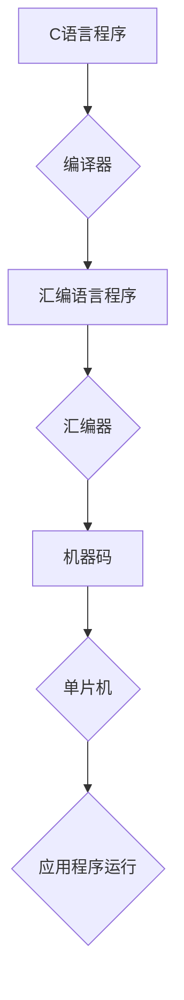

                 

## 单片机编程语言：C 和汇编

> 关键词：单片机、C语言、汇编语言、嵌入式系统、硬件编程、低级编程、微控制器

## 1. 背景介绍

单片机，作为嵌入式系统的核心，广泛应用于消费电子、工业控制、医疗设备等领域。其高效、低功耗的特点使其成为各种智能设备的理想选择。然而，单片机的资源有限，编程难度相对较高。为了更好地开发单片机程序，人们开发了多种编程语言，其中C语言和汇编语言是两种最常用的语言。

C语言作为一种高级语言，具有结构清晰、易于理解的特点，能够更高效地开发复杂的程序。汇编语言则是一种低级语言，能够直接操作硬件，实现更精细的控制。

本文将深入探讨C语言和汇编语言在单片机编程中的应用，分析其优缺点，并通过代码实例和实际应用场景，帮助读者理解这两种语言的特性和应用范围。

## 2. 核心概念与联系

### 2.1 C语言和汇编语言

* **C语言:**  一种结构化、面向过程的高级编程语言，具有移植性强、效率高、可读性好等特点。C语言程序需要经过编译器转换才能被单片机执行。

* **汇编语言:**  一种低级编程语言，其指令直接对应于单片机的机器码，能够直接控制硬件。汇编语言程序需要经过汇编器转换才能被单片机执行。

### 2.2 单片机编程模型

单片机编程模型通常包括以下几个部分：

* **硬件平台:**  单片机的硬件架构，包括CPU、内存、外设等。
* **操作系统:**  单片机运行的实时操作系统，负责资源管理、任务调度等。
* **应用程序:**  运行在单片机上的程序，负责完成具体的业务逻辑。

**Mermaid 流程图:**



## 3. 核心算法原理 & 具体操作步骤

### 3.1 算法原理概述

单片机编程中，常用的算法包括：

* **数据处理算法:**  例如加减乘除、位运算等，用于处理数字数据。
* **控制算法:**  例如状态机、定时器中断处理等，用于控制单片机的运行状态。
* **通信算法:**  例如串口通信、I2C通信等，用于实现单片机与其他设备的通信。

### 3.2 算法步骤详解

以数据处理算法为例，其具体操作步骤如下：

1. **数据输入:**  从传感器、按键等设备获取数据。
2. **数据处理:**  根据算法进行计算，例如加减乘除、位运算等。
3. **数据输出:**  将处理后的数据输出到显示器、电机等设备。

### 3.3 算法优缺点

* **数据处理算法:**  
    * **优点:**  计算效率高，易于实现。
    * **缺点:**  处理能力有限，难以处理复杂的数据结构。
* **控制算法:**  
    * **优点:**  能够实现复杂的控制逻辑，提高系统的响应速度。
    * **缺点:**  设计复杂，调试难度大。
* **通信算法:**  
    * **优点:**  能够实现单片机与其他设备的通信，扩展系统的功能。
    * **缺点:**  需要考虑通信协议、数据格式等问题，实现难度较高。

### 3.4 算法应用领域

* **数据处理算法:**  广泛应用于数字信号处理、图像处理等领域。
* **控制算法:**  应用于电机控制、温度控制、压力控制等领域。
* **通信算法:**  应用于无线通信、网络通信等领域。

## 4. 数学模型和公式 & 详细讲解 & 举例说明

### 4.1 数学模型构建

单片机编程中，常用的数学模型包括：

* **逻辑运算模型:**  用于表示逻辑运算，例如AND、OR、NOT等。
* **算术运算模型:**  用于表示算术运算，例如加减乘除、模运算等。
* **位运算模型:**  用于表示位操作，例如移位、掩码等。

### 4.2 公式推导过程

以逻辑运算为例，其公式推导过程如下：

* **AND运算:**  A AND B = 1 当且仅当 A=1 且 B=1。
* **OR运算:**  A OR B = 1 当且仅当 A=1 或 B=1 或 A=1 且 B=1。
* **NOT运算:**  NOT A = 1 当且仅当 A=0，反之亦然。

### 4.3 案例分析与讲解

以单片机控制LED灯为例，其数学模型和公式如下：

* **逻辑模型:**  使用AND运算控制LED灯的亮灭状态。
* **公式:**  LED状态 = 信号输入 AND 开关状态。

当信号输入为1且开关状态为1时，LED灯亮；否则，LED灯灭。

## 5. 项目实践：代码实例和详细解释说明

### 5.1 开发环境搭建

* **硬件平台:**  选择合适的单片机开发板，例如STM32、ESP32等。
* **软件工具:**  选择合适的开发环境，例如Keil MDK、IAR Embedded Workbench等。

### 5.2 源代码详细实现

```c
#include <stm32f10x.h>

int main(void)
{
    // 设置GPIO端口为输出
    GPIO_InitTypeDef GPIO_InitStructure;
    GPIO_InitStructure.GPIO_Pin = GPIO_Pin_13;
    GPIO_InitStructure.GPIO_Mode = GPIO_Mode_Out_PP;
    GPIO_InitStructure.GPIO_Speed = GPIO_Speed_50MHz;
    GPIO_Init(GPIOC, &GPIO_InitStructure);

    while (1)
    {
        // 点亮LED灯
        GPIO_SetBits(GPIOC, GPIO_Pin_13);
        delay(1000);

        // 熄灭LED灯
        GPIO_ResetBits(GPIOC, GPIO_Pin_13);
        delay(1000);
    }
}

void delay(unsigned int nTime)
{
    unsigned int i, j;
    for (i = 0; i < nTime; i++)
    {
        for (j = 0; j < 1000; j++);
    }
}
```

### 5.3 代码解读与分析

* **头文件:**  `stm32f10x.h` 是STM32F10x系列单片机的头文件，包含了单片机的寄存器定义和函数库。
* **主函数:**  `main()` 函数是程序的入口点。
* **GPIO初始化:**  `GPIO_InitTypeDef` 结构体用于定义GPIO端口的初始化参数，例如端口、模式、速度等。
* **循环控制:**  `while (1)` 循环语句使程序无限循环执行。
* **LED控制:**  `GPIO_SetBits()` 和 `GPIO_ResetBits()` 函数用于设置和清除GPIO端口的输出状态，从而控制LED灯的亮灭状态。
* **延时函数:**  `delay()` 函数用于实现延时功能，使程序暂停一段时间。

### 5.4 运行结果展示

程序运行后，LED灯将以1秒亮1秒灭的方式闪烁。

## 6. 实际应用场景

### 6.1 智能家居

单片机可以控制家电设备，例如灯、窗帘、空调等，实现智能家居的功能。

### 6.2 工业自动化

单片机可以控制工业设备，例如电机、传感器、执行器等，实现自动化生产。

### 6.3 医疗设备

单片机可以用于医疗设备的控制和数据采集，例如心率监测仪、血糖仪等。

### 6.4 汽车电子

单片机可以用于汽车电子系统的控制，例如点火系统、ABS系统、安全气囊等。

### 6.4 未来应用展望

随着物联网、人工智能等技术的快速发展，单片机的应用场景将更加广泛，例如：

* **智慧城市:**  单片机可以用于城市管理、交通控制、环境监测等领域。
* **工业互联网:**  单片机可以用于工业设备的远程监控、故障诊断、数据分析等领域。
* **穿戴式设备:**  单片机可以用于智能手表、智能眼镜等穿戴式设备的开发。

## 7. 工具和资源推荐

### 7.1 学习资源推荐

* **书籍:**  《单片机原理与应用》、《嵌入式系统设计》
* **网站:**  STM32官方网站、Keil官方网站、IAR官方网站
* **论坛:**  嵌入式开发论坛、单片机爱好者论坛

### 7.2 开发工具推荐

* **编译器:**  Keil MDK、IAR Embedded Workbench、GCC
* **调试器:**  J-Link、ST-LINK
* **仿真器:**  Keil Simulator、IAR Simulator

### 7.3 相关论文推荐

* **嵌入式系统设计与实现**
* **单片机控制技术**
* **物联网技术应用**

## 8. 总结：未来发展趋势与挑战

### 8.1 研究成果总结

单片机编程语言的发展经历了从汇编语言到C语言的演变，并逐渐形成了完善的开发环境和工具链。单片机技术在嵌入式系统领域取得了显著的成果，广泛应用于各个领域。

### 8.2 未来发展趋势

* **更强大的处理能力:**  单片机的CPU性能将不断提升，能够处理更复杂的算法和数据。
* **更丰富的功能:**  单片机将集成更多外设，例如传感器、通信模块、存储器等，实现更丰富的功能。
* **更易于使用的开发工具:**  开发工具将更加易于使用，降低单片机开发的门槛。

### 8.3 面临的挑战

* **资源限制:**  单片机的资源有限，例如内存、存储空间等，需要进行合理的资源管理。
* **实时性要求:**  许多嵌入式系统需要满足实时性要求，需要开发高效的实时操作系统和算法。
* **安全性问题:**  嵌入式系统面临着安全威胁，需要采取措施保证系统的安全性和可靠性。

### 8.4 研究展望

未来，单片机编程将朝着更智能、更安全、更易于使用的方向发展。研究者将继续探索新的算法、新的架构、新的开发工具，以满足不断增长的嵌入式系统需求。

## 9. 附录：常见问题与解答

* **Q1:  C语言和汇编语言哪个更好？**

A1:  C语言和汇编语言各有优缺点，选择哪种语言取决于具体的应用场景。C语言更易于学习和使用，适合开发复杂程序；汇编语言更接近硬件，能够实现更精细的控制，适合开发需要高性能和低功耗的程序。

* **Q2:  如何选择合适的单片机开发板？**

A2:  选择单片机开发板时需要考虑以下因素：

    * **单片机型号:**  选择适合自己应用场景的单片机型号。
    * **外设:**  选择具有所需外设的开发板。
    * **价格:**  选择性价比高的开发板。

* **Q3:  如何调试单片机程序？**

A3:  可以使用调试器进行单片机程序的调试，例如J-Link、ST-LINK等。

* **Q4:  如何学习单片机编程？**

A4:  可以通过书籍、网站、论坛等资源学习单片机编程。建议从基础知识开始学习，逐步深入了解单片机原理、编程语言、开发工具等。


作者：禅与计算机程序设计艺术 / Zen and the Art of Computer Programming 
<end_of_turn>

