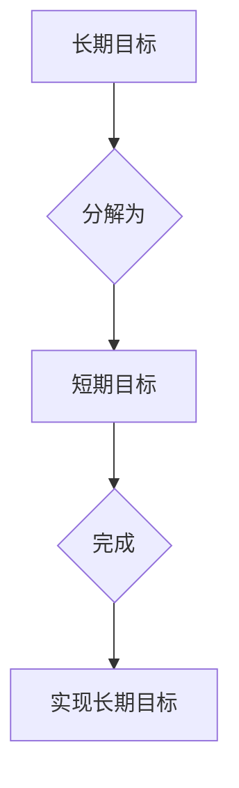

                 

## 双目标清单:聚焦要事,事半功倍

> 关键词：软件开发,优先级,时间管理,双目标清单,效率提升,项目管理

### 1. 背景介绍

在当今快速发展的科技时代，软件开发人员面临着日益增长的工作压力和复杂的任务。如何高效地管理时间，聚焦重要任务，并最终实现项目目标，成为了摆在每个开发人员面前的重大挑战。传统的任务管理方法往往难以应对这种复杂性，而双目标清单（Two-Goal List）则提供了一种全新的思路，帮助开发人员更有效地规划和执行工作。

双目标清单是一种基于优先级和目标的清单管理方法，它将任务分解为两个相互关联的目标：**短期目标**和**长期目标**。短期目标是需要在短期内完成的具体任务，而长期目标则是指最终想要达成的宏观目标。通过明确这两个目标，开发人员可以更好地理解任务的优先级和重要性，从而更加专注于关键任务，提高工作效率。

### 2. 核心概念与联系

#### 2.1 双目标清单的核心概念

双目标清单的核心概念是将任务分解为两个层次的目标：

* **短期目标 (Short-Term Goal):** 
    * 是需要在短期内完成的具体任务。
    * 通常是可分解成更小的子任务，并具有明确的截止日期。
    * 例如：完成某个模块的代码编写、修复某个bug、撰写测试用例等。
* **长期目标 (Long-Term Goal):**
    * 是指最终想要达成的宏观目标。
    * 通常是抽象的，并且需要通过多个短期目标的完成才能实现。
    * 例如：完成整个项目的开发、发布到生产环境、提升用户体验等。

#### 2.2 双目标清单的联系

短期目标和长期目标之间存在着密切的联系。短期目标是实现长期目标的基石，而长期目标则为短期目标提供方向和意义。通过将任务分解为这两个层次的目标，开发人员可以更好地理解任务的优先级和重要性，从而更加专注于关键任务，提高工作效率。

#### 2.3 双目标清单的流程图



### 3. 核心算法原理 & 具体操作步骤

#### 3.1 算法原理概述

双目标清单的核心算法原理是基于优先级和目标的分解和管理。它通过以下步骤来实现：

1. **明确长期目标:** 开发人员首先需要明确最终想要达成的宏观目标。
2. **分解长期目标:** 将长期目标分解为多个可实现的短期目标。
3. **设定优先级:** 对短期目标进行优先级排序，确定哪些任务需要在短期内完成。
4. **制定计划:** 根据优先级和截止日期，制定详细的计划，并分配相应的资源。
5. **执行和跟踪:** 按照计划执行任务，并定期跟踪进度，及时调整计划。

#### 3.2 算法步骤详解

1. **明确长期目标:** 

   * 思考项目的目标是什么，最终想要实现什么成果。
   * 将目标描述得清晰、具体、可衡量。
   * 例如：开发一个能够帮助用户管理个人日程的应用程序。

2. **分解长期目标:**

   * 将长期目标分解为多个可实现的短期目标。
   * 每个短期目标都应该能够独立完成，并且对实现长期目标有贡献。
   * 例如：
      * 完成用户注册功能
      * 完成日程添加和编辑功能
      * 完成日程提醒功能
      * 完成用户登录功能

3. **设定优先级:**

   * 根据短期目标的重要性、紧急程度和依赖关系进行排序。
   * 可以使用一些优先级排序方法，例如艾森豪威尔矩阵（Eisenhower Matrix）。
   * 例如：
      * 完成用户注册功能（高优先级，紧急）
      * 完成日程添加和编辑功能（高优先级，重要）
      * 完成日程提醒功能（中优先级，重要）
      * 完成用户登录功能（低优先级，非紧急）

4. **制定计划:**

   * 为每个短期目标制定详细的计划，包括任务分解、时间安排、资源分配等。
   * 使用一些项目管理工具，例如Trello、Jira等，来帮助管理计划和进度。
   * 例如：
      * 完成用户注册功能：
         * 任务分解：设计注册页面、实现注册逻辑、编写测试用例
         * 时间安排：3天
         * 资源分配：前端开发人员、后端开发人员、测试人员

5. **执行和跟踪:**

   * 按照计划执行任务，并定期跟踪进度。
   * 如果遇到问题，及时调整计划。
   * 使用一些时间管理工具，例如番茄工作法、Pomodoro Technique等，来帮助提高工作效率。

#### 3.3 算法优缺点

**优点:**

* **提高效率:** 通过明确目标和优先级，可以帮助开发人员专注于关键任务，提高工作效率。
* **降低压力:** 将任务分解为更小的目标，可以降低开发人员的工作压力。
* **增强可管理性:** 通过制定计划和跟踪进度，可以增强项目的可管理性。

**缺点:**

* **需要时间投入:**  制定双目标清单需要一定的思考和时间投入。
* **需要不断调整:**  随着项目的进展，需要不断调整双目标清单，以适应变化的需求。
* **可能过于抽象:**  对于一些复杂项目，双目标清单可能过于抽象，难以具体化。

#### 3.4 算法应用领域

双目标清单的应用领域非常广泛，不仅限于软件开发，还可以应用于其他领域，例如：

* **项目管理:**  帮助项目经理更好地规划和执行项目。
* **个人时间管理:**  帮助个人更好地管理时间，提高效率。
* **学习计划:**  帮助学生制定学习计划，提高学习效率。

### 4. 数学模型和公式 & 详细讲解 & 举例说明

#### 4.1 数学模型构建

双目标清单的数学模型可以抽象为一个目标树结构，其中：

* 根节点代表长期目标。
* 子节点代表短期目标。
* 每个节点的权重代表其重要性。

#### 4.2 公式推导过程

可以利用以下公式来计算每个短期目标的优先级：

```latex
优先级 = 权重 * 紧急程度
```

其中：

* 权重：根据短期目标对长期目标的贡献程度进行评估。
* 紧急程度：根据短期目标的截止日期和影响范围进行评估。

#### 4.3 案例分析与讲解

假设一个软件开发项目，其长期目标是开发一个能够帮助用户管理个人日程的应用程序。

* 短期目标1：完成用户注册功能（权重：0.8，紧急程度：0.9）
* 短期目标2：完成日程添加和编辑功能（权重：0.7，紧急程度：0.8）
* 短期目标3：完成日程提醒功能（权重：0.6，紧急程度：0.7）

根据公式，我们可以计算出每个短期目标的优先级：

* 短期目标1：优先级 = 0.8 * 0.9 = 0.72
* 短期目标2：优先级 = 0.7 * 0.8 = 0.56
* 短期目标3：优先级 = 0.6 * 0.7 = 0.42

因此，完成用户注册功能的优先级最高，应该优先完成。

### 5. 项目实践：代码实例和详细解释说明

#### 5.1 开发环境搭建

* 操作系统：Windows/macOS/Linux
* 编程语言：Python
* 开发工具：VS Code/Atom/Sublime Text
* 项目管理工具：Trello/Jira

#### 5.2 源代码详细实现

```python
#  双目标清单管理工具

class Task:
    def __init__(self, name, description, priority, due_date):
        self.name = name
        self.description = description
        self.priority = priority
        self.due_date = due_date

    def __str__(self):
        return f"任务名称: {self.name}\n描述: {self.description}\n优先级: {self.priority}\n截止日期: {self.due_date}"

class Goal:
    def __init__(self, name, tasks):
        self.name = name
        self.tasks = tasks

    def add_task(self, task):
        self.tasks.append(task)

    def __str__(self):
        return f"目标名称: {self.name}\n任务列表:\n{'\n'.join(str(task) for task in self.tasks)}"

# 创建短期目标
task1 = Task("完成用户注册功能", "设计注册页面、实现注册逻辑、编写测试用例", 0.8, "2023-12-25")
task2 = Task("完成日程添加和编辑功能", "设计添加和编辑页面、实现添加和编辑逻辑、编写测试用例", 0.7, "2023-12-31")
task3 = Task("完成日程提醒功能", "设计提醒机制、实现提醒逻辑、编写测试用例", 0.6, "2024-01-05")

# 创建长期目标
long_term_goal = Goal("开发个人日程管理应用程序", [task1, task2, task3])

# 打印长期目标和任务列表
print(long_term_goal)
```

#### 5.3 代码解读与分析

* **Task类:** 代表一个任务，包含任务名称、描述、优先级和截止日期。
* **Goal类:** 代表一个目标，包含目标名称和任务列表。
* **代码示例:** 创建了三个短期目标，并将其添加到一个长期目标中。最后打印了长期目标和任务列表。

#### 5.4 运行结果展示

运行代码后，将输出以下结果：

```
目标名称: 开发个人日程管理应用程序
任务列表:
任务名称: 完成用户注册功能
描述: 设计注册页面、实现注册逻辑、编写测试用例
优先级: 0.8
截止日期: 2023-12-25
任务名称: 完成日程添加和编辑功能
描述: 设计添加和编辑页面、实现添加和编辑逻辑、编写测试用例
优先级: 0.7
截止日期: 2023-12-31
任务名称: 完成日程提醒功能
描述: 设计提醒机制、实现提醒逻辑、编写测试用例
优先级: 0.6
截止日期: 2024-01-05
```

### 6. 实际应用场景

#### 6.1 软件开发项目

双目标清单可以帮助软件开发团队更好地规划和执行项目。例如，可以将项目分解为多个模块，每个模块作为短期目标，最终实现整个项目的长期目标。

#### 6.2 个人时间管理

双目标清单可以帮助个人更好地管理时间，提高效率。例如，可以将每天的任务分解为多个短期目标，并根据优先级进行安排。

#### 6.3 学习计划

双目标清单可以帮助学生制定学习计划，提高学习效率。例如，可以将课程目标分解为多个短期目标，并根据学习进度进行调整。

#### 6.4 未来应用展望

随着科技的发展，双目标清单的应用场景将会更加广泛。例如，可以将其与人工智能技术结合，实现自动任务分配和优先级排序。

### 7. 工具和资源推荐

#### 7.1 学习资源推荐

* **书籍:**
    * 《Getting Things Done: The Art of Stress-Free Productivity》 by David Allen
    * 《Eat That Frog!: 21 Great Ways to Stop Procrastinating and Get More Done in Less Time》 by Brian Tracy
* **网站:**
    * https://todoist.com/
    * https://trello.com/
    * https://asana.com/

#### 7.2 开发工具推荐

* **项目管理工具:**
    * Trello
    * Jira
    * Asana
* **时间管理工具:**
    * Pomodoro Technique
    * Forest

#### 7.3 相关论文推荐

* **"The Eisenhower Matrix: A Framework for Prioritizing Tasks"**
* **"The Pomodoro Technique: A Time Management Method for Enhanced Productivity"**

### 8. 总结：未来发展趋势与挑战

#### 8.1 研究成果总结

双目标清单是一种有效的任务管理方法，可以帮助开发人员提高工作效率、降低压力、增强项目可管理性。

#### 8.2 未来发展趋势

未来，双目标清单将会更加智能化和个性化。例如，可以利用人工智能技术自动分析任务优先级、生成最佳执行计划、并根据用户习惯进行个性化调整。

#### 8.3 面临的挑战

* **数据隐私:**  双目标清单需要收集用户任务和时间管理数据，如何保护用户隐私是一个重要的挑战。
* **算法复杂度:**  随着任务数量和复杂度的增加，双目标清单的算法复杂度也会增加，需要不断优化算法效率。
* **用户接受度:**  一些用户可能难以接受双目标清单这种新的工作方式，需要进行有效的推广和教育。

#### 8.4 研究展望

未来，我们将继续研究双目标清单的算法优化、个性化定制、以及与其他技术（如人工智能、机器学习）的融合，以更好地帮助开发人员提高工作效率和生活质量。

### 9. 附录：常见问题与解答

**Q1: 如何制定双目标清单？**

A1: 制定双目标清单需要遵循以下步骤：

1. 明确长期目标。
2. 将长期目标分解为多个短期目标。
3. 对短期目标进行优先级排序。
4. 制定详细的计划，并分配相应的资源。

**Q2: 如何调整双目标清单？**

A2: 随着项目的进展，需要根据实际情况不断调整双目标清单。例如，如果某个短期目标已经完成，可以将其从清单中删除；如果某个短期目标需要延期，可以调整其截止日期。

**Q3: 双目标清单适用于哪些场景？**

A3: 双目标清单适用于各种场景，例如软件开发项目、个人时间管理、学习计划等。

**作者：禅与计算机程序设计艺术 / Zen and the Art of Computer Programming**<end_of_turn>

