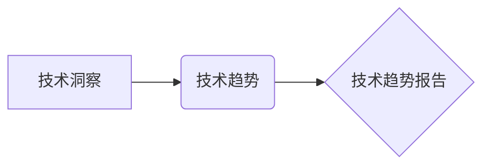

                 

## 如何将技术洞察转化为技术趋势报告

> 关键词：技术洞察、技术趋势、趋势预测、数据分析、机器学习、人工智能、报告撰写、技术战略

### 1. 背景介绍

在瞬息万变的科技世界，洞察技术发展趋势对于企业和个人来说至关重要。技术洞察是指对技术发展方向、关键技术、潜在应用场景等进行深入分析和理解，并将其转化为有价值的知识和见解。而技术趋势报告则是将技术洞察以结构化、可读的方式呈现出来，帮助读者了解未来技术发展方向，并做出相应的战略决策。

然而，将技术洞察转化为技术趋势报告并非易事。需要具备扎实的技术背景、敏锐的洞察力、严谨的分析能力以及优秀的沟通表达能力。本文将详细探讨如何将技术洞察转化为技术趋势报告，并提供一些实用建议。

### 2. 核心概念与联系

**2.1 技术洞察**

技术洞察是基于对技术发展现状、趋势和潜在影响的深入分析和理解，并将其转化为有价值的知识和见解的过程。它需要结合多方面的因素进行分析，例如：

* **技术发展现状:** 了解当前的技术水平、关键技术、成熟度等。
* **市场需求:** 分析市场对技术的需求、痛点和未来发展方向。
* **竞争格局:** 研究技术领域的竞争对手、他们的技术实力和战略布局。
* **政策法规:** 关注政府对技术的政策支持和监管措施。

**2.2 技术趋势**

技术趋势是指技术发展方向的预测，通常基于对技术洞察的分析和判断。技术趋势可以是短期、中期或长期，并可能涉及多个技术领域。

**2.3 技术趋势报告**

技术趋势报告是将技术洞察和技术趋势以结构化、可读的方式呈现出来，帮助读者了解未来技术发展方向，并做出相应的战略决策。

**2.4 核心概念关系图**



### 3. 核心算法原理 & 具体操作步骤

**3.1 算法原理概述**

技术趋势预测算法通常基于数据分析和机器学习技术。常见的算法包括：

* **时间序列分析:** 通过分析历史数据，预测未来趋势。
* **关联规则挖掘:** 发现数据之间的关联关系，预测未来事件的发生。
* **机器学习模型:** 利用机器学习算法，从数据中学习预测模型。

**3.2 算法步骤详解**

1. **数据收集:** 收集相关技术领域的各种数据，例如专利数据、学术论文、市场报告、新闻报道等。
2. **数据清洗:** 对收集到的数据进行清洗和预处理，去除噪声和异常值，确保数据质量。
3. **特征提取:** 从数据中提取有价值的特征，例如关键词、技术指标、发展速度等。
4. **模型训练:** 选择合适的算法，对数据进行训练，建立预测模型。
5. **模型评估:** 对模型进行评估，验证其预测准确率和可靠性。
6. **趋势预测:** 利用训练好的模型，预测未来技术发展趋势。

**3.3 算法优缺点**

* **优点:**

    * 可以从大量数据中发现隐藏的趋势。
    * 可以进行量化分析，提高预测的准确性。
    * 可以自动化预测过程，提高效率。

* **缺点:**

    * 需要大量的数据支持。
    * 模型的准确性取决于数据的质量和算法的选择。
    * 无法预测不可预知的事件。

**3.4 算法应用领域**

技术趋势预测算法广泛应用于以下领域：

* **科技投资:** 预测未来技术领域的投资机会。
* **产品研发:** 预测未来用户需求，开发新产品。
* **市场营销:** 预测市场趋势，制定营销策略。
* **政策制定:** 预测技术发展对社会的影响，制定相关政策。

### 4. 数学模型和公式 & 详细讲解 & 举例说明

**4.1 数学模型构建**

技术趋势预测模型通常基于时间序列分析或机器学习算法。

* **时间序列分析:** 可以使用ARIMA模型、SARIMA模型等对时间序列数据进行预测。

* **机器学习模型:** 可以使用线性回归、逻辑回归、决策树、支持向量机、神经网络等模型进行预测。

**4.2 公式推导过程**

ARIMA模型的公式推导过程比较复杂，这里不再赘述。

**4.3 案例分析与讲解**

假设我们想要预测某个技术的市场规模增长趋势。我们可以收集该技术的市场规模数据，并使用ARIMA模型进行预测。

* **数据:** 过去5年的市场规模数据。
* **模型:** ARIMA(p,d,q)模型，其中p、d、q是模型参数。
* **预测:** 利用模型预测未来5年的市场规模增长趋势。

**4.4 举例说明**

假设ARIMA模型预测结果显示，未来5年该技术的市场规模将以每年10%的速度增长。

### 5. 项目实践：代码实例和详细解释说明

**5.1 开发环境搭建**

* Python 3.x
* pandas
* statsmodels
* matplotlib

**5.2 源代码详细实现**

```python
import pandas as pd
from statsmodels.tsa.arima.model import ARIMA
import matplotlib.pyplot as plt

# 加载数据
data = pd.read_csv('market_size.csv', index_col='Year')

# 训练ARIMA模型
model = ARIMA(data['Market Size'], order=(5,1,0))
model_fit = model.fit()

# 预测未来5年的市场规模
forecast = model_fit.predict(start=len(data), end=len(data)+4)

# 可视化预测结果
plt.plot(data['Market Size'], label='历史数据')
plt.plot(forecast, label='预测结果')
plt.legend()
plt.show()
```

**5.3 代码解读与分析**

* 首先，我们使用pandas库加载市场规模数据。
* 然后，我们使用statsmodels库的ARIMA模型训练模型。
* 接着，我们使用模型预测未来5年的市场规模。
* 最后，我们使用matplotlib库可视化预测结果。

**5.4 运行结果展示**

运行代码后，将生成一个图表，展示历史数据和预测结果。

### 6. 实际应用场景

技术趋势报告可以应用于以下场景：

* **企业战略规划:** 帮助企业了解未来技术发展方向，制定相应的战略规划。
* **产品研发:** 帮助企业预测未来用户需求，开发符合市场需求的产品。
* **投资决策:** 帮助投资者识别未来技术领域的投资机会。
* **政策制定:** 帮助政府制定相关政策，引导技术发展。

**6.4 未来应用展望**

随着人工智能技术的不断发展，技术趋势预测将更加精准和智能化。未来，技术趋势报告将更加个性化、可视化和交互式，能够更好地帮助用户理解和应用技术洞察。

### 7. 工具和资源推荐

**7.1 学习资源推荐**

* **书籍:**

    * 《预测分析》
    * 《机器学习》
    * 《数据挖掘》

* **在线课程:**

    * Coursera
    * edX
    * Udemy

**7.2 开发工具推荐**

* **Python:** 强大的数据分析和机器学习工具。
* **R:** 专注于统计分析和可视化工具。
* **Tableau:** 数据可视化工具。

**7.3 相关论文推荐**

* **时间序列分析:**

    * Box, G. E. P., Jenkins, G. M., & Reinsel, G. C. (2015). Time series analysis: Forecasting and control. John Wiley & Sons.

* **机器学习:**

    * Bishop, C. M. (2006). Pattern recognition and machine learning. Springer.

### 8. 总结：未来发展趋势与挑战

**8.1 研究成果总结**

本文探讨了如何将技术洞察转化为技术趋势报告，并介绍了相关算法、模型和工具。技术趋势预测已经成为一个重要的研究领域，并取得了显著的成果。

**8.2 未来发展趋势**

* **人工智能技术的应用:** 人工智能技术将进一步提高技术趋势预测的准确性和智能化程度。
* **数据量的增加:** 数据量的不断增加将为技术趋势预测提供更丰富的素材。
* **跨领域融合:** 技术趋势预测将更加关注跨领域融合，预测不同技术领域之间的相互影响。

**8.3 面临的挑战**

* **数据质量:** 数据质量是技术趋势预测的关键因素，需要不断提高数据采集、清洗和预处理的质量。
* **模型复杂度:** 模型的复杂度需要与数据量和预测精度之间找到平衡点。
* **不可预知的事件:** 无法预测不可预知的事件，例如黑天鹅事件，对技术趋势预测造成挑战。

**8.4 研究展望**

未来，技术趋势预测的研究将更加注重以下方面:

* **解释性模型:** 开发能够解释预测结果的模型，提高预测的可信度。
* **可解释性:** 研究如何更好地解释技术趋势预测结果，使其更易于理解和应用。
* **个性化预测:** 开发能够根据用户需求进行个性化预测的模型。

### 9. 附录：常见问题与解答

**9.1 如何选择合适的算法？**

选择合适的算法取决于数据的特点和预测目标。

* **时间序列数据:** 可以使用ARIMA模型、SARIMA模型等。
* **分类问题:** 可以使用逻辑回归、决策树、支持向量机等。
* **回归问题:** 可以使用线性回归、支持向量机等。

**9.2 如何评估模型的准确性？**

常用的评估指标包括：

* **均方误差 (MSE):** 衡量预测值与真实值之间的平均平方差。
* **平均绝对误差 (MAE):** 衡量预测值与真实值之间的平均绝对差。
* **R-squared:** 衡量模型解释数据的程度。

**9.3 如何处理缺失数据？**

常用的处理缺失数据的方法包括：

* **删除缺失数据:** 如果缺失数据量较少，可以删除缺失数据。
* **插值法:** 使用周围数据进行插值，填充缺失数据。
* **预测法:** 使用模型预测缺失数据。


作者：禅与计算机程序设计艺术 / Zen and the Art of Computer Programming 
<end_of_turn>

