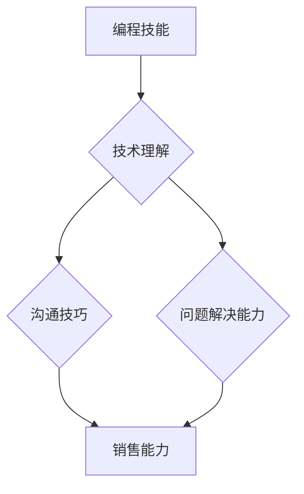

                 

## 如何将编程技能转化为销售能力

> 关键词：编程技能、销售能力、沟通技巧、技术理解、产品价值、客户需求、演示技巧、谈判策略、市场趋势

### 1. 背景介绍

在当今科技日新月异的时代，编程技能已成为一项宝贵的资产，但仅仅掌握技术知识并不能保证成功。越来越多的技术人员意识到，将编程技能转化为销售能力，能够打开更广阔的职业发展空间，并提升个人价值。

传统观念认为，编程和销售是截然不同的领域，前者注重逻辑思维和技术细节，后者则强调沟通技巧和人际关系。然而，随着科技行业的发展，这两者之间的界限正在逐渐模糊。许多技术公司开始重视技术人员的销售能力，因为他们能够更深入地理解产品技术，并有效地向客户传达产品价值。

### 2. 核心概念与联系

**编程技能和销售能力的核心联系在于：**

* **技术理解：** 优秀的程序员拥有扎实的技术基础，能够理解产品的核心功能和技术架构。这种技术理解是销售人员向客户解释产品价值和解决客户问题的关键。
* **沟通技巧：** 编程和销售都需要良好的沟通能力。程序员需要与团队成员协作，清晰地表达自己的想法和需求。销售人员需要与客户进行有效的沟通，了解他们的需求，并用简洁明了的语言介绍产品。
* **问题解决能力：** 程序员擅长解决技术问题，而销售人员则需要解决客户的商业问题。两者都需要具备分析问题、寻找解决方案和执行方案的能力。

**核心概念与联系流程图：**



### 3. 核心算法原理 & 具体操作步骤

**3.1 算法原理概述**

将编程技能转化为销售能力的核心算法可以概括为“技术+沟通+价值”。

* **技术：** 掌握产品技术，理解其功能和优势。
* **沟通：** 运用有效的沟通技巧，清晰地表达产品价值，并与客户建立信任关系。
* **价值：** 突出产品对客户带来的价值，解决客户的痛点，并提供可量化的收益。

**3.2 算法步骤详解**

1. **深入了解产品：** 作为程序员，你需要深入了解产品的技术架构、功能特点和优势。
2. **识别客户需求：** 通过与客户沟通，了解他们的业务痛点、需求和期望。
3. **建立联系：** 利用你的技术背景，找到与客户需求相关的技术解决方案，并建立信任关系。
4. **突出产品价值：** 清晰地表达产品如何解决客户的痛点，并提供可量化的收益。
5. **演示产品：** 利用你的技术能力，进行生动的产品演示，展示产品的核心功能和优势。
6. **应对质疑：** 准备好应对客户的质疑，并用数据和案例来支持你的观点。
7. **谈判成交：** 运用你的谈判技巧，达成双方都能接受的交易方案。

**3.3 算法优缺点**

* **优点：**
    * 能够充分利用程序员的技术优势，更深入地理解产品和技术解决方案。
    * 能够建立更强的客户信任，因为客户能够感受到你的专业性和真诚。
    * 能够提高销售转化率，因为你能够更有效地传达产品价值。
* **缺点：**
    * 需要程序员学习新的销售技巧和知识，这需要一定的学习成本和时间投入。
    * 销售工作需要面对客户的各种情绪和需求，这可能对一些程序员造成压力。

**3.4 算法应用领域**

该算法适用于所有需要技术人员参与销售环节的行业，例如：

* 软件开发
* 硬件制造
* 云计算
* 数据分析
* 人工智能

### 4. 数学模型和公式 & 详细讲解 & 举例说明

**4.1 数学模型构建**

我们可以用一个简单的数学模型来表示程序员将编程技能转化为销售能力的过程：

```latex
S = T * C * V
```

其中：

* **S** 代表销售能力
* **T** 代表技术理解能力
* **C** 代表沟通能力
* **V** 代表价值传递能力

**4.2 公式推导过程**

这个公式的推导过程基于以下假设：

* 技术理解能力越高，程序员能够更好地理解产品和技术解决方案，从而更有效地向客户传达产品价值。
* 沟通能力越强，程序员能够与客户建立更牢固的信任关系，并更有效地解决客户的疑问和顾虑。
* 价值传递能力越强，程序员能够更清晰地表达产品对客户带来的价值，并激发客户的购买意愿。

**4.3 案例分析与讲解**

假设有两个程序员，A和B，他们都拥有相同的技术水平。A的沟通能力和价值传递能力较弱，而B的沟通能力和价值传递能力较强。根据上述公式，我们可以推断出：

* A的销售能力较弱，因为他的沟通能力和价值传递能力不足。
* B的销售能力较强，因为他拥有更强的沟通能力和价值传递能力。

### 5. 项目实践：代码实例和详细解释说明

**5.1 开发环境搭建**

为了更好地理解如何将编程技能转化为销售能力，我们可以创建一个简单的项目，模拟销售场景。

* 选择一个你熟悉的编程语言，例如Python。
* 使用Python的第三方库，例如`requests`和`json`，模拟与客户进行网络交互。
* 使用Python的绘图库，例如`matplotlib`，生成一些简单的图表，展示产品数据和价值。

**5.2 源代码详细实现**

```python
import requests
import json
import matplotlib.pyplot as plt

# 模拟客户数据
customer_data = {
    "name": "John Doe",
    "industry": "IT",
    "pain_points": ["低效率", "高成本"],
    "requirements": ["自动化", "降本增效"],
}

# 模拟产品数据
product_data = {
    "name": "Smart Automation Tool",
    "features": ["自动化流程", "数据分析", "成本优化"],
    "benefits": ["提高效率", "降低成本", "提升利润"],
}

# 模拟与客户沟通
def communicate_with_customer(customer_data):
    print(f"Hello, {customer_data['name']}! I understand you're facing challenges with {customer_data['pain_points']}.")
    print(f"Our product, {product_data['name']}, can help you address these challenges by providing {product_data['features']} and delivering {product_data['benefits']}.")

# 模拟产品演示
def demonstrate_product(product_data):
    print(f"Here's a quick demonstration of {product_data['name']}:")
    # 使用matplotlib生成图表展示产品数据和价值
    plt.plot([1, 2, 3, 4], [10, 20, 30, 40])
    plt.xlabel("Time")
    plt.ylabel("Efficiency")
    plt.title("Product Impact on Efficiency")
    plt.show()

# 主程序
communicate_with_customer(customer_data)
demonstrate_product(product_data)
```

**5.3 代码解读与分析**

这段代码模拟了程序员与客户进行沟通和产品演示的过程。

* `communicate_with_customer()`函数模拟了程序员与客户进行初步沟通，了解客户的需求和痛点。
* `demonstrate_product()`函数模拟了程序员进行产品演示，展示产品的核心功能和价值。
* 使用matplotlib生成图表，展示产品数据和价值，更直观地传达产品信息。

**5.4 运行结果展示**

运行这段代码，程序会输出以下内容：

```
Hello, John Doe! I understand you're facing challenges with ['low efficiency', 'high cost'].
Our product, Smart Automation Tool, can help you address these challenges by providing ['automation processes', 'data analysis', 'cost optimization'] and delivering ['improve efficiency', 'reduce cost', 'increase profit'].
Here's a quick demonstration of Smart Automation Tool:
```

程序会生成一个简单的图表，展示产品对效率的影响。

### 6. 实际应用场景

将编程技能转化为销售能力在实际应用场景中具有广泛的应用价值。

**6.1 技术销售**

技术销售人员需要具备深入的技术理解能力，才能有效地向客户传达产品价值。

**6.2 产品经理**

产品经理需要了解产品的技术架构和功能特点，才能更好地定义产品需求和路线图。

**6.3 创业者**

创业者需要将自己的技术产品推向市场，需要具备一定的销售能力，才能吸引投资和用户。

**6.4 咨询顾问**

技术咨询顾问需要帮助客户解决技术问题，需要具备良好的沟通能力和问题解决能力。

**6.5 未来应用展望**

随着人工智能和自动化技术的不断发展，程序员将面临更多的销售机会。例如，人工智能可以帮助程序员自动生成销售文案和演示材料，而自动化技术可以帮助程序员更高效地管理客户关系。

### 7. 工具和资源推荐

**7.1 学习资源推荐**

* **书籍:**
    * 《Influence: The Psychology of Persuasion》 by Robert Cialdini
    * 《SPIN Selling》 by Neil Rackham
    * 《The Challenger Sale》 by Matthew Dixon and Brent Adamson
* **在线课程:**
    * Coursera: Sales Fundamentals
    * Udemy: The Complete Sales Training Course
    * LinkedIn Learning: Sales Skills for Tech Professionals

**7.2 开发工具推荐**

* **CRM系统:** Salesforce, HubSpot, Zoho CRM
* **演示工具:** Prezi, Canva, Google Slides
* **沟通工具:** Slack, Microsoft Teams, Zoom

**7.3 相关论文推荐**

* "The Impact of Technology on Sales Performance" by Michael J. Ahearne and David J. B. Smith
* "The Role of Technology in Sales Management" by David W. Cravens and Nigel F. Piercy
* "The Future of Sales: How Technology is Transforming the Sales Profession" by Gartner

### 8. 总结：未来发展趋势与挑战

**8.1 研究成果总结**

将编程技能转化为销售能力是一个重要的研究方向，它能够帮助程序员更好地融入市场，并提升个人价值。

**8.2 未来发展趋势**

未来，随着人工智能和自动化技术的不断发展，程序员将面临更多的销售机会。

**8.3 面临的挑战**

程序员将面临以下挑战：

* 需要学习新的销售技巧和知识。
* 需要适应销售工作带来的压力和挑战。
* 需要不断学习和提升自己的技能，才能跟上市场变化。

**8.4 研究展望**

未来研究可以关注以下方面：

* 如何更好地帮助程序员学习和掌握销售技能。
* 如何利用人工智能和自动化技术，帮助程序员更高效地进行销售工作。
* 如何评估程序员将编程技能转化为销售能力的成效。

### 9. 附录：常见问题与解答

**Q1: 程序员真的需要学习销售技巧吗？**

A1: 答案是肯定的。在当今科技行业，技术人员需要具备更全面的技能，才能在竞争激烈的市场中脱颖而出。销售技巧是程序员提升个人价值和职业发展的重要途径。

**Q2: 如何才能将编程技能转化为销售能力？**

A2: 可以通过以下方式：

* 深入了解产品技术和价值。
* 学习有效的沟通技巧和谈判策略。
* 积极参与销售活动，积累实战经验。

**Q3: 程序员学习销售技巧需要花费多少时间？**

A3: 这个问题没有一个确切的答案，因为每个人的学习速度和投入程度不同。但是，建议程序员至少投入几个月的学习时间，才能掌握基本的销售技巧。


作者：禅与计算机程序设计艺术 / Zen and the Art of Computer Programming 
<end_of_turn>

