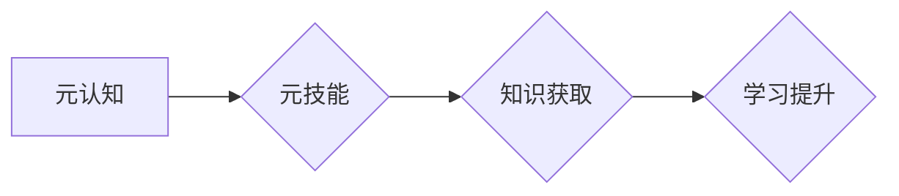

                 

## 学习的学习：元技能在知识获取中的作用

> 关键词：元认知、元技能、知识获取、学习策略、人工智能、深度学习、迁移学习

### 1. 背景介绍

在当今信息爆炸的时代，知识获取已成为一项至关重要的能力。传统的学习模式往往依赖于被动接受信息，而随着人工智能技术的飞速发展，主动学习和知识迁移成为新的趋势。元认知，即对自身认知过程的认识，以及元技能，即用于学习和解决问题的更高阶技能，在这一背景下显得尤为重要。

元认知是指个体对自己认知过程的认识，包括感知、理解、记忆、推理和解决问题等。它涉及对自身学习策略、知识结构、认知局限性等方面的理解。元技能则是基于元认知，用于指导和优化学习过程的技能。例如，制定学习计划、识别学习目标、选择合适的学习策略、评估学习效果等都是元技能的范畴。

### 2. 核心概念与联系

**2.1 元认知与元技能的关系**

元认知是元技能的基础，元技能则是元认知的应用。元认知提供了解自己认知能力和局限性的基础，而元技能则利用这些认知来指导和优化学习过程。

**2.2 元技能与知识获取的关系**

元技能可以有效地促进知识获取。通过运用元技能，个体可以更有效地理解、记忆和应用新知识。例如，制定学习计划可以帮助个体更好地组织学习内容，选择合适的学习策略可以提高学习效率，评估学习效果可以帮助个体及时调整学习方法。

**2.3 元技能与人工智能的关系**

人工智能技术的发展为元技能的应用提供了新的可能性。例如，人工智能可以帮助个体识别学习风格、推荐个性化的学习资源、提供实时反馈等，从而提高学习效率和效果。

**Mermaid 流程图**



### 3. 核心算法原理 & 具体操作步骤

**3.1 算法原理概述**

元技能学习算法的核心是利用机器学习技术，从大量学习数据中学习出有效的学习策略和知识表示方法。这些算法通常基于深度学习模型，例如循环神经网络（RNN）和强化学习（RL）。

**3.2 算法步骤详解**

1. **数据收集和预处理:** 收集大量学习数据，包括学习者的学习行为、学习内容、学习效果等信息。对数据进行预处理，例如文本清洗、特征提取等。
2. **模型构建:** 选择合适的深度学习模型，例如RNN或RL，并根据学习任务进行模型结构设计。
3. **模型训练:** 利用训练数据训练模型，学习出有效的学习策略和知识表示方法。
4. **模型评估:** 利用测试数据评估模型的性能，例如学习效率、知识迁移能力等。
5. **模型优化:** 根据评估结果对模型进行优化，例如调整模型参数、改进模型结构等。

**3.3 算法优缺点**

**优点:**

* 可以学习出个性化的学习策略，提高学习效率和效果。
* 可以促进知识迁移，帮助个体将已学知识应用到新的领域。
* 可以自动化学习过程，减轻学习者的负担。

**缺点:**

* 需要大量的学习数据进行训练。
* 模型训练过程复杂，需要专业的技术人员进行操作。
* 模型的解释性和可解释性较差。

**3.4 算法应用领域**

* 个性化教育
* 知识发现和推荐
* 机器人学习
* 人工智能辅助决策

### 4. 数学模型和公式 & 详细讲解 & 举例说明

**4.1 数学模型构建**

元技能学习算法通常基于强化学习框架，将学习过程视为一个马尔可夫决策过程（MDP）。

* 状态空间：学习者的当前认知状态，包括已掌握的知识、学习目标、学习策略等。
* 动作空间：学习者可以采取的行动，例如阅读、练习、提问等。
* 奖励函数：根据学习者的学习效果，给予相应的奖励。
* 转移概率：学习者采取特定行动后，进入下一个状态的概率。

**4.2 公式推导过程**

强化学习的目标是找到一个最优策略，使得学习者在长期内获得最大的总奖励。常用的策略优化算法包括Q学习和SARSA。

* Q学习：通过迭代更新Q值表，学习出每个状态下采取每个动作的期望奖励。
* SARSA：通过模拟学习者的行为轨迹，更新Q值表。

**4.3 案例分析与讲解**

假设一个学习者正在学习编程，他的状态空间包括已掌握的编程知识、学习目标、学习策略等。他可以采取的行动包括阅读编程书籍、练习编程代码、观看编程视频等。

通过强化学习算法，学习者可以根据自己的学习效果，调整学习策略，例如：

* 如果学习效果好，则继续使用当前策略。
* 如果学习效果差，则尝试新的学习策略。

最终，学习者可以找到最适合自己的学习策略，提高编程学习效率。

### 5. 项目实践：代码实例和详细解释说明

**5.1 开发环境搭建**

* Python 3.x
* TensorFlow 或 PyTorch 深度学习框架
* Jupyter Notebook 或 VS Code 代码编辑器

**5.2 源代码详细实现**

```python
# 使用 TensorFlow 实现 Q 学习算法

import tensorflow as tf

# 定义状态空间和动作空间
state_size = 10
action_size = 5

# 定义 Q 值网络
model = tf.keras.Sequential([
    tf.keras.layers.Dense(64, activation='relu', input_shape=(state_size,)),
    tf.keras.layers.Dense(action_size)
])

# 定义损失函数和优化器
optimizer = tf.keras.optimizers.Adam()
loss_fn = tf.keras.losses.MeanSquaredError()

# 训练 Q 值网络
for episode in range(num_episodes):
    state = env.reset()
    done = False
    while not done:
        # 选择动作
        action = tf.argmax(model(state)).numpy()

        # 执行动作并获取奖励和下一个状态
        next_state, reward, done, _ = env.step(action)

        # 更新 Q 值
        with tf.GradientTape() as tape:
            q_values = model(state)
            target = reward + gamma * tf.reduce_max(model(next_state))
            loss = loss_fn(target, q_values[0, action])
        gradients = tape.gradient(loss, model.trainable_variables)
        optimizer.apply_gradients(zip(gradients, model.trainable_variables))

        state = next_state

# 保存训练好的模型
model.save('q_learning_model.h5')
```

**5.3 代码解读与分析**

这段代码实现了 Q 学习算法，用于训练一个 Q 值网络。

* `state_size` 和 `action_size` 定义了状态空间和动作空间的大小。
* `model` 定义了 Q 值网络的结构，使用两层全连接神经网络。
* `optimizer` 和 `loss_fn` 定义了优化器和损失函数。
* 训练循环中，学习者根据当前状态选择动作，执行动作并获取奖励和下一个状态，然后更新 Q 值网络的参数。

**5.4 运行结果展示**

训练好的 Q 值网络可以用于预测学习者在不同状态下采取不同动作的期望奖励，从而帮助学习者制定最优学习策略。

### 6. 实际应用场景

**6.1 个性化教育**

元技能学习算法可以根据学生的学习风格、学习目标和学习进度，个性化推荐学习资源和学习策略，提高学生的学习效率和效果。

**6.2 知识发现和推荐**

元技能学习算法可以帮助挖掘用户潜在的学习需求，并推荐相关的知识资源，促进知识发现和传播。

**6.3 机器人学习**

元技能学习算法可以帮助机器人学习新的任务和技能，提高机器人的适应性和自主学习能力。

**6.4 未来应用展望**

随着人工智能技术的不断发展，元技能学习算法将在更多领域得到应用，例如：

* 智能医疗：帮助医生制定个性化的治疗方案。
* 智能金融：帮助投资者做出更明智的投资决策。
* 智能制造：帮助工厂优化生产流程。

### 7. 工具和资源推荐

**7.1 学习资源推荐**

* **书籍:**

    * 《深度学习》 by Ian Goodfellow, Yoshua Bengio, and Aaron Courville
    * 《强化学习：原理、算法和应用》 by Richard S. Sutton and Andrew G. Barto

* **在线课程:**

    * Coursera: Reinforcement Learning Specialization
    * Udacity: Deep Learning Nanodegree

**7.2 开发工具推荐**

* TensorFlow
* PyTorch
* Keras

**7.3 相关论文推荐**

* **Meta-Learning with Differentiable Convex Optimization** by Finn et al. (2017)
* **Model-Agnostic Meta-Learning for Fast Adaptation of Deep Networks** by Vinyals et al. (2017)

### 8. 总结：未来发展趋势与挑战

**8.1 研究成果总结**

元技能学习算法取得了显著的进展，在个性化学习、知识发现和机器人学习等领域展现出巨大的潜力。

**8.2 未来发展趋势**

* **更有效的元技能学习算法:** 研究更有效的元技能学习算法，提高算法的效率和鲁棒性。
* **更丰富的元技能表示:** 开发更丰富的元技能表示方法，更好地捕捉学习者的认知过程和学习策略。
* **跨模态元技能学习:** 研究跨模态元技能学习，例如将文本、图像和视频等多种模态信息融合到元技能学习中。

**8.3 面临的挑战**

* **数据获取和标注:** 元技能学习算法需要大量的学习数据，而获取和标注这些数据非常困难。
* **模型解释性和可解释性:** 元技能学习模型的解释性和可解释性较差，难以理解模型的决策过程。
* **伦理问题:** 元技能学习算法可能会导致学习者过度依赖算法，从而影响他们的自主学习能力。

**8.4 研究展望**

未来，元技能学习算法将继续朝着更智能、更个性化、更可解释的方向发展，为人类的学习和知识获取提供更强大的工具。

### 9. 附录：常见问题与解答

**9.1 如何选择合适的元技能学习算法？**

选择合适的元技能学习算法需要根据具体的学习任务和数据特点进行考虑。例如，对于需要学习复杂策略的任务，可以使用强化学习算法；对于需要学习知识迁移的任务，可以使用迁移学习算法。

**9.2 如何评估元技能学习算法的性能？**

元技能学习算法的性能可以根据学习效率、知识迁移能力、学习效果等指标进行评估。

**9.3 元技能学习算法是否会取代教师？**

元技能学习算法可以辅助教师，提高教学效率和效果，但不会取代教师。教师仍然是学习者学习过程中不可或缺的指导者和陪伴者。


作者：禅与计算机程序设计艺术 / Zen and the Art of Computer Programming 
<end_of_turn>

