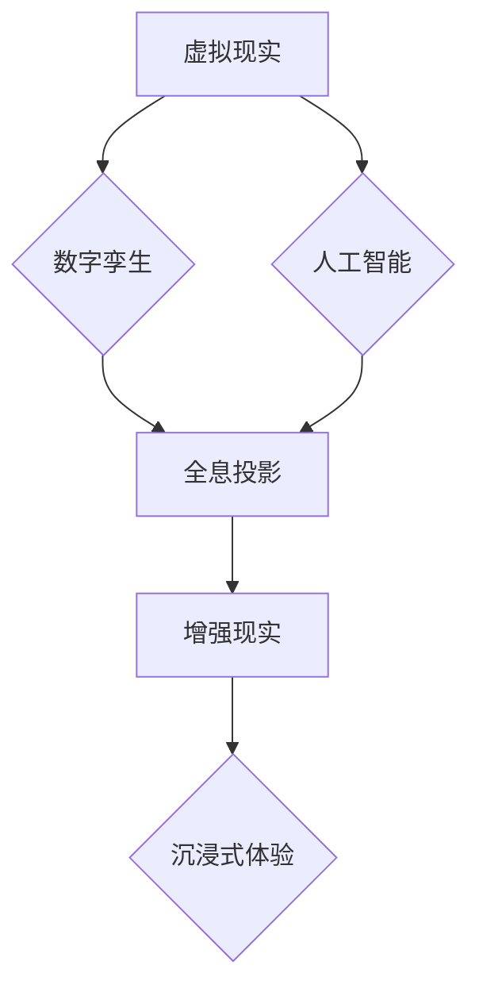

                 

## 2050年的数字创意：从虚拟直播到全息互动表演的数字创意娱乐

> 关键词：虚拟现实、增强现实、全息投影、数字孪生、人工智能、数字内容创作、沉浸式体验、元宇宙

### 1. 背景介绍

2050年，数字创意娱乐将不再局限于传统的二维屏幕，而是以虚拟现实 (VR)、增强现实 (AR) 和全息投影等技术为基础，构建出更加沉浸式、互动性和体验性的全新娱乐世界。 

随着人工智能 (AI) 和数字孪生技术的不断发展，数字内容创作将更加智能化和个性化。用户将能够参与到内容创作中，创造属于自己的虚拟世界和故事。元宇宙的概念也将更加清晰，人们可以在虚拟空间中社交、娱乐、工作和学习，体验更加丰富多彩的生活方式。

### 2. 核心概念与联系

数字创意娱乐的核心概念包括虚拟现实、增强现实、全息投影、数字孪生和人工智能。这些概念相互关联，共同构建了未来数字创意娱乐的生态系统。

**Mermaid 流程图：**

* **虚拟现实 (VR):** 通过头戴式设备模拟沉浸式的虚拟环境，用户可以身临其境地体验虚拟世界。
* **增强现实 (AR):** 在现实世界中叠加虚拟元素，增强用户的现实世界体验。
* **全息投影:**  利用光学技术，将三维物体或场景投影到空中，形成逼真的立体图像。
* **数字孪生:**  利用虚拟模型模拟现实世界中的物体或系统，可以用于虚拟测试、仿真和优化。
* **人工智能 (AI):**  赋予数字内容创作和体验智能化，例如自动生成内容、个性化推荐和智能交互。

### 3. 核心算法原理 & 具体操作步骤

#### 3.1  算法原理概述

数字创意娱乐的核心算法原理包括图形渲染、计算机视觉、机器学习和自然语言处理等。

* **图形渲染:**  将虚拟场景转化为可视化的图像，需要考虑光照、材质、阴影等因素。
* **计算机视觉:**  使计算机能够“看”和理解图像，例如物体识别、场景理解和动作跟踪。
* **机器学习:**  通过数据训练，使算法能够自动学习和改进，例如内容推荐、个性化定制和智能交互。
* **自然语言处理:**  使计算机能够理解和处理人类语言，例如语音识别、文本生成和对话系统。

#### 3.2  算法步骤详解

以虚拟直播为例，其核心算法步骤包括：

1. **场景搭建:**  利用3D建模软件搭建虚拟直播场景，包括背景、道具、虚拟人物等。
2. **角色建模:**  利用3D建模软件和计算机视觉技术，创建逼真的虚拟角色模型，并赋予其动作和表情。
3. **实时渲染:**  利用图形渲染算法，将虚拟场景实时渲染成图像，并根据用户的视角进行调整。
4. **用户交互:**  利用自然语言处理和机器学习算法，实现用户与虚拟角色的交互，例如语音聊天、问答和游戏。
5. **内容传输:**  将渲染后的图像和交互数据传输到用户的设备上，实现沉浸式的虚拟直播体验。

#### 3.3  算法优缺点

**优点:**

* **沉浸式体验:**  虚拟直播可以提供更加沉浸式的体验，用户可以身临其境地感受虚拟世界。
* **互动性强:**  用户可以与虚拟角色进行互动，参与到虚拟世界中。
* **内容丰富:**  虚拟直播可以包含各种类型的虚拟内容，例如音乐表演、游戏、教育等。

**缺点:**

* **技术门槛高:**  搭建虚拟直播场景和实现用户交互需要较高的技术门槛。
* **成本高昂:**  虚拟直播设备和软件成本较高。
* **网络延迟:**  虚拟直播需要实时传输大量数据，网络延迟会影响用户体验。

#### 3.4  算法应用领域

数字创意娱乐算法广泛应用于以下领域:

* **游戏:**  虚拟现实游戏、增强现实游戏、人工智能驱动的游戏角色。
* **影视:**  虚拟制作、特效合成、虚拟演员。
* **音乐:**  虚拟音乐会、全息音乐表演、个性化音乐推荐。
* **教育:**  虚拟课堂、沉浸式教学、个性化学习。
* **社交:**  虚拟社交平台、虚拟会议、虚拟聚会。

### 4. 数学模型和公式 & 详细讲解 & 举例说明

#### 4.1  数学模型构建

数字创意娱乐算法中，常用的数学模型包括：

* **线性代数:**  用于图形变换、物体运动和场景渲染。
* **微积分:**  用于模拟物理现象、物体运动和光照效果。
* **概率论和统计学:**  用于机器学习算法的训练和优化。

#### 4.2  公式推导过程

以图形渲染为例，常用的公式包括：

* **光线追踪:**  用于模拟光线在场景中的传播和反射，计算物体表面上的颜色和亮度。
* **着色模型:**  用于计算物体表面的颜色，根据光线照射、材质属性和环境光等因素进行计算。

#### 4.3  案例分析与讲解

以全息投影为例，其数学模型需要考虑光线传播、波前控制和图像重建等因素。

* **光线传播:**  利用菲涅尔公式和麦克斯韦方程组，模拟光线在不同介质中的传播。
* **波前控制:**  利用光学元件，例如透镜和折射片，控制光线的传播方向和波前形状。
* **图像重建:**  利用计算机视觉算法，将投影到空中的光线信息重建成三维图像。

### 5. 项目实践：代码实例和详细解释说明

#### 5.1  开发环境搭建

数字创意娱乐项目开发环境通常包括：

* **操作系统:**  Windows、Linux或macOS。
* **编程语言:**  C++、Python、Java等。
* **图形引擎:**  Unity、Unreal Engine、OpenGL等。
* **虚拟现实平台:**  Oculus、HTC Vive、SteamVR等。

#### 5.2  源代码详细实现

以虚拟直播为例，其源代码实现包括：

* **场景搭建:**  利用3D建模软件创建虚拟场景，并将其导出为游戏引擎可识别的格式。
* **角色建模:**  利用3D建模软件创建虚拟角色模型，并将其导入到游戏引擎中。
* **实时渲染:**  利用游戏引擎的渲染引擎，将虚拟场景实时渲染成图像。
* **用户交互:**  利用游戏引擎的脚本语言，实现用户与虚拟角色的交互。

#### 5.3  代码解读与分析

代码解读需要分析代码结构、算法逻辑和数据流。

#### 5.4  运行结果展示

运行结果展示需要观察虚拟直播场景的渲染效果、角色的动画效果和用户交互的流畅度。

### 6. 实际应用场景

#### 6.1  虚拟直播

虚拟直播可以用于音乐表演、游戏直播、教育讲座等场景，提供更加沉浸式的体验。

#### 6.2  全息互动表演

全息互动表演可以将虚拟角色和场景投影到现实世界中，与观众进行互动，例如虚拟演唱会、虚拟戏剧表演等。

#### 6.3  数字孪生应用

数字孪生可以用于模拟现实世界中的物体或系统，例如城市规划、建筑设计、工业生产等，进行虚拟测试和优化。

#### 6.4  未来应用展望

数字创意娱乐将更加融合现实世界，例如：

* **混合现实:**  将虚拟现实和增强现实结合，创造更加逼真的体验。
* **个人化定制:**  根据用户的喜好和需求，定制个性化的虚拟内容。
* **元宇宙:**  构建更加沉浸式和交互式的虚拟世界，人们可以在虚拟空间中生活、工作和娱乐。

### 7. 工具和资源推荐

#### 7.1  学习资源推荐

* **书籍:**  《Unity in Action》、《Unreal Engine 4 Cookbook》、《Game Programming Patterns》
* **在线课程:**  Coursera、Udemy、edX等平台提供虚拟现实、增强现实和游戏开发相关的课程。
* **社区论坛:**  Unity Forum、Unreal Engine Forums等社区论坛可以获得技术支持和交流经验。

#### 7.2  开发工具推荐

* **游戏引擎:**  Unity、Unreal Engine、Godot
* **3D建模软件:**  Blender、Maya、3ds Max
* **虚拟现实平台:**  Oculus、HTC Vive、SteamVR

#### 7.3  相关论文推荐

* **ACM SIGGRAPH:**  每年举办的计算机图形学大会，发表最新的研究成果。
* **IEEE VR:**  虚拟现实领域的顶级学术会议。
* **arXiv:**  开放获取的预印本服务器，可以找到最新的研究论文。

### 8. 总结：未来发展趋势与挑战

#### 8.1  研究成果总结

数字创意娱乐领域取得了显著的进展，虚拟现实、增强现实和全息投影技术不断成熟，人工智能和数字孪生技术也取得了突破性进展。

#### 8.2  未来发展趋势

* **更加沉浸式和交互式的体验:**  未来数字创意娱乐将更加注重沉浸感和交互性，例如混合现实、脑机接口等技术将被应用于数字创意娱乐领域。
* **更加个性化和定制化的内容:**  人工智能和机器学习技术将使数字创意娱乐内容更加个性化和定制化，例如根据用户的喜好和需求生成虚拟内容。
* **更加融合现实世界的应用:**  数字创意娱乐将更加融合现实世界，例如虚拟购物、虚拟旅游、虚拟教育等应用场景将更加广泛。

#### 8.3  面临的挑战

* **技术门槛高:**  数字创意娱乐技术门槛较高，需要专业的技术人员和团队进行开发。
* **成本高昂:**  数字创意娱乐设备和软件成本较高，需要大量的资金投入。
* **内容创作难题:**  高质量的数字创意娱乐内容创作需要大量的时间和精力。

#### 8.4  研究展望

未来数字创意娱乐领域的研究方向包括：

* **更加逼真的虚拟现实和增强现实技术:**  例如高分辨率显示、更自然的交互方式、更逼真的物理模拟等。
* **更加智能的数字内容创作:**  例如利用人工智能自动生成虚拟内容、个性化定制虚拟内容等。
* **更加融合现实世界的应用场景:**  例如虚拟购物、虚拟旅游、虚拟教育等应用场景的开发和推广。

### 9. 附录：常见问题与解答

* **Q1:  虚拟现实和增强现实有什么区别？**

* **A1:**  虚拟现实 (VR) 是模拟沉浸式的虚拟环境，用户需要佩戴头戴式设备才能体验。增强现实 (AR) 是在现实世界中叠加虚拟元素，用户可以通过手机或平板电脑等设备体验。

* **Q2:  数字孪生技术有什么应用场景？**

* **A2:**  数字孪生技术可以用于模拟现实世界中的物体或系统，例如城市规划、建筑设计、工业生产等，进行虚拟测试和优化。

* **Q3:  如何学习数字创意娱乐相关技术？**

* **A3:**  可以学习相关的书籍、在线课程和社区论坛，也可以参加相关的培训课程和工作坊。

作者：禅与计算机程序设计艺术 / Zen and the Art of Computer Programming 
<end_of_turn>

