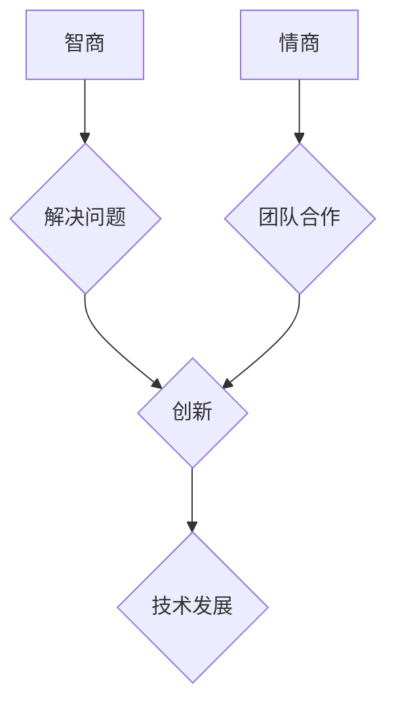

                 

## 情商与智商：全面发展的智慧

> 关键词：人工智能、情商、智商、软技能、硬技能、全面发展、技术创新、团队合作、领导力、沟通能力

## 1. 背景介绍

在当今科技飞速发展的时代，智商（IQ）作为衡量认知能力的标准，长期以来被视为成功和卓越的标志。然而，随着人工智能技术的快速发展，单纯依靠智商已不足以应对日益复杂的挑战。情商（EQ），即情绪智力，逐渐被人们所重视，并被认为是个人和团队成功的重要驱动力。

人工智能的兴起，一方面提升了人类的生产力和效率，另一方面也引发了对未来工作模式和人才需求的深刻思考。未来，人工智能将承担越来越多的重复性、规则性工作，而人类需要更加注重培养自身的创造力、创新能力、沟通能力和领导力等软技能，以适应新的工作环境和发展趋势。

## 2. 核心概念与联系

**2.1 情商与智商的定义**

* **智商（IQ）：** 指的是个体在认知能力方面的水平，包括逻辑推理、空间想象、语言理解、记忆力和解决问题的能力等。智商通常通过智力测试来评估。

* **情商（EQ）：** 指的是个体在情绪管理、人际关系、自我意识和社会意识方面的能力。情商包括自我认知、自我调节、激励、同理心和社交技能等方面。

**2.2 情商与智商之间的关系**

智商和情商并非相互排斥，而是相互补充和促进的。高智商的人可能在逻辑思维、知识积累方面表现出色，但缺乏情绪管理能力和人际交往技巧，难以在团队合作和领导力方面取得成功。而高情商的人，即使智商相对较低，也能够通过良好的沟通、团队合作和情绪管理能力，在工作和生活中取得成就。

**2.3 情商与人工智能的关系**

人工智能的发展，一方面可以帮助人类提高效率和解决复杂问题，另一方面也对人类的情商提出了更高的要求。

* 人工智能的应用，可能会导致部分工作岗位被取代，因此，人类需要不断学习新的技能，提升自身的适应能力和创造力。
* 人工智能的决策和行为，需要人类进行监督和引导，这需要人类具备良好的判断力和沟通能力，才能与人工智能协同工作。
* 人工智能的发展，也需要人类的情感和伦理指导，才能确保人工智能技术被用于造福人类。

**2.4 情商与技术创新的关系**

技术创新是一个需要团队协作、沟通和理解的过程。高情商的人能够更好地理解团队成员的需求，激发团队的创造力和协作精神，从而推动技术创新的发展。

**Mermaid 流程图**



## 3. 核心算法原理 & 具体操作步骤

**3.1 算法原理概述**

情商的提升并非一蹴而就，需要通过不断的学习和实践来积累经验和提高能力。以下是一些常用的情商提升算法，以及其具体的操作步骤：

**3.2 算法步骤详解**

* **自我认知算法:**

    1. **情绪识别:** 学习识别自己的情绪，并了解情绪背后的原因。可以使用情绪日记、情绪监测工具等方法进行记录和分析。
    2. **价值观识别:** 确定自己的核心价值观，并将其融入到日常生活中。
    3. **优势与劣势分析:** 了解自己的优势和劣势，并制定相应的提升计划。

* **情绪管理算法:**

    1. **情绪调节:** 学习控制自己的情绪，避免情绪化决策。可以使用深呼吸、冥想、运动等方法进行情绪调节。
    2. **压力应对:** 学习应对压力，避免过度焦虑和紧张。可以使用时间管理、放松技巧、寻求支持等方法进行压力应对。
    3. **情绪表达:** 学会健康地表达自己的情绪，避免情绪积压。可以使用积极的语言、非语言表达等方式进行情绪表达。

* **人际关系算法:**

    1. **沟通技巧:** 学习有效的沟通技巧，包括倾听、表达、反馈等。
    2. **同理心培养:** 尝试理解他人的感受和观点，并给予相应的支持和帮助。
    3. **团队合作:** 学习在团队中有效地合作，并为团队目标做出贡献。

* **领导力算法:**

    1. **激励他人:** 学习如何激励和鼓舞他人，激发他们的潜能。
    2. **决策能力:** 学习如何做出明智的决策，并有效地传达决策结果。
    3. **责任感:** 承担责任，并为自己的行为负责。

**3.3 算法优缺点**

* **优点:** 情商提升算法可以帮助人们更好地理解自己和他人，提升人际关系、情绪管理和领导力等方面的能力，从而在工作和生活中取得更大的成功。
* **缺点:** 情商提升是一个需要长期坚持的过程，需要不断地学习和实践，才能取得显著的效果。

**3.4 算法应用领域**

情商提升算法可以应用于各个领域，例如：

* **教育:** 帮助学生提高自我认知、情绪管理和人际交往能力。
* **企业:** 帮助员工提升团队合作、沟通和领导力等能力，从而提高工作效率和团队绩效。
* **个人成长:** 帮助个人更好地了解自己，提升自我价值，实现个人目标。

## 4. 数学模型和公式 & 详细讲解 & 举例说明

**4.1 数学模型构建**

情商可以被视为一个多维度的向量，每个维度代表不同的情商能力，例如：自我认知、情绪调节、同理心、社交技能等。每个维度的数值可以表示个体在该方面的能力水平。

**4.2 公式推导过程**

由于情商是一个复杂的概念，难以用简单的公式进行精确量化。目前，常用的情商评估方法主要依赖于问卷调查和观察评估，并结合心理学理论进行分析和解释。

**4.3 案例分析与讲解**

假设我们有一个情商评估模型，包含以下四个维度：

* 自我认知 (SC)
* 情绪调节 (ER)
* 同理心 (TP)
* 社交技能 (SS)

每个维度的数值范围为 0 到 100，其中 0 表示能力水平最低，100 表示能力水平最高。

对于一个个体，我们可以用以下公式计算其整体情商 (EQ) 的得分：

```
EQ = (SC + ER + TP + SS) / 4
```

例如，如果一个个体的自我认知得分是 80，情绪调节得分是 70，同理心得分是 90，社交技能得分是 85，那么其整体情商得分是：

```
EQ = (80 + 70 + 90 + 85) / 4 = 82.5
```

## 5. 项目实践：代码实例和详细解释说明

**5.1 开发环境搭建**

为了实现情商提升算法，我们可以使用 Python 语言和相关的机器学习库，例如 TensorFlow 或 PyTorch。

**5.2 源代码详细实现**

由于情商提升算法涉及到多个方面，例如情绪识别、情绪调节、人际关系分析等，其代码实现较为复杂。这里只提供一个简单的示例，用于演示情绪识别算法的实现。

```python
import nltk
from nltk.sentiment import SentimentIntensityAnalyzer

nltk.download('vader_lexicon')

sia = SentimentIntensityAnalyzer()

text = "今天感觉很开心，因为我完成了重要的工作。"

scores = sia.polarity_scores(text)

print(scores)
```

**5.3 代码解读与分析**

这段代码使用 NLTK 库中的 SentimentIntensityAnalyzer 类来分析文本的情绪倾向。

* `nltk.download('vader_lexicon')`: 下载 VADER 词汇库，用于情绪分析。
* `sia = SentimentIntensityAnalyzer()`: 创建 SentimentIntensityAnalyzer 对象。
* `text = "今天感觉很开心，因为我完成了重要的工作。"`: 定义需要分析的文本。
* `scores = sia.polarity_scores(text)`: 使用 SentimentIntensityAnalyzer 对象分析文本的情绪倾向，并返回一个字典，包含四个分数：

    * `neg`: 负面情绪得分
    * `neu`: 中性情绪得分
    * `pos`: 正面情绪得分
    * `compound`: 综合情绪得分

* `print(scores)`: 打印情绪分析结果。

**5.4 运行结果展示**

运行这段代码后，会输出以下结果：

```
{'neg': 0.0, 'neu': 0.308, 'pos': 0.692, 'compound': 0.9098}
```

结果表明，这段文本的情绪倾向为正面，综合情绪得分较高。

## 6. 实际应用场景

**6.1 情商在教育领域的应用**

* **学生情绪管理:** 学校可以利用情商评估工具，帮助学生了解自己的情绪状态，并学习如何有效地管理情绪。
* **师生沟通:** 教师可以通过提高情商，更好地理解学生的需求，建立良好的师生关系，促进学生的学习和成长。
* **团队合作:** 学校可以组织团队合作活动，帮助学生学习如何与他人有效地沟通和合作，提升团队合作能力。

**6.2 情商在企业领域的应用**

* **员工招聘:** 企业可以将情商作为招聘的重要指标，选择具有良好情商的员工，提升团队整体的凝聚力和协作能力。
* **员工培训:** 企业可以提供情商提升培训，帮助员工提高情绪管理、沟通和领导力等方面的能力，从而提升工作效率和团队绩效。
* **客户服务:** 拥有高情商的客服人员能够更好地理解客户的需求，提供更优质的服务，提升客户满意度。

**6.3 情商在个人成长的应用**

* **自我认知:** 通过情商评估和反思，个人可以更好地了解自己的优势和劣势，制定更有效的个人发展计划。
* **情绪管理:** 学习情绪管理技巧，可以帮助个人更好地应对压力和挑战，提升生活质量。
* **人际关系:** 提升情商可以帮助个人建立更和谐的人际关系，获得更多的支持和帮助。

**6.4 未来应用展望**

随着人工智能技术的不断发展，情商的评估和提升将更加精准和个性化。未来，我们可以期待看到更多基于人工智能的情商提升工具和应用，帮助人们更好地了解自己，提升自身的能力，实现个人和社会的发展。

## 7. 工具和资源推荐

**7.1 学习资源推荐**

* **书籍:**
    * 《情商》 - Daniel Goleman
    * 《高效能人士的七个习惯》 - Stephen Covey
    * 《领导力的本质》 - Kouzes & Posner
* **在线课程:**
    * Coursera: 情商与领导力
    * edX: 人际关系与沟通技巧
    * Udemy: 情商提升

**7.2 开发工具推荐**

* **Python:** 作为一种通用的编程语言，Python 在数据分析、机器学习和人工智能领域有着广泛的应用。
* **TensorFlow:** Google 开发的开源机器学习框架，可以用于构建和训练各种深度学习模型。
* **PyTorch:** Facebook 开发的开源机器学习框架，以其灵活性和易用性而闻名。

**7.3 相关论文推荐**

* Goleman, D. (1995). Emotional intelligence. Bantam Books.
* Mayer, J. D., Salovey, P., & Caruso, D. R. (1999). Emotional intelligence. Imagination, Cognition and Personality, 18(1), 433-442.
* Bar-On, R. (1997). The emotional quotient inventory (EQ-i). Multi-Health Systems.

## 8. 总结：未来发展趋势与挑战

**8.1 研究成果总结**

近年来，情商的研究取得了显著进展，人们对情商的定义、测量和培养有了更深入的理解。情商被证明与个人的成功、幸福和健康密切相关，并被广泛应用于教育、企业和个人成长等领域。

**8.2 未来发展趋势**

* **情商评估的精准化和个性化:** 未来，情商评估将更加精准和个性化，能够更好地反映个体在不同情境下的情商水平。
* **情商提升的智能化:** 基于人工智能技术的应用，情商提升将更加智能化，能够提供更加个性化的学习方案和指导。
* **情商与其他能力的融合:** 情商将与其他能力，例如智商、创造力、适应力等，更加紧密地融合，形成一个更加完整的个人能力体系。

**8.3 面临的挑战**

* **情商的定义和测量:** 情商是一个复杂的概念，其定义和测量方法仍存在争议。需要进一步的研究和探索，以建立更加科学和可靠的评估体系。
* **情商提升的有效性:** 情商提升是一个需要长期坚持的过程，其有效性还需要进一步的验证和评估。
* **情商与伦理的冲突:** 情商的提升可能会涉及到个人的隐私和自由，需要谨慎考虑其伦理 implications。

**8.4 研究展望**

未来，情商研究将继续深入，探索情商的本质、发展规律和应用潜力。同时，也将更加关注情商与人工智能、伦理、社会发展等方面的关系，为构建更加和谐、可持续的社会发展模式提供理论和实践支持。

## 9. 附录：常见问题与解答

**9.1 如何提高自己的情商？**

提高情商是一个需要长期坚持的过程，可以通过以下方法进行提升：

* **自我认知:** 了解自己的情绪、性格、价值观和行为模式。
* **情绪管理:** 学习控制自己的情绪，避免情绪化决策。
* **同理心培养:** 尝试理解他人的感受和观点，并给予相应的支持和帮助。
* **社交技能:** 学习有效的沟通技巧，建立良好的人际关系。

**9.2 情商与智商的关系是什么？**

智商和情商并非相互排斥，而是相互补充和促进的。高智商的人可能在逻辑思维、知识积累方面表现出色，但缺乏情绪管理能力和人际交往技巧，难以在团队合作和领导力方面取得成功。而高情商的人，即使智商相对较低，也能够通过良好的沟通、团队合作和情绪管理能力，在工作和生活中取得成就。

**9.3 情商的评估方法有哪些？**

常用的情商评估方法主要依赖于问卷调查和观察评估，并结合心理学理论进行分析和解释。


作者：禅与计算机程序设计艺术 / Zen and the Art of Computer Programming<end_of_turn>

