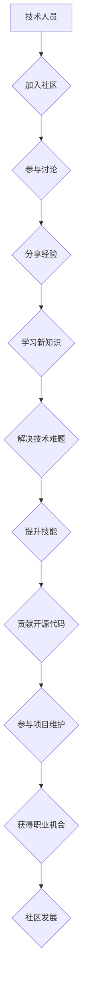

                 

## 技术社区建设：从本地群组到全球性组织

> 关键词：技术社区、开源社区、线上社区、线下社区、社区建设、社区运营、社区治理、技术交流、知识共享

## 1. 背景介绍

在当今科技日新月异的时代，技术社区扮演着越来越重要的角色。它们不仅是技术人员交流学习、分享经验的平台，也是推动技术创新、促进行业发展的重要力量。从最初的线下技术沙龙到如今遍布全球的线上社区，技术社区的形态和规模不断演变，其影响力也日益扩大。

然而，建设一个成功的技术社区并非易事。它需要精心策划、持续运营和有效的治理。本文将从本地群组到全球性组织，探讨技术社区建设的各个方面，并分享一些经验和建议。

## 2. 核心概念与联系

**2.1 技术社区的定义**

技术社区是指围绕特定技术领域或兴趣爱好，由技术人员、爱好者、开发者等群体组成的自发性或组织性网络。

**2.2 技术社区的类型**

技术社区可以根据其规模、地域、目标、组织形式等方面进行分类。常见的类型包括：

* **本地群组:** 聚集在特定地理位置的技术人员，通常以线下活动为主。
* **线上社区:** 通过网络平台，如论坛、社交媒体、在线聊天室等，连接全球的技术人员。
* **开源社区:** 围绕开源软件或项目而形成的社区，以代码贡献、技术讨论和项目维护为主要活动。
* **专业社区:** 聚焦特定技术领域或行业，如人工智能、云计算、数据科学等。

**2.3 技术社区的价值**

技术社区为其成员提供了以下价值：

* **知识共享:** 成员可以分享技术经验、学习新知识、解决技术难题。
* **技术交流:** 成员可以与同行交流，探讨技术趋势，促进技术创新。
* **职业发展:** 成员可以拓展人脉，获得职业机会，提升自身价值。
* **社区归属感:** 成员可以找到志同道合的朋友，获得情感支持和归属感。

**2.4 技术社区的架构**

技术社区的架构通常包括以下几个关键要素：

* **平台:** 提供社区成员交流、分享和协作的线上或线下空间。
* **内容:** 包括技术文章、代码示例、项目文档、讨论话题等。
* **社区运营:** 包括社区管理、活动组织、规则制定、用户维护等。
* **治理机制:** 包括社区决策、贡献奖励、冲突解决等。

**Mermaid 流程图**



## 3. 核心算法原理 & 具体操作步骤

**3.1 算法原理概述**

技术社区建设的核心算法原理在于构建一个高效的知识共享和技术交流平台，并通过有效的社区运营和治理机制，促进社区成员的活跃度和参与度。

**3.2 算法步骤详解**

1. **社区定位和目标设定:** 确定社区的主题、目标用户群体和发展方向。
2. **平台搭建和内容建设:** 选择合适的平台，并根据社区主题和目标用户群体，构建丰富的内容体系。
3. **社区运营和推广:** 组织线下活动、线上活动、技术分享会等，吸引和留住社区成员。
4. **社区治理和规则制定:** 制定社区规则，维护社区秩序，解决社区冲突。
5. **数据分析和优化:** 收集社区数据，分析用户行为，不断优化社区运营策略。

**3.3 算法优缺点**

* **优点:** 能够有效促进技术交流、知识共享和技术创新。
* **缺点:** 需要投入大量的时间和精力进行运营和维护，并面临社区成员流失、内容质量下降等挑战。

**3.4 算法应用领域**

技术社区建设的算法原理广泛应用于开源软件社区、技术论坛、行业协会、企业内部技术团队等领域。

## 4. 数学模型和公式 & 详细讲解 & 举例说明

**4.1 数学模型构建**

我们可以使用网络理论中的图论模型来描述技术社区的结构。其中，社区成员作为节点，彼此之间的关系作为边。

**4.2 公式推导过程**

* **节点度:**  节点度表示节点连接的边的数量，可以用来衡量社区成员的影响力。
* **聚类系数:** 聚类系数表示节点与其邻居节点之间连接的程度，可以用来衡量社区的凝聚力。
* **平均路径长度:** 平均路径长度表示从一个节点到另一个节点的平均路径长度，可以用来衡量社区的连通性。

**4.3 案例分析与讲解**

例如，我们可以通过分析开源软件社区的图论模型，来了解社区成员的活跃度、贡献度和影响力。

## 5. 项目实践：代码实例和详细解释说明

**5.1 开发环境搭建**

* 选择合适的编程语言和框架，例如 Python 和 Django。
* 安装必要的软件包，例如数据库、Web服务器等。

**5.2 源代码详细实现**

```python
# 用户模型
class User(models.Model):
    username = models.CharField(max_length=255)
    email = models.EmailField()
    # ... 其他字段

# 文章模型
class Article(models.Model):
    title = models.CharField(max_length=255)
    content = models.TextField()
    author = models.ForeignKey(User, on_delete=models.CASCADE)
    # ... 其他字段
```

**5.3 代码解读与分析**

以上代码示例展示了技术社区平台的基本模型，包括用户模型和文章模型。

**5.4 运行结果展示**

运行代码后，可以搭建一个简单的技术社区平台，用户可以注册、登录、发布文章、评论文章等。

## 6. 实际应用场景

技术社区广泛应用于以下场景：

* **开源软件社区:** 促进开源软件的开发和维护，例如 Linux、Apache、MySQL 等。
* **技术论坛:** 提供技术交流和问题解答平台，例如 Stack Overflow、GitHub Discussions 等。
* **行业协会:** 组织行业技术交流活动，促进行业发展，例如 IEEE、ACM 等。
* **企业内部技术团队:** 促进团队成员之间的技术交流和协作，例如 Google Developer Groups、Microsoft Tech Community 等。

**6.4 未来应用展望**

随着人工智能、虚拟现实等技术的不断发展，技术社区将更加智能化、个性化和沉浸式。

## 7. 工具和资源推荐

**7.1 学习资源推荐**

* **书籍:** 《社区构建指南》、《开源社区运营实践》
* **网站:**  社区学院、社区运营联盟
* **课程:**  Coursera、Udemy 等平台上的社区运营课程

**7.2 开发工具推荐**

* **平台:**  Discourse、NodeBB、Flarum 等
* **数据库:**  MySQL、PostgreSQL、MongoDB 等
* **Web服务器:**  Nginx、Apache 等

**7.3 相关论文推荐**

* **论文:**  “社区网络的结构和演化”，“开源社区的治理机制”

## 8. 总结：未来发展趋势与挑战

**8.1 研究成果总结**

技术社区建设是一个复杂的系统工程，需要综合考虑技术、运营、治理等多个方面。

**8.2 未来发展趋势**

未来技术社区将更加智能化、个性化和沉浸式。

**8.3 面临的挑战**

技术社区建设面临着社区成员流失、内容质量下降、治理难度增加等挑战。

**8.4 研究展望**

未来研究将更加关注技术社区的智能化、个性化和沉浸式体验，以及如何有效解决社区治理和维护问题。

## 9. 附录：常见问题与解答

**常见问题:**

* 如何吸引和留住社区成员？
* 如何维护社区秩序和解决冲突？
* 如何评估社区的成功与否？

**解答:**

* 通过组织线下活动、线上活动、技术分享会等，吸引和留住社区成员。
* 制定社区规则，维护社区秩序，解决社区冲突。
* 通过社区活跃度、用户参与度、内容质量等指标，评估社区的成功与否。


作者：禅与计算机程序设计艺术 / Zen and the Art of Computer Programming 
<end_of_turn>

