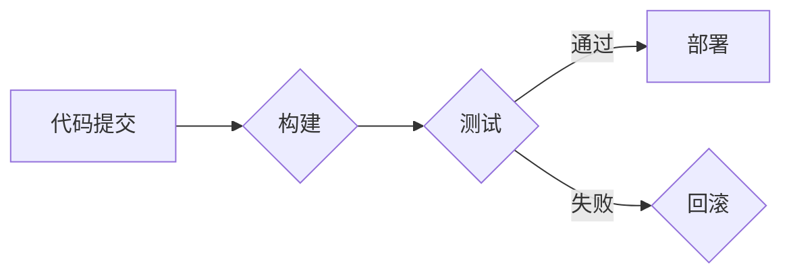

                 

## 持续集成和持续部署：自动化软件发布

> 关键词：持续集成、持续部署、DevOps、自动化测试、软件发布、版本控制、构建自动化、部署自动化

### 1. 背景介绍

在当今快速迭代的软件开发环境中，高效、可靠的软件发布流程至关重要。传统的软件发布流程往往冗长、繁琐，容易出现错误，难以满足快速交付的需求。持续集成 (Continuous Integration，CI) 和持续部署 (Continuous Deployment，CD) 应运而生，旨在通过自动化构建、测试和部署流程，提高软件开发效率，降低发布风险。

CI/CD 是一种软件开发和运维实践，强调频繁、自动化地将代码集成到主分支，并自动构建、测试和部署应用程序。它旨在消除软件开发和运维之间的壁垒，促进团队协作，并加速软件交付速度。

### 2. 核心概念与联系

#### 2.1 持续集成 (CI)

持续集成是指开发人员频繁地将代码提交到一个共享的代码库中，并自动触发构建和测试流程。每次代码提交都会被自动构建成可执行软件，并进行一系列测试，包括单元测试、集成测试和构建测试。如果测试通过，则代码会被合并到主分支，否则会阻止合并，并提示开发人员解决问题。

#### 2.2 持续部署 (CD)

持续部署是指将经过测试的代码自动部署到生产环境中。它可以是自动部署到测试环境、预生产环境，最终部署到生产环境，也可以是直接部署到生产环境。持续部署的目标是实现代码的自动化交付，减少人为干预，提高部署效率和可靠性。

#### 2.3 CI/CD 流程图



### 3. 核心算法原理 & 具体操作步骤

#### 3.1 算法原理概述

CI/CD 的核心算法原理是基于自动化构建、测试和部署的流程。它利用版本控制系统、构建自动化工具和部署自动化工具，实现代码的自动化管理、构建和交付。

#### 3.2 算法步骤详解

1. **代码提交:** 开发人员将代码提交到共享的代码库中。
2. **构建触发:** 代码提交会触发构建自动化工具，自动构建应用程序。
3. **单元测试:** 构建完成后，自动执行单元测试，验证每个代码模块的正确性。
4. **集成测试:** 构建完成后，自动执行集成测试，验证不同代码模块之间的交互是否正确。
5. **构建测试:** 构建完成后，自动执行构建测试，验证应用程序的构建质量。
6. **测试结果反馈:** 测试结果会反馈到开发人员，如果测试通过，则代码会被合并到主分支，否则会阻止合并，并提示开发人员解决问题。
7. **部署触发:** 当代码被合并到主分支后，会触发部署自动化工具，自动部署应用程序到测试环境、预生产环境或生产环境。
8. **部署结果监控:** 部署完成后，会监控应用程序的运行状态，并记录部署日志。

#### 3.3 算法优缺点

**优点:**

* **提高开发效率:** 自动化构建、测试和部署流程，减少了人为干预，提高了开发效率。
* **降低发布风险:** 频繁的测试和部署，可以及时发现和解决问题，降低发布风险。
* **提高软件质量:** 自动化的测试流程，可以提高软件质量，减少缺陷。
* **促进团队协作:** CI/CD 鼓励团队成员频繁地将代码提交到共享代码库中，促进团队协作。

**缺点:**

* **需要投入时间和精力:** 建立和维护 CI/CD 流程需要投入时间和精力。
* **需要专业的工具和技术:** CI/CD 需要使用专业的工具和技术，需要开发人员具备相应的技能。
* **可能导致部署失败:** 如果部署自动化工具配置不当，可能会导致部署失败。

#### 3.4 算法应用领域

CI/CD 广泛应用于各种软件开发领域，例如：

* Web 应用开发
* 移动应用开发
* 云计算平台开发
* 数据分析平台开发
* 嵌入式系统开发

### 4. 数学模型和公式 & 详细讲解 & 举例说明

CI/CD 的核心算法原理可以抽象为一个数学模型，用于描述软件发布流程的效率和可靠性。

#### 4.1 数学模型构建

假设：

*  `N` 为软件开发团队的成员数量
*  `C` 为代码提交频率
*  `T` 为测试覆盖率
*  `D` 为部署频率

则软件发布流程的效率和可靠性可以表示为以下公式：

```latex
E = \frac{C * T * D}{N}
```

其中：

* `E` 为软件发布流程的效率和可靠性指标

#### 4.2 公式推导过程

该公式的推导过程如下：

* `C * T * D` 表示软件发布流程的总次数，即代码提交次数乘以测试覆盖率乘以部署频率。
* `N` 表示软件开发团队的成员数量，即参与软件发布流程的人员数量。

因此，`E` 的值越大，表示软件发布流程的效率和可靠性越高。

#### 4.3 案例分析与讲解

假设一个软件开发团队有 5 名成员，代码提交频率为每天 10 次，测试覆盖率为 90%，部署频率为每周 2 次。

则该团队的软件发布流程的效率和可靠性指标为：

```latex
E = \frac{10 * 0.9 * 2}{5} = 3.6
```

该值表明该团队的软件发布流程效率和可靠性较高。

### 5. 项目实践：代码实例和详细解释说明

#### 5.1 开发环境搭建

CI/CD 的开发环境搭建需要以下工具和软件：

* 版本控制系统 (例如 Git)
* 构建自动化工具 (例如 Jenkins, Travis CI)
* 测试自动化工具 (例如 JUnit, Selenium)
* 部署自动化工具 (例如 Ansible, Puppet)

#### 5.2 源代码详细实现

以下是一个简单的 CI/CD 流程的代码示例，使用 Jenkins 构建和部署一个 Java 应用：

```xml
<project>
  <actions/>
  <description></description>
  <keepDependencies>false</keepDependencies>
  <properties>
    <hudson.model.ParametersDefinitionProperty>
      <parameterDefinitions>
        <hudson.model.StringParameterDefinition>
          <name>env</name>
          <description>环境</description>
          <defaultValue>dev</defaultValue>
        </hudson.model.StringParameterDefinition>
      </parameterDefinitions>
    </hudson.model.ParametersDefinitionProperty>
  </properties>
  <scm class="hudson.scm.NullSCM"/>
  <canRoam>true</canRoam>
  <disabled>false</disabled>
  <triggers>
    <hudson.triggers.SCMTrigger>
      <spec>H/1 * * * *</spec>
    </hudson.triggers.SCMTrigger>
  </triggers>
  <concurrentBuild>false</concurrentBuild>
  <builders>
    <hudson.tasks.Shell>
      <command>mvn clean package</command>
    </hudson.tasks.Shell>
  </builders>
  <publishers>
    <hudson.plugins.deploy.DeployPublisher>
      <publishers>
        <hudson.plugins.deploy.ArtifactDeployer>
          <remote>
            <hostname>your-server</hostname>
            <username>your-username</username>
            <password>your-password</password>
          </remote>
          <artifactName>target/your-app.war</artifactName>
          <remoteDirectory>/path/to/deploy</remoteDirectory>
          <publishOverwrite>true</publishOverwrite>
        </hudson.plugins.deploy.ArtifactDeployer>
      </publishers>
    </hudson.plugins.deploy.DeployPublisher>
  </publishers>
  <buildWrappers/>
</project>
```

#### 5.3 代码解读与分析

该代码定义了一个 Jenkins 的构建任务，该任务会自动构建一个 Java 应用，并将其部署到指定的服务器。

* `scm` 节点定义了版本控制系统，这里使用的是 NullSCM，表示不使用版本控制系统。
* `triggers` 节点定义了构建的触发条件，这里使用的是 SCM 触发器，表示每次代码提交都会触发构建。
* `builders` 节点定义了构建的步骤，这里使用的是 Shell 命令，执行 `mvn clean package` 命令构建应用程序。
* `publishers` 节点定义了部署的步骤，这里使用的是 DeployPublisher 插件，将构建好的应用程序部署到指定的服务器。

#### 5.4 运行结果展示

当代码提交到代码库后，Jenkins 会自动触发构建任务，执行构建和部署步骤。如果构建和部署成功，则会显示成功信息，否则会显示错误信息。

### 6. 实际应用场景

CI/CD 广泛应用于各种软件开发场景，例如：

#### 6.1 Web 应用开发

CI/CD 可以帮助 Web 应用开发团队快速迭代，频繁发布新功能，并及时修复 bug。

#### 6.2 移动应用开发

CI/CD 可以帮助移动应用开发团队自动化构建和测试移动应用，并快速部署到 App Store 和 Google Play。

#### 6.3 云计算平台开发

CI/CD 可以帮助云计算平台开发团队自动化部署和管理云服务，提高平台的可靠性和可用性。

#### 6.4 数据分析平台开发

CI/CD 可以帮助数据分析平台开发团队自动化构建和部署数据分析模型，并快速将模型部署到生产环境中。

#### 6.5 嵌入式系统开发

CI/CD 可以帮助嵌入式系统开发团队自动化构建和测试嵌入式软件，并快速部署到嵌入式设备中。

#### 6.6 未来应用展望

随着云计算、容器化和微服务架构的兴起，CI/CD 将会更加广泛地应用于各种软件开发场景。未来，CI/CD 将会更加智能化、自动化和可扩展，能够更好地支持软件开发团队的快速迭代和高效交付。

### 7. 工具和资源推荐

#### 7.1 学习资源推荐

* **书籍:**
    * "Continuous Delivery: Reliable Software Releases through Build, Test, and Deployment Automation" by Jez Humble and David Farley
    * "The Phoenix Project: A Novel About IT, DevOps, and Helping Your Business Win" by Gene Kim, Kevin Behr, and George Spafford
* **网站:**
    * https://www.atlassian.com/continuous-integration/
    * https://www.jenkins.io/
    * https://www.travis-ci.com/

#### 7.2 开发工具推荐

* **版本控制系统:** Git
* **构建自动化工具:** Jenkins, Travis CI, CircleCI
* **测试自动化工具:** JUnit, Selenium, Cucumber
* **部署自动化工具:** Ansible, Puppet, Chef

#### 7.3 相关论文推荐

* "Continuous Integration and Continuous Delivery: A Literature Review" by David A. Wheeler
* "DevOps: A Software Development Methodology for the 21st Century" by Gene Kim, Jez Humble, and Patrick Debois

### 8. 总结：未来发展趋势与挑战

#### 8.1 研究成果总结

CI/CD 已经成为软件开发行业中一种成熟的实践，它可以帮助软件开发团队提高开发效率、降低发布风险和提高软件质量。

#### 8.2 未来发展趋势

* **更加智能化:** CI/CD 工具将更加智能化，能够自动识别和解决问题，并提供更精准的反馈。
* **更加自动化:** CI/CD 流程将更加自动化，减少人为干预，提高效率。
* **更加可扩展:** CI/CD 工具将更加可扩展，能够支持更复杂的软件开发场景。

#### 8.3 面临的挑战

* **文化转变:** CI/CD 需要改变软件开发团队的文化和工作方式，这需要时间和努力。
* **工具集成:** 不同的 CI/CD 工具之间需要进行集成，这可能会带来一些技术挑战。
* **安全问题:** CI/CD 流程需要考虑安全问题，防止代码泄露和攻击。

#### 8.4 研究展望

未来，CI/CD 研究将继续关注以下几个方面:

* **人工智能驱动的 CI/CD:** 利用人工智能技术，提高 CI/CD 工具的智能化水平。
* **云原生 CI/CD:** 针对云原生应用开发场景，构建更加高效和灵活的 CI/CD 流程。
* **安全 CI/CD:** 研究和开发更加安全的 CI/CD 工具和流程，防止代码泄露和攻击。

### 9. 附录：常见问题与解答

#### 9.1 什么是持续集成？

持续集成是指开发人员频繁地将代码提交到共享的代码库中，并自动触发构建和测试流程。

#### 9.2 什么是持续部署？

持续部署是指将经过测试的代码自动部署到生产环境中。

#### 9.3 CI/CD 的优势是什么？

CI/CD 的优势包括：提高开发效率、降低发布风险、提高软件质量、促进团队协作。

#### 9.4 如何搭建 CI/CD 环境？

搭建 CI/CD 环境需要以下工具和软件：版本控制系统、构建自动化工具、测试自动化工具、部署自动化工具。

#### 9.5 CI/CD 的挑战是什么？

CI/CD 的挑战包括：文化转变、工具集成、安全问题。


作者：禅与计算机程序设计艺术 / Zen and the Art of Computer Programming 
<end_of_turn>

