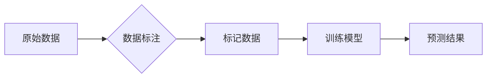

                 

## 数据标注：人工智能背后的无名英雄

> 关键词：数据标注、人工智能、机器学习、深度学习、监督学习、数据质量、标注工具、标注人员

### 1. 背景介绍

人工智能（AI）近年来发展迅速，在各个领域取得了令人瞩目的成就。从语音识别到图像识别，从自然语言处理到自动驾驶，AI技术的应用无处不在。然而，支撑这些技术的背后，有一个默默无闻的英雄——数据标注。

数据标注是人工智能训练数据的重要环节，它指的是对原始数据进行人工标记和分类，为机器学习算法提供可理解的训练样本。简单来说，就像给机器学习模型“讲故事”一样，我们需要用清晰的标签和注释，让机器理解数据的含义和关系。

### 2. 核心概念与联系

数据标注是机器学习和深度学习的基础，它与监督学习密切相关。

**监督学习**是一种机器学习算法，它通过学习标记好的训练数据，来预测未知数据的类别或值。数据标注就是为监督学习算法提供这些标记好的训练数据。

**数据标注流程**



### 3. 核心算法原理 & 具体操作步骤

#### 3.1 算法原理概述

数据标注算法本身并不存在独立的算法，而是根据不同的数据类型和任务需求，采用不同的标注方法和工具。常见的标注方法包括：

* **分类标注:** 将数据分为不同的类别，例如图像识别中的“猫”、“狗”、“鸟”等。
* **边界框标注:** 在图像中绘制矩形框，标记目标物体的区域，例如车辆检测中的车身区域。
* **关键点标注:** 在图像中标记目标物体的关键点，例如人脸识别中的眼睛、鼻子、嘴巴等。
* **序列标注:** 对文本序列进行标记，例如命名实体识别中的“人名”、“地名”、“机构名”等。

#### 3.2 算法步骤详解

数据标注的具体步骤取决于所采用的标注方法和工具。一般来说，包括以下几个步骤：

1. **数据收集:** 收集需要标注的数据，例如图像、文本、音频等。
2. **数据预处理:** 对数据进行清洗、格式化等预处理，使其符合标注工具的要求。
3. **标注工具选择:** 选择合适的标注工具，例如LabelImg、CVAT、BRAT等。
4. **数据标注:** 根据标注方法，对数据进行人工标记和分类。
5. **数据验证:** 对标注结果进行验证，确保数据的准确性和一致性。
6. **数据导出:** 将标注好的数据导出为机器学习算法可以识别的格式，例如CSV、JSON等。

#### 3.3 算法优缺点

**优点:**

* **高精度:** 人工标注可以达到较高的精度，能够准确地标记数据的类别和关系。
* **灵活度高:** 可以根据不同的任务需求，采用不同的标注方法和工具。
* **可解释性强:** 标注结果可以被人类理解和解释，有助于提高模型的可解释性。

**缺点:**

* **成本高:** 人工标注需要大量的人力投入，成本较高。
* **效率低:** 人工标注的速度相对较慢，难以满足大规模数据的标注需求。
* **标注人员主观性:** 标注结果可能受到标注人员主观因素的影响，导致标注结果的偏差。

#### 3.4 算法应用领域

数据标注在人工智能的各个领域都有广泛的应用，例如：

* **图像识别:** 用于识别图像中的物体、场景、人物等。
* **语音识别:** 用于识别语音中的文字、命令等。
* **自然语言处理:** 用于识别文本中的情感、主题、实体等。
* **自动驾驶:** 用于识别道路上的车辆、行人、交通信号等。
* **医疗诊断:** 用于识别医学图像中的病灶、异常等。

### 4. 数学模型和公式 & 详细讲解 & 举例说明

数据标注本身并不涉及复杂的数学模型和公式，但它与机器学习算法密切相关，而机器学习算法的训练过程涉及到大量的数学公式和模型。

#### 4.1 数学模型构建

机器学习算法的训练过程本质上是一个参数优化过程，目标是找到最优的参数，使得模型在训练数据上表现最佳。常用的数学模型包括：

* **线性回归:** 用于预测连续值，模型假设数据之间存在线性关系。
* **逻辑回归:** 用于分类问题，模型假设数据之间存在非线性关系。
* **支持向量机:** 用于分类问题，模型试图找到一个最佳的分隔超平面，将不同类别的数据分开。
* **神经网络:** 用于复杂的数据处理，模型由多个层组成，每个层包含多个神经元，通过连接和激活函数，学习数据的复杂特征。

#### 4.2 公式推导过程

每个机器学习算法都有其对应的数学公式和推导过程，例如线性回归的损失函数为均方误差，逻辑回归的损失函数为交叉熵等。这些公式的推导过程通常涉及到微积分、概率论等数学知识。

#### 4.3 案例分析与讲解

例如，在图像识别任务中，可以使用卷积神经网络（CNN）进行训练。CNN模型通过卷积层、池化层、全连接层等结构，学习图像的特征，并将其分类。训练过程需要使用大量的标注好的图像数据，通过反向传播算法，不断调整模型的参数，使得模型在识别图像时能够达到更高的准确率。

### 5. 项目实践：代码实例和详细解释说明

#### 5.1 开发环境搭建

数据标注项目可以使用Python语言进行开发，常用的库包括：

* **OpenCV:** 用于图像处理和标注。
* **TensorFlow:** 用于深度学习模型的训练和部署。
* **PyTorch:** 用于深度学习模型的训练和部署。
* **LabelImg:** 用于图像标注的开源工具。

#### 5.2 源代码详细实现

以下是一个简单的图像边界框标注的代码示例，使用OpenCV和LabelImg工具：

```python
import cv2
import numpy as np

# 加载图像
image = cv2.imread("image.jpg")

# 创建标注窗口
cv2.namedWindow("Image")

# 设置标注回调函数
def draw_rectangle(event, x, y, flags, param):
    global rect
    if event == cv2.EVENT_LBUTTONDOWN:
        rect = [(x, y)]
    elif event == cv2.EVENT_MOUSEMOVE:
        if len(rect) > 0:
            rect[-1] = (x, y)
    elif event == cv2.EVENT_LBUTTONUP:
        rect.append((x, y))

# 设置标注区域
rect = []

# 绑定回调函数
cv2.setMouseCallback("Image", draw_rectangle)

# 显示图像
while True:
    cv2.imshow("Image", image)
    if cv2.waitKey(1) & 0xFF == ord("q"):
        break

# 保存标注结果
cv2.destroyAllWindows()
```

#### 5.3 代码解读与分析

这段代码首先加载图像，然后创建标注窗口。当用户点击鼠标左键时，会记录鼠标位置，并在图像上绘制矩形框。当用户释放鼠标左键时，会完成矩形框的绘制。

#### 5.4 运行结果展示

运行这段代码后，用户可以在图像上自由绘制矩形框，并保存标注结果。

### 6. 实际应用场景

数据标注在人工智能的各个领域都有广泛的应用，例如：

#### 6.1 自动驾驶

自动驾驶系统需要识别道路上的车辆、行人、交通信号等，数据标注是训练自动驾驶模型的关键环节。

#### 6.2 医疗诊断

医疗诊断系统需要识别医学图像中的病灶、异常等，数据标注可以帮助医生更快、更准确地诊断疾病。

#### 6.3 语音识别

语音识别系统需要识别语音中的文字、命令等，数据标注可以帮助训练语音识别模型，提高其识别准确率。

#### 6.4 自然语言处理

自然语言处理系统需要理解和处理人类语言，数据标注可以帮助训练自然语言处理模型，例如情感分析、文本分类等。

#### 6.5 未来应用展望

随着人工智能技术的不断发展，数据标注的需求将会越来越大。未来，数据标注将会更加智能化、自动化，例如：

* **主动学习:** 模型可以自动选择需要标注的数据，提高标注效率。
* **半监督学习:** 利用少量标注数据和大量未标注数据，训练模型，降低标注成本。
* **联邦学习:** 将数据分散在不同的设备上，进行联合训练，保护数据隐私。

### 7. 工具和资源推荐

#### 7.1 学习资源推荐

* **Stanford CS224N: Natural Language Processing with Deep Learning:** https://web.stanford.edu/class/cs224n/
* **Deep Learning Specialization by Andrew Ng:** https://www.deeplearning.ai/

#### 7.2 开发工具推荐

* **LabelImg:** https://github.com/tzutalin/labelImg
* **CVAT:** https://cvat.ai/
* **BRAT:** https://brat.nlplab.org/

#### 7.3 相关论文推荐

* **Attention Is All You Need:** https://arxiv.org/abs/1706.03762
* **BERT: Pre-training of Deep Bidirectional Transformers for Language Understanding:** https://arxiv.org/abs/1810.04805

### 8. 总结：未来发展趋势与挑战

数据标注是人工智能发展的重要基础，它将继续在人工智能的各个领域发挥着关键作用。未来，数据标注将会更加智能化、自动化，降低成本，提高效率。

#### 8.1 研究成果总结

数据标注技术已经取得了显著的进展，例如：

* **主动学习:** 模型可以自动选择需要标注的数据，提高标注效率。
* **半监督学习:** 利用少量标注数据和大量未标注数据，训练模型，降低标注成本。
* **联邦学习:** 将数据分散在不同的设备上，进行联合训练，保护数据隐私。

#### 8.2 未来发展趋势

* **更智能化的标注工具:** 利用人工智能技术，自动识别和标注数据，降低人工标注成本。
* **更有效的标注方法:** 开发新的标注方法，提高标注效率和准确率。
* **更广泛的应用场景:** 数据标注技术将应用于更多领域，例如医疗、教育、金融等。

#### 8.3 面临的挑战

* **数据质量问题:** 数据标注的质量直接影响模型的性能，需要保证数据标注的准确性和一致性。
* **标注成本高:** 人工标注成本仍然较高，需要寻找更有效的标注方法，降低成本。
* **数据隐私问题:** 数据标注过程中需要处理大量敏感数据，需要保护数据隐私。

#### 8.4 研究展望

未来，数据标注技术将继续发展，朝着更智能化、自动化、高效的方向发展。


### 9. 附录：常见问题与解答

#### 9.1 什么是数据标注？

数据标注是指对原始数据进行人工标记和分类，为机器学习算法提供可理解的训练样本。

#### 9.2 数据标注的目的是什么？

数据标注的目的是为机器学习算法提供训练数据，帮助算法学习数据的特征和规律，从而能够完成特定的任务。

#### 9.3 数据标注有哪些方法？

常见的标注方法包括分类标注、边界框标注、关键点标注、序列标注等。

#### 9.4 数据标注的成本高吗？

数据标注的成本取决于数据的类型、数量和标注的复杂程度。一般来说，人工标注成本较高，但随着人工智能技术的进步，数据标注将会更加智能化、自动化，降低成本。


作者：禅与计算机程序设计艺术 / Zen and the Art of Computer Programming 
<end_of_turn>

