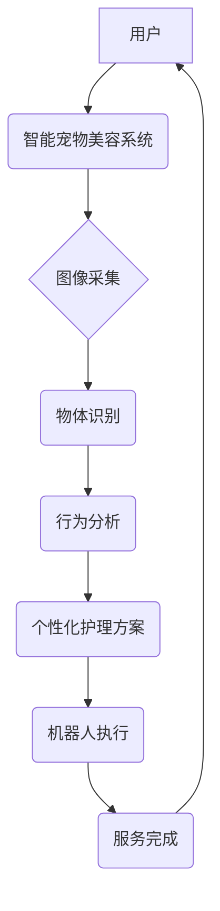

                 

## 智能宠物美容创业：自动化宠物护理

> 关键词：人工智能、机器学习、计算机视觉、机器人技术、宠物护理、自动化、创业

### 1. 背景介绍

随着全球宠物经济的蓬勃发展，宠物美容行业也迎来了快速增长。然而，传统宠物美容服务面临着诸多挑战，例如服务成本高、预约难、时间成本长等。同时，宠物主人对宠物的健康和舒适度要求越来越高，对智能化、便捷化的宠物护理服务需求日益增长。

自动化宠物护理技术作为一种新兴技术，为宠物美容行业带来了新的机遇。通过人工智能、机器学习、计算机视觉等技术的应用，可以实现宠物美容服务的自动化、智能化和个性化，从而提升服务效率、降低服务成本，并提供更优质的宠物护理体验。

### 2. 核心概念与联系

**2.1 核心概念**

* **人工智能 (AI):** 人工智能是指模拟人类智能行为的计算机系统，包括学习、推理、决策、感知等能力。
* **机器学习 (ML):** 机器学习是人工智能的一个子领域，通过算法训练模型，使模型能够从数据中学习并进行预测或分类。
* **计算机视觉 (CV):** 计算机视觉是赋予计算机“看”的能力，通过算法分析图像和视频数据，识别物体、场景和行为。
* **机器人技术:** 机器人技术是指设计、制造和控制机器人的技术，包括机械设计、控制算法、传感器技术等。

**2.2 架构关系**



**2.3 核心联系**

智能宠物美容系统通过将人工智能、机器学习、计算机视觉和机器人技术相结合，实现宠物美容服务的自动化和智能化。

* **图像采集:** 利用摄像头采集宠物的图像数据。
* **物体识别:** 利用计算机视觉算法识别宠物的身体部位、毛发状态等信息。
* **行为分析:** 利用机器学习算法分析宠物的行为模式，例如是否紧张、是否舒适等。
* **个性化护理方案:** 根据宠物的特征和行为，制定个性化的美容方案。
* **机器人执行:** 利用机器人技术执行美容方案，例如梳毛、洗毛、吹毛等。

### 3. 核心算法原理 & 具体操作步骤

**3.1 算法原理概述**

智能宠物美容系统的核心算法包括图像识别、行为分析和路径规划等。

* **图像识别:** 利用卷积神经网络 (CNN) 算法识别宠物的身体部位、毛发状态等信息。CNN 是一种专门用于处理图像数据的深度学习算法，能够自动学习图像特征，并进行分类和识别。
* **行为分析:** 利用循环神经网络 (RNN) 算法分析宠物的行为模式，例如是否紧张、是否舒适等。RNN 是一种专门用于处理序列数据的深度学习算法，能够学习时间序列中的依赖关系，并进行预测和分类。
* **路径规划:** 利用 A* 算法规划机器人执行美容方案的路径，避免碰撞和提高效率。A* 是一种常用的路径规划算法，能够在有限的时间内找到最优路径。

**3.2 算法步骤详解**

1. **图像采集:** 利用摄像头采集宠物的图像数据。
2. **图像预处理:** 对图像进行预处理，例如调整亮度、对比度、去除噪声等，以提高识别精度。
3. **物体识别:** 利用 CNN 算法识别宠物的身体部位、毛发状态等信息。
4. **行为分析:** 利用 RNN 算法分析宠物的行为模式，例如是否紧张、是否舒适等。
5. **个性化护理方案:** 根据宠物的特征和行为，制定个性化的美容方案。
6. **路径规划:** 利用 A* 算法规划机器人执行美容方案的路径，避免碰撞和提高效率。
7. **机器人执行:** 利用机器人技术执行美容方案，例如梳毛、洗毛、吹毛等。
8. **服务完成:** 美容服务完成后，系统会提示用户，并提供后续护理建议。

**3.3 算法优缺点**

* **优点:**
    * 自动化程度高，提高服务效率。
    * 个性化程度高，满足不同宠物的需求。
    * 降低服务成本，提高服务可负担性。
* **缺点:**
    * 技术复杂，开发成本高。
    * 机器人技术尚不成熟，存在安全风险。
    * 无法完全替代人工服务，需要人工监督和干预。

**3.4 算法应用领域**

* **宠物美容:** 自动化宠物洗毛、吹毛、梳毛等服务。
* **宠物医疗:** 自动化宠物体检、疾病诊断等服务。
* **宠物训练:** 自动化宠物训练、行为矫正等服务。
* **宠物陪伴:** 自动化宠物陪伴、互动等服务。

### 4. 数学模型和公式 & 详细讲解 & 举例说明

**4.1 数学模型构建**

智能宠物美容系统可以构建一个基于深度学习的数学模型，用于识别宠物的特征和行为，并制定个性化的美容方案。

* **图像识别模型:** 利用 CNN 算法构建一个图像识别模型，输入宠物的图像数据，输出宠物的身体部位、毛发状态等信息。
* **行为分析模型:** 利用 RNN 算法构建一个行为分析模型，输入宠物的行为数据，输出宠物的行为模式，例如是否紧张、是否舒适等。

**4.2 公式推导过程**

CNN 和 RNN 算法的具体公式推导过程较为复杂，涉及大量的数学和统计知识。

* **CNN 算法:** 主要利用卷积核和池化操作来提取图像特征，并通过全连接层进行分类和识别。
* **RNN 算法:** 主要利用循环神经网络结构来学习时间序列中的依赖关系，并通过输出层进行预测和分类。

**4.3 案例分析与讲解**

假设我们有一个智能宠物美容系统，需要识别宠物的毛发状态，并根据毛发状态制定相应的美容方案。

* **图像识别模型:** 系统可以利用 CNN 算法训练一个图像识别模型，输入宠物的图像数据，输出宠物毛发的状态，例如是否脏、是否油腻、是否打结等。
* **行为分析模型:** 系统可以利用 RNN 算法训练一个行为分析模型，输入宠物的行为数据，例如是否舔毛、是否抓挠等，输出宠物毛发状态的预测，例如是否需要洗毛、是否需要梳毛等。

根据模型的输出结果，系统可以制定相应的美容方案，例如：

* **毛发脏:** 进行洗毛和吹毛服务。
* **毛发油腻:** 进行洗毛和梳毛服务。
* **毛发打结:** 进行梳毛和护理服务。

### 5. 项目实践：代码实例和详细解释说明

**5.1 开发环境搭建**

智能宠物美容系统的开发环境需要包含以下软件：

* **操作系统:** Linux 或 Windows
* **编程语言:** Python
* **深度学习框架:** TensorFlow 或 PyTorch
* **计算机视觉库:** OpenCV
* **机器人控制库:** ROS

**5.2 源代码详细实现**

由于篇幅限制，这里只提供部分代码示例，具体实现细节请参考相关开源项目或文献。

```python
# 使用 TensorFlow 构建 CNN 模型
model = tf.keras.models.Sequential([
    tf.keras.layers.Conv2D(32, (3, 3), activation='relu', input_shape=(224, 224, 3)),
    tf.keras.layers.MaxPooling2D((2, 2)),
    tf.keras.layers.Conv2D(64, (3, 3), activation='relu'),
    tf.keras.layers.MaxPooling2D((2, 2)),
    tf.keras.layers.Flatten(),
    tf.keras.layers.Dense(10, activation='softmax')
])

# 使用 PyTorch 构建 RNN 模型
model = nn.Sequential(
    nn.LSTM(128, input_size=10),
    nn.ReLU(),
    nn.Linear(128, 1)
)

# 使用 OpenCV 进行图像处理
img = cv2.imread('pet.jpg')
gray = cv2.cvtColor(img, cv2.COLOR_BGR2GRAY)

# 使用 ROS 控制机器人
rospy.init_node('pet_groomer')
# ...
```

**5.3 代码解读与分析**

* **CNN 模型:** 该代码示例使用 TensorFlow 构建了一个简单的 CNN 模型，用于识别宠物的图像。模型包含卷积层、池化层和全连接层，用于提取图像特征和进行分类。
* **RNN 模型:** 该代码示例使用 PyTorch 构建了一个简单的 RNN 模型，用于分析宠物的行为序列数据。模型包含 LSTM 层、ReLU 激活函数和全连接层，用于学习时间序列中的依赖关系和进行预测。
* **图像处理:** 该代码示例使用 OpenCV 库进行图像处理，例如将彩色图像转换为灰度图像。
* **机器人控制:** 该代码示例使用 ROS 库控制机器人，例如移动、旋转、抓取等动作。

**5.4 运行结果展示**

运行上述代码后，可以实现以下功能：

* **图像识别:** 系统可以识别宠物的图像，并输出宠物的身体部位、毛发状态等信息。
* **行为分析:** 系统可以分析宠物的行为序列数据，并预测宠物毛发状态。
* **个性化护理方案:** 系统可以根据宠物的特征和行为，制定相应的美容方案。
* **机器人执行:** 机器人可以根据美容方案执行相应的动作，例如洗毛、吹毛、梳毛等。

### 6. 实际应用场景

**6.1 智能宠物美容店**

智能宠物美容店可以利用智能宠物美容系统，实现自动化、智能化和个性化的宠物美容服务，提高服务效率和客户体验。

**6.2 在线宠物美容平台**

在线宠物美容平台可以利用智能宠物美容系统，提供远程宠物美容服务，方便宠物主人在家中为宠物进行美容护理。

**6.3 智能宠物护理机器人**

智能宠物护理机器人可以集成智能宠物美容系统，为宠物提供全方位的护理服务，例如洗毛、吹毛、梳毛、喂食、玩耍等。

**6.4 未来应用展望**

随着人工智能、机器学习和机器人技术的不断发展，智能宠物美容系统将拥有更强大的功能和更广泛的应用场景，例如：

* **宠物健康监测:** 通过分析宠物的行为和生理数据，监测宠物的健康状况，并及时提醒宠物主人。
* **宠物个性化护理:** 根据宠物的个体差异，制定个性化的美容和护理方案。
* **宠物情感陪伴:** 通过与宠物互动，了解宠物的情感状态，并提供情感陪伴。

### 7. 工具和资源推荐

**7.1 学习资源推荐**

* **在线课程:** Coursera、edX、Udacity 等平台提供人工智能、机器学习和计算机视觉相关的在线课程。
* **书籍:** 《深度学习》、《机器学习实战》、《计算机视觉》等书籍。
* **开源项目:** TensorFlow、PyTorch、OpenCV 等开源项目。

**7.2 开发工具推荐**

* **编程语言:** Python
* **深度学习框架:** TensorFlow、PyTorch
* **计算机视觉库:** OpenCV
* **机器人控制库:** ROS

**7.3 相关论文推荐**

* **图像识别:** 《ImageNet Classification with Deep Convolutional Neural Networks》
* **行为分析:** 《Recurrent Neural Networks for Sequence Modeling》
* **路径规划:** 《A* Search Algorithm》

### 8. 总结：未来发展趋势与挑战

**8.1 研究成果总结**

智能宠物美容系统是人工智能、机器学习、计算机视觉和机器人技术相结合的产物，具有自动化、智能化和个性化的特点，能够为宠物美容行业带来革命性的变革。

**8.2 未来发展趋势**

* **更强大的算法:** 随着人工智能技术的不断发展，智能宠物美容系统的算法将更加强大，能够识别更复杂的宠物特征和行为，并制定更个性化的美容方案。
* **更智能的机器人:** 机器人的技术将更加成熟，能够执行更复杂的操作，并与宠物更加自然地互动。
* **更广泛的应用场景:** 智能宠物美容系统将应用于更广泛的场景，例如宠物医疗、宠物训练、宠物陪伴等。

**8.3 面临的挑战**

* **技术复杂性:** 智能宠物美容系统的开发需要整合多种技术，技术难度较高。
* **数据获取和标注:** 训练智能宠物美容系统的算法需要大量的宠物数据，数据获取和标注成本较高。
* **安全性和可靠性:** 机器人技术尚不成熟，存在安全风险，需要确保系统的安全性和可靠性。

**8.4 研究展望**

未来，智能宠物美容系统将朝着更智能、更安全、更可靠的方向发展，为宠物主人提供更加便捷、高效、个性化的宠物护理服务。


### 9. 附录：常见问题与解答

**9.1  智能宠物美容系统是否会取代人工美容师？**

智能宠物美容系统可以提高服务效率和降低成本，但无法完全取代人工美容师。人工美容师拥有丰富的经验和专业技能，能够根据宠物的个体差异提供更个性化的服务，并与宠物建立更深厚的感情。

**9.2  智能宠物美容系统的安全性如何保证？**

智能宠物美容系统的安全性是至关重要的。开发人员需要采取多种措施来确保系统的安全性和可靠性，例如：

* 使用安全的硬件和软件。
* 进行严格的测试和验证。
* 设置安全防护机制，防止意外操作。
* 提供完善的售后服务。

**9.3  智能宠物美容系统的成本如何？**

智能宠物美容系统的成本取决于系统的复杂程度和功能。目前，智能宠物美容系统的成本相对较高，但随着技术的进步和规模化生产，成本将会逐渐降低。


作者：禅与计算机程序设计艺术 / Zen and the Art of Computer Programming 
<end_of_turn>

