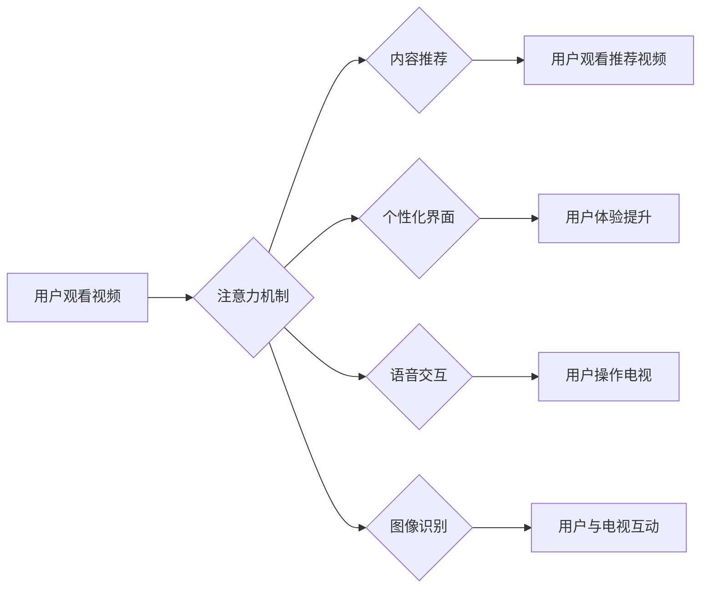

                 

## 智能电视：客厅场景下的注意力之争

> 关键词：智能电视、注意力机制、自然语言处理、计算机视觉、深度学习、用户体验、客厅场景

## 1. 背景介绍

智能电视已经成为现代家庭必备的娱乐中心，其功能不再局限于简单的视频播放，而是逐渐向智能化、交互化、个性化方向发展。然而，随着智能电视功能的不断丰富，用户在客厅场景下的注意力也被越来越多的信息和应用所分散。如何有效地捕捉用户注意力，并提供个性化、沉浸式的用户体验，成为智能电视发展面临的重大挑战。

近年来，深度学习、自然语言处理（NLP）和计算机视觉（CV）等人工智能技术取得了显著进展，为智能电视的注意力机制研究提供了强大的技术支撑。注意力机制能够模拟人类的注意力机制，学习到用户感兴趣的信息，并将其重点呈现，从而提升用户体验。

## 2. 核心概念与联系

### 2.1  注意力机制

注意力机制是一种模仿人类注意力机制的机器学习技术，它能够学习到输入数据中最重要的部分，并将其重点关注。在智能电视场景下，注意力机制可以用于识别用户感兴趣的内容，例如用户观看的视频类型、感兴趣的节目内容、用户的观看习惯等。

### 2.2  智能电视系统架构

智能电视系统通常由以下几个主要模块组成：

* **硬件模块:** 包括显示屏、处理器、内存、存储等硬件设备。
* **软件模块:** 包括操作系统、应用程序、用户界面等软件组件。
* **传感器模块:** 包括摄像头、麦克风、遥控器等传感器设备。
* **网络模块:** 用于连接互联网，获取数据和服务。

### 2.3  注意力机制在智能电视中的应用

注意力机制可以应用于智能电视的多个模块，例如：

* **内容推荐:** 根据用户的观看历史、偏好等信息，推荐用户感兴趣的视频内容。
* **个性化界面:** 根据用户的观看习惯和喜好，个性化定制电视界面，突出用户感兴趣的内容。
* **语音交互:** 利用语音识别技术，识别用户的语音指令，并根据指令提供相应的服务。
* **图像识别:** 利用计算机视觉技术，识别电视画面中的物体和场景，并提供相应的互动功能。

**Mermaid 流程图**



## 3. 核心算法原理 & 具体操作步骤

### 3.1  算法原理概述

注意力机制的核心思想是学习到输入数据中最重要的部分，并将其重点关注。常见的注意力机制算法包括：

* **自注意力机制 (Self-Attention):**  用于处理序列数据，例如文本和音频，能够学习到序列中不同元素之间的关系。
* **交叉注意力机制 (Cross-Attention):** 用于处理多个序列数据，例如文本和图像，能够学习到不同序列之间关系。

### 3.2  算法步骤详解

**自注意力机制的具体操作步骤:**

1. **计算查询 (Query)、键 (Key) 和值 (Value) 向量:** 将输入序列中的每个元素映射到查询、键和值向量。
2. **计算注意力权重:** 使用查询向量和键向量计算注意力权重，权重表示每个元素对当前元素的关注程度。
3. **加权求和:** 使用注意力权重对值向量进行加权求和，得到最终的输出向量。

**交叉注意力机制的具体操作步骤:**

1. **计算查询、键和值向量:** 将两个序列分别映射到查询、键和值向量。
2. **计算注意力权重:** 使用一个序列的查询向量和另一个序列的键向量计算注意力权重。
3. **加权求和:** 使用注意力权重对另一个序列的值向量进行加权求和，得到最终的输出向量。

### 3.3  算法优缺点

**优点:**

* 可以学习到输入数据中最重要的部分，提高模型的准确性和效率。
* 可以处理长序列数据，例如长文本和视频。
* 可以用于多种任务，例如文本分类、机器翻译、图像识别等。

**缺点:**

* 计算复杂度较高，训练时间较长。
* 需要大量的训练数据。
* 对于一些特殊的输入数据，例如噪声数据，效果可能不佳。

### 3.4  算法应用领域

注意力机制在人工智能领域有着广泛的应用，例如：

* **自然语言处理:** 文本分类、机器翻译、文本摘要、问答系统等。
* **计算机视觉:** 图像识别、目标检测、图像分割等。
* **语音识别:** 语音识别、语音合成等。
* **推荐系统:** 内容推荐、用户画像等。

## 4. 数学模型和公式 & 详细讲解 & 举例说明

### 4.1  数学模型构建

**自注意力机制的数学模型:**

设输入序列为 X = {x1, x2, ..., xn}，每个元素 xi 为一个向量。

* 查询向量 Q = Wq * X
* 键向量 K = Wk * X
* 值向量 V = Wv * X

其中，Wq、Wk、Wv 为可学习的权重矩阵。

注意力权重计算公式:

```latex
Attention(Q, K, V) = softmax(Q * K^T / sqrt(d_k)) * V
```

其中，d_k 为键向量的维度，softmax 函数用于归一化注意力权重。

### 4.2  公式推导过程

注意力权重计算公式的推导过程如下:

1. 计算查询向量 Q 和键向量 K 的点积，得到一个得分矩阵。
2. 对得分矩阵进行归一化，使用 softmax 函数将得分转换为注意力权重。
3. 将注意力权重与值向量 V 进行加权求和，得到最终的输出向量。

### 4.3  案例分析与讲解

**举例说明:**

假设输入序列为 X = {"我", "爱", "学习", "编程"}，每个元素为一个词向量。

1. 计算查询向量 Q、键向量 K 和值向量 V。
2. 计算注意力权重，例如，对于词 "学习"，其注意力权重表示它与其他词的关联程度。
3. 将注意力权重与值向量 V 进行加权求和，得到最终的输出向量，该向量包含了 "学习" 与其他词的关联信息。

## 5. 项目实践：代码实例和详细解释说明

### 5.1  开发环境搭建

* 操作系统: Ubuntu 20.04
* Python 版本: 3.8
* 深度学习框架: TensorFlow 2.x

### 5.2  源代码详细实现

```python
import tensorflow as tf

# 定义自注意力机制层
class SelfAttention(tf.keras.layers.Layer):
    def __init__(self, embed_dim, num_heads):
        super(SelfAttention, self).__init__()
        self.embed_dim = embed_dim
        self.num_heads = num_heads
        self.head_dim = embed_dim // num_heads

        # 定义查询、键和值权重矩阵
        self.Wq = tf.keras.layers.Dense(embed_dim)
        self.Wk = tf.keras.layers.Dense(embed_dim)
        self.Wv = tf.keras.layers.Dense(embed_dim)

    def call(self, inputs):
        # 计算查询、键和值向量
        Q = self.Wq(inputs)
        K = self.Wk(inputs)
        V = self.Wv(inputs)

        # 分割向量
        Q = tf.reshape(Q, shape=(-1, tf.shape(Q)[1], self.num_heads, self.head_dim))
        K = tf.reshape(K, shape=(-1, tf.shape(K)[1], self.num_heads, self.head_dim))
        V = tf.reshape(V, shape=(-1, tf.shape(V)[1], self.num_heads, self.head_dim))

        # 计算注意力权重
        attention_scores = tf.matmul(Q, K, transpose_b=True) / tf.math.sqrt(tf.cast(self.head_dim, tf.float32))
        attention_weights = tf.nn.softmax(attention_scores, axis=-1)

        # 加权求和
        output = tf.matmul(attention_weights, V)

        # 合并向量
        output = tf.reshape(output, shape=(-1, tf.shape(inputs)[1], self.embed_dim))

        return output
```

### 5.3  代码解读与分析

* 该代码实现了一个自注意力机制层，其中包含查询、键和值权重矩阵，以及注意力权重计算和加权求和操作。
* 首先，将输入向量通过三个不同的线性变换得到查询、键和值向量。
* 然后，将这些向量分割成多个头，并计算每个头的注意力权重。
* 最后，将注意力权重与值向量进行加权求和，得到最终的输出向量。

### 5.4  运行结果展示

运行该代码，可以将输入序列映射到包含注意力信息的输出向量。

## 6. 实际应用场景

### 6.1  内容推荐

智能电视可以利用注意力机制分析用户的观看历史、偏好等信息，并推荐用户感兴趣的视频内容。例如，如果用户经常观看科幻电影，智能电视可以根据用户的观看历史，推荐其他科幻电影或相关题材的节目。

### 6.2  个性化界面

智能电视可以根据用户的观看习惯和喜好，个性化定制电视界面，突出用户感兴趣的内容。例如，可以根据用户的观看历史，将最近观看的节目放在首页，或者根据用户的偏好，推荐相关的应用和服务。

### 6.3  语音交互

智能电视可以利用语音识别技术，识别用户的语音指令，并根据指令提供相应的服务。例如，用户可以通过语音指令搜索视频内容、控制电视音量、切换频道等。

### 6.4  未来应用展望

随着人工智能技术的不断发展，注意力机制在智能电视领域的应用前景十分广阔。未来，注意力机制可以应用于更多场景，例如：

* **智能字幕:** 根据用户的观看习惯，智能字幕可以突出重点内容，并提供多语言翻译服务。
* **互动游戏:** 利用注意力机制，智能电视可以根据用户的操作和反应，提供更具沉浸感的互动游戏体验。
* **虚拟现实:** 智能电视可以结合虚拟现实技术，提供更逼真的虚拟体验，并根据用户的注意力变化，调整虚拟场景的细节。

## 7. 工具和资源推荐

### 7.1  学习资源推荐

* **书籍:**
    * 《深度学习》 by Ian Goodfellow, Yoshua Bengio, and Aaron Courville
    * 《Attention Is All You Need》 by Vaswani et al.
* **在线课程:**
    * Coursera: Deep Learning Specialization
    * Udacity: Deep Learning Nanodegree
* **博客和网站:**
    * TensorFlow Blog: https://blog.tensorflow.org/
    * PyTorch Blog: https://pytorch.org/blog/

### 7.2  开发工具推荐

* **深度学习框架:** TensorFlow, PyTorch
* **编程语言:** Python
* **开发环境:** Jupyter Notebook, Google Colab

### 7.3  相关论文推荐

* **Attention Is All You Need:** https://arxiv.org/abs/1706.03762
* **BERT: Pre-training of Deep Bidirectional Transformers for Language Understanding:** https://arxiv.org/abs/1810.04805

## 8. 总结：未来发展趋势与挑战

### 8.1  研究成果总结

注意力机制在智能电视领域取得了显著的成果，例如：

* 提升了内容推荐的准确性和个性化程度。
* 增强了用户与电视的交互体验。
* 推动了智能电视的功能创新。

### 8.2  未来发展趋势

未来，注意力机制在智能电视领域的应用将朝着以下方向发展:

* **更精准的注意力机制:** 研究更精准的注意力机制算法，能够更准确地捕捉用户注意力。
* **多模态注意力机制:** 研究能够处理多种模态数据的注意力机制，例如文本、图像、音频等。
* **动态注意力机制:** 研究能够根据用户行为动态调整注意力的机制，提供更个性化的体验。

### 8.3  面临的挑战

注意力机制在智能电视领域也面临一些挑战:

* **计算复杂度:** 一些注意力机制算法计算复杂度较高，需要更高效的算法设计。
* **数据需求:** 训练高性能的注意力机制模型需要大量的训练数据。
* **隐私保护:** 注意力机制可能会收集用户的隐私信息，需要采取措施保护用户的隐私安全。

### 8.4  研究展望

未来，需要进一步研究注意力机制在智能电视领域的应用，探索更精准、更智能、更安全的注意力机制算法，为用户提供更优质的智能电视体验。

## 9. 附录：常见问题与解答

* **Q: 注意力机制与传统机器学习模型相比有什么优势？**

A: 注意力机制能够学习到输入数据中最重要的部分，提高模型的准确性和效率。

* **Q: 如何选择合适的注意力机制算法？**

A: 需要根据具体的应用场景和数据特点选择合适的注意力机制算法。

* **Q: 如何评估注意力机制的性能？**

A: 可以使用准确率、召回率、F1-score等指标评估注意力机制的性能。


作者：禅与计算机程序设计艺术 / Zen and the Art of Computer Programming 
<end_of_turn>

