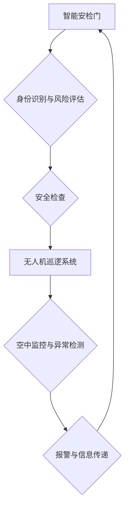

                 

## 未来的智能安防：2050年的智能安检门与无人机巡逻

> 关键词：智能安检门、无人机巡逻、人工智能、计算机视觉、深度学习、生物识别、物联网、安全保障

### 1. 背景介绍

随着科技的飞速发展，人工智能（AI）已经渗透到生活的方方面面，安防领域也不例外。传统的安防系统主要依靠人工监控和简单的传感器，存在效率低、成本高、易受人为因素影响等问题。未来，智能安防将以人工智能为核心，融合计算机视觉、生物识别、物联网等技术，构建更加安全、高效、智能的安防体系。

本文将探讨2050年智能安防的未来发展趋势，重点关注智能安检门和无人机巡逻两大方面。

### 2. 核心概念与联系

**2.1 智能安检门**

智能安检门是未来安防系统的重要组成部分，它利用人工智能技术对人员进行身份识别、风险评估和安全检查。

**2.2 无人机巡逻**

无人机巡逻利用无人机进行空中巡逻，实时监控目标区域，发现异常情况并及时报警。

**2.3 核心概念联系**

智能安检门和无人机巡逻可以相互配合，形成一个完整的智能安防体系。

* 智能安检门可以识别进入人员的身份信息，并将信息传递给无人机巡逻系统。
* 无人机巡逻系统可以对人员进行空中监控，发现异常行为并向智能安检门发送警报。
* 智能安检门可以根据无人机巡逻系统的反馈，对人员进行进一步的检查和处理。

**2.4 架构图**



### 3. 核心算法原理 & 具体操作步骤

**3.1 算法原理概述**

智能安检门和无人机巡逻系统中，主要应用以下核心算法：

* **计算机视觉算法:** 用于图像识别、目标检测、人脸识别等。
* **深度学习算法:** 用于特征提取、模式识别、异常检测等。
* **生物识别算法:** 用于指纹识别、虹膜识别、语音识别等。
* **路径规划算法:** 用于无人机自主导航和巡逻。

**3.2 算法步骤详解**

**3.2.1 智能安检门**

1. **图像采集:** 安检门摄像头采集人员图像。
2. **图像预处理:** 对图像进行尺寸调整、灰度化、去噪等处理。
3. **人脸识别:** 利用深度学习算法对图像进行人脸检测和识别，提取人脸特征。
4. **身份验证:** 将人脸特征与数据库进行比对，验证人员身份。
5. **风险评估:** 根据人员身份、行为特征等信息进行风险评估，判断是否需要进一步检查。
6. **安全检查:** 对人员进行行李扫描、金属探测等安全检查。

**3.2.2 无人机巡逻**

1. **任务规划:** 根据目标区域、巡逻路线等信息，规划无人机巡逻任务。
2. **自主导航:** 利用路径规划算法，使无人机自主导航到指定位置。
3. **空中监控:** 利用摄像头采集目标区域图像，进行实时监控。
4. **异常检测:** 利用计算机视觉算法和深度学习算法，对图像进行分析，检测异常情况。
5. **报警与信息传递:** 当检测到异常情况时，无人机会向地面控制中心发送报警信息。

**3.3 算法优缺点**

**3.3.1 计算机视觉算法**

* **优点:** 识别速度快、精度高、可处理大量图像数据。
* **缺点:** 对图像质量要求高、容易受到光照、角度等因素影响。

**3.3.2 深度学习算法**

* **优点:** 学习能力强、能够识别复杂模式、可进行端到端的学习。
* **缺点:** 训练数据量大、计算资源消耗高、解释性较差。

**3.3.3 生物识别算法**

* **优点:** 识别准确率高、安全性强。
* **缺点:** 采集设备成本高、隐私安全问题。

**3.4 算法应用领域**

* **智能安检门:** 人员身份识别、安全检查、风险评估。
* **无人机巡逻:** 目标区域监控、异常检测、巡逻路线规划。
* **智能交通:** 车辆识别、违章行为检测、交通流量分析。
* **智能医疗:** 病人身份识别、疾病诊断、医疗影像分析。

### 4. 数学模型和公式 & 详细讲解 & 举例说明

**4.1 数学模型构建**

智能安检门和无人机巡逻系统中，可以使用以下数学模型来描述算法的运行过程：

* **人脸识别模型:** 可以使用深度学习算法构建人脸识别模型，例如卷积神经网络（CNN）。
* **风险评估模型:** 可以使用机器学习算法构建风险评估模型，例如逻辑回归、支持向量机（SVM）。
* **路径规划模型:** 可以使用数学规划算法构建路径规划模型，例如A*算法、Dijkstra算法。

**4.2 公式推导过程**

* **人脸识别模型:** CNN模型的训练过程涉及到损失函数、优化算法等数学公式。
* **风险评估模型:** 逻辑回归模型的训练过程涉及到似然函数、最大似然估计等数学公式。
* **路径规划模型:** A*算法的路径规划过程涉及到启发函数、代价函数等数学公式。

**4.3 案例分析与讲解**

* **人脸识别模型:** 可以使用公开的人脸识别数据集，例如LFW数据集，来训练CNN模型，并评估模型的识别精度。
* **风险评估模型:** 可以使用历史的安检数据，例如人员身份、行为特征、安全检查结果等信息，来训练风险评估模型，并评估模型的预测准确率。
* **路径规划模型:** 可以使用模拟环境，例如地图数据、障碍物信息等，来测试路径规划模型的路径规划效果。

### 5. 项目实践：代码实例和详细解释说明

**5.1 开发环境搭建**

* **操作系统:** Ubuntu 20.04 LTS
* **编程语言:** Python 3.8
* **深度学习框架:** TensorFlow 2.0
* **计算机视觉库:** OpenCV

**5.2 源代码详细实现**

```python
# 人脸识别代码示例
import tensorflow as tf
from tensorflow.keras.models import load_model

# 加载预训练的人脸识别模型
model = load_model('face_recognition_model.h5')

# 读取图像数据
image = tf.keras.preprocessing.image.load_img('input_image.jpg', target_size=(224, 224))
image = tf.keras.preprocessing.image.img_to_array(image)
image = tf.expand_dims(image, axis=0)

# 进行人脸识别
predictions = model.predict(image)
```

**5.3 代码解读与分析**

* 代码首先加载预训练的人脸识别模型。
* 然后读取图像数据，并进行预处理，例如尺寸调整、归一化等。
* 最后使用模型进行预测，得到人脸识别结果。

**5.4 运行结果展示**

运行代码后，将输出人脸识别结果，例如人脸置信度、人脸特征等信息。

### 6. 实际应用场景

**6.1 智能安检门**

* **机场安检:** 智能安检门可以快速识别旅客身份，并对行李进行安全检查，提高安检效率。
* **车站安检:** 智能安检门可以识别乘客身份，并对行李进行安全检查，防止违禁物品进入车站。
* **办公楼安防:** 智能安检门可以识别员工身份，并控制人员进出，提高办公楼安全。

**6.2 无人机巡逻**

* **边境巡逻:** 无人机可以进行空中巡逻，监控边境线，发现非法穿越行为。
* **森林防火:** 无人机可以进行空中巡逻，监测森林火灾风险，及时发现火灾并进行报警。
* **城市治安:** 无人机可以进行空中巡逻，监控城市治安，发现犯罪行为并及时报警。

**6.4 未来应用展望**

* **更智能的安防系统:** 未来，智能安防系统将更加智能化，能够自主学习和适应环境变化。
* **更广泛的应用场景:** 智能安防技术将应用于更多领域，例如医疗、教育、金融等。
* **更安全的社会:** 智能安防技术将帮助我们构建更加安全、高效、便捷的社会。

### 7. 工具和资源推荐

**7.1 学习资源推荐**

* **书籍:**
    * 深度学习
    * 人工智能
    * 计算机视觉
* **在线课程:**
    * Coursera
    * edX
    * Udacity

**7.2 开发工具推荐**

* **编程语言:** Python
* **深度学习框架:** TensorFlow, PyTorch
* **计算机视觉库:** OpenCV

**7.3 相关论文推荐**

* **人脸识别:**
    * FaceNet: A Unified Embedding for Face Recognition and Clustering
    * DeepFace: Closing the Gap to Human-Level Performance in Face Verification
* **无人机路径规划:**
    * A Survey of Path Planning Algorithms for Autonomous Mobile Robots
    * A* Search Algorithm for Path Planning in Dynamic Environments

### 8. 总结：未来发展趋势与挑战

**8.1 研究成果总结**

近年来，人工智能技术在安防领域取得了显著进展，智能安检门和无人机巡逻系统已经成为现实。

**8.2 未来发展趋势**

* **更强大的算法:** 未来，人工智能算法将更加强大，能够识别更加复杂的人脸特征、检测更加细微的异常情况。
* **更广泛的应用场景:** 智能安防技术将应用于更多领域，例如医疗、教育、金融等。
* **更智能的系统:** 未来，智能安防系统将更加智能化，能够自主学习和适应环境变化。

**8.3 面临的挑战**

* **数据安全:** 智能安防系统需要处理大量的人脸数据和敏感信息，数据安全问题需要得到高度重视。
* **算法偏见:** 人工智能算法可能会存在偏见，导致不公平的识别结果。
* **伦理问题:** 智能安防技术可能会侵犯个人隐私，需要进行伦理规范的制定和监管。

**8.4 研究展望**

未来，我们需要继续研究和探索智能安防技术的应用，使其更加安全、高效、便捷，同时也要关注其带来的伦理和社会问题，确保其健康发展。

### 9. 附录：常见问题与解答

* **智能安检门是否会识别所有人的脸？**

智能安检门的人脸识别技术目前还无法识别所有人的脸，例如儿童、老人、戴眼镜的人等。

* **无人机巡逻是否会侵犯个人隐私？**

无人机巡逻需要遵守相关法律法规，避免侵犯个人隐私。

* **智能安防技术是否会取代人工安保人员？**

智能安防技术可以辅助人工安保人员的工作，提高效率，但不会完全取代人工安保人员。


作者：禅与计算机程序设计艺术 / Zen and the Art of Computer Programming 
<end_of_turn>

