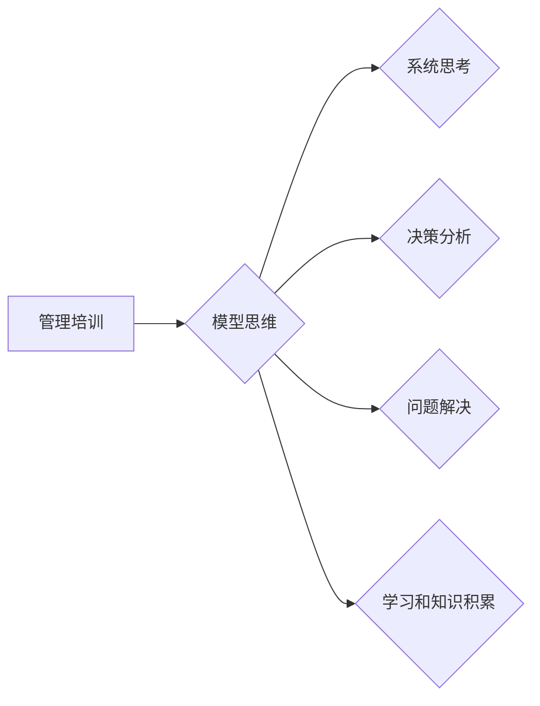

                 

##  模型思维在管理培训中的运用

> 关键词：模型思维、管理培训、系统思考、决策分析、问题解决、学习方法、认知框架

## 1. 背景介绍

在当今瞬息万变的商业环境中，管理者面临着越来越复杂的挑战。传统的管理方法往往难以应对这些挑战，因为它们往往过于局限于局部视角，缺乏对整体系统的理解。因此，一种新的思维方式——模型思维，逐渐成为管理培训的热门话题。

模型思维是一种将复杂问题抽象成可理解的模型，并通过分析模型来解决问题和做出决策的思维方式。它强调系统性思考，帮助管理者洞察问题背后的本质，并找到更有效的解决方案。

## 2. 核心概念与联系

### 2.1 模型思维的定义

模型思维是指用抽象的符号、图示或数学公式等方式，将复杂的事物或系统简化成一个可理解、可分析的模型，从而帮助我们更好地理解、预测和控制事物的发展。

### 2.2 模型思维与管理培训的联系

模型思维可以帮助管理者在培训中：

* **提升系统思考能力:** 通过构建模型，管理者可以从多个角度分析问题，了解不同因素之间的相互作用，从而形成更全面的视角。
* **增强决策分析能力:** 模型思维提供了一种结构化的决策框架，帮助管理者分析各种方案的优缺点，做出更明智的决策。
* **提高问题解决能力:** 模型思维可以帮助管理者将复杂问题分解成更小的子问题，并找到解决这些子问题的方案，最终解决整个问题。
* **促进学习和知识积累:** 通过构建和分析模型，管理者可以加深对管理知识的理解，并将其应用于实际工作中。

**模型思维与管理培训的联系流程图:**



## 3. 核心算法原理 & 具体操作步骤

### 3.1 算法原理概述

模型思维的核心算法原理是将复杂系统抽象成一个简化的模型，并通过分析模型来理解和预测系统的行为。

### 3.2 算法步骤详解

1. **识别问题:** 明确需要解决的问题，并将其描述清楚。
2. **构建模型:** 根据问题的特点，选择合适的模型框架，并用符号、图示或数学公式等方式将问题抽象成一个可理解的模型。
3. **分析模型:** 对模型进行分析，识别关键因素、变量和关系，并预测模型的行为。
4. **验证模型:** 将模型应用于实际案例，验证模型的准确性和有效性。
5. **改进模型:** 根据验证结果，对模型进行改进，使其更准确、更有效。

### 3.3 算法优缺点

**优点:**

* **提高系统思考能力:** 模型思维可以帮助管理者从多个角度分析问题，了解不同因素之间的相互作用。
* **增强决策分析能力:** 模型思维提供了一种结构化的决策框架，帮助管理者分析各种方案的优缺点。
* **提高问题解决能力:** 模型思维可以帮助管理者将复杂问题分解成更小的子问题，并找到解决这些子问题的方案。

**缺点:**

* **模型构建难度:** 构建一个准确、有效的模型需要一定的专业知识和经验。
* **模型局限性:** 模型只是一个简化的抽象，无法完全反映现实世界的复杂性。
* **模型验证困难:** 验证模型的准确性和有效性需要大量的实际数据和案例分析。

### 3.4 算法应用领域

模型思维在管理培训中应用广泛，例如：

* **战略规划:** 使用模型分析市场环境、竞争对手和自身优势，制定有效的战略规划。
* **组织结构设计:** 使用模型分析组织的流程、人员配置和沟通模式，优化组织结构。
* **项目管理:** 使用模型分析项目风险、进度和资源，提高项目管理效率。
* **团队合作:** 使用模型分析团队成员的技能、性格和沟通方式，促进团队合作。

## 4. 数学模型和公式 & 详细讲解 & 举例说明

### 4.1 数学模型构建

在管理培训中，可以使用数学模型来量化和分析一些关键指标，例如：

* **决策树模型:** 用于分析决策过程中的各种可能性和结果，帮助管理者做出更明智的决策。
* **线性规划模型:** 用于优化资源分配，例如生产计划、营销预算等。
* **网络流模型:** 用于分析物流网络中的流量和瓶颈，优化物流效率。

### 4.2 公式推导过程

例如，决策树模型的构建过程可以概括如下：

1. **确定决策节点:** 决策节点代表管理者需要做出选择的地方。
2. **确定状态节点:** 状态节点代表决策结果的可能状态。
3. **确定概率:** 每个决策节点到各个状态节点的概率需要根据实际情况进行估计。
4. **计算期望值:** 每个状态节点的期望值可以根据其概率和价值进行计算。
5. **选择最佳决策:** 选择期望值最高的决策节点作为最佳决策。

### 4.3 案例分析与讲解

例如，一家公司需要决定是否投资一个新项目。可以使用决策树模型来分析这个决策过程。

* **决策节点:** 投资或不投资
* **状态节点:** 项目成功或失败
* **概率:** 根据市场调研和项目评估，估计项目成功和失败的概率。
* **价值:** 估计项目成功和失败的收益和损失。

通过计算每个状态节点的期望值，可以比较投资和不投资的期望收益，从而做出最佳决策。

## 5. 项目实践：代码实例和详细解释说明

### 5.1 开发环境搭建

可以使用 Python 语言和相应的库来实现模型思维的应用。例如，可以使用 Scikit-learn 库来构建决策树模型，可以使用 PuLP 库来构建线性规划模型。

### 5.2 源代码详细实现

以下是一个简单的决策树模型的 Python 代码实现：

```python
from sklearn.tree import DecisionTreeClassifier

# 训练数据
X = [[1, 2], [2, 3], [3, 4], [4, 5]]
y = [0, 1, 0, 1]

# 创建决策树模型
model = DecisionTreeClassifier()

# 训练模型
model.fit(X, y)

# 预测新数据
new_data = [[5, 6]]
prediction = model.predict(new_data)

# 打印预测结果
print(prediction)
```

### 5.3 代码解读与分析

这段代码首先定义了训练数据和目标变量。然后，创建了一个决策树模型，并使用训练数据训练模型。最后，使用训练好的模型预测新数据的类别。

### 5.4 运行结果展示

运行这段代码，输出结果为：

```
[1]
```

这表明，新数据属于类别 1。

## 6. 实际应用场景

模型思维在管理培训中的应用场景非常广泛，例如：

* **市场营销:** 使用模型分析客户行为、市场趋势和竞争对手策略，制定有效的营销计划。
* **人力资源:** 使用模型分析员工绩效、培训需求和人才流动，优化人力资源管理。
* **财务管理:** 使用模型分析财务状况、投资风险和成本控制，提高财务管理效率。
* **供应链管理:** 使用模型分析供应链流程、库存管理和物流配送，优化供应链效率。

### 6.4 未来应用展望

随着人工智能和数据分析技术的不断发展，模型思维在管理培训中的应用将更加广泛和深入。例如，可以使用机器学习算法构建更智能的模型，自动分析数据并提供决策建议。

## 7. 工具和资源推荐

### 7.1 学习资源推荐

* **书籍:**
    * 《模型思维》
    * 《思考，快与慢》
    * 《复杂》
* **在线课程:**
    * Coursera 上的《系统思考》课程
    * edX 上的《数据分析》课程

### 7.2 开发工具推荐

* **Python:** 
    * Scikit-learn
    * PuLP
    * TensorFlow
* **R:** 
    * caret
    * dplyr
    * ggplot2

### 7.3 相关论文推荐

* **《模型思维在管理中的应用》**
* **《系统思考与决策分析》**
* **《数据驱动决策》**

## 8. 总结：未来发展趋势与挑战

### 8.1 研究成果总结

模型思维在管理培训中的应用取得了显著的成果，帮助管理者提升系统思考能力、增强决策分析能力、提高问题解决能力和促进学习和知识积累。

### 8.2 未来发展趋势

未来，模型思维在管理培训中的应用将更加智能化、个性化和数据化。

* **智能化:** 使用人工智能算法构建更智能的模型，自动分析数据并提供决策建议。
* **个性化:** 根据个人的学习风格和需求，定制个性化的模型思维培训方案。
* **数据化:** 利用大数据分析技术，收集和分析更多管理数据，为模型构建提供更丰富的支持。

### 8.3 面临的挑战

模型思维在管理培训中的应用也面临一些挑战，例如：

* **模型构建难度:** 构建一个准确、有效的模型需要一定的专业知识和经验。
* **模型局限性:** 模型只是一个简化的抽象，无法完全反映现实世界的复杂性。
* **模型验证困难:** 验证模型的准确性和有效性需要大量的实际数据和案例分析。

### 8.4 研究展望

未来，需要进一步研究模型思维的应用方法和技术，提高模型的准确性和有效性，并将其应用于更多管理领域。

## 9. 附录：常见问题与解答

**问题 1:** 如何选择合适的模型框架？

**解答:** 选择合适的模型框架需要根据具体的问题特点和数据类型进行判断。例如，对于决策问题，可以使用决策树模型；对于资源优化问题，可以使用线性规划模型。

**问题 2:** 如何验证模型的准确性和有效性？

**解答:** 可以使用测试数据对模型进行验证，并比较模型的预测结果与实际结果的差异。也可以使用交叉验证技术来评估模型的泛化能力。

**问题 3:** 如何将模型思维应用于实际工作中？

**解答:** 可以将模型思维融入到日常工作中，例如在制定战略规划、分析市场趋势、解决问题等方面。


作者：禅与计算机程序设计艺术 / Zen and the Art of Computer Programming 
<end_of_turn>

