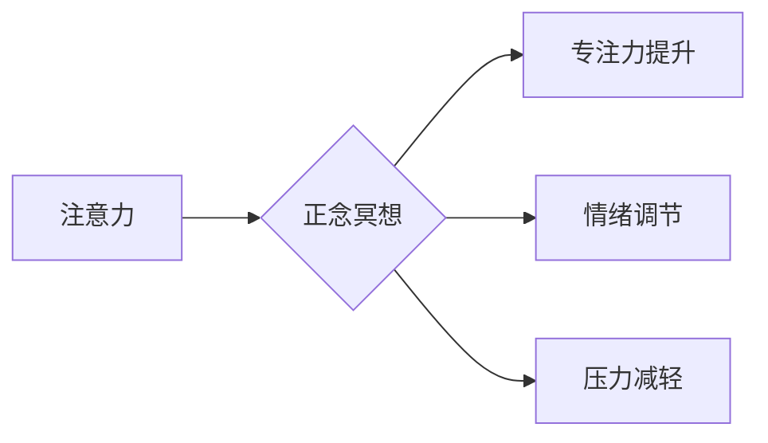

                 

##  注意力管理与正念冥想实践：通过内省增强专注力和心灵平和

> 关键词：注意力管理、正念冥想、专注力、心灵平和、内省、认知科学、神经科学、 mindfulness、meditation、focus、well-being

### 1. 背景介绍

在当今信息爆炸的时代，我们面临着前所未有的信息冲击。来自手机、电脑、社交媒体的各种通知和信息不断地吸引着我们的注意力，使得我们难以集中精力完成任务，也难以享受当下。注意力力的下降，导致工作效率降低、学习效果不佳、生活质量下降，甚至引发焦虑、抑郁等心理问题。

正念冥想作为一种古老的修行方式，近年来在西方世界逐渐受到关注。研究表明，正念冥想可以有效地提升注意力、减轻压力、改善情绪，甚至可以改变大脑结构和功能。正念冥想的核心是培养对当下体验的觉察和接受，不评判地观察自己的思想、情绪和身体感受。

### 2. 核心概念与联系

#### 2.1 注意力与正念

**注意力**是指我们对特定信息或刺激的集中和选择性关注。它是一个有限的资源，可以被各种因素所干扰。

**正念**是指一种觉察当下体验的状态，不评判地观察自己的思想、情绪和身体感受。它是一种训练有素的意识状态，可以帮助我们更好地管理注意力。

**注意力与正念之间的关系**

正念冥想可以帮助我们训练注意力，提高专注力。通过持续地练习，我们可以学会将注意力集中在当下，不被杂念所干扰。

**架构图**



#### 2.2  内省与自我觉察

**内省**是指深入思考自己的内心世界，包括思想、情感、动机和价值观。

**自我觉察**是指对自身内心状态的清晰感知，包括情绪、身体感受、思想模式等。

**内省与自我觉察与注意力与正念的关系**

内省和自我觉察是正念冥想的重要组成部分。通过内省，我们可以更好地了解自己的注意力模式，识别那些容易分散注意力的因素。通过自我觉察，我们可以及时察觉到注意力被转移的瞬间，并将其引导回到当下。

### 3. 核心算法原理 & 具体操作步骤

#### 3.1 算法原理概述

正念冥想并非一种算法，而是一种训练方法。它通过反复练习，帮助我们培养对当下体验的觉察和接受，从而提升注意力和心灵平和。

#### 3.2 算法步骤详解

1. **找到一个安静舒适的环境:** 选择一个没有干扰的地方，让自己能够放松身心。
2. **采取舒适的坐姿:** 可以盘腿坐，也可以坐在椅子上，保持背部挺直，但不要过于僵硬。
3. **闭上眼睛或微微睁开:** 闭上眼睛可以帮助我们减少外界刺激，但也可以选择微微睁开眼睛，专注于一个固定点。
4. **将注意力集中在呼吸上:** 注意感受每一次呼吸的入口和出口，观察呼吸的节奏和深度。
5. **觉察思绪和感受:** 当思绪出现时，不要评判或抗拒，只是简单地观察它们，然后将注意力引导回到呼吸上。
6. **持续练习:** 最初可以从每天5分钟开始，逐渐增加练习时间。

#### 3.3 算法优缺点

**优点:**

* 提升注意力和专注力
* 减轻压力和焦虑
* 改善情绪和睡眠
* 增强自我觉察和理解

**缺点:**

* 需要坚持练习，才能看到效果
* 初期可能会感到无聊或难以集中注意力
* 不适合所有人群，例如患有精神疾病的人群

#### 3.4 算法应用领域

* **个人发展:** 提升专注力、减轻压力、改善情绪、增强自我觉察
* **教育:** 帮助学生提高学习效率、减轻考试焦虑
* **医疗:** 辅助治疗焦虑、抑郁、创伤后应激障碍等心理问题
* **企业:** 提升员工注意力、减轻工作压力、提高工作效率

### 4. 数学模型和公式 & 详细讲解 & 举例说明

正念冥想本身不是一个数学模型，但我们可以用数学模型来描述注意力和正念的变化过程。

#### 4.1 数学模型构建

我们可以用一个简单的数学模型来描述注意力：

**注意力 = 认知资源 - 分散注意力**

其中：

* **认知资源**是指我们大脑可用于处理信息的资源。
* **分散注意力**是指来自外部刺激和内部杂念的干扰。

#### 4.2 公式推导过程

正念冥想通过训练可以增加认知资源，减少分散注意力，从而提升注意力。

#### 4.3 案例分析与讲解

例如，一个人在工作时，如果受到手机通知的干扰，就会分散注意力，导致工作效率下降。通过正念冥想，这个人可以训练自己更好地控制注意力，减少对手机通知的反应，从而提高工作效率。

### 5. 项目实践：代码实例和详细解释说明

正念冥想本身不是一个软件项目，但我们可以开发一些应用程序来辅助正念冥想练习。

#### 5.1 开发环境搭建

可以使用 Python 和 Flask 框架开发一个简单的正念冥想应用程序。

#### 5.2 源代码详细实现

```python
from flask import Flask, render_template

app = Flask(__name__)

@app.route('/')
def index():
    return render_template('index.html')

if __name__ == '__main__':
    app.run(debug=True)
```

#### 5.3 代码解读与分析

这个代码是一个简单的 Flask 应用程序，它只有一个路由 `/`，返回一个名为 `index.html` 的模板文件。

#### 5.4 运行结果展示

运行这个应用程序后，可以在浏览器中访问 `http://127.0.0.1:5000/`，看到一个简单的正念冥想应用程序界面。

### 6. 实际应用场景

正念冥想可以应用于各种场景，例如：

* **工作场所:** 帮助员工减轻压力、提高专注力、增强团队合作
* **学校:** 帮助学生提高学习效率、减轻考试焦虑、改善情绪
* **医疗机构:** 辅助治疗焦虑、抑郁、创伤后应激障碍等心理问题
* **个人生活:** 帮助人们更好地管理情绪、提升幸福感、享受当下

#### 6.4 未来应用展望

随着科技的发展，正念冥想技术将会得到更广泛的应用。例如，我们可以开发出更加智能化的正念冥想应用程序，能够根据用户的需求提供个性化的指导和反馈。

### 7. 工具和资源推荐

#### 7.1 学习资源推荐

* **书籍:** 《正念：改变生活的八周冥想计划》
* **网站:** Headspace, Calm, Insight Timer
* **课程:** Coursera, Udemy

#### 7.2 开发工具推荐

* **Python:** 一个用于开发正念冥想应用程序的流行编程语言
* **Flask:** 一个轻量级的 Python Web 框架
* **React:** 一个用于构建用户界面的 JavaScript 库

#### 7.3 相关论文推荐

* **正念冥想对注意力和认知功能的影响**
* **正念冥想对情绪调节和压力管理的影响**
* **正念冥想对大脑结构和功能的影响**

### 8. 总结：未来发展趋势与挑战

#### 8.1 研究成果总结

正念冥想研究取得了显著进展，证明了其对注意力、情绪、压力等方面的积极影响。

#### 8.2 未来发展趋势

未来，正念冥想研究将更加深入，探索其在更多领域应用的可能性。

#### 8.3 面临的挑战

正念冥想研究还面临一些挑战，例如：

* 缺乏统一的标准化评估方法
* 难以解释正念冥想对大脑的影响机制
* 如何将正念冥想技术应用于更广泛的人群

#### 8.4 研究展望

未来，我们需要继续努力，克服这些挑战，将正念冥想技术更好地应用于人们的生活，帮助人们提升幸福感和生活质量。

### 9. 附录：常见问题与解答

**Q1: 正念冥想真的能提升注意力吗？**

A1: 研究表明，正念冥想可以有效地提升注意力和专注力。

**Q2: 如何才能坚持练习正念冥想？**

A2: 可以从每天5分钟开始，逐渐增加练习时间。选择一个安静舒适的环境，并找到适合自己的冥想方法。

**Q3: 正念冥想适合所有人群吗？**

A3: 不适合所有人群，例如患有精神疾病的人群。

**Q4: 正念冥想需要花费多少时间才能看到效果？**

A4: 每个人的情况不同，有些人可能只需要几周就能看到效果，而有些人可能需要几个月甚至更长时间。

**Q5: 我在练习正念冥想时，思绪总是跑来跑去，怎么办？**

A5: 这是很正常的现象。当思绪出现时，不要评判或抗拒，只是简单地观察它们，然后将注意力引导回到呼吸上。


作者：禅与计算机程序设计艺术 / Zen and the Art of Computer Programming 
<end_of_turn>

