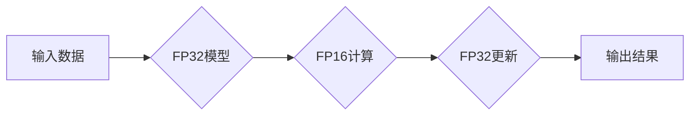

                 

## 混合精度训练：提高AI模型效率

> 关键词：混合精度训练、FP16、FP32、模型效率、深度学习、加速训练

### 1. 背景介绍

深度学习模型的训练过程通常需要处理海量数据，并进行复杂的计算，这导致训练时间长、资源消耗大。为了提高模型训练效率，研究人员不断探索新的优化方法。混合精度训练 (Mixed Precision Training) 是一种近年来兴起的训练技术，通过使用不同精度的数据类型来加速训练过程，同时保持模型性能。

传统的深度学习模型训练主要使用单精度浮点数 (FP32) 格式，但 FP32 占用较多的内存空间，并且计算量较大。混合精度训练通过将模型参数和中间结果部分使用低精度浮点数 (FP16) 格式，可以有效减少内存占用和计算量，从而加速训练速度。

### 2. 核心概念与联系

混合精度训练的核心概念是利用不同精度的数据类型来平衡模型精度和训练速度。

**2.1 混合精度训练流程图**



**2.2 核心概念解释**

* **FP32:**  标准的单精度浮点数，精度高，但占用内存空间大，计算量大。
* **FP16:** 半精度浮点数，精度相对较低，但占用内存空间小，计算量小。
* **混合精度训练:** 在训练过程中，将模型参数部分使用 FP32 格式，而中间计算结果和梯度使用 FP16 格式。

**2.3 优势与挑战**

* **优势:**
    * 显著加速训练速度
    * 减少内存占用
    * 提高训练效率
* **挑战:**
    * FP16 精度较低，可能导致模型精度下降
    * 需要特殊的硬件支持 (如 NVIDIA Tensor Cores)
    * 需要调整训练参数

### 3. 核心算法原理 & 具体操作步骤

**3.1 算法原理概述**

混合精度训练的核心原理是利用 FP16 的低精度计算特性，在不显著影响模型精度的前提下，加速训练过程。

**3.2 算法步骤详解**

1. **模型转换:** 将模型参数部分转换为 FP32 格式，中间计算结果和梯度转换为 FP16 格式。
2. **前向传播:** 使用 FP16 格式进行前向传播计算，得到输出结果。
3. **反向传播:** 使用 FP16 格式进行反向传播计算，得到梯度。
4. **梯度转换:** 将 FP16 格式的梯度转换为 FP32 格式，用于更新模型参数。
5. **模型更新:** 使用 FP32 格式更新模型参数。

**3.3 算法优缺点**

* **优点:**
    * 显著加速训练速度
    * 减少内存占用
* **缺点:**
    * FP16 精度较低，可能导致模型精度下降
    * 需要特殊的硬件支持

**3.4 算法应用领域**

混合精度训练广泛应用于各种深度学习模型的训练，例如图像识别、自然语言处理、语音识别等。

### 4. 数学模型和公式 & 详细讲解 & 举例说明

**4.1 数学模型构建**

混合精度训练的数学模型主要基于 FP16 和 FP32 的计算特性。

**4.2 公式推导过程**

* **FP16 运算:** FP16 运算的精度相对较低，但计算速度更快。
* **梯度转换:** 将 FP16 格式的梯度转换为 FP32 格式，可以保证模型参数更新的精度。

**4.3 案例分析与讲解**

假设我们有一个深度学习模型，其参数量为 M，训练数据量为 N。

* **FP32 训练:** 使用 FP32 格式训练模型，需要存储 M 个 FP32 参数，以及 N 个训练数据。
* **混合精度训练:** 使用 FP16 格式训练模型，只需要存储 M/2 个 FP16 参数，以及 N 个 FP16 数据。

可以看出，混合精度训练可以有效减少内存占用。

### 5. 项目实践：代码实例和详细解释说明

**5.1 开发环境搭建**

* **操作系统:** Ubuntu 20.04
* **深度学习框架:** PyTorch 1.10
* **GPU:** NVIDIA GeForce RTX 3090

**5.2 源代码详细实现**

```python
import torch
import torch.nn as nn

# 定义一个简单的深度学习模型
class SimpleModel(nn.Module):
    def __init__(self):
        super(SimpleModel, self).__init__()
        self.linear1 = nn.Linear(10, 20)
        self.linear2 = nn.Linear(20, 10)

    def forward(self, x):
        x = torch.relu(self.linear1(x))
        x = self.linear2(x)
        return x

# 创建模型实例
model = SimpleModel()

# 将模型转换为混合精度训练模式
model.half()

# 定义优化器
optimizer = torch.optim.Adam(model.parameters(), lr=0.01)

# 定义损失函数
criterion = nn.MSELoss()

# 训练数据
input_data = torch.randn(100, 10).half()
target_data = torch.randn(100, 10).half()

# 训练循环
for epoch in range(10):
    # 前向传播
    output = model(input_data)

    # 计算损失
    loss = criterion(output, target_data)

    # 反向传播
    optimizer.zero_grad()
    loss.backward()

    # 更新模型参数
    optimizer.step()

    # 打印损失值
    print(f'Epoch {epoch+1}, Loss: {loss.item()}')
```

**5.3 代码解读与分析**

* **模型转换:** `model.half()` 将模型参数和中间结果转换为 FP16 格式。
* **数据类型转换:** `torch.randn(100, 10).half()` 将数据转换为 FP16 格式。
* **训练循环:** 训练循环中，前向传播、反向传播和模型参数更新都使用 FP16 格式进行计算。

**5.4 运行结果展示**

运行上述代码，可以观察到训练损失值随着训练轮数的增加而下降。

### 6. 实际应用场景

混合精度训练在各种深度学习应用场景中都有着广泛的应用，例如：

* **图像识别:** 混合精度训练可以加速图像分类、目标检测等任务的训练。
* **自然语言处理:** 混合精度训练可以提高文本分类、机器翻译等任务的训练效率。
* **语音识别:** 混合精度训练可以加速语音识别模型的训练。

### 7. 工具和资源推荐

**7.1 学习资源推荐**

* **PyTorch 官方文档:** https://pytorch.org/docs/stable/
* **NVIDIA Tensor Cores 文档:** https://developer.nvidia.com/tensor-cores

**7.2 开发工具推荐**

* **PyTorch:** https://pytorch.org/
* **TensorFlow:** https://www.tensorflow.org/

**7.3 相关论文推荐**

* **Mixed Precision Training:** https://arxiv.org/abs/1710.03740

### 8. 总结：未来发展趋势与挑战

**8.1 研究成果总结**

混合精度训练是一种有效的深度学习训练优化技术，可以显著提高训练速度和效率。

**8.2 未来发展趋势**

* **更广泛的应用:** 混合精度训练将应用于更多深度学习领域，例如强化学习、生成对抗网络等。
* **更先进的算法:** 研究人员将继续探索更先进的混合精度训练算法，以进一步提高模型精度和训练效率。
* **硬件支持:** 未来硬件将更加支持混合精度训练，例如更强大的 Tensor Cores 和专门的混合精度加速器。

**8.3 面临的挑战**

* **模型精度:** 混合精度训练可能会导致模型精度下降，需要进一步研究如何平衡精度和效率。
* **硬件兼容性:** 混合精度训练需要特殊的硬件支持，需要确保硬件兼容性。
* **算法复杂性:** 混合精度训练算法相对复杂，需要更高的开发成本。

**8.4 研究展望**

未来，混合精度训练将继续是深度学习领域的重要研究方向，其发展将推动深度学习技术的进步和应用。

### 9. 附录：常见问题与解答

**9.1 如何选择合适的混合精度训练方案？**

选择合适的混合精度训练方案需要考虑模型类型、硬件支持和精度要求等因素。

**9.2 如何解决混合精度训练导致的精度下降问题？**

可以使用量化技术、模型剪枝等方法来解决混合精度训练导致的精度下降问题。

**9.3 混合精度训练是否适用于所有深度学习模型？**

并非所有深度学习模型都适合使用混合精度训练，例如一些对精度要求非常高的模型可能不适合使用混合精度训练。


作者：禅与计算机程序设计艺术 / Zen and the Art of Computer Programming 
<end_of_turn>

