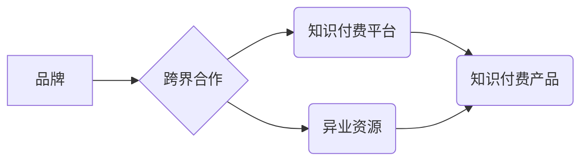

                 

## 知识付费赚钱的品牌跨界营销与异业资源整合

> 关键词：知识付费、品牌跨界营销、异业资源整合、内容营销、用户运营、商业模式创新

## 1. 背景介绍

知识经济时代，知识成为最宝贵的资源。知识付费作为一种新型的商业模式，迅速崛起，为创作者和品牌提供了新的盈利途径。知识付费平台如雨后春笋般涌现，涵盖了各个领域，从专业技能培训到兴趣爱好课程，从学术研究到生活方式分享，应有尽有。

然而，知识付费市场竞争日益激烈，单纯依靠优质内容难以获得持续的增长。品牌需要寻求新的突破口，拓展新的市场空间。跨界营销和异业资源整合成为品牌在知识付费市场中脱颖而出的重要策略。

## 2. 核心概念与联系

### 2.1 品牌跨界营销

品牌跨界营销是指品牌与其他品牌或领域合作，共同推广产品或服务，以达到扩大品牌影响力、提升品牌知名度和吸引新用户等目的。跨界营销可以打破传统营销模式的局限，创造新的联动效应，为品牌带来意想不到的惊喜。

### 2.2 异业资源整合

异业资源整合是指不同行业、不同领域的企业或组织之间建立合作关系，整合各自的资源和优势，共同开发新的市场和产品，实现互利共赢。异业资源整合可以帮助品牌拓展新的业务领域，获得新的增长点，提升品牌竞争力。

### 2.3 知识付费与跨界营销的结合

知识付费平台可以与其他品牌或领域进行跨界合作，整合资源，共同打造新的知识付费产品或服务。例如，教育机构可以与科技公司合作，开发线上线下结合的智能化学习平台；生活方式品牌可以与专家合作，推出主题相关的知识付费课程；游戏公司可以与动漫公司合作，开发游戏相关的知识付费内容。

**Mermaid 流程图**



## 3. 核心算法原理 & 具体操作步骤

### 3.1 算法原理概述

跨界营销和异业资源整合的核心算法原理是基于用户需求和价值链分析。通过分析用户需求和价值链，识别出跨界合作的潜在机会，并设计出能够满足用户需求和创造价值的知识付费产品或服务。

### 3.2 算法步骤详解

1. **用户需求分析:** 
    * 了解目标用户的兴趣爱好、需求痛点和消费习惯。
    * 利用数据分析工具，挖掘用户行为数据，识别出潜在的跨界合作机会。
2. **价值链分析:** 
    * 分析品牌和异业资源的各自优势和劣势，识别出能够互补的资源和能力。
    * 建立价值链图，明确跨界合作的价值传递路径。
3. **合作模式设计:** 
    * 根据用户需求和价值链分析，设计出合适的跨界合作模式，例如联合营销、资源共享、联合开发等。
    * 制定合作协议，明确各方的责任和义务。
4. **知识付费产品开发:** 
    * 基于跨界合作的资源和优势，开发出能够满足用户需求和创造价值的知识付费产品或服务。
    * 确保产品质量和用户体验。
5. **推广和运营:** 
    * 利用品牌和异业资源的渠道和影响力，进行产品推广和用户运营。
    * 持续收集用户反馈，不断优化产品和服务。

### 3.3 算法优缺点

**优点:**

* 能够打破传统营销模式的局限，创造新的联动效应。
* 能够拓展新的市场空间，获得新的增长点。
* 能够提升品牌竞争力，增强品牌影响力。

**缺点:**

* 需要进行充分的市场调研和用户需求分析。
* 需要找到合适的跨界合作对象，并建立良好的合作关系。
* 需要投入一定的资源和时间进行产品开发和推广。

### 3.4 算法应用领域

* 教育培训
* 医疗健康
* 金融理财
* 娱乐休闲
* 时尚美容

## 4. 数学模型和公式 & 详细讲解 & 举例说明

### 4.1 数学模型构建

知识付费平台的成功与否，可以从用户增长、用户留存、用户付费转化率等指标来衡量。我们可以构建一个简单的数学模型来描述这些指标之间的关系：

**用户增长率 (GR) = (新用户数 / 老用户数) * 100%**

**用户留存率 (LR) = (第n天活跃用户数 / 第n-1天活跃用户数) * 100%**

**付费转化率 (CR) = (付费用户数 / 总用户数) * 100%**

### 4.2 公式推导过程

这些公式的推导过程基于用户行为分析和统计学原理。

* 用户增长率反映了平台吸引新用户的能力。
* 用户留存率反映了平台用户粘性。
* 付费转化率反映了平台用户付费意愿。

### 4.3 案例分析与讲解

假设一个知识付费平台，其用户增长率为 20%，用户留存率为 50%，付费转化率为 10%。这意味着该平台每月能够吸引 20% 的新用户，用户在平台上停留的时间较长，并且 10% 的用户愿意付费购买知识付费产品。

通过分析这些指标，平台可以了解自身的用户增长、用户留存和付费转化情况，并制定相应的策略来提升这些指标。例如，可以加强用户运营，提高用户留存率；可以优化付费产品，提升付费转化率。

## 5. 项目实践：代码实例和详细解释说明

### 5.1 开发环境搭建

* 语言：Python
* 框架：Django
* 数据库：MySQL
* 云平台：AWS

### 5.2 源代码详细实现

```python
# views.py
from django.shortcuts import render

def index(request):
    # 获取用户数据
    user_data = User.objects.all()
    # 渲染模板
    return render(request, 'index.html', {'user_data': user_data})

# models.py
class User(models.Model):
    name = models.CharField(max_length=100)
    email = models.EmailField()
    # 其他用户属性

```

### 5.3 代码解读与分析

* views.py 文件定义了网站的视图函数，负责处理用户请求并渲染模板。
* models.py 文件定义了数据库模型，用于存储用户数据。

### 5.4 运行结果展示

运行代码后，用户可以访问网站首页，并看到所有用户的姓名和邮箱地址。

## 6. 实际应用场景

### 6.1 教育培训

* 在线课程平台可以与教育机构合作，开发线上线下结合的智能化学习平台，提供个性化学习方案和辅导服务。
* 职业技能培训机构可以与企业合作，开发针对特定行业的职业技能培训课程，帮助用户提升职业竞争力。

### 6.2 医疗健康

* 医疗机构可以与健康管理平台合作，开发线上线下结合的健康管理服务，提供远程医疗、健康咨询和健康监测等服务。
* 医疗专家可以与知识付费平台合作，推出主题相关的医疗健康知识付费课程，帮助用户了解疾病预防、健康养生等知识。

### 6.3 金融理财

* 金融机构可以与理财平台合作，开发线上线下结合的理财服务，提供个性化理财方案和投资指导等服务。
* 金融专家可以与知识付费平台合作，推出主题相关的金融理财知识付费课程，帮助用户了解投资理财知识、风险管理等。

### 6.4 未来应用展望

随着人工智能、大数据等技术的不断发展，知识付费平台将更加智能化、个性化和多元化。未来，知识付费平台将更加注重用户体验，提供更加丰富的知识付费产品和服务，满足用户多样化的需求。

## 7. 工具和资源推荐

### 7.1 学习资源推荐

* **书籍:**
    * 《知识付费的商业模式》
    * 《跨界营销实战》
    * 《数据分析与挖掘》
* **在线课程:**
    * Coursera
    * Udemy
    * edX

### 7.2 开发工具推荐

* **Python:**
    * Django
    * Flask
* **数据库:**
    * MySQL
    * PostgreSQL
* **云平台:**
    * AWS
    * Azure
    * Google Cloud

### 7.3 相关论文推荐

* 《知识付费平台用户行为分析》
* 《跨界营销策略研究》
* 《异业资源整合的模式与机制》

## 8. 总结：未来发展趋势与挑战

### 8.1 研究成果总结

知识付费平台的跨界营销和异业资源整合，为品牌提供了新的增长点，也为用户提供了更加丰富和多元化的知识付费产品和服务。

### 8.2 未来发展趋势

* **智能化:** 知识付费平台将更加智能化，利用人工智能技术提供个性化学习方案和推荐服务。
* **多元化:** 知识付费平台将更加多元化，涵盖更加广泛的领域和主题，满足用户多样化的需求。
* **生态化:** 知识付费平台将更加生态化，与其他平台和服务进行整合，形成更加完整的知识付费生态系统。

### 8.3 面临的挑战

* **用户信任:** 知识付费平台需要建立用户的信任，确保知识付费产品的质量和价值。
* **内容原创:** 知识付费平台需要鼓励原创内容，避免内容抄袭和重复。
* **商业模式创新:** 知识付费平台需要不断探索新的商业模式，实现可持续发展。

### 8.4 研究展望

未来，我们将继续研究知识付费平台的跨界营销和异业资源整合，探索新的合作模式和商业模式，为用户提供更加优质的知识付费服务。

## 9. 附录：常见问题与解答

* **Q1: 如何选择合适的跨界合作对象？**

* **A1:** 选择合适的跨界合作对象需要考虑双方资源的互补性、目标用户的重合度以及合作模式的可行性。

* **Q2: 如何设计有效的知识付费产品？**

* **A2:** 设计有效的知识付费产品需要深入了解用户需求，提供有价值的知识和技能，并确保产品质量和用户体验。

* **Q3: 如何推广和运营知识付费产品？**

* **A3:** 推广和运营知识付费产品需要利用多种渠道和方式，例如社交媒体营销、内容营销、用户运营等。


作者：禅与计算机程序设计艺术 / Zen and the Art of Computer Programming 
<end_of_turn>

