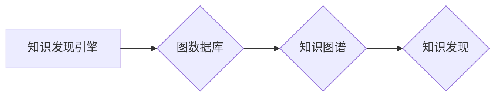

                 

## 知识发现引擎的图数据库应用

> 关键词：知识发现，图数据库，关系型数据库，节点，边，算法，应用场景，未来趋势

## 1. 背景介绍

在海量数据时代，从海量数据中挖掘有价值的知识已成为各行各业的关键挑战。传统的关系型数据库结构难以有效处理复杂关系和非结构化数据，而图数据库凭借其强大的关系建模能力和高效的路径查询，成为知识发现引擎的理想选择。

知识发现引擎旨在从数据中自动识别模式、趋势和关联，并将其转化为可理解的知识。传统的知识发现方法主要依赖于统计分析和机器学习算法，但这些方法在处理复杂关系和语义信息方面存在局限性。图数据库的出现为知识发现引擎提供了新的思路和技术手段。

## 2. 核心概念与联系

图数据库是一种专门用于存储和查询关系数据的数据库。它以节点和边作为基本数据单元，节点代表实体，边代表实体之间的关系。图数据库能够高效地处理复杂关系和路径查询，使其成为知识发现引擎的理想选择。

### 2.1 图数据库架构

图数据库的架构通常由以下几个部分组成：

* **节点存储**: 用于存储图数据库中的节点数据。
* **边存储**: 用于存储图数据库中的边数据。
* **索引**: 用于加速节点和边的查询。
* **查询引擎**: 用于执行图数据库的查询。

### 2.2 图数据库与知识发现引擎的联系

图数据库和知识发现引擎之间存在着密切的联系。图数据库可以有效地存储和管理知识图谱，而知识发现引擎可以利用图数据库的特性进行知识挖掘。

**Mermaid 流程图**



## 3. 核心算法原理 & 具体操作步骤

### 3.1 算法原理概述

知识发现引擎在图数据库中常用的算法包括：

* **路径查询**: 用于寻找图中特定节点之间的路径。
* **社区发现**: 用于发现图中具有相似连接的节点集。
* **关联规则挖掘**: 用于发现图中节点之间的关联关系。
* **嵌入式表示学习**: 用于将节点映射到低维向量空间，以便进行相似性计算和分类。

### 3.2 算法步骤详解

以路径查询为例，其具体步骤如下：

1. **定义查询目标**: 确定需要查询的起点节点和终点节点。
2. **构建查询语句**: 使用图数据库的查询语言（如Cypher）构建查询语句。
3. **执行查询**: 将查询语句提交给图数据库执行。
4. **处理结果**: 解析查询结果，提取所需信息。

### 3.3 算法优缺点

**优点**:

* **高效处理复杂关系**: 图数据库能够高效地处理复杂关系和路径查询，使其适用于知识发现引擎。
* **灵活的查询**: 图数据库的查询语言灵活强大，可以支持多种类型的查询。
* **可扩展性**: 图数据库可以轻松扩展以处理海量数据。

**缺点**:

* **数据模型限制**: 图数据库的数据模型相对简单，难以处理某些复杂的数据类型。
* **查询优化**: 图数据库的查询优化算法相对复杂，需要专业知识进行调优。

### 3.4 算法应用领域

图数据库和知识发现引擎的应用领域非常广泛，包括：

* **推荐系统**: 基于用户行为和商品关系进行推荐。
* **社交网络分析**: 分析社交网络结构和用户关系。
* **知识管理**: 建立知识图谱，进行知识发现和知识共享。
* **生物信息学**: 分析生物网络和基因关系。
* **金融风险管理**: 分析金融网络和风险关联。

## 4. 数学模型和公式 & 详细讲解 & 举例说明

### 4.1 数学模型构建

在图数据库中，节点和边可以分别用数学模型表示。

* **节点**: 可以用一个向量表示，其中每个元素代表节点的属性值。
* **边**: 可以用一个三元组表示，其中包含起点节点、终点节点和边类型。

### 4.2 公式推导过程

路径查询可以使用图数据库的查询语言进行实现。例如，可以使用Cypher语言查询图中从节点A到节点B的所有路径。

```cypher
MATCH (A)-[:关系]->(B)
RETURN A, B
```

这个查询语句会返回从节点A到节点B的所有路径，其中“关系”代表连接节点A和节点B的边类型。

### 4.3 案例分析与讲解

假设有一个社交网络图，其中节点代表用户，边代表用户之间的关注关系。我们可以使用图数据库和路径查询算法来分析用户之间的关系。例如，我们可以查询某个用户的粉丝列表，或者查询某个用户关注的所有用户。

## 5. 项目实践：代码实例和详细解释说明

### 5.1 开发环境搭建

为了进行图数据库的开发，需要搭建相应的开发环境。常用的图数据库包括Neo4j、OrientDB、TigerGraph等。

### 5.2 源代码详细实现

以下是一个使用Neo4j进行路径查询的简单代码示例：

```python
from neo4j import GraphDatabase

driver = GraphDatabase.driver("bolt://localhost:7687", auth=("neo4j", "password"))

with driver.session() as session:
    result = session.run("MATCH (a:Person)-[:KNOWS]->(b:Person) RETURN a.name, b.name")
    for record in result:
        print(f"{record['a.name']} knows {record['b.name']}")

driver.close()
```

### 5.3 代码解读与分析

这段代码首先连接到Neo4j数据库，然后使用Cypher语言查询图中所有“KNOWS”关系的节点。最后，打印出查询结果。

### 5.4 运行结果展示

运行这段代码后，会输出所有节点之间的“KNOWS”关系。例如：

```
John knows Mary
Mary knows Peter
```

## 6. 实际应用场景

### 6.1 推荐系统

图数据库可以用于构建基于用户行为和商品关系的推荐系统。例如，可以根据用户的购买历史和浏览记录，推荐与用户兴趣相关的商品。

### 6.2 社交网络分析

图数据库可以用于分析社交网络结构和用户关系。例如，可以分析用户之间的关注关系、好友关系和评论关系，从而了解社交网络的传播模式和用户行为特征。

### 6.3 知识管理

图数据库可以用于建立知识图谱，进行知识发现和知识共享。例如，可以将企业内部的文档、数据和专家知识存储在图数据库中，并使用知识发现算法挖掘出隐藏的知识和关联关系。

### 6.4 未来应用展望

随着数据量的不断增长和人工智能技术的不断发展，图数据库和知识发现引擎的应用场景将更加广泛。例如，可以用于医疗诊断、金融风险管理、城市规划等领域。

## 7. 工具和资源推荐

### 7.1 学习资源推荐

* **Neo4j官方文档**: https://neo4j.com/docs/
* **OrientDB官方文档**: https://orientdb.com/docs/
* **TigerGraph官方文档**: https://www.tigergraph.com/docs/

### 7.2 开发工具推荐

* **Neo4j Desktop**: https://neo4j.com/download/desktop/
* **OrientDB Studio**: https://orientdb.com/docs/last/studio.html
* **TigerGraph Studio**: https://www.tigergraph.com/products/tigergraph-studio

### 7.3 相关论文推荐

* **A Survey of Graph Databases**: https://dl.acm.org/doi/10.1145/3157857.3157860
* **Graph Neural Networks**: https://arxiv.org/abs/1609.02907

## 8. 总结：未来发展趋势与挑战

### 8.1 研究成果总结

图数据库和知识发现引擎在海量数据挖掘领域取得了显著的成果。图数据库的强大关系建模能力和高效的路径查询，为知识发现引擎提供了新的思路和技术手段。

### 8.2 未来发展趋势

未来，图数据库和知识发现引擎将朝着以下几个方向发展：

* **更强大的算法**: 开发更强大的知识发现算法，能够处理更复杂的数据和关系。
* **更灵活的数据模型**: 发展更灵活的数据模型，能够支持更多类型的复杂数据。
* **更智能的应用**: 将图数据库和知识发现引擎应用于更智能的应用场景，例如自动驾驶、医疗诊断等。

### 8.3 面临的挑战

图数据库和知识发现引擎也面临着一些挑战：

* **数据规模**: 海量数据的存储和处理仍然是一个挑战。
* **查询优化**: 图数据库的查询优化算法仍然需要进一步改进。
* **可解释性**: 知识发现算法的决策过程往往难以解释，这限制了其在一些应用场景中的应用。

### 8.4 研究展望

未来，我们需要继续研究图数据库和知识发现引擎的算法、数据模型和应用场景，以更好地应对海量数据挖掘的挑战。


## 9. 附录：常见问题与解答

### 9.1 什么是图数据库？

图数据库是一种专门用于存储和查询关系数据的数据库。它以节点和边作为基本数据单元，节点代表实体，边代表实体之间的关系。

### 9.2 图数据库与关系型数据库有什么区别？

关系型数据库以表和列作为基本数据单元，而图数据库以节点和边作为基本数据单元。关系型数据库更适合处理结构化数据，而图数据库更适合处理复杂关系和非结构化数据。

### 9.3 如何选择合适的图数据库？

选择合适的图数据库需要考虑以下因素：

* 数据规模
* 数据模型
* 查询需求
* 性能要求
* 成本预算

### 9.4 图数据库有哪些应用场景？

图数据库的应用场景非常广泛，包括：

* 推荐系统
* 社交网络分析
* 知识管理
* 生物信息学
* 金融风险管理


作者：禅与计算机程序设计艺术 / Zen and the Art of Computer Programming 
<end_of_turn>

