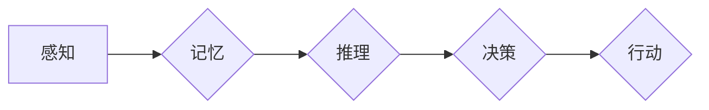

                 

## 知识的心理学基础：认知过程的解析

> 关键词：知识表示、认知模型、知识图谱、机器学习、深度学习、自然语言处理、人工智能

## 1. 背景介绍

人工智能（AI）的蓬勃发展离不开对知识的理解和处理。从早期规则驱动的专家系统到如今的深度学习模型，构建能够有效地表示、存储、检索和利用知识的系统一直是人工智能研究的核心问题。而知识的心理学基础，即理解人类如何获取、组织和运用知识，为构建更智能、更具普适性的AI系统提供了重要的启示。

人类的认知过程是一个复杂而动态的系统，它涉及感知、记忆、推理、决策等多种认知功能。知识作为认知过程的基础，被存储在人类大脑中以各种形式存在，例如概念、规则、事实、经验等。这些知识片段通过各种连接和关系相互关联，形成一个庞大的知识网络。

## 2. 核心概念与联系

**2.1 知识表示**

知识表示是指将知识以计算机可理解的形式进行编码和组织的过程。不同的知识表示形式各有优缺点，常见的知识表示形式包括：

* **符号表示:** 使用符号和规则来表示知识，例如逻辑表达式、概念网络等。
* **语义网络:** 使用节点和边来表示概念和它们的之间的关系，例如WordNet、ConceptNet等。
* **知识图谱:**  一种结构化的知识表示形式，使用实体和关系来描述知识，例如DBpedia、Wikidata等。

**2.2 认知模型**

认知模型试图模拟人类认知过程，解释人类如何理解、记忆和运用知识。常见的认知模型包括：

* **信息处理模型:** 将认知过程看作信息流的处理过程，例如多层感知机、专家系统等。
* **连接主义模型:** 将认知过程看作神经网络的激活模式，例如深度学习模型、循环神经网络等。
* **基于案例的模型:** 将知识存储为案例，并通过案例相似性进行推理和决策。

**2.3 知识图谱**

知识图谱是一种结构化的知识表示形式，它使用实体和关系来描述知识。实体代表现实世界中的事物，关系描述实体之间的联系。知识图谱可以用于各种应用场景，例如搜索引擎、问答系统、推荐系统等。

**Mermaid 流程图**



## 3. 核心算法原理 & 具体操作步骤

**3.1 算法原理概述**

知识图谱构建的核心算法包括：

* **实体识别:** 从文本中识别出实体，例如人名、地名、机构名等。
* **关系抽取:** 从文本中识别出实体之间的关系，例如“工作于”、“出生于”等。
* **知识推理:** 利用已有的知识进行推理，推导出新的知识。

**3.2 算法步骤详解**

1. **数据预处理:** 对原始数据进行清洗、格式化和标注，例如去除停用词、规范化实体名称等。
2. **实体识别:** 使用自然语言处理技术，例如词嵌入、条件随机场等，识别出文本中的实体。
3. **关系抽取:** 使用深度学习模型，例如循环神经网络、注意力机制等，识别出实体之间的关系。
4. **知识表示:** 将识别出的实体和关系表示为知识图谱的形式，例如使用RDF、OWL等标准。
5. **知识推理:** 利用规则引擎、逻辑推理等方法，进行知识推理，推导出新的知识。

**3.3 算法优缺点**

* **优点:** 能够有效地表示和组织知识，支持知识推理和查询。
* **缺点:** 构建知识图谱需要大量的标注数据，算法复杂度较高，推理能力有限。

**3.4 算法应用领域**

* **搜索引擎:** 提高搜索结果的准确性和相关性。
* **问答系统:** 构建能够理解自然语言并进行准确回答的问答系统。
* **推荐系统:** 基于用户兴趣和知识图谱进行个性化推荐。
* **医疗诊断:** 辅助医生进行疾病诊断和治疗方案制定。

## 4. 数学模型和公式 & 详细讲解 & 举例说明

**4.1 数学模型构建**

知识图谱可以表示为一个三元组的集合，其中每个三元组由一个实体、一个关系和另一个实体组成。

* **实体:**  用整数表示，例如：实体1，实体2，实体3
* **关系:** 用整数表示，例如：关系1，关系2，关系3
* **三元组:** (实体1, 关系1, 实体2)

**4.2 公式推导过程**

假设我们有一个知识图谱，包含以下三元组：

* (实体1, 关系1, 实体2)
* (实体2, 关系2, 实体3)

我们可以通过关系推理推导出新的三元组：

* (实体1, 关系3, 实体3)

其中，关系3 是关系1 和关系2 的组合关系。

**4.3 案例分析与讲解**

例如，在医疗领域，我们可以构建一个知识图谱，包含疾病、症状、治疗方法等实体和关系。通过关系推理，我们可以推导出新的知识，例如：

* 如果患者表现出症状A和症状B，那么他可能患有疾病C。
* 治疗方法D可以有效治疗疾病C。

## 5. 项目实践：代码实例和详细解释说明

**5.1 开发环境搭建**

* Python 3.x
* TensorFlow 或 PyTorch
* SpaCy 或 NLTK

**5.2 源代码详细实现**

```python
import spacy

# 加载 SpaCy 模型
nlp = spacy.load("en_core_web_sm")

# 文本数据
text = "Barack Obama was born in Honolulu, Hawaii."

# 使用 SpaCy 进行实体识别
doc = nlp(text)

# 打印识别出的实体
for ent in doc.ents:
    print(ent.text, ent.label_)
```

**5.3 代码解读与分析**

* 使用 SpaCy 库进行实体识别。
* 加载预训练的英文模型 `en_core_web_sm`。
* 对文本数据进行处理，识别出实体和实体类型。

**5.4 运行结果展示**

```
Barack Obama PERSON
Honolulu GPE
Hawaii GPE
```

## 6. 实际应用场景

**6.1 搜索引擎**

知识图谱可以帮助搜索引擎理解用户查询的意图，并提供更准确、更相关的搜索结果。例如，当用户搜索“苹果公司”时，搜索引擎可以利用知识图谱获取苹果公司的相关信息，例如公司名称、成立时间、CEO等，并将其显示在搜索结果中。

**6.2 问答系统**

知识图谱可以为问答系统提供知识库，帮助系统理解用户的问题并给出准确的答案。例如，当用户问“苹果公司总部在哪里？”时，问答系统可以利用知识图谱找到“苹果公司”实体和“总部”关系，并给出答案“苹果公司总部位于加州”。

**6.3 推荐系统**

知识图谱可以帮助推荐系统理解用户的兴趣和偏好，并推荐更相关的商品或服务。例如，如果用户购买了苹果手机，推荐系统可以利用知识图谱找到与苹果手机相关的商品，例如苹果耳机、苹果手表等，并将其推荐给用户。

**6.4 未来应用展望**

随着人工智能技术的不断发展，知识图谱将在更多领域得到应用，例如：

* **个性化教育:** 根据学生的学习情况和兴趣，提供个性化的学习内容和建议。
* **智能医疗:** 辅助医生进行疾病诊断、治疗方案制定和药物研发。
* **智慧城市:** 利用知识图谱构建城市信息模型，提高城市管理效率和服务水平。

## 7. 工具和资源推荐

**7.1 学习资源推荐**

* **书籍:**
    * 《知识表示与推理》
    * 《深度学习》
* **在线课程:**
    * Coursera: Knowledge Representation and Reasoning
    * edX: Introduction to Artificial Intelligence

**7.2 开发工具推荐**

* **知识图谱构建工具:**
    * Protégé
    * Apache Jena
* **深度学习框架:**
    * TensorFlow
    * PyTorch

**7.3 相关论文推荐**

* **知识图谱构建:**
    * “A Survey on Knowledge Graph Construction”
* **知识图谱推理:**
    * “A Survey on Knowledge Graph Reasoning”

## 8. 总结：未来发展趋势与挑战

**8.1 研究成果总结**

近年来，知识图谱技术取得了显著进展，在搜索引擎、问答系统、推荐系统等领域得到了广泛应用。

**8.2 未来发展趋势**

* **知识图谱规模和复杂度不断提升:** 未来知识图谱将包含更多实体和关系，并涵盖更广泛的领域。
* **知识图谱推理能力不断增强:** 研究者将开发更强大的知识推理算法，使知识图谱能够进行更复杂的推理和决策。
* **知识图谱与其他人工智能技术融合:** 知识图谱将与自然语言处理、计算机视觉等其他人工智能技术融合，构建更智能的AI系统。

**8.3 面临的挑战**

* **知识图谱构建成本高:** 构建高质量的知识图谱需要大量的标注数据和人工干预，成本较高。
* **知识图谱更新和维护困难:** 随着时间的推移，知识图谱中的信息会变得过时，需要不断更新和维护。
* **知识图谱的可解释性和信任度:** 知识图谱的推理过程往往是复杂的，难以解释，这会影响用户的信任度。

**8.4 研究展望**

未来研究将重点关注以下几个方面:

* **自动知识图谱构建技术:** 开发能够自动从文本、图像、视频等数据中提取知识的算法。
* **知识图谱动态更新和维护技术:** 研究如何自动更新和维护知识图谱，使其能够保持最新状态。
* **知识图谱可解释性和信任度提升技术:** 开发能够解释知识图谱推理过程的算法，提高用户的信任度。


## 9. 附录：常见问题与解答

**9.1 如何构建知识图谱？**

构建知识图谱需要以下步骤：

1. **数据收集:** 收集相关领域的文本、图像、视频等数据。
2. **数据预处理:** 对数据进行清洗、格式化和标注。
3. **实体识别:** 使用自然语言处理技术识别出实体。
4. **关系抽取:** 使用深度学习模型识别出实体之间的关系。
5. **知识表示:** 将识别出的实体和关系表示为知识图谱的形式。

**9.2 知识图谱有什么应用场景？**

知识图谱的应用场景非常广泛，例如：

* 搜索引擎
* 问答系统
* 推荐系统
* 智能医疗
* 个性化教育

**9.3 知识图谱的未来发展趋势是什么？**

知识图谱的未来发展趋势包括：

* 规模和复杂度不断提升
* 推理能力不断增强
* 与其他人工智能技术融合

作者：禅与计算机程序设计艺术 / Zen and the Art of Computer Programming 


<end_of_turn>

