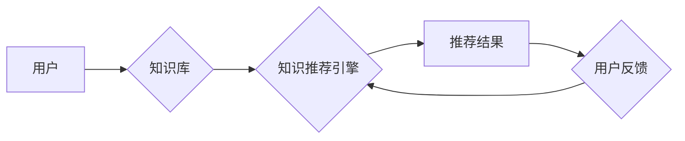

                 

## 知识经济下知识付费的人工智能知识推荐系统

> 关键词：知识推荐系统、人工智能、知识付费、机器学习、深度学习、个性化推荐、内容匹配、用户行为分析

## 1. 背景介绍

随着互联网的快速发展和知识经济的兴起，知识已成为重要的生产要素和社会资源。知识付费模式的出现，为知识生产者和消费者提供了新的合作模式，也推动了知识产业的蓬勃发展。然而，海量知识资源的涌现也带来了新的挑战，如何高效地将用户与所需知识精准匹配，成为了一个亟待解决的问题。

人工智能技术作为新一代信息技术的重要组成部分，在知识推荐领域展现出巨大的潜力。人工智能知识推荐系统能够通过对用户行为、知识内容和知识关系的分析，智能地推荐用户感兴趣、有价值的知识内容，从而提升用户体验，促进知识传播和价值实现。

## 2. 核心概念与联系

### 2.1 知识推荐系统

知识推荐系统是指利用人工智能技术，根据用户的兴趣、需求和行为特征，从海量知识资源中智能推荐相关知识内容的系统。它旨在解决用户在海量知识海洋中难以找到所需信息的问题，提高知识获取效率和用户满意度。

### 2.2 人工智能

人工智能 (Artificial Intelligence，简称 AI) 是一门致力于模拟和实现人类智能的学科。它涵盖了机器学习、深度学习、自然语言处理、计算机视觉等多个领域，旨在使机器能够像人类一样学习、思考、解决问题和做出决策。

### 2.3 知识付费

知识付费是指知识生产者通过提供付费的知识内容，例如课程、书籍、咨询等，获取收益的商业模式。它打破了传统知识传播的免费模式，为知识生产者提供了新的收入来源，也为用户提供了更高质量、更个性化的知识服务。

**核心概念与架构流程图**



## 3. 核心算法原理 & 具体操作步骤

### 3.1 算法原理概述

知识推荐系统常用的算法包括：

* **基于内容的推荐算法:** 根据知识内容的主题、标签、关键词等特征，与用户的兴趣偏好进行匹配，推荐相关知识。
* **基于协同过滤的推荐算法:** 通过分析其他用户对知识的评价和行为，预测用户对特定知识的兴趣，进行推荐。
* **基于深度学习的推荐算法:** 利用深度神经网络模型，学习用户和知识之间的复杂关系，进行更精准的推荐。

### 3.2 算法步骤详解

以基于内容的推荐算法为例，其具体操作步骤如下：

1. **知识内容分析:** 对知识内容进行文本分析，提取主题、关键词、标签等特征，构建知识内容的特征向量。
2. **用户兴趣建模:** 分析用户的历史行为数据，例如浏览记录、购买记录、评价记录等，构建用户的兴趣偏好模型。
3. **相似度计算:** 计算知识内容特征向量与用户兴趣偏好模型之间的相似度，例如余弦相似度、皮尔逊相关系数等。
4. **推荐结果排序:** 根据相似度得分对推荐结果进行排序，推荐用户最感兴趣的知识内容。

### 3.3 算法优缺点

**基于内容的推荐算法:**

* **优点:** 能够根据知识内容本身的特点进行推荐，推荐结果更精准。
* **缺点:** 需要大量的知识内容数据进行训练，对新知识内容的推荐效果较差。

**基于协同过滤的推荐算法:**

* **优点:** 可以发现用户之间的隐性关联，推荐用户可能感兴趣但未接触过的知识内容。
* **缺点:** 数据稀疏性问题，对新用户和新知识内容的推荐效果较差。

**基于深度学习的推荐算法:**

* **优点:** 可以学习用户和知识之间的复杂关系，推荐效果更精准。
* **缺点:** 需要大量的训练数据和计算资源，模型训练复杂度高。

### 3.4 算法应用领域

知识推荐算法广泛应用于以下领域:

* **在线教育平台:** 推荐个性化学习课程和学习资源。
* **知识付费平台:** 推荐用户感兴趣的付费知识内容。
* **搜索引擎:** 提升搜索结果的精准度和相关性。
* **电商平台:** 推荐用户可能感兴趣的商品和服务。

## 4. 数学模型和公式 & 详细讲解 & 举例说明

### 4.1 数学模型构建

基于内容的推荐算法通常使用余弦相似度来衡量知识内容和用户兴趣之间的相似度。

**用户兴趣向量:**  u = (u1, u2, ..., un)

**知识内容向量:**  i = (i1, i2, ..., in)

**余弦相似度:**  sim(u, i) = (u ⋅ i) / (||u|| ||i||)

其中:

* u ⋅ i 表示用户兴趣向量和知识内容向量的点积。
* ||u|| 和 ||i|| 分别表示用户兴趣向量和知识内容向量的模长。

### 4.2 公式推导过程

余弦相似度的公式推导过程如下:

1. 点积: u ⋅ i = u1 * i1 + u2 * i2 + ... + un * in

2. 模长: ||u|| = √(u1^2 + u2^2 + ... + un^2)

3.  ||i|| = √(i1^2 + i2^2 + ... + in^2)

4.  sim(u, i) = (u ⋅ i) / (||u|| ||i||)

### 4.3 案例分析与讲解

假设用户 u 的兴趣向量为 (0.8, 0.5, 0.2)，知识内容 i 的向量为 (0.6, 0.7, 0.1)。

则:

* u ⋅ i = 0.8 * 0.6 + 0.5 * 0.7 + 0.2 * 0.1 = 0.89

* ||u|| = √(0.8^2 + 0.5^2 + 0.2^2) = √0.93

* ||i|| = √(0.6^2 + 0.7^2 + 0.1^2) = √0.9

因此:

* sim(u, i) = 0.89 / (√0.93 * √0.9) ≈ 0.96

该结果表明，用户 u 和知识内容 i 之间具有很高的相似度，因此用户 u 很可能对该知识内容感兴趣。

## 5. 项目实践：代码实例和详细解释说明

### 5.1 开发环境搭建

* Python 3.x
* scikit-learn 库
* pandas 库
* numpy 库

### 5.2 源代码详细实现

```python
import pandas as pd
from sklearn.metrics.pairwise import cosine_similarity

# 加载知识内容数据
data = pd.read_csv('knowledge_data.csv')

# 对知识内容进行文本分析，提取特征向量
# ...

# 加载用户行为数据
user_data = pd.read_csv('user_data.csv')

# 对用户行为数据进行分析，构建用户兴趣模型
# ...

# 计算知识内容和用户兴趣之间的余弦相似度
similarity_matrix = cosine_similarity(knowledge_features, user_features)

# 根据相似度得分排序推荐结果
recommended_items = similarity_matrix.argsort()[:, ::-1]

# 输出推荐结果
print(recommended_items)
```

### 5.3 代码解读与分析

* 代码首先加载知识内容数据和用户行为数据。
* 然后对知识内容进行文本分析，提取特征向量，并对用户行为数据进行分析，构建用户兴趣模型。
* 利用 scikit-learn 库中的 cosine_similarity 函数计算知识内容和用户兴趣之间的余弦相似度。
* 根据相似度得分排序推荐结果，并输出推荐结果。

### 5.4 运行结果展示

运行代码后，将输出一个包含推荐知识内容索引的数组。

## 6. 实际应用场景

### 6.1 在线教育平台

在线教育平台可以利用知识推荐系统，根据用户的学习目标、学习进度和学习风格，推荐个性化的学习课程和学习资源，提升用户学习效率和学习体验。

### 6.2 知识付费平台

知识付费平台可以利用知识推荐系统，根据用户的兴趣爱好和知识需求，推荐相关付费知识内容，提高用户付费意愿和平台收入。

### 6.3 搜索引擎

搜索引擎可以利用知识推荐系统，根据用户的搜索历史和搜索行为，推荐用户可能感兴趣的知识内容，提升搜索结果的精准度和相关性。

### 6.4 未来应用展望

随着人工智能技术的不断发展，知识推荐系统将更加智能化、个性化和精准化。未来，知识推荐系统将应用于更多领域，例如医疗、金融、法律等，为用户提供更个性化、更精准的知识服务。

## 7. 工具和资源推荐

### 7.1 学习资源推荐

* **书籍:**
    * 《推荐系统》
    * 《深度学习》
    * 《机器学习》
* **在线课程:**
    * Coursera: 机器学习
    * edX: 深度学习
    * Udacity: 自然语言处理

### 7.2 开发工具推荐

* **Python:** 
    * scikit-learn
    * pandas
    * numpy
* **深度学习框架:**
    * TensorFlow
    * PyTorch
    * Keras

### 7.3 相关论文推荐

* **Collaborative Filtering for Implicit Feedback Datasets**
* **Deep Learning for Recommender Systems**
* **Content-Based Recommendation Systems**

## 8. 总结：未来发展趋势与挑战

### 8.1 研究成果总结

人工智能知识推荐系统在知识发现、知识传播和知识价值实现方面取得了显著成果，为用户提供更便捷、更精准的知识服务。

### 8.2 未来发展趋势

* **更精准的推荐:** 利用更先进的机器学习算法和深度学习模型，提升推荐结果的精准度和个性化程度。
* **更丰富的知识内容:** 融合多模态知识，例如文本、图像、音频等，构建更丰富的知识图谱，提供更全面的知识服务。
* **更智能的交互:** 利用自然语言处理技术，实现更智能的知识交互，例如语音搜索、对话式知识推荐等。

### 8.3 面临的挑战

* **数据质量和数据稀疏性:** 知识推荐系统需要大量的优质数据进行训练，而数据质量和数据稀疏性是制约系统性能的重要因素。
* **算法复杂性和计算资源:** 训练复杂的深度学习模型需要大量的计算资源，这对于资源有限的机构和个人来说是一个挑战。
* **用户隐私保护:** 知识推荐系统需要收集和分析用户的个人信息，因此用户隐私保护是一个重要的伦理问题。

### 8.4 研究展望

未来，人工智能知识推荐系统将朝着更智能、更精准、更个性化的方向发展，为用户提供更便捷、更丰富的知识服务。


## 9. 附录：常见问题与解答

**Q1: 如何评估知识推荐系统的性能？**

**A1:** 常用的评估指标包括准确率、召回率、F1-score、NDCG等。

**Q2: 如何处理数据稀疏性问题？**

**A2:** 可以采用以下方法处理数据稀疏性问题:

* **协同过滤算法的改进:** 例如使用矩阵分解技术，将用户-物品交互矩阵分解成低维子空间，降低数据稀疏性的影响。
* **内容特征的融合:** 将用户兴趣和知识内容的特征进行融合，提高推荐结果的准确性。
* **冷启动问题解决:** 利用用户画像、知识图谱等信息，对新用户和新知识内容进行推荐。

**Q3: 如何保证知识推荐系统的公平性？**

**A3:** 

* 避免算法偏见: 

使用公平性评估指标，检测和修正算法中的潜在偏见。
* 提供多样化的推荐结果: 

避免推荐结果过于单一，提供多样化的知识内容，满足不同用户的需求。
* 透明化算法: 

公开算法原理和决策过程，提高算法的可解释性和可控性。


作者：禅与计算机程序设计艺术 / Zen and the Art of Computer Programming 
<end_of_turn>

