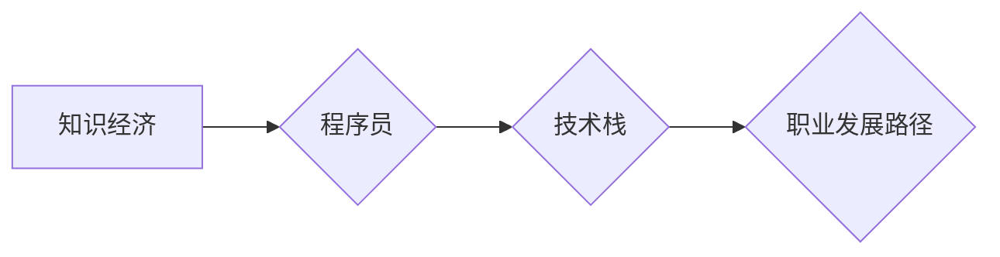

                 

## 知识经济下程序员的职业发展路径

> 关键词：知识经济、程序员、职业发展、技术栈、持续学习、软技能、领导力、创业、人工智能

### 1. 背景介绍

21世纪，知识已成为经济的决定性要素，知识经济时代到来。在这个时代，拥有知识、技能和创造力的个体将占据主导地位。程序员作为知识经济的核心力量之一，在推动科技进步、经济发展和社会变革中扮演着越来越重要的角色。然而，随着技术的日新月异，程序员的职业发展路径也面临着新的挑战和机遇。

传统意义上的程序员，主要负责编写代码，维护软件系统。但随着人工智能、云计算、大数据等技术的快速发展，程序员的职责正在发生着深刻的变化。他们需要具备更广泛的知识和技能，才能适应不断变化的市场需求。

### 2. 核心概念与联系

**2.1 知识经济与程序员职业发展**

知识经济的核心是知识的创造、传播和应用。程序员作为知识创造者，通过编写代码，构建软件系统，为社会创造价值。

**2.2 程序员职业发展路径**

程序员的职业发展路径可以分为以下几个阶段：

* **初级程序员:** 主要负责编写简单的代码，维护软件系统。
* **中级程序员:** 能够独立完成软件开发任务，具备一定的架构设计能力。
* **高级程序员:** 能够设计和开发复杂的软件系统，具备丰富的经验和技术积累。
* **架构师:** 负责软件系统的整体设计和架构，对技术方向具有较强的领导力。
* **技术专家:** 在某个特定领域拥有深厚的技术积累，能够解决复杂的技术问题。

**2.3 技术栈与职业发展**

技术栈是指程序员掌握的编程语言、框架、工具等技术组合。不同的技术栈对应不同的职业发展路径。例如，前端开发工程师主要掌握HTML、CSS、JavaScript等技术，而后端开发工程师则主要掌握Java、Python、Node.js等技术。

**Mermaid 流程图**



### 3. 核心算法原理 & 具体操作步骤

**3.1 算法原理概述**

算法是解决特定问题的步骤或规则。程序员需要掌握各种算法，才能高效地编写代码，解决实际问题。常见的算法包括排序算法、搜索算法、数据结构算法等。

**3.2 算法步骤详解**

以排序算法为例，常见的排序算法包括冒泡排序、插入排序、快速排序等。

* **冒泡排序:** 比较相邻的两个元素，如果顺序错误，则交换它们的位置。重复此过程，直到整个数组有序。
* **插入排序:** 将数组中的每个元素插入到已排序的子数组中，直到整个数组有序。
* **快速排序:** 选择一个元素作为基准，将小于基准的元素放在左边，大于基准的元素放在右边。递归地对左右子数组进行排序。

**3.3 算法优缺点**

不同的算法具有不同的优缺点，需要根据实际情况选择合适的算法。例如，冒泡排序简单易懂，但效率较低；快速排序效率较高，但对于已经排序的数组效率较低。

**3.4 算法应用领域**

算法广泛应用于各个领域，例如搜索引擎、推荐系统、图像识别、自然语言处理等。

### 4. 数学模型和公式 & 详细讲解 & 举例说明

**4.1 数学模型构建**

数学模型可以用来描述算法的运行过程和性能。例如，可以使用时间复杂度和空间复杂度来衡量算法的效率。

**4.2 公式推导过程**

时间复杂度是指算法运行时间随输入规模变化的趋势。空间复杂度是指算法运行过程中使用的内存空间大小。

**4.3 案例分析与讲解**

例如，冒泡排序的时间复杂度为O(n^2)，空间复杂度为O(1)。快速排序的时间复杂度为平均情况下O(n log n)，空间复杂度为O(log n)。

### 5. 项目实践：代码实例和详细解释说明

**5.1 开发环境搭建**

程序员需要选择合适的开发环境，例如IDE、文本编辑器、版本控制系统等。

**5.2 源代码详细实现**

以Python语言为例，实现一个简单的冒泡排序算法：

```python
def bubble_sort(arr):
    n = len(arr)
    for i in range(n):
        for j in range(0, n-i-1):
            if arr[j] > arr[j+1]:
                arr[j], arr[j+1] = arr[j+1], arr[j]
    return arr

# 测试代码
arr = [64, 34, 25, 12, 22, 11, 90]
sorted_arr = bubble_sort(arr)
print("排序后的数组:", sorted_arr)
```

**5.3 代码解读与分析**

代码首先定义了一个名为`bubble_sort`的函数，该函数接受一个数组作为输入。函数内部使用两个循环来实现冒泡排序算法。外循环控制迭代次数，内循环比较相邻元素，并交换位置。最后，函数返回排序后的数组。

**5.4 运行结果展示**

运行代码后，输出结果为：

```
排序后的数组: [11, 12, 22, 25, 34, 64, 90]
```

### 6. 实际应用场景

程序员的技能在各个行业都有广泛的应用，例如：

* **软件开发:** 开发各种类型的软件应用程序，例如网站、移动应用、桌面应用等。
* **数据科学:** 分析和处理大数据，挖掘数据中的价值。
* **人工智能:** 开发人工智能算法，例如机器学习、深度学习等。
* **网络安全:** 保护计算机系统和网络免受攻击。

**6.4 未来应用展望**

随着技术的不断发展，程序员的职业发展路径将更加多元化。例如，云计算、物联网、区块链等新兴技术将创造新的职业机会。

### 7. 工具和资源推荐

**7.1 学习资源推荐**

* 在线学习平台：Coursera、edX、Udemy等
* 书籍： 《编程之美》、《算法导论》等
* 开源项目：GitHub、GitLab等

**7.2 开发工具推荐**

* IDE：Visual Studio Code、IntelliJ IDEA等
* 版本控制系统：Git、SVN等
* 数据库：MySQL、PostgreSQL等

**7.3 相关论文推荐**

* 《图灵奖获奖论文集》
* 《ACM计算杂志》

### 8. 总结：未来发展趋势与挑战

**8.1 研究成果总结**

知识经济下，程序员的职业发展路径正在发生着深刻的变化。程序员需要不断学习新技术，提升自身技能，才能适应市场需求。

**8.2 未来发展趋势**

未来，程序员的职业发展将更加多元化，需要具备更广泛的知识和技能。例如，人工智能、云计算、大数据等新兴技术将创造新的职业机会。

**8.3 面临的挑战**

程序员面临着不断变化的技术环境、激烈的市场竞争等挑战。需要不断学习和提升自身能力，才能保持竞争力。

**8.4 研究展望**

未来研究方向包括：

* 如何更好地培养程序员的软技能，例如沟通能力、团队合作能力等。
* 如何利用人工智能技术，提高程序员的开发效率。
* 如何探索程序员的职业发展新模式，例如远程工作、自由职业等。

### 9. 附录：常见问题与解答

**9.1 如何选择合适的技术栈？**

选择技术栈需要考虑自身兴趣、职业目标和市场需求等因素。

**9.2 如何提升编程能力？**

可以通过学习编程书籍、参加在线课程、参与开源项目等方式提升编程能力。

**9.3 如何应对技术更新迭代？**

需要保持学习的热情，关注行业动态，不断学习新技术。


作者：禅与计算机程序设计艺术 / Zen and the Art of Computer Programming 
<end_of_turn>

