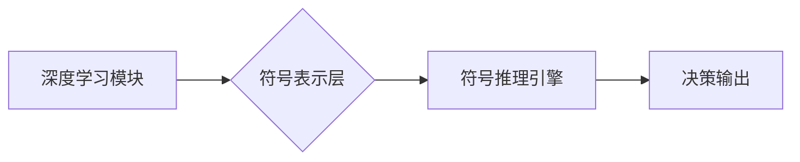

                 

## 神经符号人工智能：最佳方案

> 关键词：神经符号人工智能、符号推理、深度学习、知识表示、通用人工智能、神经网络、符号主义

## 1. 背景介绍

人工智能（AI）的发展经历了多个阶段，从早期基于规则的专家系统到如今的深度学习时代。深度学习在图像识别、自然语言处理等领域取得了显著成就，但同时也面临着一些挑战，例如缺乏可解释性、对新知识的泛化能力有限、难以处理复杂推理任务等。

神经符号人工智能（Neuro-Symbolic AI）作为一种新兴的 AI 范式，试图结合深度学习和符号人工智能的优势，构建更强大、更智能的 AI 系统。它旨在将深度学习的强大表征能力与符号人工智能的逻辑推理和知识表示能力相结合，从而实现更高级的认知功能，例如推理、规划、学习和解释。

## 2. 核心概念与联系

**2.1 符号人工智能 (Symbolic AI)**

符号人工智能的核心思想是将世界知识和推理规则表示为符号，并使用逻辑推理机制进行知识表示和推理。它强调知识的明确表达和逻辑的严密性，能够进行复杂的推理和决策，但缺乏对复杂数据的处理能力。

**2.2 深度学习 (Deep Learning)**

深度学习是一种基于多层神经网络的机器学习方法，能够从海量数据中学习复杂的特征表示。它在图像识别、语音识别等领域取得了突破性进展，但缺乏对知识的明确表达和逻辑推理的能力。

**2.3 神经符号人工智能 (Neuro-Symbolic AI)**

神经符号人工智能试图将符号人工智能和深度学习相结合，构建一个能够进行高效推理和知识表示的 AI 系统。它利用深度学习学习数据特征，并将其表示为符号，然后使用符号推理机制进行知识推理和决策。

**2.4  核心架构**



## 3. 核心算法原理 & 具体操作步骤

**3.1 算法原理概述**

神经符号人工智能的核心算法通常包括以下步骤：

1. **数据预处理:** 将原始数据转换为深度学习模型可以处理的格式。
2. **特征提取:** 使用深度学习模型从数据中提取特征表示。
3. **符号表示:** 将深度学习提取的特征表示转换为符号形式，例如概念、关系和规则。
4. **符号推理:** 使用符号推理引擎进行知识推理和决策。
5. **输出结果:** 将推理结果输出为决策或预测。

**3.2 算法步骤详解**

1. **数据预处理:** 

   - 对原始数据进行清洗、转换和格式化，例如文本数据需要进行分词、词性标注等处理。
   - 将数据转换为深度学习模型可以处理的格式，例如将图像数据转换为像素矩阵，将文本数据转换为词向量等。

2. **特征提取:** 

   - 使用深度学习模型，例如卷积神经网络（CNN）或循环神经网络（RNN），从数据中提取特征表示。
   - CNN擅长处理图像数据，RNN擅长处理序列数据，选择合适的模型取决于数据的类型。

3. **符号表示:** 

   - 将深度学习提取的特征表示转换为符号形式，例如概念、关系和规则。
   - 可以使用知识图谱、概念网或其他符号表示方法。
   - 例如，将图像中的物体识别为“猫”，“狗”等概念，并将它们之间的关系表示为“猫是哺乳动物”，“狗是哺乳动物”等规则。

4. **符号推理:** 

   - 使用符号推理引擎，例如逻辑推理引擎或规则引擎，进行知识推理和决策。
   - 根据符号表示和推理规则，推导出新的知识或做出决策。
   - 例如，根据“猫是哺乳动物”，“狗是哺乳动物”等规则，可以推导出“猫和狗都是哺乳动物”。

5. **输出结果:** 

   - 将推理结果输出为决策或预测。
   - 例如，根据图像中的物体识别结果和符号推理，可以预测图像中是否存在危险。

**3.3 算法优缺点**

**优点:**

- 能够进行复杂的推理和决策。
- 能够处理复杂知识表示。
- 具有可解释性，可以解释推理过程。

**缺点:**

- 构建符号表示和推理规则需要大量人工干预。
- 难以处理海量数据和复杂关系。
- 符号推理效率相对较低。

**3.4 算法应用领域**

- 医疗诊断
- 自动驾驶
- 自然语言理解
- 机器学习解释
- 科学发现

## 4. 数学模型和公式 & 详细讲解 & 举例说明

**4.1 数学模型构建**

神经符号人工智能的数学模型通常结合了深度学习和符号逻辑的元素。

- **深度学习部分:** 使用神经网络模型学习数据特征，可以采用卷积神经网络（CNN）、循环神经网络（RNN）或其他深度学习架构。
- **符号逻辑部分:** 使用符号逻辑语言表示知识和推理规则，例如命题逻辑、谓词逻辑或 Description Logic。

**4.2 公式推导过程**

神经符号人工智能的推理过程通常涉及以下公式推导：

- **特征提取公式:** 使用深度学习模型从数据中提取特征表示，例如 CNN 的卷积和池化操作。
- **符号化公式:** 将深度学习提取的特征表示转换为符号形式，例如使用词嵌入将文本数据转换为向量，然后将向量映射到概念或关系。
- **推理规则:** 使用符号逻辑规则进行知识推理，例如使用规则引擎根据已知知识和推理规则推导出新的知识。

**4.3 案例分析与讲解**

例如，在图像识别任务中，可以使用 CNN 模型提取图像特征，然后将特征转换为符号表示，例如将图像中的物体识别为“猫”，“狗”等概念。可以使用符号逻辑规则表示“猫是哺乳动物”，“狗是哺乳动物”等知识。根据这些符号表示和规则，可以推导出“猫和狗都是哺乳动物”等新的知识。

## 5. 项目实践：代码实例和详细解释说明

**5.1 开发环境搭建**

- Python 3.x
- TensorFlow 或 PyTorch 深度学习框架
- SpaCy 或 NLTK 自然语言处理库
- Protégé 或 Jena 符号推理引擎

**5.2 源代码详细实现**

```python
# 使用 TensorFlow 构建 CNN 模型
model = tf.keras.models.Sequential([
    tf.keras.layers.Conv2D(32, (3, 3), activation='relu', input_shape=(28, 28, 1)),
    tf.keras.layers.MaxPooling2D((2, 2)),
    tf.keras.layers.Conv2D(64, (3, 3), activation='relu'),
    tf.keras.layers.MaxPooling2D((2, 2)),
    tf.keras.layers.Flatten(),
    tf.keras.layers.Dense(10, activation='softmax')
])

# 使用 SpaCy 进行文本数据预处理
nlp = spacy.load("en_core_web_sm")
text = "This is a sample text."
doc = nlp(text)

# 将文本数据转换为词向量
word_vectors = [doc[i].vector for i in range(len(doc))]

# 使用 Protégé 创建知识图谱
# ...

# 使用符号推理引擎进行知识推理
# ...
```

**5.3 代码解读与分析**

- 代码示例展示了如何使用 TensorFlow 构建 CNN 模型，SpaCy 进行文本数据预处理，并将文本数据转换为词向量。
- 知识图谱的构建和符号推理引擎的使用需要根据具体任务和应用场景进行定制。

**5.4 运行结果展示**

- 运行结果将根据具体任务和数据而异，例如图像识别任务的输出结果是图像中物体的类别，文本分类任务的输出结果是文本的类别标签。

## 6. 实际应用场景

**6.1 医疗诊断**

神经符号人工智能可以用于辅助医生进行诊断，例如根据患者的症状、病史和医学影像数据进行疾病诊断。

**6.2 自动驾驶**

神经符号人工智能可以用于构建更安全的自动驾驶系统，例如理解道路场景、预测其他车辆的行为、做出决策。

**6.3 自然语言理解**

神经符号人工智能可以用于构建更智能的自然语言理解系统，例如理解复杂句子、回答开放式问题、进行对话。

**6.4 机器学习解释**

神经符号人工智能可以用于解释深度学习模型的决策过程，提高模型的可解释性和可信度。

**6.5 科学发现**

神经符号人工智能可以用于辅助科学家进行科学发现，例如分析实验数据、发现新的规律、提出新的假设。

**6.6 未来应用展望**

神经符号人工智能在未来将有更广泛的应用场景，例如：

- 个性化教育
- 智能客服
- 虚拟助手
- 药物研发
- 灾害预测

## 7. 工具和资源推荐

**7.1 学习资源推荐**

- **书籍:**
    - "Neuro-Symbolic AI: Bridging the Gap Between Deep Learning and Knowledge Representation" by  Marcus Hutter
    - "Deep Learning with Python" by Francois Chollet
- **课程:**
    - Stanford CS224N: Natural Language Processing with Deep Learning
    - MIT 6.S191: Introduction to Deep Learning

**7.2 开发工具推荐**

- **深度学习框架:** TensorFlow, PyTorch, Keras
- **符号推理引擎:** Protégé, Jena, SWI-Prolog
- **自然语言处理库:** SpaCy, NLTK, Gensim

**7.3 相关论文推荐**

- "Neuro-Symbolic Learning: A Survey" by  A. Grefenstette et al.
- "Symbolic Reasoning with Deep Learning" by  J. B. Tenenbaum et al.
- "Towards Neuro-Symbolic AI" by  R. Socher et al.

## 8. 总结：未来发展趋势与挑战

**8.1 研究成果总结**

神经符号人工智能是一个新兴的领域，近年来取得了显著进展。

- 深度学习模型和符号推理引擎的结合取得了成功。
- 出现了新的神经符号学习算法和框架。
- 在图像识别、自然语言理解等领域取得了突破性进展。

**8.2 未来发展趋势**

- **更强大的符号推理能力:** 开发更强大的符号推理引擎，能够处理更复杂的关系和推理任务。
- **更有效的符号表示:** 探索更有效的符号表示方法，能够更好地表达复杂知识和关系。
- **端到端训练:** 开发端到端训练的 neuro-symbolic 模型，能够同时学习特征表示和符号推理规则。
- **可解释性增强:** 提高神经符号人工智能模型的可解释性，使其决策过程更加透明和可理解。

**8.3 面临的挑战**

- **符号表示的复杂性:** 构建有效的符号表示方法仍然是一个挑战。
- **推理效率的瓶颈:** 符号推理过程通常比较耗时，需要提高推理效率。
- **数据稀缺性:** 神经符号人工智能模型需要大量数据进行训练，数据稀缺性是一个挑战。
- **安全性和可靠性:** 神经符号人工智能模型的安全性和可靠性需要进一步研究和保证。

**8.4 研究展望**

神经符号人工智能是一个充满希望的领域，未来将有更多突破和进展。

- 构建更智能、更安全的 AI 系统。
- 帮助人类更好地理解世界。
- 推动科技进步和社会发展。

## 9. 附录：常见问题与解答

**9.1 如何选择合适的符号表示方法？**

选择合适的符号表示方法取决于具体任务和应用场景。

- 对于图像识别任务，可以使用概念网或图像描述语言进行符号表示。
- 对于自然语言理解任务，可以使用词嵌入、句法树或知识图谱进行符号表示。

**9.2 如何提高符号推理的效率？**

可以使用以下方法提高符号推理的效率：

- 使用更有效的推理算法，例如基于图的推理算法。
- 使用并行计算技术进行推理。
- 使用知识库进行推理加速。

**9.3 神经符号人工智能与通用人工智能的关系？**

神经符号人工智能被认为是通用的人工智能的重要组成部分。

- 它结合了深度学习和符号逻辑的优势，能够实现更高级的认知功能。
- 构建通用人工智能系统需要多种技术手段的结合，神经符号人工智能是其中一个关键方向。


作者：禅与计算机程序设计艺术 / Zen and the Art of Computer Programming 
<end_of_turn>

