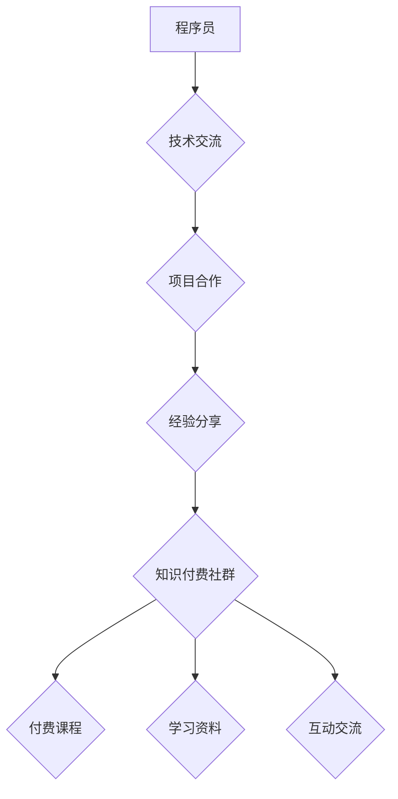

                 

## 程序员如何建立自己的知识付费社群

> 关键词：知识付费、程序员社群、在线教育、内容运营、社区建设、技术分享、品牌打造

### 1. 背景介绍

在当今数字化时代，知识成为最宝贵的财富。程序员作为科技领域的核心力量，拥有丰富的技术经验和专业技能。如何将自身积累的知识转化为价值，并与更多人分享，成为众多程序员共同思考的问题。知识付费模式的兴起为程序员提供了新的机遇，让他们能够通过建立自己的知识付费社群，分享技术，构建品牌，实现自我价值和经济回报。

### 2. 核心概念与联系

**2.1 知识付费社群**

知识付费社群是指以知识分享为核心，通过线上平台构建一个付费会员制社区，提供专业技术课程、学习资料、互动交流等服务，实现知识价值的传播和变现的模式。

**2.2 程序员社群**

程序员社群是指聚集程序员的线上或线下组织，通过技术交流、项目合作、经验分享等方式，促进程序员之间的互动和协作。

**2.3 核心概念联系**

知识付费社群与程序员社群之间存在着密切的联系。知识付费社群可以视为程序员社群的一种升级形式，它不仅提供技术交流和合作的平台，更重要的是通过付费机制，将知识分享和价值创造结合起来。

**Mermaid 流程图**



### 3. 核心算法原理 & 具体操作步骤

**3.1 算法原理概述**

知识付费社群的运营本质上是一个算法驱动的过程，通过数据分析和用户行为模型，实现内容推荐、用户匹配、社群活跃度提升等功能。

**3.2 算法步骤详解**

1. **用户画像构建:** 收集用户数据，包括技术领域、学习目标、兴趣爱好、行为习惯等，构建用户画像。
2. **内容推荐算法:** 基于用户画像，推荐相关技术课程、学习资料、社区话题等内容。
3. **社区匹配算法:** 根据用户兴趣和技术水平，匹配用户到合适的社群，促进互动交流。
4. **活跃度提升算法:** 通过点赞、评论、分享等行为，计算用户活跃度，并通过推送通知、活动组织等方式，提升社群活跃度。

**3.3 算法优缺点**

**优点:**

* **精准推荐:** 算法可以根据用户需求，精准推荐相关内容，提高用户学习效率。
* **个性化服务:** 算法可以根据用户画像，提供个性化学习路径和社群匹配，提升用户体验。
* **数据驱动:** 算法可以根据数据分析，优化运营策略，提升社群活跃度和用户粘性。

**缺点:**

* **数据依赖:** 算法需要大量用户数据才能有效运作，初期阶段可能面临数据不足的问题。
* **算法偏差:** 算法模型可能存在偏差，导致推荐内容不准确或用户匹配不理想。
* **用户隐私:** 数据收集和分析需要谨慎处理，确保用户隐私安全。

**3.4 算法应用领域**

* **在线教育平台:** 推荐课程、学习资料、导师匹配等。
* **社交平台:** 推荐好友、兴趣小组、话题讨论等。
* **电商平台:** 推荐商品、优惠券、促销活动等。

### 4. 数学模型和公式 & 详细讲解 & 举例说明

**4.1 数学模型构建**

知识付费社群的运营可以抽象为一个用户-内容-社群的交互系统，可以使用图论模型来描述。其中，用户、内容、社群分别对应节点，用户与内容、用户与社群、内容与社群之间的交互关系对应边。

**4.2 公式推导过程**

* **用户活跃度:**  活跃度 = (点赞数 + 评论数 + 分享数) / 用户总数
* **内容推荐得分:** 推荐得分 = (用户兴趣匹配度 + 内容相关性 + 内容质量) * 用户活跃度
* **社群匹配得分:** 匹配得分 = (用户技术水平 + 用户兴趣爱好 + 社群规模) * 社群活跃度

**4.3 案例分析与讲解**

假设一个程序员社群，其中用户A对人工智能技术感兴趣，用户B对Web开发技术感兴趣。社群中提供了一门人工智能课程和一门Web开发课程。根据上述公式，可以计算出用户A对人工智能课程的推荐得分较高，用户B对Web开发课程的推荐得分较高。

### 5. 项目实践：代码实例和详细解释说明

**5.1 开发环境搭建**

* **操作系统:** Linux/macOS/Windows
* **编程语言:** Python
* **框架:** Django/Flask
* **数据库:** MySQL/PostgreSQL

**5.2 源代码详细实现**

```python
# 用户模型
class User(models.Model):
    username = models.CharField(max_length=255)
    password = models.CharField(max_length=255)
    # 其他用户属性

# 内容模型
class Content(models.Model):
    title = models.CharField(max_length=255)
    description = models.TextField()
    # 其他内容属性

# 社群模型
class Community(models.Model):
    name = models.CharField(max_length=255)
    description = models.TextField()
    # 其他社群属性
```

**5.3 代码解读与分析**

以上代码示例展示了知识付费社群的基本模型结构。用户、内容、社群分别对应不同的模型，通过数据库关系建立连接。

**5.4 运行结果展示**

运行上述代码，可以搭建一个基本的知识付费社群平台，实现用户注册、登录、内容发布、社群加入等功能。

### 6. 实际应用场景

**6.1 在线课程平台**

程序员可以利用知识付费社群平台，发布自己的技术课程，分享编程经验，帮助其他程序员提升技能。

**6.2 技术博客平台**

程序员可以将自己的技术博客与知识付费社群平台结合，提供付费会员服务，获得更多收入。

**6.3 项目合作平台**

程序员可以利用知识付费社群平台，寻找项目合作伙伴，共同开发软件项目。

**6.4 未来应用展望**

随着人工智能、大数据等技术的不断发展，知识付费社群平台将更加智能化、个性化，能够提供更精准的推荐、更丰富的互动体验，成为程序员学习、交流、合作的重要平台。

### 7. 工具和资源推荐

**7.1 学习资源推荐**

* **书籍:** 《程序员的自我修养》、《代码的艺术》
* **网站:** CSDN、Stack Overflow、GitHub
* **课程:** Coursera、Udemy、edX

**7.2 开发工具推荐**

* **IDE:** Visual Studio Code、IntelliJ IDEA、PyCharm
* **框架:** Django、Flask、React
* **数据库:** MySQL、PostgreSQL、MongoDB

**7.3 相关论文推荐**

* **推荐系统:** 《Collaborative Filtering for Implicit Feedback Datasets》
* **社区分析:** 《Community Detection in Social Networks》
* **知识图谱:** 《Knowledge Graph Embedding: A Survey》

### 8. 总结：未来发展趋势与挑战

**8.1 研究成果总结**

知识付费社群模式为程序员提供了新的收入来源和职业发展路径，同时也促进了技术知识的传播和共享。

**8.2 未来发展趋势**

* **智能化:** 利用人工智能技术，实现更精准的推荐、更个性化的服务。
* **多元化:** 拓展知识付费内容，涵盖更多技术领域和学习形式。
* **全球化:** 打破地域限制，构建全球性的程序员社群。

**8.3 面临的挑战**

* **内容质量:** 保障知识付费内容的质量和原创性。
* **用户粘性:** 提升用户参与度和社群活跃度。
* **商业模式:** 探索更可持续的商业模式。

**8.4 研究展望**

未来研究方向包括：

* **更精准的推荐算法:** 基于用户行为和学习习惯，实现更精准的知识推荐。
* **更丰富的互动体验:** 打造更活跃的社群氛围，提供更多互动交流方式。
* **更可持续的商业模式:** 探索新的商业模式，实现知识付费社群的长期发展。

### 9. 附录：常见问题与解答

**9.1 如何建立知识付费社群？**

* 选择合适的平台：可以选择现有的知识付费平台，也可以自行搭建平台。
* 确定目标用户：明确目标用户的技术领域、学习目标和兴趣爱好。
* 规划内容体系：根据目标用户需求，规划课程、资料、活动等内容。
* 运营推广：通过线上线下推广，吸引用户加入社群。

**9.2 如何保证知识付费内容的质量？**

* 邀请专业讲师：选择经验丰富、技术过硬的讲师。
* 严格审核内容：对所有内容进行严格审核，确保原创性和准确性。
* 建立反馈机制：鼓励用户反馈，及时改进内容。

**9.3 如何提升用户粘性？**

* 提供优质服务：及时回复用户咨询，解决用户问题。
* 组织线下活动：举办线下交流会、技术分享会等活动，增强用户互动。
* 建立社群氛围：营造积极、友好的社群氛围，让用户感受到归属感。


作者：禅与计算机程序设计艺术 / Zen and the Art of Computer Programming 
<end_of_turn>

