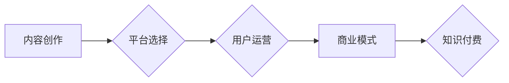

                 

## 程序员如何进行知识付费的财务规划

> 关键词：知识付费、程序员、财务规划、投资理财、税务规划、风险管理、个人品牌

## 1. 背景介绍

随着互联网的蓬勃发展和科技行业的快速迭代，程序员的需求量持续增长，也催生了知识付费的兴起。程序员可以通过分享技术经验、开发在线课程、撰写书籍等方式进行知识付费，获得稳定的收入来源。然而，知识付费并非一蹴而就，需要合理的财务规划才能确保长期的收益和财务安全。

对于程序员来说，知识付费不仅是一种收入来源，更是一种职业发展和自我提升的方式。通过知识付费，程序员可以：

* **建立个人品牌：** 通过分享专业知识，提升个人影响力，建立行业口碑。
* **拓展职业发展：** 掌握新的技术和技能，开拓新的职业方向，提升职业竞争力。
* **获得被动收入：** 开发在线课程、撰写书籍等，可以获得持续的被动收入，实现财务自由。

## 2. 核心概念与联系

知识付费的核心概念包括：

* **内容创作：**  程序员需要创作高质量、有价值的技术内容，例如博客文章、视频教程、在线课程等。
* **平台选择：** 选择合适的知识付费平台，例如 Udemy、Coursera、知乎、B站等，进行内容发布和推广。
* **用户运营：**  建立用户社区，与用户互动交流，提供技术支持和答疑服务。
* **商业模式：**  选择合适的商业模式，例如付费订阅、课程销售、会员体系等，实现知识付费的盈利。

**Mermaid 流程图**



## 3. 核心算法原理 & 具体操作步骤

知识付费的成功并非依靠特定的算法，而是需要结合多种因素，例如内容质量、平台选择、用户运营等。然而，我们可以将知识付费过程抽象为一个算法，并将其分解为以下步骤：

### 3.1  算法原理概述

知识付费算法的核心原理是：

* **价值创造：**  程序员需要创作具有价值的技术内容，解决用户实际问题，满足用户需求。
* **传播推广：**  通过多种渠道，例如社交媒体、搜索引擎优化等，将知识内容传播给目标用户。
* **用户转化：**  引导用户付费购买知识内容，实现知识付费的盈利。

### 3.2  算法步骤详解

1. **市场调研：**  分析目标用户群体，了解他们的需求和痛点，确定知识付费的方向。
2. **内容创作：**  根据市场调研结果，创作高质量、有价值的技术内容，例如博客文章、视频教程、在线课程等。
3. **平台选择：**  选择合适的知识付费平台，例如 Udemy、Coursera、知乎、B站等，进行内容发布和推广。
4. **用户运营：**  建立用户社区，与用户互动交流，提供技术支持和答疑服务，提升用户粘性。
5. **推广营销：**  通过多种渠道，例如社交媒体、搜索引擎优化等，将知识内容推广给目标用户。
6. **付费转化：**  引导用户付费购买知识内容，实现知识付费的盈利。

### 3.3  算法优缺点

**优点：**

* **可重复性强：**  优质的知识内容可以被多次销售，实现持续的被动收入。
* **门槛相对较低：**  相比其他创业模式，知识付费的门槛相对较低，程序员可以利用自身的技术优势进行创业。
* **个人品牌建设：**  知识付费可以帮助程序员建立个人品牌，提升行业影响力。

**缺点：**

* **竞争激烈：**  知识付费市场竞争激烈，需要不断创作优质内容，才能脱颖而出。
* **用户粘性问题：**  知识付费的用户粘性相对较低，需要不断进行用户运营，才能保持用户活跃度。
* **知识更新速度快：**  科技行业发展迅速，需要不断更新知识内容，才能保持竞争力。

### 3.4  算法应用领域

知识付费算法广泛应用于以下领域：

* **在线教育：**  开发在线课程、视频教程等，提供技术培训服务。
* **技术博客：**  撰写技术文章、分享经验，吸引读者付费订阅。
* **开源软件：**  提供开源软件的付费支持服务，例如技术咨询、代码定制等。
* **技术社区：**  建立技术社区，提供付费会员服务，例如专属论坛、技术交流会等。

## 4. 数学模型和公式 & 详细讲解 & 举例说明

知识付费的财务规划可以借助数学模型进行分析和预测。

### 4.1  数学模型构建

我们可以构建一个简单的知识付费收入模型：

**收入 = (课程价格 * 课程销量) + (订阅费用 * 订阅用户数) + (其他收入)**

其中：

* 课程价格：单个课程的售价。
* 课程销量：单个课程的销售量。
* 订阅费用：每月订阅费用。
* 订阅用户数：每月付费订阅的用户数。
* 其他收入：例如广告收入、赞助收入等。

### 4.2  公式推导过程

我们可以根据实际情况，对上述公式进行调整和细化。例如，我们可以将课程销量视为一个函数，与课程推广力度、市场需求等因素相关联。

**课程销量 = f(推广力度, 市场需求, 课程质量等)**

### 4.3  案例分析与讲解

假设一个程序员开发了一门编程课程，课程价格为 99 元，预计每月销售量为 100 份，同时提供每月 19 元的订阅服务，预计每月有 50 名用户订阅。

根据上述模型，该程序员的每月知识付费收入可以计算如下：

**收入 = (99 元 * 100 份) + (19 元 * 50 人) + 其他收入**

**收入 = 9900 元 + 950 元 + 其他收入**

**收入 = 10850 元 + 其他收入**

## 5. 项目实践：代码实例和详细解释说明

知识付费的项目实践可以参考以下代码实例：

### 5.1  开发环境搭建

* **操作系统：**  Windows、macOS、Linux 等。
* **编程语言：**  Python、JavaScript、Java 等。
* **开发工具：**  VS Code、Atom、Sublime Text 等。
* **知识付费平台：**  Udemy、Coursera、知乎、B站 等。

### 5.2  源代码详细实现

以下是一个简单的 Python 代码实例，用于计算知识付费收入：

```python
course_price = 99
course_sales = 100
subscription_fee = 19
subscription_users = 50

total_revenue = (course_price * course_sales) + (subscription_fee * subscription_users)

print(f"总收入: {total_revenue} 元")
```

### 5.3  代码解读与分析

该代码首先定义了课程价格、课程销量、订阅费用和订阅用户数等变量。然后，利用公式计算总收入，并使用 print 函数输出结果。

### 5.4  运行结果展示

运行该代码后，输出结果为：

```
总收入: 10850 元
```

## 6. 实际应用场景

知识付费在程序员领域有着广泛的应用场景：

### 6.1  在线课程开发

程序员可以开发在线课程，教授编程语言、软件开发框架、算法设计等技术知识。

### 6.2  技术博客写作

程序员可以撰写技术博客文章，分享经验、解决问题，吸引读者付费订阅。

### 6.3  开源软件支持

程序员可以提供开源软件的付费支持服务，例如技术咨询、代码定制等。

### 6.4  技术社区运营

程序员可以建立技术社区，提供付费会员服务，例如专属论坛、技术交流会等。

## 7. 工具和资源推荐

### 7.1  学习资源推荐

* **书籍：** 《代码的艺术》、《设计模式：复用面向对象软件的元素》
* **在线课程：** Coursera、Udemy、edX
* **技术博客：** CSDN、博客园、掘金

### 7.2  开发工具推荐

* **代码编辑器：** VS Code、Atom、Sublime Text
* **版本控制系统：** Git、GitHub
* **项目管理工具：** Trello、Asana

### 7.3  相关论文推荐

* **知识付费的商业模式创新**
* **知识付费平台的用户行为分析**
* **知识付费对个人职业发展的影响**

## 8. 总结：未来发展趋势与挑战

### 8.1  研究成果总结

知识付费已成为程序员职业发展和财务规划的重要途径。通过合理规划和实施，程序员可以利用知识付费实现持续的收入增长和个人品牌建设。

### 8.2  未来发展趋势

* **内容形式多样化：**  除了文字和视频，未来知识付费将更加注重互动性和沉浸感，例如虚拟现实、增强现实等技术应用。
* **个性化定制化：**  知识付费将更加注重用户需求，提供个性化定制化的学习方案。
* **社区化学习：**  知识付费将更加注重社区建设，形成用户互动交流的学习氛围。

### 8.3  面临的挑战

* **知识更新速度快：**  科技行业发展迅速，需要不断更新知识内容，才能保持竞争力。
* **用户粘性问题：**  知识付费的用户粘性相对较低，需要不断进行用户运营，才能保持用户活跃度。
* **知识产权保护：**  知识付费内容的知识产权保护是一个重要问题，需要加强法律法规的完善。

### 8.4  研究展望

未来，知识付费将更加注重用户体验、个性化定制和社区化学习，并与人工智能、虚拟现实等新技术融合，为程序员提供更加高效、便捷的学习和发展平台。

## 9. 附录：常见问题与解答

**Q1：如何选择合适的知识付费平台？**

**A1：**  选择知识付费平台需要考虑平台的受众群体、课程类型、收费模式、推广力度等因素。

**Q2：如何进行知识付费内容的推广？**

**A2：**  知识付费内容的推广可以采用多种方式，例如社交媒体营销、搜索引擎优化、KOL 合作等。

**Q3：如何应对知识付费的竞争？**

**A3：**  应对知识付费的竞争，需要不断创作优质内容、提升用户体验、建立个人品牌等。


作者：禅与计算机程序设计艺术 / Zen and the Art of Computer Programming 
<end_of_turn>

