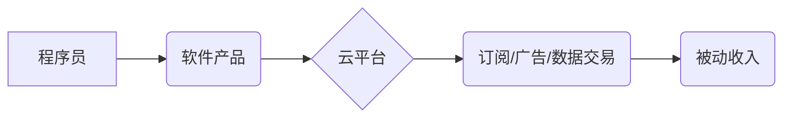

                 

## 程序员的被动收入：构建与维护

> 关键词：被动收入、软件开发、自动化、云计算、持续交付、API、微服务、云函数

### 1. 背景介绍

在当今科技飞速发展的时代，程序员作为数字时代的核心力量，拥有着创造价值和获取财富的巨大潜力。然而，传统的编程工作模式往往以项目为单位，收入波动较大，难以实现持续稳定的被动收入。随着云计算、自动化、持续交付等技术的不断发展，程序员可以通过构建和维护软件产品，实现持续的被动收入。

被动收入是指无需持续投入时间和精力就能获得的收入。对于程序员来说，构建和维护软件产品可以成为实现被动收入的理想途径。通过开发高质量、具有市场需求的软件产品，程序员可以将产品部署到云平台，并通过订阅、广告、数据交易等方式获得持续的收入流。

### 2. 核心概念与联系

**2.1 核心概念**

* **被动收入:** 指无需持续投入时间和精力就能获得的收入。
* **软件产品:** 指通过编程开发并提供给用户使用的软件应用程序。
* **云计算:** 指利用互联网访问和共享计算资源的服务模式。
* **自动化:** 指通过程序或脚本自动执行重复性任务，提高效率和降低成本。
* **持续交付:** 指将软件代码频繁地发布到生产环境，确保软件的稳定性和快速迭代。

**2.2 架构关系**

**2.3 联系分析**

程序员通过开发软件产品，将产品部署到云平台，利用云平台的资源和服务，实现软件的自动化部署、持续交付和运营维护。通过订阅、广告、数据交易等方式，将软件产品转化为收入流，实现被动收入。

### 3. 核心算法原理 & 具体操作步骤

**3.1 算法原理概述**

构建和维护软件产品涉及到多种算法和技术，例如：

* **数据结构和算法:** 用于高效地存储和处理数据，例如树、图、排序算法等。
* **软件设计模式:** 用于解决软件设计中的常见问题，例如MVC、设计原则等。
* **机器学习算法:** 用于开发智能软件产品，例如分类、预测、推荐等。

**3.2 算法步骤详解**

1. **需求分析:** 确定软件产品的目标用户、功能需求和市场定位。
2. **设计方案:** 设计软件产品的架构、功能模块和数据模型。
3. **代码开发:** 使用编程语言编写软件代码，并进行单元测试。
4. **集成测试:** 将各个模块集成在一起，进行系统测试。
5. **部署上线:** 将软件产品部署到云平台，并进行性能测试和监控。
6. **维护更新:** 定期维护软件产品，修复bug，并根据用户反馈进行迭代更新。

**3.3 算法优缺点**

* **优点:** 

    * 可实现持续的被动收入。
    * 具有较高的市场需求和发展潜力。
    * 可以利用云计算和自动化技术提高效率。

* **缺点:** 

    * 需要投入较多的时间和精力进行开发和维护。
    * 需要具备一定的市场营销和运营能力。
    * 需要不断学习新技术和适应市场变化。

**3.4 算法应用领域**

* **移动应用:** 开发具有实用性和娱乐性的移动应用程序。
* **网站和平台:** 开发电商平台、社交平台、信息平台等网站和平台。
* **云服务:** 开发云计算服务、数据分析服务、人工智能服务等。
* **自动化工具:** 开发自动化测试工具、运维工具、数据处理工具等。

### 4. 数学模型和公式 & 详细讲解 & 举例说明

**4.1 数学模型构建**

构建被动收入模型可以参考以下数学模型：

* **收入 = 用户数量 * 平均收入**

其中：

* 用户数量：指使用软件产品的用户数量。
* 平均收入：指每个用户为软件产品带来的平均收入。

**4.2 公式推导过程**

* 用户数量可以通过市场营销、用户增长策略等方式进行推导。
* 平均收入可以通过订阅费用、广告收入、数据交易收入等方式进行计算。

**4.3 案例分析与讲解**

假设开发一款音乐流媒体软件，用户数量为100万，平均订阅费用为每月10美元，则软件产品的每月收入为：

* 收入 = 100万 * 10美元 = 1000万美元

### 5. 项目实践：代码实例和详细解释说明

**5.1 开发环境搭建**

* 选择合适的云平台，例如AWS、Azure、GCP等。
* 安装必要的开发工具，例如IDE、版本控制系统等。
* 配置开发环境，例如数据库、API接口等。

**5.2 源代码详细实现**

* 使用编程语言编写软件代码，例如Python、Java、Go等。
* 设计软件架构，例如微服务架构、云函数架构等。
* 开发软件功能模块，例如用户注册、登录、音乐播放等。

**5.3 代码解读与分析**

* 分析代码结构，理解代码逻辑。
* 识别关键代码模块，例如用户管理模块、音乐播放模块等。
* 优化代码性能，提高代码效率。

**5.4 运行结果展示**

* 部署软件产品到云平台，进行测试和验证。
* 监控软件运行状态，及时解决问题。
* 收集用户反馈，进行迭代更新。

### 6. 实际应用场景

**6.1 订阅型软件**

例如音乐流媒体软件、视频点播软件、办公软件等，用户通过订阅服务获得软件的使用权限。

**6.2 广告型软件**

例如新闻资讯网站、游戏平台、社交媒体等，通过展示广告获得收入。

**6.3 数据交易型软件**

例如数据分析平台、人工智能服务等，通过收集和分析用户数据，提供数据服务和 insights。

**6.4 未来应用展望**

随着人工智能、物联网、区块链等技术的不断发展，软件产品将更加智能化、个性化、平台化，被动收入模式也将更加多样化和灵活。

### 7. 工具和资源推荐

**7.1 学习资源推荐**

* 在线课程平台：Coursera、Udemy、edX等
* 博客和技术文章：Medium、Hacker News、Stack Overflow等
* 书籍：

    * 《The Lean Startup》
    * 《Zero to One》
    * 《The Phoenix Project》

**7.2 开发工具推荐**

* 云平台：AWS、Azure、GCP等
* 编程语言：Python、Java、Go等
* 版本控制系统：Git、GitHub等
* 数据库：MySQL、MongoDB、PostgreSQL等

**7.3 相关论文推荐**

* 《The Economics of Software Platforms》
* 《The Sharing Economy: A New Paradigm for Business and Society》
* 《The Future of Work: How Technology Will Transform the Workplace》

### 8. 总结：未来发展趋势与挑战

**8.1 研究成果总结**

构建和维护软件产品实现被动收入是一个具有巨大潜力的发展方向。通过利用云计算、自动化、持续交付等技术，程序员可以开发高质量、具有市场需求的软件产品，并通过订阅、广告、数据交易等方式获得持续的收入流。

**8.2 未来发展趋势**

* **人工智能驱动的软件产品:** 人工智能技术将更加广泛地应用于软件产品开发，例如智能客服、个性化推荐等。
* **平台化软件产品:** 软件产品将更加平台化，提供更丰富的功能和服务，例如云游戏平台、在线教育平台等。
* **区块链技术的应用:** 区块链技术将为软件产品提供更安全、透明的交易和数据管理机制。

**8.3 面临的挑战**

* **市场竞争激烈:** 软件产品市场竞争激烈，需要不断创新和迭代才能保持竞争力。
* **技术更新快速:** 需要不断学习新技术和适应市场变化。
* **用户隐私和安全:** 需要重视用户隐私和数据安全，并采取相应的措施保护用户权益。

**8.4 研究展望**

未来研究方向包括：

* 开发更智能、更个性化的软件产品。
* 探索新的被动收入模式。
* 研究软件产品生命周期管理。
* 提升软件产品开发效率和质量。

### 9. 附录：常见问题与解答

**9.1 如何选择合适的云平台？**

需要根据软件产品的需求和预算选择合适的云平台。例如，AWS拥有丰富的服务和资源，适合大型企业；Azure更侧重于企业级解决方案；GCP则更注重数据分析和人工智能服务。

**9.2 如何进行软件产品的市场营销？**

可以通过多种方式进行软件产品的市场营销，例如内容营销、社交媒体营销、付费广告等。

**9.3 如何维护软件产品的安全性？**

需要定期进行安全漏洞扫描和修复，并采取相应的安全措施，例如身份验证、数据加密等。

作者：禅与计算机程序设计艺术 / Zen and the Art of Computer Programming 
<end_of_turn>

